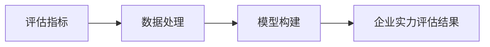

# 企业实力评估系统详细设计与具体代码实现

## 1. 背景介绍
在当今瞬息万变的商业环境中,企业实力的评估对于投资者、管理者以及其他利益相关方来说至关重要。一个全面、客观、准确的企业实力评估系统能够帮助各方做出更加明智的决策。本文将详细阐述如何设计和实现一个高效的企业实力评估系统。

### 1.1 企业实力评估的重要性
- 1.1.1 投资决策的参考依据
- 1.1.2 企业内部管理的重要工具  
- 1.1.3 行业竞争力分析的基础

### 1.2 现有评估系统的不足
- 1.2.1 评估指标不全面
- 1.2.2 数据来源单一
- 1.2.3 评估模型过于简单

### 1.3 新型评估系统的目标
- 1.3.1 建立科学的指标体系
- 1.3.2 整合多源异构数据
- 1.3.3 构建智能评估模型

## 2. 核心概念与联系
企业实力评估系统涉及到多个核心概念,包括评估指标、数据处理、模型构建等。下面我们将详细阐述这些概念以及它们之间的联系。

### 2.1 评估指标
- 2.1.1 财务指标
- 2.1.2 市场指标
- 2.1.3 创新指标
- 2.1.4 管理指标

### 2.2 数据处理
- 2.2.1 数据采集
- 2.2.2 数据清洗
- 2.2.3 数据整合
- 2.2.4 数据存储

### 2.3 模型构建 
- 2.3.1 机器学习模型
- 2.3.2 深度学习模型
- 2.3.3 专家知识融合

下面是核心概念之间的联系图:


## 3. 核心算法原理与具体操作步骤
企业实力评估系统的核心是评估模型,而评估模型的构建离不开机器学习和深度学习算法。下面我们以支持向量机(SVM)算法为例,详细讲解其原理和操作步骤。

### 3.1 SVM算法原理
SVM是一种二分类模型,其基本思想是在特征空间中寻找一个超平面,使得不同类别的数据点能够被超平面所分割。SVM不仅要找到一个能够正确分类的超平面,还要使得两个类别的数据点到超平面的距离尽可能大,即最大化分类间隔。

### 3.2 SVM算法的数学表示
给定训练集 $D=\{(x_1,y_1),(x_2,y_2),...,(x_N,y_N)\}$,其中 $x_i \in R^n$ 表示第 $i$ 个样本的特征向量, $y_i \in \{-1,+1\}$ 表示第 $i$ 个样本的类别标签。SVM的目标是找到一个超平面 $w^Tx+b=0$,使得对于所有的 $(x_i,y_i)$ 都有:

$$y_i(w^Tx_i+b) \geq 1$$

同时,我们希望最大化超平面两侧的间隔,即:

$$\max_{w,b} \frac{2}{||w||}$$

### 3.3 SVM算法的求解步骤
- 步骤1:将上述问题转化为凸二次规划问题:
$$\min_{w,b} \frac{1}{2}||w||^2 \quad s.t. \quad y_i(w^Tx_i+b) \geq 1, i=1,2,...,N$$

- 步骤2:引入拉格朗日乘子 $\alpha_i \geq 0$,构建拉格朗日函数:
$$L(w,b,\alpha)=\frac{1}{2}||w||^2-\sum_{i=1}^N \alpha_i[y_i(w^Tx_i+b)-1]$$

- 步骤3:对 $w$ 和 $b$ 求偏导,令其等于0,得到:
$$w=\sum_{i=1}^N \alpha_i y_i x_i$$
$$0=\sum_{i=1}^N \alpha_i y_i$$

- 步骤4:将步骤3的结果代入拉格朗日函数,得到对偶问题:
$$\max_{\alpha} \sum_{i=1}^N \alpha_i - \frac{1}{2}\sum_{i=1}^N \sum_{j=1}^N \alpha_i \alpha_j y_i y_j x_i^T x_j$$
$$s.t. \quad \sum_{i=1}^N \alpha_i y_i = 0$$
$$\alpha_i \geq 0, i=1,2,...,N$$

- 步骤5:求解对偶问题,得到最优解 $\alpha^*$,然后根据 $w^*=\sum_{i=1}^N \alpha_i^* y_i x_i$ 求出 $w^*$,选择任意支持向量 $(x_s,y_s)$ 代入 $y_s(w^{*T}x_s+b)=1$ 求出 $b^*$。

- 步骤6:得到最优分类超平面 $w^{*T}x+b^*=0$,对新样本进行预测:
$$f(x)=sign(w^{*T}x+b^*)$$

## 4. 数学模型和公式详细讲解举例说明
在第3节中,我们介绍了SVM算法的数学原理。下面我们通过一个具体的例子来说明如何使用SVM进行二分类任务。

假设我们有如下训练集:

| 样本 | 特征1 | 特征2 | 类别 |
|:----:|:-----:|:-----:|:----:|
| 1    | 1     | 2     | +1   |
| 2    | 2     | 1     | +1   |
| 3    | 3     | 3     | -1   |
| 4    | 2     | 4     | -1   |

我们的目标是找到一个最优的分类超平面,使得正负样本能够被完全分开,并且分类间隔最大。

首先,我们将问题转化为凸二次规划问题:

$$\min_{w,b} \frac{1}{2}(w_1^2+w_2^2)$$
$$s.t. \quad 1(w_1+2w_2+b) \geq 1$$
$$2(2w_1+w_2+b) \geq 1$$
$$-3(3w_1+3w_2+b) \geq 1$$
$$-4(2w_1+4w_2+b) \geq 1$$

然后,我们引入拉格朗日乘子,构建拉格朗日函数:

$$L(w,b,\alpha)=\frac{1}{2}(w_1^2+w_2^2)-\alpha_1[1(w_1+2w_2+b)-1]$$
$$-\alpha_2[2(2w_1+w_2+b)-1]-\alpha_3[-3(3w_1+3w_2+b)-1]-\alpha_4[-4(2w_1+4w_2+b)-1]$$

对 $w_1$, $w_2$ 和 $b$ 求偏导,令其等于0,得到:

$$w_1=5\alpha_1+12\alpha_2-27\alpha_3-16\alpha_4$$
$$w_2=10\alpha_1+6\alpha_2-27\alpha_3-32\alpha_4$$
$$0=\alpha_1+2\alpha_2-3\alpha_3-4\alpha_4$$

将上述结果代入拉格朗日函数,得到对偶问题:

$$\max_{\alpha} \alpha_1+\alpha_2+\alpha_3+\alpha_4-\frac{1}{2}(25\alpha_1^2+144\alpha_2^2+729\alpha_3^2+256\alpha_4^2$$
$$+120\alpha_1\alpha_2-270\alpha_1\alpha_3-160\alpha_1\alpha_4-324\alpha_2\alpha_3-192\alpha_2\alpha_4+432\alpha_3\alpha_4)$$
$$s.t. \quad \alpha_1+2\alpha_2-3\alpha_3-4\alpha_4=0$$
$$\alpha_1,\alpha_2,\alpha_3,\alpha_4 \geq 0$$

求解上述对偶问题,得到最优解 $\alpha^*=(\frac{1}{12},\frac{7}{36},0,\frac{1}{9})$。

根据 $w^*=\sum_{i=1}^N \alpha_i^* y_i x_i$ 求出:

$$w_1^*=\frac{1}{12}*1*1+\frac{7}{36}*1*2-\frac{1}{9}*(-1)*2=\frac{11}{18}$$
$$w_2^*=\frac{1}{12}*1*2+\frac{7}{36}*1*1-\frac{1}{9}*(-1)*4=\frac{4}{9}$$

选择支持向量 $(1,2,+1)$ 代入 $y_s(w^{*T}x_s+b)=1$ 求出:

$$b^*=1-(\frac{11}{18}*1+\frac{4}{9}*2)=-\frac{1}{2}$$

最终得到最优分类超平面:

$$\frac{11}{18}x_1+\frac{4}{9}x_2-\frac{1}{2}=0$$

对于任意新样本 $x=(x_1,x_2)$,我们可以通过以下判别函数来预测其类别:

$$f(x)=sign(\frac{11}{18}x_1+\frac{4}{9}x_2-\frac{1}{2})$$

## 5. 项目实践:代码实例和详细解释说明
下面我们使用Python语言和scikit-learn库来实现SVM算法,并应用于企业实力评估任务。

### 5.1 数据准备
首先,我们需要准备训练数据和测试数据。假设我们已经收集了100家企业的相关数据,每个企业有10个特征,并且已经由专家打上了标签(1表示实力强,0表示实力弱)。我们将数据随机分为训练集和测试集,比例为8:2。

```python
import numpy as np
from sklearn.model_selection import train_test_split

# 假设X_all和y_all分别为所有企业的特征矩阵和标签向量
X_train, X_test, y_train, y_test = train_test_split(X_all, y_all, test_size=0.2, random_state=42)
```

### 5.2 模型训练
接下来,我们使用scikit-learn中的SVC类来训练SVM模型。我们选择高斯核函数,并通过网格搜索来寻找最优的超参数。

```python
from sklearn.svm import SVC
from sklearn.model_selection import GridSearchCV

# 定义候选超参数
param_grid = {'C': [0.1, 1, 10], 'gamma': [0.01, 0.1, 1]}

# 初始化SVM模型
svm = SVC(kernel='rbf')

# 网格搜索最优超参数
grid_search = GridSearchCV(svm, param_grid, cv=5)
grid_search.fit(X_train, y_train)

# 得到最优模型
best_svm = grid_search.best_estimator_
```

### 5.3 模型评估
最后,我们使用训练好的SVM模型对测试集进行预测,并计算准确率、精确率、召回率和F1分数等评价指标。

```python
from sklearn.metrics import accuracy_score, precision_score, recall_score, f1_score

# 在测试集上进行预测
y_pred = best_svm.predict(X_test)

# 计算评价指标
accuracy = accuracy_score(y_test, y_pred)
precision = precision_score(y_test, y_pred)  
recall = recall_score(y_test, y_pred)
f1 = f1_score(y_test, y_pred)

print("Accuracy: {:.4f}".format(accuracy))
print("Precision: {:.4f}".format(precision))
print("Recall: {:.4f}".format(recall))  
print("F1 score: {:.4f}".format(f1))
```

通过以上步骤,我们就实现了一个基于SVM算法的企业实力评估模型。在实际应用中,我们还可以进一步优化特征工程、模型集成等方面,以提高评估的准确性和稳健性。

## 6. 实际应用场景
企业实力评估系统可以应用于多个领域,为相关决策提供有力支持。下面列举几个典型的应用场景:

### 6.1 投资决策
- 6.1.1 风险投资:帮助投资者评估初创企业的潜力和风险
- 6.1.2 股权投资:为上市公司股票的选择提供参考
- 6.1.3 债券投资:评估企业的偿债能力和违约风险

### 6.2 商业合作
- 6.2.1 供应商选择:评估供应商的综合实力和稳定性
- 6.2.2 战略合