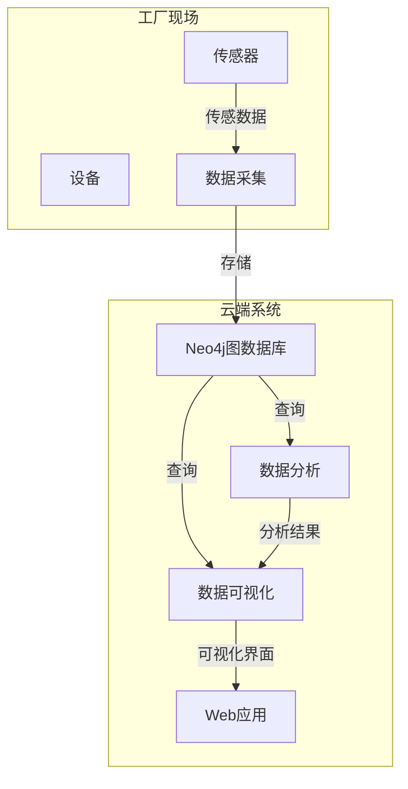

# 使用Neo4j实现工业设备健康监测与预测性维护

## 1.背景介绍

### 1.1 工业设备健康监测的重要性

在现代工业生产中,设备的可靠性和持续运行是确保生产效率和产品质量的关键因素。工业设备通常运行在恶劣的环境下,面临着各种各样的应力和磨损,这可能导致设备故障、停机时间延长和生产损失。因此,对工业设备进行实时健康监测和预测性维护是非常重要的。

### 1.2 传统监测方法的局限性  

传统的设备监测方法主要依赖于人工检查和定期维护,这种方式存在一些固有的缺陷:

- 反应滞后:直到设备出现明显故障迹象时才能被发现
- 成本高昂:需要大量人力和时间投入
- 效率低下:无法实现实时连续监控
- 数据孤岛:各类监测数据无法高效整合和分析

### 1.3 工业4.0与智能监测系统的需求

随着工业4.0时代的到来,智能制造、物联网、大数据分析等新技术的应用,对工业设备健康监测提出了新的要求。现代智能监测系统应该具备:

- 实时数据采集:从各类传感器收集设备运行数据
- 数据集成:将异构数据源无缝集成
- 复杂分析:运用机器学习等技术挖掘深层次知识  
- 预测能力:基于历史数据预测设备健康状态
- 可视化呈现:直观展示设备运行状况

## 2.核心概念与联系

### 2.1 图数据库概念

传统的关系型和非关系型数据库更适合处理结构化和非结构化数据,但在处理高度互连的复杂数据时效率较低。图数据库则是一种全新的NoSQL数据库范式,它使用图结构高效地存储实体及其关系。

图数据库中的主要概念包括:

- 节点(Node):代表实体对象
- 关系(Relationship):连接节点,描述实体间的关联
- 属性(Property):节点和关系上的键值对

图数据库擅长表达和查询高度互连的数据,特别适合处理复杂的现实世界数据模型。

### 2.2 Neo4j图数据库

Neo4j是一个开源的高性能图数据库,具有以下特点:

- 原生图存储:使用经过优化的原生图结构存储
- 声明式查询语言Cypher:类似SQL,但面向图数据
- 高度可扩展:支持水平扩展和分布式架构
- 多模型支持:可与关系型和其他NoSQL数据库混合使用

Neo4j可广泛应用于社交网络、推荐系统、知识图谱、网络与IT运维等领域。

### 2.3 图数据库与设备监测的契合

工业设备监测系统涉及大量设备、传感器、测点等实体,以及它们之间的复杂拓扑关联关系。利用图数据库可以自然地表达这些实体及其关系网络,并高效查询和遍历。

此外,Neo4j支持时序数据存储,可直接存储设备运行时序数据,并与实体关系数据相结合,为设备健康评估和预测提供数据基础。

综上所述,Neo4j图数据库非常适合构建工业设备智能监测与预测性维护系统。

## 3.核心算法原理具体操作步骤  

### 3.1 设备拓扑建模

首先需要将工厂设备的物理拓扑结构映射到Neo4j图数据库中。主要步骤包括:

1. 识别核心实体类型,如设备、传感器、测点等,将它们对应为节点
2. 确定实体间关系的语义,如组成、测量、连接等,对应为关系
3. 为节点和关系定义属性,如设备型号、测点位置等
4. 使用Cypher查询语言创建节点、关系和属性

```cypher
// 创建设备节点
CREATE (:Device {name:'Pump001', type:'Centrifugal Pump'})

// 创建传感器节点并与设备关联  
CREATE (s:Sensor {name:'VibroSensor'})
CREATE (d:Device {name:'Pump001'})
CREATE (s)-[:MONITORS]->(d)

// 为关系添加属性
MATCH (s:Sensor)-[r:MONITORS]->(d:Device)
SET r.measurementType = 'Vibration'
```

通过这种方式,可以较为直观地在图数据库中构建出工厂设备及其拓扑关系的数据模型。

### 3.2 时序数据存储

Neo4j支持将时序数据存储为节点,并通过关系与设备、传感器等实体相连。

```cypher
// 创建时间节点并与传感器关联
CREATE (t:Timestamp {value:1592563200})
CREATE (s:Sensor {name:'VibroSensor'})
CREATE (t)-[:MEASURED_BY]->(s)

// 存储时序数据值
SET t.value = 2.8
```

这样可以自然地将时序数据与设备拓扑结构相关联,为后续的数据分析打下基础。

### 3.3 图遍历与聚合

利用Cypher查询语言,可以高效地遍历图结构,并执行聚合计算。

```cypher
// 查找某设备所有测点的最新测量值
MATCH (d:Device{name:'Pump001'})<-[:MONITORS]-(s:Sensor)<-[m:MEASURED_BY]-(t:Timestamp)  
RETURN d.name, s.name, max(t.value) AS latest_value
ORDER BY latest_value DESC

// 统计某设备过去24小时的平均振动值  
MATCH (d:Device{name:'Pump001'})<-[:MONITORS]-(s:Sensor)<-[m:MEASURED_BY]-(t:Timestamp)
WHERE t.value > (timestamp() - 86400)  
RETURN d.name, s.name, avg(t.value) AS avg_vibration  
```

这些查询操作可以帮助我们及时发现异常情况,并对设备健康状态进行评估。

## 4.数学模型和公式详细讲解举例说明

### 4.1 设备健康评分模型

为了对设备的健康状态进行量化评估,我们可以构建一个综合评分模型。该模型基于多个影响因素,如振动、温度、功耗等,对每个影响因素赋予权重,并计算加权平均值作为设备健康评分。

设备健康评分模型可以表示为:

$$
H = \sum_{i=1}^{n}w_i \times x_i
$$

其中:
- $H$是设备健康评分,范围为0到1,值越高表示设备越健康
- $n$是影响因素的个数  
- $w_i$是第$i$个影响因素的权重,$\sum_{i=1}^{n}w_i=1$
- $x_i$是第$i$个影响因素的标准化值,范围为0到1

例如,对于一台泵来说,我们可以考虑三个主要影响因素:振动、温度和功耗,并给予权重分别为0.5、0.3和0.2。将实际测量值标准化到0-1范围后,代入公式计算即可得到泵的健康评分。

### 4.2 时序异常检测

对于连续的时序数据,如振动值、温度等,我们需要判断是否存在异常值或异常模式。一种常用的异常检测方法是基于统计模型,假设数据服从某种概率分布,计算新观测值的概率,若概率过小则判定为异常。

假设时序数据$X$服从正态分布$\mathcal{N}(\mu,\sigma^2)$,其中$\mu$为均值,$\sigma^2$为方差。对于新观测值$x_t$,其在正态分布下的概率密度为:

$$
P(x_t|\mu,\sigma^2) = \frac{1}{\sqrt{2\pi\sigma^2}}e^{-\frac{(x_t-\mu)^2}{2\sigma^2}}
$$

我们可以设定一个阈值$\alpha$,若$P(x_t|\mu,\sigma^2) < \alpha$,则判定$x_t$为异常值。通过滑动窗口,我们还可以检测数据的异常模式。

例如,对于某个振动传感器,我们可以用过去一周的数据估计正态分布的参数$\mu$和$\sigma^2$,并对每个新的振动值进行异常检测,从而实时发现潜在的设备故障风险。

## 5.项目实践:代码实例和详细解释说明

本节将通过一个示例工厂设备监测项目,展示如何使用Neo4j图数据库和Python构建一个完整的系统。

### 5.1 系统架构



该系统架构主要包括以下几个模块:

- 工厂现场:各类设备和传感器
- 数据采集:从现场采集传感器数据,存储到图数据库
- Neo4j图数据库:存储设备拓扑结构和时序数据 
- 数据分析:对存储的数据进行分析,如健康评分、异常检测等
- 数据可视化:将分析结果以可视化形式呈现
- Web应用:提供给用户的界面,展示设备状态并发出预警

### 5.2 Neo4j数据模型

```python
# 创建设备节点
device = Node("Device", name="Pump001", type="Centrifugal Pump")
graph.create(device)

# 创建传感器节点并与设备关联
vibro_sensor = Node("Sensor", name="VibroSensor") 
rel_monitors = Relationship(vibro_sensor, "MONITORS", device)
rel_monitors["measurementType"] = "Vibration"
graph.create(rel_monitors)

# 存储时序数据
timestamp = Node("Timestamp", value=1592563200)
rel_measured = Relationship(timestamp, "MEASURED_BY", vibro_sensor)  
graph.create(rel_measured)
timestamp["value"] = 2.8
```

上述代码使用Neo4j Python驱动创建了设备、传感器节点,并通过"MONITORS"和"MEASURED_BY"关系将它们连接起来,存储了一个时间戳和振动值。

### 5.3 数据分析

```python
# 设备健康评分模型
weights = {"vibration": 0.5, "temperature": 0.3, "power": 0.2}

def health_score(tx, device_name):
    query = """
        MATCH (d:Device {name: $device_name}) 
        MATCH (d)<-[:MONITORS]-(s:Sensor)<-[m:MEASURED_BY]-(t:Timestamp)
        WITH d, s, m, t ORDER BY m.time DESC LIMIT 1  
        RETURN d.name, s.name, m.measurementType, t.value
    """
    results = tx.run(query, device_name=device_name)
    
    score = 0
    for res in results:
        measure_type = res["m.measurementType"]
        value = res["t.value"]
        # 标准化并计算加权平均
        score += weights[measure_type] * min(value / threshold[measure_type], 1)
        
    return score

# 时序异常检测 
def anomaly_detect(values, window=7, alpha=0.01):
    values = np.array(values)
    mu = values[-window:].mean()
    std = values[-window:].std()
    
    p = norm.pdf(values[-1], loc=mu, scale=std)
    if p < alpha:
        return values[-1], "Anomaly"
    else:
        return values[-1], "Normal"
```

上面的Python代码实现了设备健康评分和时序异常检测两个函数:

- `health_score`函数通过Cypher查询获取设备的最新测量数据,对每种测量类型进行标准化并加权平均,得到0到1范围内的健康评分。
- `anomaly_detect`函数基于高斯分布模型,判断新的时序数据点是否为异常值。

这些分析函数可以与Neo4j数据库和Web前端相结合,为用户提供设备健康状态评估和实时预警。

## 6.实际应用场景

工业设备智能监测系统可以广泛应用于各类制造业,尤其是一些设备密集型行业,如:

- 石油化工:监测管线、阀门、压缩机等设备
- 电力能源:监测发电机组、变压器等关键设备
- 航空航天:监测发动机、起落架等飞机部件
- 汽车制造:监测机器人、