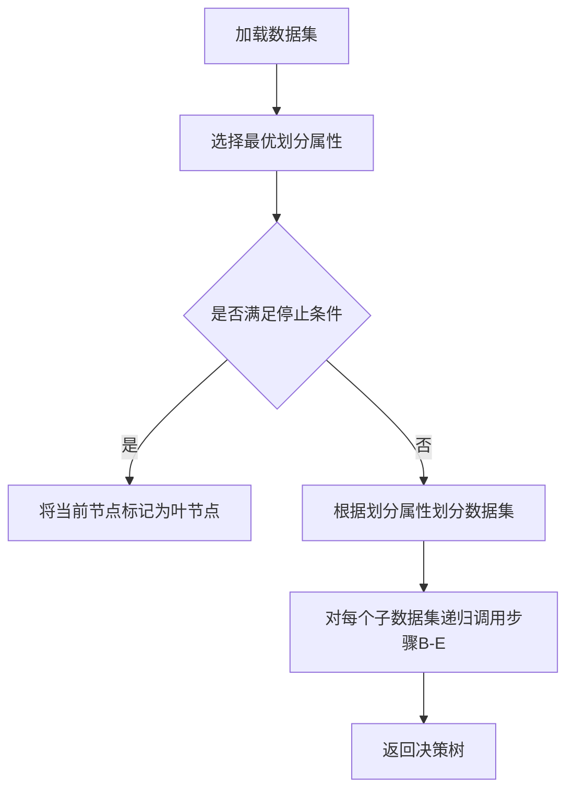

# 决策树算法在生物信息学中的运用前景

## 1.背景介绍
### 1.1 生物信息学的发展历程
生物信息学是一门融合了生物学、计算机科学、数学和统计学等多个学科的交叉学科。它主要研究如何利用计算机技术来分析和解释海量的生物数据,从中发现有价值的生物学规律和知识。生物信息学的发展可以追溯到20世纪60年代,随着基因组测序技术的进步,生物信息学迎来了飞速发展。

### 1.2 机器学习在生物信息学中的应用
机器学习是人工智能的一个重要分支,它通过对数据进行学习和训练,从而具备了对未知数据进行预测和分类的能力。近年来,机器学习算法被广泛应用于生物信息学领域,用于解决基因序列比对、蛋白质结构预测、疾病诊断等问题。其中,决策树算法以其易于理解和实现的特点,在生物信息学中得到了广泛关注。

## 2.核心概念与联系
### 2.1 决策树算法概述
决策树是一种常见的分类和回归算法,它通过对数据的特征进行递归划分,最终建立一个树状的分类模型。决策树由节点和有向边组成,内部节点表示一个特征或属性,叶节点代表分类的结果。

### 2.2 决策树算法与生物信息学的联系
生物信息学需要处理大量的数据,如基因序列、蛋白质结构等。这些数据通常具有高维度、非线性、噪声较大等特点,给机器学习算法的应用带来了挑战。决策树算法以其易于理解、计算效率高、可解释性强等优势,成为生物信息学中的重要工具之一。

## 3.核心算法原理具体操作步骤
### 3.1 决策树的构建过程
决策树的构建通常包括以下步骤:

1. 选择最优划分属性:根据某个评价指标(如信息增益、基尼指数等),选择最优的属性作为当前节点的划分属性。

2. 递归构建子树:根据选定的划分属性,将数据集分成若干子集,每个子集构建一棵子树,重复步骤1。

3. 停止条件:当满足预设的停止条件(如所有样本属于同一类别、达到最大深度等)时,将当前节点标记为叶节点,并将其类别作为该叶节点的输出。

### 3.2 决策树的剪枝策略
为了避免决策树过拟合,通常需要对生成的树进行剪枝。常见的剪枝策略有:

- 预剪枝(Pre-Pruning):在决策树生成过程中,提前停止树的生长。可通过设置树的最大深度、节点的最小样本数等参数实现。

- 后剪枝(Post-Pruning):先生成一棵完整的决策树,然后自底向上地对非叶节点进行考察,若将其替换为叶节点能带来泛化性能的提升,则进行剪枝。

## 4.数学模型和公式详细讲解举例说明
### 4.1 信息熵与信息增益
假设样本集合为$D$,类别属性有$K$个不同的值$\{C_1,C_2,...,C_K\}$,定义$D$的信息熵为:

$$
H(D)=-\sum_{k=1}^K \frac{|C_k|}{|D|} \log_2 \frac{|C_k|}{|D|}
$$

其中,$|C_k|$表示$D$中属于类$C_k$的样本个数,$|D|$为样本总数。

假设离散属性$a$有$V$个可能的取值$\{a^1,a^2,...,a^V\}$,根据$a$的取值将$D$划分为$V$个子集$\{D_1,D_2,...,D_V\}$,则属性$a$对数据集$D$的信息增益为:

$$
g(D,a)=H(D)-\sum_{v=1}^V \frac{|D^v|}{|D|}H(D^v)
$$

信息增益越大,表示属性$a$对数据集$D$的分类能力越强。ID3算法使用信息增益作为划分属性的选择标准。

### 4.2 基尼指数
假设数据集$D$中属于第$k$类的样本所占的比例为$p_k$,则$D$的基尼值定义为:

$$
\operatorname{Gini}(D)=\sum_{k=1}^K p_k(1-p_k)=1-\sum_{k=1}^K p_k^2
$$

如果根据属性$a$的取值将$D$分为$V$个子集$\{D_1,D_2,...,D_V\}$,则属性$a$的基尼指数定义为:

$$
\operatorname{Gini\_index}(D,a)=\sum_{v=1}^V \frac{|D^v|}{|D|}\operatorname{Gini}(D^v)
$$

基尼指数越小,表示属性$a$对数据集$D$的分类能力越强。CART算法使用基尼指数作为划分属性的选择标准。

## 5.项目实践：代码实例和详细解释说明
下面以Python中的scikit-learn库为例,演示如何使用决策树算法进行分类任务:

```python
from sklearn.datasets import load_iris
from sklearn.model_selection import train_test_split
from sklearn.tree import DecisionTreeClassifier

# 加载鸢尾花数据集
iris = load_iris()
X = iris.data
y = iris.target

# 划分训练集和测试集
X_train, X_test, y_train, y_test = train_test_split(X, y, test_size=0.2, random_state=42)

# 创建决策树分类器
clf = DecisionTreeClassifier(criterion='gini', max_depth=3, random_state=42)

# 训练模型
clf.fit(X_train, y_train)

# 在测试集上进行预测
y_pred = clf.predict(X_test)

# 计算分类准确率
accuracy = clf.score(X_test, y_test)
print("Accuracy: {:.2f}".format(accuracy))
```

上述代码首先加载了鸢尾花数据集,然后将其划分为训练集和测试集。接着创建了一个决策树分类器,设置划分属性选择标准为基尼指数,最大树深度为3。调用`fit`方法在训练集上训练模型,再用`predict`方法在测试集上进行预测。最后计算分类准确率。

## 6.实际应用场景
决策树算法在生物信息学中有广泛的应用,例如:

- 基因表达数据分析:利用决策树算法对基因芯片数据进行分类,鉴别不同疾病或病理状态下的基因表达模式。

- 蛋白质结构预测:通过决策树算法对蛋白质序列的特征进行分析,预测蛋白质的二级结构和三级结构。

- 疾病诊断和预后预测:根据患者的临床指标和基因组学数据,使用决策树算法进行疾病诊断和预后预测。

- 药物-靶点相互作用预测:利用决策树算法分析药物分子和靶点蛋白的特征,预测它们之间的相互作用。

## 7.工具和资源推荐
- scikit-learn:Python机器学习库,提供了多种决策树算法的实现,API简单易用。

- WEKA:基于Java的机器学习工具包,包含了C4.5、CART等经典决策树算法。

- R语言rpart包:R语言中用于构建CART决策树的软件包。

- MATLAB Statistics and Machine Learning Toolbox:MATLAB中的统计和机器学习工具箱,提供了决策树算法的实现。

## 8.总结：未来发展趋势与挑战
随着生物信息学的快速发展,决策树算法在该领域的应用将不断深入。未来的研究方向包括:

- 集成学习:将决策树与其他机器学习算法相结合,提高预测性能。

- 深度学习与决策树的融合:利用深度学习提取高级特征,再输入决策树算法进行分类和预测。

- 可解释性研究:进一步提高决策树模型的可解释性,使其更易于生物学家理解和应用。

同时,生物信息学数据的高维度、小样本、不平衡等特点,也给决策树算法的应用带来了挑战。如何有效处理这些问题,是未来研究的重点之一。

## 9.附录：常见问题与解答
### 9.1 决策树算法的优缺点是什么?
优点:
- 易于理解和解释,可以生成规则
- 计算效率高,适用于大数据集
- 对缺失值和异常值不敏感

缺点:
- 容易过拟合,泛化能力较差  
- 对连续型变量处理较差
- 容易生成不平衡的树

### 9.2 决策树算法如何处理缺失值?
常见的处理缺失值的策略有:
- 将缺失值视为一个独立的类别
- 用样本中该属性的最常见值填充
- 用与缺失值样本最相似的样本的属性值填充
- 根据属性之间的相关关系估计缺失值

### 9.3 决策树如何避免过拟合?
避免过拟合的方法主要有:
- 预剪枝:在决策树生长过程中,提前停止树的生长
- 后剪枝:生成完整决策树后,自底向上剪去一些分支
- 设置树的最大深度、叶节点的最小样本数等参数
- 使用交叉验证选择最优模型

### 9.4 决策树算法的时间复杂度如何?
假设样本数为$n$,属性数为$m$,则决策树算法的时间复杂度为$O(n\log n \times m)$。其中,排序属性值需要$O(n\log n)$,选择最优划分属性需要$O(m)$。对于连续值属性,由于需要对属性进行排序,因此总时间复杂度为$O(n\log n \times m)$。

## 决策树算法核心流程图


作者：禅与计算机程序设计艺术 / Zen and the Art of Computer Programming