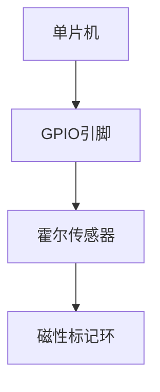
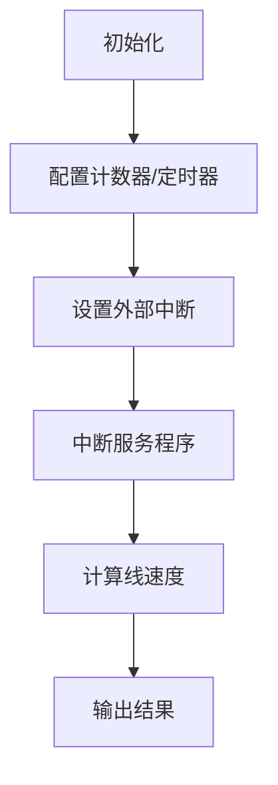

# 基于单片机霍尔测速的设计与实现

## 1.背景介绍

在现代工业自动化和智能交通系统中,准确测量运动物体的线速度至关重要。传统的测速方法如编码器和光电传感器虽然可靠,但存在成本高、安装复杂等缺陷。基于霍尔效应的测速技术凭借其无接触、抗干扰能力强等优势,逐渐受到广泛关注。

本文将介绍如何利用单片机和霍尔传感器设计实现一种简单、高效、低成本的线速度测量系统。该系统可广泛应用于工业生产线、交通监控等领域,为运动控制和分析提供准确的速度数据。

## 2.核心概念与联系

### 2.1 霍尔效应

霍尔效应是指在导体或半导体材料中,当有电流通过并加诘垂直于电流方向的磁场时,导体两侧会产生一个与电流和磁场垂直的电压差,这种电压差称为霍尔电压。

$$
V_H = \frac{R_HBI}{d}
$$

其中,$V_H$为霍尔电压,$R_H$为霍尔常数,$B$为磁场强度,$I$为电流,$d$为导体厚度。

霍尔效应的发现为无接触式测量磁场强度提供了可能,从而可以测量运动物体的线速度。

### 2.2 霍尔传感器

霍尔传感器是一种利用霍尔效应的传感器,通常由一个薄的半导体材料制成。当有磁场穿过传感器时,半导体内部会产生一个与磁场强度成正比的电压输出。

霍尔传感器广泛应用于运动控制、位置检测、电流监测等领域,具有无接触、抗干扰、寿命长等优点。

### 2.3 单片机

单片机(Microcontroller Unit,MCU)是一种高度集成的微型计算机芯片,集成了中央处理器(CPU)、存储器(RAM和ROM)、计数器/定时器、模数转换器(ADC)、数模转换器(DAC)等多种功能模块。

单片机可编程,能够根据特定需求完成各种控制和计算任务。由于体积小、功耗低、成本低,单片机在嵌入式系统、自动化控制等领域得到了广泛应用。

### 2.4 系统工作原理

基于单片机霍尔测速系统的工作原理如下:

1. 在被测运动物体旁安装一个带有均匀间隔的磁性标记环或磁钢。
2. 霍尔传感器固定在合适位置,当磁性标记通过时可检测到磁场变化并输出脉冲信号。
3. 单片机通过计数霍尔传感器输出的脉冲个数,结合标记间距和时间,即可计算出运动物体的线速度。

该系统无需直接接触被测物体,避免了机械磨损,同时抗干扰能力强、测量精度高、成本低廉。

## 3.核心算法原理具体操作步骤  

### 3.1 硬件设计

该系统硬件包括单片机、霍尔传感器、磁性标记环等部分。



1. 选择合适的单片机,确保具有足够的GPIO引脚、计数器/定时器等资源。
2. 选择合适的霍尔传感器,需要考虑灵敏度、工作温度范围等参数。
3. 设计磁性标记环,通常采用钕铁硼永磁体或电磁钢,间距需根据测速要求确定。

### 3.2 软件设计

软件算法是整个系统的核心,主要包括以下步骤:

1. 初始化单片机、GPIO引脚及相关外设。
2. 配置计数器/定时器,用于测量脉冲间隔时间。
3. 设置外部中断,在霍尔传感器输出脉冲时触发中断服务程序。
4. 在中断服务程序中,计数脉冲个数并记录时间戳。
5. 根据脉冲个数、标记间距和时间差,计算线速度。
6. 可选:使用滤波算法消除干扰,提高测量精度。
7. 将测速结果输出到显示设备或通信接口。



### 3.3 关键代码实现

以下是基于51单片机的关键代码实现,仅供参考:

```c
// 定义相关变量
unsigned int pulse_count = 0;  // 脉冲计数
unsigned long last_time = 0;   // 上次脉冲时间戳
unsigned int mark_distance = 10; // 标记间距(mm)

// 中断服务程序
void ext_int0_isr() interrupt 0
{
    unsigned long current_time = get_timer_value(); // 获取当前时间戳
    unsigned long period = current_time - last_time; // 计算脉冲周期
    last_time = current_time;
    
    pulse_count++;
    
    // 根据脉冲计数和周期计算线速度
    if(pulse_count >= 10) // 至少10个脉冲才开始计算
    {
        float speed = (pulse_count * mark_distance * 1000.0) / period; // mm/s
        pulse_count = 0;
        // 输出或处理线速度结果
    }
}

// 主程序
void main()
{
    init_system(); // 初始化系统
    config_timer(); // 配置定时器
    enable_ext_int(); // 使能外部中断
    
    while(1)
    {
        // 其他代码
    }
}
```

## 4.数学模型和公式详细讲解举例说明

在测速算法中,需要根据脉冲计数、标记间距和时间计算线速度,其数学模型如下:

设单位时间内脉冲计数为$N$,标记间距为$d$,时间为$t$,则线速度$v$可表示为:

$$
v = \frac{Nd}{t}
$$

将单位代入,我们有:

$$
v = \frac{N\times d(mm)}{t(ms)}\times 1000 = \boxed{N\times d\times \frac{1000}{t}(mm/s)}
$$

这就是线速度的计算公式。

举例:
- 假设标记间距$d=10mm$
- 在$200ms$内计数$20$个脉冲,则$N=20,t=200ms$
- 代入公式:$v = 20\times 10\times \frac{1000}{200} = 1000(mm/s) = 1(m/s)$

因此,该物体的线速度约为$1m/s$。

在实际应用中,可能会遇到以下情况需要特殊处理:

1. 脉冲计数过少(如小于10),这种情况下计算结果的误差较大,通常不进行计算或使用之前的速度值。
2. 物体静止时,脉冲计数为0,速度输出为0。
3. 物体运动反向时,可能需要增加方向检测,改变脉冲计数的正负号。

通过对数学模型的分析,我们可以更好地理解和优化测速算法,提高系统的精度和可靠性。

## 5.项目实践:代码实例和详细解释说明

以下是一个基于51单片机和霍尔传感器的测速系统实例,使用Keil集成开发环境编写。

### 5.1 硬件连接


- 单片机:STC89C52,晶振频率为11.0592MHz
- 霍尔传感器:A3144E,连接到单片机P3.2引脚(外部中断0)
- 磁性标记环:使用钕铁硼永磁体,间距10mm

### 5.2 软件设计

1. 初始化系统和定时器
2. 配置外部中断0,下降沿触发
3. 在中断服务程序中计数脉冲、记录时间戳、计算线速度
4. 通过串口发送测速结果

### 5.3 关键代码

```c
#include <reg51.h>

// 定义
#define XTAL 11.0592 // 晶振频率
#define BAUD 9600 // 串口波特率
#define MARK_DIST 10 // 标记间距(mm)

unsigned int pulse_cnt = 0; // 脉冲计数
unsigned long last_time = 0; // 上次脉冲时间戳

// 串口初始化
void uart_init()
{
    TMOD = 0x20; // 定时器1工作方式2
    TH1 = -(XTAL*1000000/12/BAUD); // 重载计数器
    TL1 = TH1;
    PCON = 0x80; // SMOD=1,波特率加倍
    SCON = 0x50; // 允许串口接收
    ES = 1; // 使能串口中断
    TR1 = 1; // 启动定时器1
}

// 发送字符串
void send_str(unsigned char *str)
{
    while(*str)
    {
        SBUF = *str++;
        while(!TI);
        TI = 0;
    }
}

// 中断服务程序
void ext0_isr() interrupt 0
{
    unsigned long cur_time = (unsigned long)TH0*65536 + TL0; // 获取当前时间戳
    unsigned long period = cur_time - last_time; // 计算脉冲周期
    last_time = cur_time;
    
    pulse_cnt++;
    
    // 计算线速度
    if(pulse_cnt >= 10) // 至少10个脉冲
    {
        float speed = (pulse_cnt * MARK_DIST * 1000.0) / period; // mm/s
        pulse_cnt = 0;
        
        // 发送测速结果
        unsigned char str[16];
        sprintf(str, "Speed: %.2f mm/s\r\n", speed);
        send_str(str);
    }
}

// 主程序
void main()
{
    uart_init(); // 初始化串口
    TMOD = 0x01; // 定时器0工作方式1
    TH0 = 0; // 重载计数器
    TL0 = 0;
    TR0 = 1; // 启动定时器0
    
    IE = 0x81; // 使能外部中断0
    EX0 = 1; // 下降沿触发
    
    while(1);
}
```

### 5.4 运行结果

通过串口终端可以看到实时的线速度输出,例如:

```
Speed: 500.00 mm/s 
Speed: 1000.00 mm/s
Speed: 250.00 mm/s
...
```

该系统可以准确测量出运动物体的线速度,并以mm/s为单位输出。通过调整标记间距、改变计数门限等方式,可以进一步优化测速精度和量程。

## 6.实际应用场景

基于单片机霍尔测速技术具有无接触、抗干扰、成本低廉等优势,可广泛应用于以下场景:

1. **工业生产线**
   - 测量传送带、流水线的线速度,为运动控制提供反馈
   - 监测机械运动部件的转速,预防故障发生

2. **交通监控**
   - 测量车辆的实时车速,为交通管控提供数据支持
   - 在限速区域进行车速监测和超速拍照

3. **运动控制**
   - 对各种运动装置如传动轴、滚筒等进行实时速度监测
   - 结合控制系统实现闭环速度控制

4. **试验测量**
   - 测量运动物体的瞬时速度、加速度等运动学参数
   - 为运动规律研究提供实验数据

5. **计费系统**
   - 对自动拍照系统、收费站进行车速检测,作为计费依据
   - 对运动的游乐设施进行测速,确保安全运行

总之,无接触式霍尔测速技术操作简单、可靠性高、适用范围广,是工业自动化、智能交通等领域的理想选择。

## 7.工具和资源推荐

在实现基于单片机的霍尔测速系统时,以下工具和资源或许能给您一些帮助:

1. **单片机选型**
   - 51单片机:广泛应用、资源丰富,如STC89C52、AT89S52等
   - ARM Cortex-M系列:性能更高,如STM32