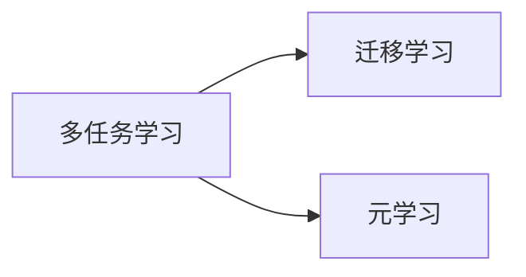

# 多任务学习(Multi-task Learning)原理与代码实战案例讲解

## 1. 背景介绍

### 1.1 多任务学习的定义与起源

多任务学习(Multi-task Learning, MTL)是一种机器学习范式,其目标是同时学习多个相关任务,通过利用这些任务之间的相似性和差异性,来提高模型的泛化能力和学习效率。多任务学习最早由Rich Caruana在1997年提出,他在论文《Multitask Learning》中指出,通过共享不同任务的信息,可以使模型在主任务上取得更好的性能。

### 1.2 多任务学习的优势

与单任务学习相比,多任务学习具有以下优势:

1. 提高模型泛化能力:通过学习多个相关任务,模型可以学到更加通用的特征表示,从而提高在新任务上的泛化能力。
2. 减少过拟合风险:多任务学习可以起到正则化的作用,降低单个任务的过拟合风险。
3. 加速模型收敛:不同任务间的知识迁移可以加速模型的收敛速度。
4. 减少数据需求:多任务学习可以利用其他任务的数据,减少目标任务所需的标注数据。

### 1.3 多任务学习的应用场景

多任务学习在自然语言处理、计算机视觉、语音识别等领域有广泛应用,典型的应用场景包括:

1. 自然语言处理:同时训练命名实体识别、词性标注、语义角色标注等任务。
2. 计算机视觉:同时训练目标检测、语义分割、关键点检测等任务。 
3. 语音识别:同时训练声学模型和语言模型。
4. 推荐系统:同时训练用户兴趣预测和商品属性预测任务。

## 2. 核心概念与联系

### 2.1 任务相关性

多任务学习的关键在于不同任务之间的相关性。Caruana将任务相关性分为以下四类:

1. 特征相关性:不同任务共享相同或相似的输入特征。
2. 语义相关性:不同任务在语义上具有一定的相似性。
3. 模型相关性:不同任务可以共享相同或相似的模型结构。
4. 优化目标相关性:不同任务的优化目标具有一定的相似性。

任务相关性越强,通过多任务学习获得的性能提升就越显著。

### 2.2 硬参数共享与软参数共享

根据任务间参数共享的方式,多任务学习可以分为硬参数共享和软参数共享两种:

1. 硬参数共享:不同任务共享同一组参数,模型底层结构对所有任务都是相同的,顶层分支结构针对不同任务而定制。硬参数共享的代表模型是多任务CNN。
2. 软参数共享:每个任务都有独立的参数,但通过正则化项来鼓励不同任务的参数相似。软参数共享的代表模型是跨层耦合的多任务模型。

### 2.3 多任务学习与迁移学习、元学习的区别

多任务学习与迁移学习、元学习都是提高模型泛化能力的手段,但又有所区别:

1. 迁移学习侧重于将源任务的知识迁移到目标任务,而多任务学习侧重于多个任务间的相互促进。
2. 元学习侧重于学习如何快速适应新任务,而多任务学习侧重于同时学习多个任务。

下图展示了多任务学习、迁移学习、元学习三者间的关系:



## 3. 核心算法原理与具体操作步骤

### 3.1 基于硬参数共享的多任务学习算法

基于硬参数共享的多任务学习算法的核心思想是让不同任务共享同一组参数。以多任务CNN为例,其具体操作步骤如下:

1. 构建多任务CNN模型:
   - 底层卷积层:所有任务共享,用于提取通用特征。
   - 顶层全连接层:针对不同任务定制,用于提取任务特定特征。
2. 准备多任务训练数据:为每个任务准备独立的训练集。
3. 定义多任务损失函数:
   - 每个任务定义独立的损失函数。
   - 将各任务的损失函数加权求和,得到总的多任务损失函数。
4. 训练多任务模型:
   - 在每个训练步骤,随机选择一个任务,计算其损失函数和梯度。
   - 根据梯度更新模型参数。
5. 评估多任务模型:在每个任务的测试集上评估模型性能。

### 3.2 基于软参数共享的多任务学习算法

基于软参数共享的多任务学习算法的核心思想是通过正则化项来鼓励不同任务的参数相似。以跨层耦合的多任务模型为例,其具体操作步骤如下:

1. 构建跨层耦合的多任务模型:
   - 每个任务有独立的模型参数。
   - 在损失函数中引入正则化项,鼓励不同任务的参数相似。
2. 准备多任务训练数据:为每个任务准备独立的训练集。
3. 定义多任务损失函数:
   - 每个任务定义独立的损失函数。
   - 引入跨任务耦合正则化项,鼓励不同任务的参数相似。
   - 将各任务损失函数和正则化项加权求和,得到总的多任务损失函数。
4. 训练多任务模型:
   - 在每个训练步骤,随机选择一个任务,计算其损失函数和梯度。
   - 根据梯度更新模型参数。
5. 评估多任务模型:在每个任务的测试集上评估模型性能。

## 4. 数学模型和公式详细讲解举例说明

### 4.1 基于硬参数共享的多任务CNN模型

考虑一个包含 $T$ 个任务的多任务学习问题,第 $t$ 个任务的训练集为 $D_t=\{(x_i^t,y_i^t)\}_{i=1}^{N_t}$,其中 $x_i^t$ 为输入特征, $y_i^t$ 为标签, $N_t$ 为第 $t$ 个任务的训练样本数。多任务CNN模型可以表示为:

$$
f_t(x;\theta_s,\theta_t)=g_t(h(x;\theta_s);\theta_t)
$$

其中 $\theta_s$ 为所有任务共享的参数, $\theta_t$ 为第 $t$ 个任务独有的参数, $h(\cdot)$ 为共享的特征提取器, $g_t(\cdot)$ 为第 $t$ 个任务的特定分类器。

多任务CNN的损失函数定义为所有任务损失函数的加权求和:

$$
L(\Theta)=\sum_{t=1}^T \lambda_t L_t(\theta_s,\theta_t)
$$

其中 $\Theta=\{\theta_s,\theta_1,\ldots,\theta_T\}$ 为所有参数, $\lambda_t$ 为第 $t$ 个任务的权重系数, $L_t$ 为第 $t$ 个任务的损失函数,例如交叉熵损失:

$$
L_t(\theta_s,\theta_t)=-\frac{1}{N_t}\sum_{i=1}^{N_t}y_i^t\log f_t(x_i^t;\theta_s,\theta_t)
$$

### 4.2 基于软参数共享的跨层耦合多任务模型

考虑一个包含 $T$ 个任务的多任务学习问题,第 $t$ 个任务的训练集为 $D_t=\{(x_i^t,y_i^t)\}_{i=1}^{N_t}$,其中 $x_i^t$ 为输入特征, $y_i^t$ 为标签, $N_t$ 为第 $t$ 个任务的训练样本数。跨层耦合多任务模型可以表示为:

$$
f_t(x;\theta_t)=g_t(h_t(x;\theta_t);\theta_t)
$$

其中 $\theta_t$ 为第 $t$ 个任务独有的参数, $h_t(\cdot)$ 为第 $t$ 个任务的特征提取器, $g_t(\cdot)$ 为第 $t$ 个任务的分类器。

跨层耦合多任务模型的损失函数包括两部分:每个任务独立的损失函数和跨任务耦合正则化项:

$$
L(\Theta)=\sum_{t=1}^T \lambda_t L_t(\theta_t) + \alpha R(\Theta)
$$

其中 $\Theta=\{\theta_1,\ldots,\theta_T\}$ 为所有参数, $\lambda_t$ 为第 $t$ 个任务的权重系数, $L_t$ 为第 $t$ 个任务的损失函数,例如交叉熵损失:

$$
L_t(\theta_t)=-\frac{1}{N_t}\sum_{i=1}^{N_t}y_i^t\log f_t(x_i^t;\theta_t)
$$

$R(\Theta)$ 为跨任务耦合正则化项,常见的形式有L2正则化:

$$
R(\Theta)=\sum_{t=1}^{T-1}\sum_{k=t+1}^T\|\theta_t-\theta_k\|_2^2
$$

和trace正则化:

$$
R(\Theta)=\sum_{t=1}^{T-1}\sum_{k=t+1}^T tr(\theta_t^T\theta_k)
$$

其中 $\alpha$ 为正则化项的权重系数。

## 5. 项目实践:代码实例和详细解释说明

下面以Keras框架为例,演示如何实现基于硬参数共享的多任务CNN模型。考虑一个包含两个任务的图像分类问题:任务1是判断图像中是否包含猫,任务2是判断图像中是否包含狗。

```python
import numpy as np
from keras.models import Model
from keras.layers import Input, Conv2D, MaxPooling2D, Flatten, Dense
from keras.optimizers import Adam

# 准备训练数据
x_train = np.random.rand(1000, 64, 64, 3) 
y1_train = np.random.randint(0, 2, (1000,))  # 任务1标签
y2_train = np.random.randint(0, 2, (1000,))  # 任务2标签

# 构建多任务CNN模型
input_layer = Input(shape=(64, 64, 3))
conv1 = Conv2D(32, (3, 3), activation='relu')(input_layer)
pool1 = MaxPooling2D((2, 2))(conv1)
conv2 = Conv2D(64, (3, 3), activation='relu')(pool1)
pool2 = MaxPooling2D((2, 2))(conv2)
flatten = Flatten()(pool2)

# 任务1分支
dense1_1 = Dense(64, activation='relu')(flatten)
output1 = Dense(1, activation='sigmoid', name='output1')(dense1_1)

# 任务2分支  
dense2_1 = Dense(64, activation='relu')(flatten)
output2 = Dense(1, activation='sigmoid', name='output2')(dense2_1)

model = Model(inputs=input_layer, outputs=[output1, output2])

# 编译多任务模型
model.compile(optimizer=Adam(lr=0.001), 
              loss={'output1':'binary_crossentropy', 
                    'output2':'binary_crossentropy'},
              loss_weights={'output1':1.0, 'output2':1.0},
              metrics=['accuracy'])

# 训练多任务模型
model.fit(x_train, [y1_train, y2_train], 
          batch_size=32, epochs=10, verbose=1)
```

代码解释:

1. 准备训练数据:生成一个包含1000个样本的训练集,每个样本是一个64x64的RGB图像。任务1和任务2的标签分别用0/1表示是否包含猫/狗。
2. 构建多任务CNN模型:
   - 所有任务共享卷积层和池化层,用于提取图像特征。
   - 在共享特征的基础上,为每个任务定制全连接层和输出层。
3. 编译多任务模型:
   - 每个任务使用二元交叉熵损失函数。
   - 两个任务的损失权重都设为1.0。
   - 每个任务使用准确率指标评估性能。
4. 训练多任务模型:
   - 将训练数据输入模型,同时提供两个任务的标签。
   - 设置batch size为32,训练10个epoch。

## 6. 实际应用场景

多任务学习在许多实际应用中取得了成功,例如:

1. 自然语言处理: