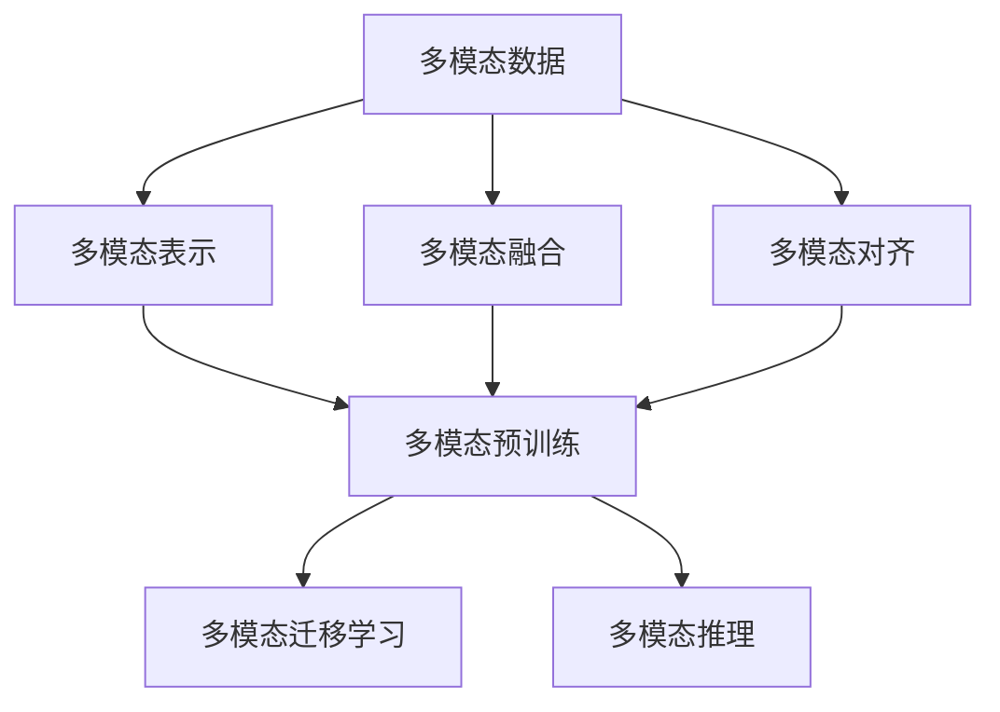

# 多模态大模型：技术原理与实战 自然语言处理的发展历程

## 1. 背景介绍
### 1.1 自然语言处理的发展历程
#### 1.1.1 早期的自然语言处理
#### 1.1.2 基于统计学习的自然语言处理
#### 1.1.3 深度学习时代的自然语言处理
### 1.2 多模态大模型的兴起
#### 1.2.1 多模态学习的概念
#### 1.2.2 大模型的发展历程
#### 1.2.3 多模态大模型的优势

## 2. 核心概念与联系
### 2.1 多模态学习
#### 2.1.1 多模态数据的表示
#### 2.1.2 多模态数据的融合
#### 2.1.3 多模态数据的对齐
### 2.2 大模型
#### 2.2.1 预训练模型
#### 2.2.2 自监督学习
#### 2.2.3 迁移学习
### 2.3 多模态大模型
#### 2.3.1 多模态预训练
#### 2.3.2 多模态迁移学习
#### 2.3.3 多模态推理



## 3. 核心算法原理具体操作步骤
### 3.1 多模态表示学习
#### 3.1.1 视觉特征提取
#### 3.1.2 文本特征提取
#### 3.1.3 语音特征提取
### 3.2 多模态融合
#### 3.2.1 早期融合
#### 3.2.2 晚期融合
#### 3.2.3 中间融合
### 3.3 多模态对齐
#### 3.3.1 显式对齐
#### 3.3.2 隐式对齐
### 3.4 多模态预训练
#### 3.4.1 掩码语言模型
#### 3.4.2 对比语言-图像预训练
#### 3.4.3 视频-文本预训练

## 4. 数学模型和公式详细讲解举例说明
### 4.1 注意力机制
注意力机制可以表示为：

$$Attention(Q,K,V) = softmax(\frac{QK^T}{\sqrt{d_k}})V$$

其中，$Q$表示查询，$K$表示键，$V$表示值，$d_k$是键的维度。

### 4.2 Transformer模型
Transformer模型的编码器可以表示为：

$$Encoder(x) = LayerNorm(x + MHSelfAttention(x))$$

其中，$x$表示输入序列，$MHSelfAttention$表示多头自注意力机制。

### 4.3 对比学习
对比学习的损失函数可以表示为：

$$\mathcal{L}_{contrast} = -\log \frac{\exp(sim(q,k_+)/\tau)}{\sum_{i=0}^K \exp(sim(q,k_i)/\tau)}$$

其中，$q$表示查询，$k_+$表示正样本，$k_i$表示负样本，$\tau$是温度参数。

## 5. 项目实践：代码实例和详细解释说明
### 5.1 多模态预训练模型的实现
以下是使用PyTorch实现的一个简单的多模态预训练模型：

```python
import torch
import torch.nn as nn

class MultimodalPretrainModel(nn.Module):
    def __init__(self, vision_model, text_model, fusion_dim):
        super(MultimodalPretrainModel, self).__init__()
        self.vision_model = vision_model
        self.text_model = text_model
        self.fusion_layer = nn.Linear(fusion_dim, fusion_dim)
        
    def forward(self, image, text):
        image_feat = self.vision_model(image)
        text_feat = self.text_model(text)
        fused_feat = torch.cat([image_feat, text_feat], dim=-1)
        output = self.fusion_layer(fused_feat)
        return output
```

该模型包含一个视觉模型和一个文本模型，用于提取图像和文本的特征。然后将两个模态的特征拼接起来，通过一个全连接层进行融合。

### 5.2 多模态对齐的实现
以下是使用PyTorch实现的一个简单的多模态对齐模型：

```python
import torch
import torch.nn as nn

class MultimodalAlignmentModel(nn.Module):
    def __init__(self, vision_model, text_model, projection_dim):
        super(MultimodalAlignmentModel, self).__init__()
        self.vision_model = vision_model
        self.text_model = text_model
        self.vision_projection = nn.Linear(vision_model.output_dim, projection_dim)
        self.text_projection = nn.Linear(text_model.output_dim, projection_dim)
        
    def forward(self, image, text):
        image_feat = self.vision_model(image)
        text_feat = self.text_model(text)
        image_proj = self.vision_projection(image_feat)
        text_proj = self.text_projection(text_feat)
        alignment_loss = torch.mean((image_proj - text_proj) ** 2)
        return alignment_loss
```

该模型包含一个视觉模型和一个文本模型，用于提取图像和文本的特征。然后通过两个投影层将两个模态的特征映射到同一个空间中，并计算它们之间的欧氏距离作为对齐损失。

## 6. 实际应用场景
### 6.1 图像描述生成
多模态大模型可以用于自动生成图像的文本描述。给定一张图像，模型可以理解图像的内容，并生成与之相关的自然语言描述。

### 6.2 视觉问答
多模态大模型可以用于回答关于图像的问题。给定一张图像和一个问题，模型可以理解图像和问题的内容，并生成相应的答案。

### 6.3 视频摘要生成
多模态大模型可以用于自动生成视频的文本摘要。给定一个视频，模型可以理解视频的内容，并生成一个简洁的文本摘要。

## 7. 工具和资源推荐
### 7.1 数据集
- COCO：包含图像和对应的文本描述
- Flickr30k：包含图像和对应的文本描述
- VQA：包含图像、问题和答案
- MSRVTT：包含视频和对应的文本描述

### 7.2 开源工具包
- MMF：用于多模态学习的开源库
- transformers：包含各种预训练模型的开源库
- PyTorch：流行的深度学习框架
- TensorFlow：流行的深度学习框架

### 7.3 预训练模型
- CLIP：用于图像-文本对齐的预训练模型
- ViLBERT：用于视觉-语言任务的预训练模型
- UniVL：用于视频-语言任务的预训练模型

## 8. 总结：未来发展趋势与挑战
### 8.1 未来发展趋势
#### 8.1.1 更大规模的多模态预训练
#### 8.1.2 更多模态的融合
#### 8.1.3 更广泛的应用场景
### 8.2 面临的挑战
#### 8.2.1 数据质量和规模
#### 8.2.2 模型的可解释性
#### 8.2.3 公平性和隐私问题

## 9. 附录：常见问题与解答
### 9.1 多模态大模型与单模态模型相比有什么优势？
多模态大模型可以利用不同模态之间的互补信息，从而获得更全面、更准确的理解。相比单模态模型，多模态大模型在处理涉及多个模态的任务时通常能取得更好的性能。

### 9.2 多模态大模型需要多大规模的数据集？
训练多模态大模型通常需要大规模的数据集，包含成对的不同模态的数据，如图像和文本描述、视频和文本描述等。数据集的规模越大，模型的性能往往越好。

### 9.3 多模态大模型的训练需要什么样的硬件条件？
训练多模态大模型对硬件要求较高，通常需要多个高性能GPU，并且需要大容量的内存和存储。在实际应用中，可以利用模型压缩、知识蒸馏等技术来减小模型的规模，从而降低硬件要求。

作者：禅与计算机程序设计艺术 / Zen and the Art of Computer Programming