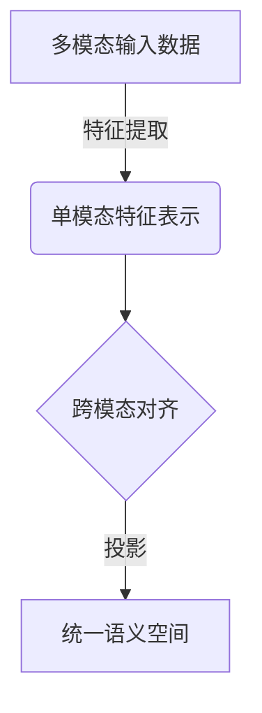
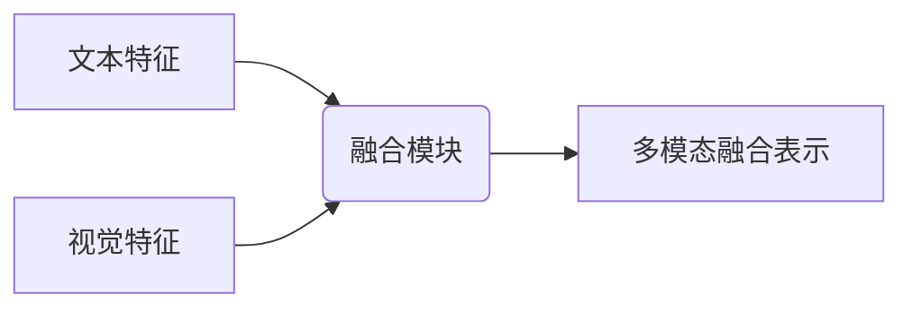
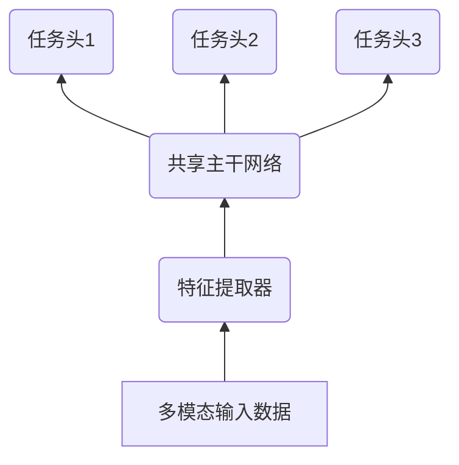

# 多模态大模型：技术原理与实战 部署过程中常见的问题总结

## 1.背景介绍

### 1.1 人工智能发展历程

人工智能经历了从狭义人工智能到通用人工智能的发展历程。狭义人工智能系统专注于解决特定任务,例如计算机视觉、自然语言处理等,而通用人工智能系统则旨在模拟人类的认知能力,具备广泛的推理和学习能力。

### 1.2 大模型兴起

近年来,随着算力、数据和模型规模的不断增长,大模型成为人工智能发展的重要方向。大模型通过预训练海量数据,学习丰富的知识和能力,为下游任务提供强大的迁移能力。

### 1.3 多模态大模型概念

多模态大模型是指能够同时处理多种模态数据(如文本、图像、视频、音频等)的大规模预训练模型。相比单一模态,多模态大模型具有更强的泛化能力和表现力,可以更好地理解和表达复杂的多模态信息。

## 2.核心概念与联系

### 2.1 多模态表示学习

多模态表示学习旨在学习统一的表示空间,将不同模态的数据映射到同一语义空间中,捕获模态间的相关性。这是多模态大模型的核心技术。



### 2.2 多模态融合

多模态融合是指将不同模态的特征有效融合,产生更加丰富的表示。常见的融合方式包括早期融合、晚期融合和混合融合等。



### 2.3 多任务学习

多任务学习使模型能够同时学习多个相关任务,提高泛化能力和数据利用效率。多模态大模型通常采用多任务学习范式,在预训练阶段同时优化多个模态相关的任务目标。



## 3.核心算法原理具体操作步骤

### 3.1 预训练阶段

1. **数据采集**：收集大量高质量的多模态数据,如图文对、视频字幕等。
2. **数据预处理**：对不同模态的数据进行适当的预处理,如文本分词、图像归一化等。
3. **模型构建**：设计支持多模态输入的Transformer模型架构,包括编码器和解码器。
4. **预训练任务**：设计多个预训练任务,如遮蔽语言模型、视觉问答等,用于学习多模态表示。
5. **预训练优化**：采用多任务学习范式,同时优化多个预训练任务目标,获得多模态表示。

### 3.2 微调阶段

1. **下游任务数据准备**：收集针对特定下游任务的多模态数据,如图像分类、文本生成等。
2. **模型微调**：在预训练模型的基础上,进一步微调模型参数以适应下游任务。
3. **评估和部署**：在验证集上评估模型性能,并将模型部署到生产环境中。

## 4.数学模型和公式详细讲解举例说明

### 4.1 注意力机制

注意力机制是多模态大模型的核心组件之一,用于捕获不同模态之间的相关性。给定查询 $q$、键 $K$ 和值 $V$,注意力计算公式如下:

$$\text{Attention}(Q, K, V) = \text{softmax}\left(\frac{QK^T}{\sqrt{d_k}}\right)V$$

其中 $d_k$ 是缩放因子,用于避免内积值过大导致梯度饱和。

### 4.2 对比学习目标

对比学习是多模态表示学习的重要方法,通过最大化正例对的相似性,最小化负例对的相似性,学习区分不同模态数据的能力。常用的对比学习目标是 InfoNCE 损失:

$$\mathcal{L}_\text{InfoNCE} = -\mathbb{E}_{(i,j)\sim p_\text{pos}}\left[\log\frac{\exp(\text{sim}(z_i, z_j)/\tau)}{\sum_{k\in\mathcal{N}(i)}\exp(\text{sim}(z_i, z_k)/\tau)}\right]$$

其中 $z_i$ 和 $z_j$ 是正例对的表示, $\mathcal{N}(i)$ 是负例集合, $\tau$ 是温度超参数, $\text{sim}(\cdot, \cdot)$ 是相似度函数。

### 4.3 视觉语义对齐

视觉语义对齐旨在将视觉和语义表示映射到同一语义空间中。一种常见的方法是使用双向编码器,其中视觉编码器和文本编码器分别编码图像和文本,然后通过对比损失函数对齐两种表示。

$$\mathcal{L}_\text{align} = \mathcal{L}_\text{InfoNCE}^\text{img2txt} + \mathcal{L}_\text{InfoNCE}^\text{txt2img}$$

## 5.项目实践：代码实例和详细解释说明

以下是一个基于 PyTorch 的多模态视觉问答模型示例:

```python
import torch
import torch.nn as nn

class VisualEncoder(nn.Module):
    def __init__(self, ...):
        ...

    def forward(self, images):
        ...
        return visual_features

class TextEncoder(nn.Module):
    def __init__(self, ...):
        ...

    def forward(self, texts):
        ...
        return text_features

class MultimodalFusion(nn.Module):
    def __init__(self, ...):
        ...

    def forward(self, visual_features, text_features):
        ...
        return fused_features

class VQAModel(nn.Module):
    def __init__(self, ...):
        ...
        self.visual_encoder = VisualEncoder(...)
        self.text_encoder = TextEncoder(...)
        self.fusion = MultimodalFusion(...)
        self.classifier = nn.Linear(...)

    def forward(self, images, questions):
        visual_features = self.visual_encoder(images)
        text_features = self.text_encoder(questions)
        fused_features = self.fusion(visual_features, text_features)
        outputs = self.classifier(fused_features)
        return outputs
```

在这个示例中:

1. `VisualEncoder` 用于编码图像输入,提取视觉特征。
2. `TextEncoder` 用于编码文本输入,提取文本特征。
3. `MultimodalFusion` 将视觉和文本特征融合,产生多模态表示。
4. `VQAModel` 是整体模型,包含编码器、融合模块和分类器。

在训练过程中,可以使用交叉熵损失函数优化模型参数,并在验证集上评估模型性能。

## 6.实际应用场景

多模态大模型在以下场景中有广泛的应用:

1. **视觉问答**:根据图像和自然语言问题,生成相应的答案。
2. **图像描述**:根据图像生成自然语言描述。
3. **视频描述**:根据视频生成自然语言描述或字幕。
4. **多模态检索**:根据一种模态的输入(如文本或图像),检索相关的其他模态数据。
5. **多模态生成**:根据一种或多种模态的输入,生成新的多模态内容。
6. **多模态分析**:在多模态数据上进行情感分析、事件检测等任务。

## 7.工具和资源推荐

以下是一些常用的多模态大模型工具和资源:

1. **PyTorch**:流行的深度学习框架,支持多模态建模。
2. **TensorFlow**:另一种流行的深度学习框架,也支持多模态建模。
3. **Hugging Face Transformers**:提供了多种预训练模型,包括一些多模态模型。
4. **CLIP**:OpenAI开源的视觉语义对齐模型,可用于多模态表示学习。
5. **LAION**:大规模多模态数据集,包含数十亿张图像及相应的文本描述。
6. **Conceptual Captions**:高质量的图文对数据集,可用于多模态预训练。

## 8.总结:未来发展趋势与挑战

### 8.1 发展趋势

1. **模型规模持续增长**:随着算力和数据的不断增长,模型规模将继续扩大,以学习更丰富的知识和能力。
2. **多模态融合方式创新**:探索更有效的多模态融合方式,提高不同模态之间的交互和协同能力。
3. **注意力机制优化**:优化注意力机制,提高模型对长期依赖和全局信息的建模能力。
4. **少样本学习和迁移学习**:提高模型在少量数据或新领域的适应能力。
5. **解释性和可控性**:增强模型的解释性和可控性,使其更加可靠和可信。

### 8.2 挑战

1. **计算资源需求**:大模型训练和推理对计算资源的需求巨大,需要更高效的算法和硬件加速。
2. **数据质量和隐私**:确保训练数据的质量和隐私保护,避免模型学习到有偏见或不当的知识。
3. **鲁棒性和安全性**:提高模型对adversarial攻击、噪声数据等的鲁棒性和安全性。
4. **评估和测试**:设计合理的评估指标和测试方法,全面衡量多模态模型的性能。
5. **模型部署**:高效地将大规模多模态模型部署到生产环境中,满足低延迟和高吞吐量的要求。

## 9.附录:常见问题与解答

1. **多模态大模型与单模态模型相比,有什么优势?**

多模态大模型能够同时处理多种模态数据,捕获不同模态之间的相关性和互补信息,从而具有更强的表现力和泛化能力。它们在许多复杂任务上表现出优于单模态模型的性能。

2. **多模态大模型的训练过程是怎样的?**

多模态大模型通常采用两阶段训练策略。首先是预训练阶段,在大规模多模态数据上进行自监督学习,获得初始的多模态表示能力。然后是微调阶段,在特定下游任务上进一步调整模型参数,使其适应具体任务。

3. **如何评估多模态大模型的性能?**

评估多模态大模型性能需要综合考虑多个指标,包括下游任务的指标(如准确率、F1分数等)、模态间的一致性、模型的泛化能力等。此外,还需要关注模型的计算效率、内存占用等实际部署指标。

4. **多模态大模型存在哪些潜在风险和挑战?**

多模态大模型面临一些潜在风险和挑战,如数据质量和隐私问题、模型偏见和不当知识、对抗攻击和鲁棒性、计算资源需求等。需要采取相应的缓解措施,如数据清洗、模型解释性、鲁棒优化等,以确保模型的安全性和可靠性。

5. **多模态大模型在实际应用中存在哪些挑战?**

在实际应用中,多模态大模型面临一些挑战,如模型部署和优化、实时响应和低延迟要求、大规模并行计算等。需要采用高效的模型压缩、模型并行化等技术,以满足实际应用的需求。

作者: 禅与计算机程序设计艺术 / Zen and the Art of Computer Programming