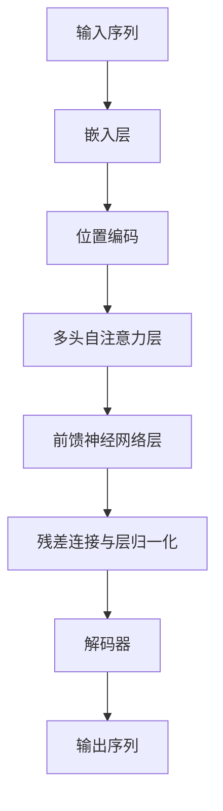

# 大语言模型原理与工程实践：难点和挑战

## 1. 背景介绍
### 1.1 大语言模型的发展历程
#### 1.1.1 早期的语言模型
#### 1.1.2 神经网络语言模型的兴起 
#### 1.1.3 Transformer 架构的革命性突破
### 1.2 大语言模型的应用领域
#### 1.2.1 自然语言处理
#### 1.2.2 信息检索与问答系统
#### 1.2.3 机器翻译与文本生成
### 1.3 大语言模型面临的挑战
#### 1.3.1 训练数据的质量与规模
#### 1.3.2 计算资源的瓶颈
#### 1.3.3 模型的可解释性与可控性

## 2. 核心概念与联系
### 2.1 语言模型
#### 2.1.1 统计语言模型
#### 2.1.2 神经网络语言模型
#### 2.1.3 上下文感知的语言模型
### 2.2 注意力机制
#### 2.2.1 注意力机制的基本原理
#### 2.2.2 自注意力机制
#### 2.2.3 多头注意力机制
### 2.3 Transformer 架构  
#### 2.3.1 编码器-解码器结构
#### 2.3.2 位置编码
#### 2.3.3 残差连接与层归一化



## 3. 核心算法原理具体操作步骤
### 3.1 Transformer 的编码器
#### 3.1.1 输入嵌入与位置编码
#### 3.1.2 多头自注意力层的计算过程
#### 3.1.3 前馈神经网络层与残差连接
### 3.2 Transformer 的解码器  
#### 3.2.1 掩码自注意力机制
#### 3.2.2 编码-解码注意力机制
#### 3.2.3 解码器的自回归生成过程
### 3.3 Transformer 的训练与优化
#### 3.3.1 训练目标与损失函数
#### 3.3.2 优化算法与学习率调度
#### 3.3.3 梯度裁剪与正则化技术

## 4. 数学模型和公式详细讲解举例说明 
### 4.1 注意力机制的数学表示
#### 4.1.1 缩放点积注意力
$Attention(Q,K,V) = softmax(\frac{QK^T}{\sqrt{d_k}})V$
#### 4.1.2 多头注意力
$MultiHead(Q,K,V) = Concat(head_1, ..., head_h)W^O$
其中，$head_i = Attention(QW_i^Q, KW_i^K, VW_i^V)$
#### 4.1.3 自注意力与掩码自注意力
### 4.2 Transformer 的前向传播过程
#### 4.2.1 编码器的前向传播
$Encoder(x) = LayerNorm(x + SubLayer(x))$
其中，$SubLayer(x) = max(0, xW_1 + b_1)W_2 + b_2$
#### 4.2.2 解码器的前向传播 
$Decoder(x, memory) = LayerNorm(x + SubLayer(x, memory))$
### 4.3 损失函数与优化算法
#### 4.3.1 交叉熵损失函数
$L(x, y) = -\sum_{i=1}^{n} y_i \log(p(x_i))$
#### 4.3.2 Adam 优化算法
$m_t = \beta_1 m_{t-1} + (1 - \beta_1) g_t$
$v_t = \beta_2 v_{t-1} + (1 - \beta_2) g_t^2$
$\hat{m}_t = \frac{m_t}{1 - \beta_1^t}$
$\hat{v}_t = \frac{v_t}{1 - \beta_2^t}$
$\theta_t = \theta_{t-1} - \frac{\eta}{\sqrt{\hat{v}_t} + \epsilon} \hat{m}_t$

## 5. 项目实践：代码实例和详细解释说明
### 5.1 数据预处理与词嵌入
#### 5.1.1 文本数据清洗与标记化
```python
import re
def preprocess_text(text):
    text = text.lower()
    text = re.sub(r"[^a-zA-Z0-9]+", " ", text)
    return text.strip()
```
#### 5.1.2 构建词汇表与词嵌入矩阵
```python
from tensorflow.keras.preprocessing.text import Tokenizer
tokenizer = Tokenizer(num_words=MAX_VOCAB_SIZE)
tokenizer.fit_on_texts(texts)
sequences = tokenizer.texts_to_sequences(texts)
```
### 5.2 Transformer 模型的实现
#### 5.2.1 位置编码
```python
def positional_encoding(pos, d_model):
    def get_angles(pos, i, d_model):
        angle_rates = 1 / np.power(10000, (2 * (i//2)) / np.float32(d_model))
        return pos * angle_rates
    
    angle_rads = get_angles(np.arange(pos)[:, np.newaxis],
                            np.arange(d_model)[np.newaxis, :],
                            d_model)
    
    angle_rads[:, 0::2] = np.sin(angle_rads[:, 0::2])
    angle_rads[:, 1::2] = np.cos(angle_rads[:, 1::2])
    
    pos_encoding = angle_rads[np.newaxis, ...]
    
    return tf.cast(pos_encoding, dtype=tf.float32)
```
#### 5.2.2 多头注意力层
```python
class MultiHeadAttention(tf.keras.layers.Layer):
    def __init__(self, d_model, num_heads):
        super(MultiHeadAttention, self).__init__()
        self.num_heads = num_heads
        self.d_model = d_model
        
        assert d_model % self.num_heads == 0
        
        self.depth = d_model // self.num_heads
        
        self.wq = tf.keras.layers.Dense(d_model)
        self.wk = tf.keras.layers.Dense(d_model)
        self.wv = tf.keras.layers.Dense(d_model)
        
        self.dense = tf.keras.layers.Dense(d_model)
    
    def split_heads(self, x, batch_size):
        x = tf.reshape(x, (batch_size, -1, self.num_heads, self.depth))
        return tf.transpose(x, perm=[0, 2, 1, 3])
    
    def call(self, v, k, q, mask):
        batch_size = tf.shape(q)[0]
        
        q = self.wq(q)
        k = self.wk(k)  
        v = self.wv(v)
        
        q = self.split_heads(q, batch_size)
        k = self.split_heads(k, batch_size)
        v = self.split_heads(v, batch_size)
        
        scaled_attention, attention_weights = scaled_dot_product_attention(q, k, v, mask)
        
        scaled_attention = tf.transpose(scaled_attention, perm=[0, 2, 1, 3])
        
        concat_attention = tf.reshape(scaled_attention, (batch_size, -1, self.d_model))
        
        output = self.dense(concat_attention)
        
        return output, attention_weights
```
#### 5.2.3 Transformer 的编码器与解码器
```python
class EncoderLayer(tf.keras.layers.Layer):
    def __init__(self, d_model, num_heads, dff, rate=0.1):
        super(EncoderLayer, self).__init__()
        
        self.mha = MultiHeadAttention(d_model, num_heads)
        self.ffn = point_wise_feed_forward_network(d_model, dff)
        
        self.layernorm1 = tf.keras.layers.LayerNormalization(epsilon=1e-6)
        self.layernorm2 = tf.keras.layers.LayerNormalization(epsilon=1e-6)
        
        self.dropout1 = tf.keras.layers.Dropout(rate)
        self.dropout2 = tf.keras.layers.Dropout(rate)
    
    def call(self, x, training, mask):
        attn_output, _ = self.mha(x, x, x, mask)
        attn_output = self.dropout1(attn_output, training=training)
        out1 = self.layernorm1(x + attn_output)
        
        ffn_output = self.ffn(out1)
        ffn_output = self.dropout2(ffn_output, training=training)
        out2 = self.layernorm2(out1 + ffn_output)
        
        return out2

class DecoderLayer(tf.keras.layers.Layer):
    def __init__(self, d_model, num_heads, dff, rate=0.1):
        super(DecoderLayer, self).__init__()
        
        self.mha1 = MultiHeadAttention(d_model, num_heads)
        self.mha2 = MultiHeadAttention(d_model, num_heads)
        
        self.ffn = point_wise_feed_forward_network(d_model, dff)
        
        self.layernorm1 = tf.keras.layers.LayerNormalization(epsilon=1e-6)
        self.layernorm2 = tf.keras.layers.LayerNormalization(epsilon=1e-6)
        self.layernorm3 = tf.keras.layers.LayerNormalization(epsilon=1e-6)
        
        self.dropout1 = tf.keras.layers.Dropout(rate)
        self.dropout2 = tf.keras.layers.Dropout(rate)
        self.dropout3 = tf.keras.layers.Dropout(rate)
    
    def call(self, x, enc_output, training, look_ahead_mask, padding_mask):
        attn1, attn_weights_block1 = self.mha1(x, x, x, look_ahead_mask)
        attn1 = self.dropout1(attn1, training=training)
        out1 = self.layernorm1(attn1 + x)
        
        attn2, attn_weights_block2 = self.mha2(enc_output, enc_output, out1, padding_mask)
        attn2 = self.dropout2(attn2, training=training)
        out2 = self.layernorm2(attn2 + out1)
        
        ffn_output = self.ffn(out2)
        ffn_output = self.dropout3(ffn_output, training=training)
        out3 = self.layernorm3(ffn_output + out2)
        
        return out3, attn_weights_block1, attn_weights_block2
```

### 5.3 模型训练与评估
#### 5.3.1 数据集划分与批处理
```python
train_dataset = tf.data.Dataset.from_tensor_slices((train_inputs, train_outputs))
train_dataset = train_dataset.cache()
train_dataset = train_dataset.shuffle(BUFFER_SIZE).batch(BATCH_SIZE)
train_dataset = train_dataset.prefetch(tf.data.experimental.AUTOTUNE)

val_dataset = tf.data.Dataset.from_tensor_slices((val_inputs, val_outputs))
val_dataset = val_dataset.batch(BATCH_SIZE)
```
#### 5.3.2 模型编译与训练
```python
transformer = Transformer(num_layers, d_model, num_heads, dff, input_vocab_size, target_vocab_size, pe_input=input_vocab_size, pe_target=target_vocab_size, rate=dropout_rate)

optimizer = tf.keras.optimizers.Adam(learning_rate, beta_1=0.9, beta_2=0.98, epsilon=1e-9)

transformer.compile(optimizer=optimizer, loss=masked_loss)

history = transformer.fit(train_dataset, epochs=EPOCHS, validation_data=val_dataset)
```
#### 5.3.3 模型评估与推理
```python
def evaluate(inp_sentence):
    start_token = [tokenizer_pt.vocab_size]
    end_token = [tokenizer_pt.vocab_size + 1]
    
    inp_sentence = start_token + tokenizer_pt.encode(inp_sentence) + end_token
    encoder_input = tf.expand_dims(inp_sentence, 0)
    
    decoder_input = [tokenizer_en.vocab_size]
    output = tf.expand_dims(decoder_input, 0)
    
    for i in range(MAX_LENGTH):
        enc_padding_mask, combined_mask, dec_padding_mask = create_masks(encoder_input, output)
        
        predictions, attention_weights = transformer(encoder_input, output, False, enc_padding_mask, combined_mask, dec_padding_mask)
        
        predictions = predictions[:, -1:, :]
        
        predicted_id = tf.cast(tf.argmax(predictions, axis=-1), tf.int32)
        
        if predicted_id == tokenizer_en.vocab_size+1:
            return tf.squeeze(output, axis=0), attention_weights
        
        output = tf.concat([output, predicted_id], axis=-1)
    
    return tf.squeeze(output, axis=0), attention_weights

def translate(sentence):
    result, attention_weights = evaluate(sentence)
    
    predicted_sentence = tokenizer_en.decode([i for i in result if i < tokenizer_en.vocab_size])
    
    return predicted_sentence
```

## 6. 实际应用场景
### 6.1 机器翻译
#### 6.1.1 多语言翻译系统
#### 6.1.2 领域适应与个性化翻译
#### 6.1.3 翻译质量评估与人工反馈
### 6.2 智能对话与问答
#### 6.2.1 开放域对话系统
#### 6.2.2 知识驱动的问答系统
#### 6.2.3 个性化对话生成
### 6