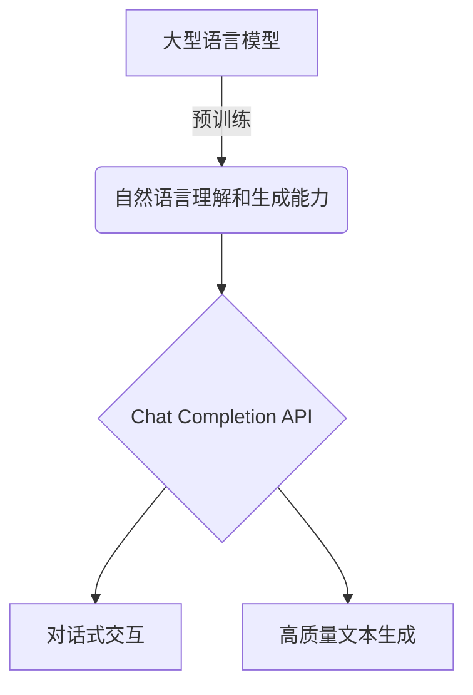

# 大语言模型应用指南：Chat Completion接口参数详解

## 1. 背景介绍

随着人工智能技术的飞速发展,大型语言模型(Large Language Models, LLMs)已经成为当前最热门的研究领域之一。这些模型通过在海量文本数据上进行预训练,展现出了令人惊叹的自然语言理解和生成能力。其中,OpenAI推出的GPT-3就是一个典型的大型语言模型,它能够根据给定的提示(Prompt)生成高质量的自然语言文本。

基于GPT-3等大型语言模型,OpenAI开发了一系列API接口,为开发者提供了强大的自然语言处理能力。其中,Chat Completion API就是一个非常实用的接口,它允许开发者与语言模型进行对话式交互,获取高质量的文本生成结果。本文将深入探讨Chat Completion接口的参数设置,帮助开发者更好地利用这一强大的自然语言处理工具。



## 2. 核心概念与联系

在深入探讨Chat Completion接口的参数之前,我们需要先了解一些核心概念:

1. **Prompt(提示)**: 这是输入给语言模型的文本,用于引导模型生成所需的输出。在Chat Completion接口中,Prompt可以是一个问题、一段对话上下文或任何其他形式的文本。

2. **Tokens**: 语言模型将输入的文本按字符或子词进行切分,得到一系列Tokens。Tokens是模型处理和生成文本的基本单位。

3. **Logits**: 这是语言模型在每个位置上对下一个Token的预测分数。Logits越高,表示该Token被预测为下一个Token的可能性越大。

4. **Temperature(采样温度)**: 这是一个控制语言模型输出多样性的参数。较高的温度会使输出更加多样化,但也可能降低输出的质量和一致性。

5. **Top-p和Top-k采样**: 这是两种控制语言模型输出多样性的采样方法。Top-p采样是根据累积概率密度函数选择Tokens,而Top-k采样是选择概率最高的k个Tokens。

以上概念都与Chat Completion接口的参数设置密切相关,对于正确使用和调优接口至关重要。

## 3. 核心算法原理具体操作步骤

Chat Completion接口的核心算法原理是基于自回归(Autoregressive)语言模型。自回归语言模型的工作原理如下:

1. 将输入的Prompt按Token切分,得到Token序列$X = (x_1, x_2, ..., x_n)$。

2. 模型基于$X$预测下一个Token $y_1$的概率分布$P(y_1|X)$。

3. 根据某种采样策略(如Top-k、Top-p或温度采样)从$P(y_1|X)$中采样得到$y_1$。

4. 将$y_1$添加到输入序列中,得到$(x_1, x_2, ..., x_n, y_1)$,重复步骤2和3,预测并采样得到$y_2$。

5. 重复上述过程,直到达到所需的输出长度或触发终止条件。

该算法的具体操作步骤如下所示:

```mermaid
graph TD
    A[输入Prompt] --> B[Token切分]
    B --> C[Token序列X]
    C --> D[预测下一个Token概率分布P(y|X)]
    D --> E[采样策略]
    E --> F[采样得到Token y]
    F --> G[更新输入序列]
    G --> H{是否终止?}
    H --是--> I[输出序列]
    H --否--> D
```

通过上述自回归过程,语言模型能够根据输入的Prompt生成连贯、相关的自然语言输出。而Chat Completion接口的参数设置,就是用于控制和调优这一生成过程。

## 4. 数学模型和公式详细讲解举例说明

自回归语言模型的核心是计算给定输入序列$X$和部分输出序列$Y_1, Y_2, ..., Y_t$时,下一个Token $Y_{t+1}$的条件概率:

$$P(Y_{t+1}|X, Y_1, Y_2, ..., Y_t)$$

这个条件概率通常由神经网络模型计算得到,模型的输入是输入序列$X$和部分输出序列$Y_1, Y_2, ..., Y_t$的Embedding表示,输出是一个概率分布,表示下一个Token为词表中每个Token的概率。

具体来说,假设词表大小为$V$,模型会输出一个长度为$V$的向量$\vec{o}$,其中第$i$个元素$o_i$表示下一个Token为词表中第$i$个Token的概率。通过Softmax函数,我们可以将$\vec{o}$转换为一个合法的概率分布:

$$P(Y_{t+1}=i|X, Y_1, ..., Y_t) = \frac{e^{o_i}}{\sum_{j=1}^V e^{o_j}}$$

其中$i$表示词表中Token的索引。

在实际应用中,词表往往非常大(GPT-3的词表大小约为5万),因此直接对整个词表进行Softmax运算是非常低效的。为了提高计算效率,通常会采用一些技巧,如仿残差(Trie)数据结构、nearest neighbor approximate(近似最近邻)等。

另一个重要的技术是并行采样(Parallel Sampling),即在一次前向传播中,同时预测多个位置的Token概率。这不仅能提高采样效率,而且还能更好地捕捉Token之间的相关性。

通过上述数学模型和高效算法,大型语言模型才能实现高质量、高效率的自然语言生成。而Chat Completion接口的参数设置,就是对这一生成过程的进一步控制和调优。

## 5. 项目实践:代码实例和详细解释说明

为了更好地理解Chat Completion接口的使用方法,我们来看一个基于Python的代码示例:

```python
import openai

# 设置API密钥
openai.api_key = "YOUR_API_KEY"

# 定义Prompt
prompt = "你是一位旅行家,请给我介绍一下你最近去过的一个很棒的旅行地点。"

# 调用Chat Completion API
response = openai.ChatCompletion.create(
    model="gpt-3.5-turbo",
    messages=[
        {"role": "system", "content": "你是一位经验丰富的旅行家"},
        {"role": "user", "content": prompt}
    ],
    temperature=0.7,
    max_tokens=800,
    top_p=0.95,
    frequency_penalty=0.2,
    presence_penalty=0
)

# 输出生成的文本
print(response.choices[0].message.content)
```

在这个示例中,我们首先导入了OpenAI的Python SDK,并设置了API密钥。然后定义了一个Prompt,作为对话的起始点。

接下来,我们调用了`openai.ChatCompletion.create()`方法,传入了一些重要的参数:

- `model`参数指定了要使用的语言模型,这里我们使用了`gpt-3.5-turbo`。
- `messages`参数是一个列表,包含了对话的上下文。第一个元素设置了一个系统提示,告诉模型你的角色是一位经验丰富的旅行家。第二个元素是用户的输入Prompt。
- `temperature`参数控制了输出的多样性,我们将其设置为0.7,使输出具有一定的多样性,但不会过于离谱。
- `max_tokens`参数限制了输出文本的最大长度为800个Tokens。
- `top_p`参数启用了Top-p采样,将累积概率密度函数的前95%的Tokens保留在候选集中。
- `frequency_penalty`参数对于重复出现的Token给予一定程度的惩罚,以避免输出过于重复。
- `presence_penalty`参数设置为0,表示不对某些Token的存在给予惩罚或奖励。

最后,我们打印出了API返回的生成文本。

通过这个示例,我们可以看到Chat Completion接口提供了多种参数,允许开发者对语言模型的输出进行细粒度的控制。根据具体的应用场景,合理设置这些参数就能获得更好的生成效果。

## 6. 实际应用场景

Chat Completion接口的应用场景非常广泛,包括但不限于:

1. **智能对话系统**: 可以开发基于对话的虚拟助手、客服机器人等,为用户提供自然语言交互体验。

2. **内容生成**: 可以用于自动生成新闻、文案、故事、诗歌等各种形式的内容。

3. **问答系统**: 可以构建基于知识库的问答系统,回答用户的各种问题。

4. **代码生成**: 可以根据自然语言描述自动生成代码片段或完整程序。

5. **语言翻译**: 可以实现多种语言之间的自动翻译。

6. **文本摘要**: 可以对长文本进行自动摘要,提取关键信息。

7. **情感分析**: 可以分析文本中的情感倾向,用于舆情监测、客户服务等场景。

8. **写作辅助**: 可以帮助用户生成文章大纲、续写故事情节等,提高写作效率。

9. **教育领域**: 可以开发智能教学助手,解答学生的问题,提供个性化学习建议。

10. **医疗健康**: 可以用于症状诊断、治疗方案推荐等医疗辅助系统。

总的来说,只要涉及自然语言处理的场景,Chat Completion接口都可以发挥重要作用,为开发者提供强大的语言生成能力。

## 7. 工具和资源推荐

在使用Chat Completion接口时,有一些工具和资源值得推荐:

1. **OpenAI Playground**: OpenAI官方提供的在线Playground,可以直接尝试和调试各种语言模型API,非常方便。

2. **OpenAI Python SDK**: OpenAI提供了Python、Node.js、Java等多种语言的官方SDK,方便开发者在代码中集成API。

3. **Anthropic**: 一家专注于开发安全、可靠的人工智能系统的公司,提供了一些有趣的语言模型工具和资源。

4. **HuggingFace**: 一个面向开发者和研究人员的开源社区,提供了大量预训练语言模型和相关工具。

5. **LangChain**: 一个用于构建应用程序的框架,可以方便地将大型语言模型集成到项目中。

6. **DeepSpeed**: 一个用于优化大型模型训练和推理的库,可以提高模型的效率和可扩展性。

7. **技术博客和论坛**: 如OpenAI论坛、HuggingFace论坛、机器之心等,可以了解最新的技术动态和实践经验。

8. **在线课程和教程**: 像Coursera、edX等平台上有许多关于自然语言处理和大型语言模型的优质课程和教程。

9. **技术书籍**: 如《自然语言处理实战》、《深度学习与自然语言处理》等书籍,可以系统地学习相关理论和技术。

10. **开源项目**: 在GitHub等代码托管平台上,有许多开源的自然语言处理项目值得学习和借鉴。

利用这些工具和资源,开发者可以更高效地学习和使用Chat Completion接口,构建出色的自然语言处理应用。

## 8. 总结:未来发展趋势与挑战

大型语言模型和Chat Completion接口正在改变着我们与计算机交互的方式。未来,这一技术还将继续快速发展,带来更多令人兴奋的应用场景。

一个值得关注的趋势是,语言模型将变得更加通用、多功能。未来的模型不仅能够生成自然语言文本,还能够处理图像、视频、代码等多种形式的数据,实现多模态的人工智能系统。

另一个趋势是,语言模型将变得更加安全、可控。目前的模型存在一些潜在风险,如产生有害、不当或不实信息。未来的模型需要更加可靠、可解释,并能够根据人类的反馈进行持续学习和优化。

与此同时,也存在一些需要克服的挑战:

1. **计算资源需求**: 训练大型语言模型需要海量的计算资源,这对硬件和能源消耗提出了很高的要求。

2. **数据隐私和安全**: 语言模型训练所需的