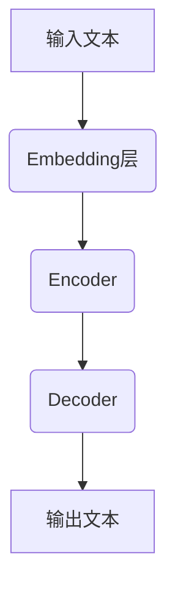

# 大语言模型应用指南：大语言模型的安全技术

## 1. 背景介绍

### 1.1 大语言模型的兴起

近年来,大语言模型(Large Language Models, LLMs)在自然语言处理(NLP)领域取得了令人瞩目的成就。这些模型通过在海量文本数据上进行预训练,学习了丰富的语言知识和上下文信息,从而能够生成高质量、连贯的文本输出。

GPT(Generative Pre-trained Transformer)是最早的大型语言模型之一,由OpenAI开发。随后,更大更强大的模型不断问世,如GPT-3、PaLM、Chinchilla等。这些模型展现出了惊人的语言生成能力,可以用于各种NLP任务,如文本生成、机器翻译、问答系统等。

### 1.2 安全隐患与挑战

尽管大语言模型的能力令人印象深刻,但它们也带来了一些安全隐患和挑战。由于这些模型是在开放的互联网数据上训练的,因此可能会学习到有偏见、不当或不安全的内容。此外,生成的文本可能包含个人信息、虚假信息或有害内容。

另一个挑战是模型的可解释性和可控性。大语言模型是复杂的黑盒系统,很难解释它们的决策过程。此外,它们可能会产生意外或不可预测的输出,这对于一些关键应用来说是不可接受的。

因此,在将大语言模型应用于实际场景之前,必须解决这些安全和可靠性问题。本文将探讨一些解决这些挑战的技术和方法。

## 2. 核心概念与联系

### 2.1 大语言模型的架构

大语言模型通常采用基于Transformer的编码器-解码器架构,如下图所示:



- Embedding层将文本转换为向量表示
- Encoder捕获输入序列的上下文信息
- Decoder根据Encoder的输出和前一个标记生成下一个标记

大型语言模型通常包含数十亿到数万亿个参数,需要在大规模数据集上进行预训练。

### 2.2 核心技术

大语言模型的核心技术包括:

1. **自注意力机制(Self-Attention)**: 捕捉序列中任意两个位置之间的依赖关系,是Transformer的核心组件。
2. **掩码语言模型(Masked Language Modeling)**: 在预训练阶段,随机掩蔽部分输入标记,并预测被掩蔽的标记。
3. **下一句预测(Next Sentence Prediction)**: 预训练目标之一,判断两个句子是否相邻。
4. **因果语言模型(Causal Language Modeling)**: 基于前文预测下一个标记的概率。
5. **提示学习(Prompt Learning)**: 通过设计合适的提示,指导模型生成所需输出。

这些技术赋予了大语言模型强大的语言理解和生成能力。

## 3. 核心算法原理具体操作步骤  

### 3.1 预训练

大语言模型的预训练过程包括以下步骤:

1. **数据预处理**: 从大规模语料库(如网页、书籍等)中收集文本数据,进行标记化、过滤等预处理。
2. **掩码语言模型训练**: 随机掩蔽部分输入标记,模型需要预测被掩蔽的标记。
3. **下一句预测训练**(可选): 给定两个句子,模型需要判断它们是否相邻。
4. **因果语言模型训练**(可选): 基于前文预测下一个标记的概率。

通过上述自监督学习方式,模型可以学习到丰富的语言知识和上下文信息。

### 3.2 微调

为了将预训练的大语言模型应用于特定的下游任务(如文本分类、问答等),需要进行微调(Fine-tuning)。微调的步骤如下:

1. **准备训练数据**: 收集与下游任务相关的标注数据集。
2. **设计提示(Prompt)**: 根据任务设计合适的提示,将输入数据映射为模型可以理解的形式。
3. **微调训练**: 在标注数据集上对预训练模型进行进一步训练,使其适应特定任务。
4. **评估和调优**: 在验证集上评估模型性能,根据需要调整超参数和训练策略。

通过微调,预训练模型可以将其通用的语言知识转移到特定任务上,提高任务性能。

## 4. 数学模型和公式详细讲解举例说明

### 4.1 自注意力机制

自注意力机制是Transformer的核心组件,用于捕捉序列中任意两个位置之间的依赖关系。给定一个长度为n的序列$X = (x_1, x_2, ..., x_n)$,自注意力计算过程如下:

1. 计算Query(Q)、Key(K)和Value(V)矩阵:

$$Q = XW^Q, K = XW^K, V = XW^V$$

其中$W^Q, W^K, W^V$是可学习的权重矩阵。

2. 计算注意力分数:

$$\text{Attention}(Q, K, V) = \text{softmax}(\frac{QK^T}{\sqrt{d_k}})V$$

其中$d_k$是缩放因子,用于防止内积值过大导致softmax函数梯度较小。

3. 多头注意力机制:

$$\text{MultiHead}(Q, K, V) = \text{Concat}(head_1, ..., head_h)W^O$$
$$\text{where } head_i = \text{Attention}(QW_i^Q, KW_i^K, VW_i^V)$$

多头注意力可以从不同的子空间捕捉不同的依赖关系,提高模型的表达能力。

自注意力机制允许模型直接建模输入序列中任意两个位置之间的依赖关系,而不需要递归或卷积操作,这使得模型能够高效地并行计算,适用于长序列输入。

### 4.2 掩码语言模型

掩码语言模型(Masked Language Modeling, MLM)是预训练大语言模型的一种重要方式。给定一个长度为n的序列$X = (x_1, x_2, ..., x_n)$,我们随机掩蔽部分标记,得到掩码序列$\tilde{X} = (x_1, \text{MASK}, x_3, \text{MASK}, ...)$。模型的目标是基于上下文预测被掩蔽的标记。

对于每个被掩蔽的位置$i$,我们计算预测分布:

$$P(x_i | \tilde{X}) = \text{softmax}(h_i^T W + b)$$

其中$h_i$是该位置的隐藏状态向量,通过模型的编码器计算得到;$W$和$b$是可学习的权重和偏置。

模型的损失函数是被掩蔽位置的交叉熵损失之和:

$$\mathcal{L}_\text{MLM} = -\sum_{i \in \text{MASK}} \log P(x_i | \tilde{X})$$

通过最小化该损失函数,模型可以学习到丰富的语言知识和上下文信息,从而提高语言生成和理解能力。

## 5. 项目实践: 代码实例和详细解释说明

以下是使用Hugging Face的Transformers库对GPT-2进行微调的Python代码示例,用于文本生成任务。

```python
from transformers import GPT2LMHeadModel, GPT2Tokenizer

# 加载预训练模型和分词器
model = GPT2LMHeadModel.from_pretrained('gpt2')
tokenizer = GPT2Tokenizer.from_pretrained('gpt2')

# 设置提示
prompt = "写一篇关于人工智能的文章:"

# 对提示进行编码
input_ids = tokenizer.encode(prompt, return_tensors='pt')

# 生成文本
output = model.generate(input_ids, max_length=1000, do_sample=True, top_k=50, top_p=0.95, num_return_sequences=1)

# 解码生成的文本
generated_text = tokenizer.decode(output[0], skip_special_tokens=True)

print(generated_text)
```

代码解释:

1. 导入GPT2LMHeadModel和GPT2Tokenizer,分别用于加载预训练模型和分词器。
2. 使用from_pretrained方法加载预训练的GPT-2模型和分词器。
3. 设置提示文本,作为模型生成文本的起点。
4. 使用分词器将提示文本编码为模型可以理解的输入张量。
5. 调用模型的generate方法生成文本,设置生成参数如最大长度、采样策略等。
6. 使用分词器将生成的输出张量解码为文本。
7. 打印生成的文本。

通过上述代码,我们可以利用预训练的GPT-2模型生成与提示相关的文本。根据需要,我们还可以对模型进行微调,以提高生成质量或适应特定任务。

## 6. 实际应用场景

大语言模型在各种自然语言处理任务中发挥着重要作用,包括但不限于:

1. **文本生成**: 生成高质量、连贯的文本内容,如新闻报道、小说、文案等。
2. **机器翻译**: 将一种语言的文本翻译成另一种语言。
3. **问答系统**: 基于上下文回答用户提出的问题。
4. **文本摘要**: 自动生成文本的摘要或概括。
5. **情感分析**: 分析文本中的情感倾向,如正面、负面等。
6. **代码生成**: 根据自然语言描述生成相应的计算机代码。

除了上述应用场景,大语言模型还可以用于其他领域,如知识图谱构建、关系抽取、对话系统等。随着模型能力的不断提高,它们的应用前景将更加广阔。

## 7. 工具和资源推荐

以下是一些与大语言模型相关的有用工具和资源:

1. **Hugging Face Transformers**: 一个强大的NLP库,提供了各种预训练模型和工具,支持PyTorch和TensorFlow。
2. **OpenAI GPT-3**: 一个巨大的语言模型,具有惊人的文本生成能力,但需要付费使用。
3. **Google AI Language**: Google提供的一系列大语言模型,包括PaLM、LaMDA等。
4. **StanfordNLP**: 斯坦福大学开发的NLP库,提供了各种模型和工具。
5. **Allen AI**: 一个NLP研究组织,开发了多个大语言模型,如UNICORN、UNITER等。
6. **Papers with Code**: 一个收集和整理最新AI论文的网站,可以查找大语言模型相关的研究工作。
7. **LangChain**: 一个用于构建大语言模型应用的框架,提供了各种实用工具和示例。

利用这些工具和资源,研究人员和开发人员可以更高效地开发和部署基于大语言模型的应用。

## 8. 总结: 未来发展趋势与挑战

大语言模型正在推动自然语言处理领域的快速发展,但同时也面临着一些挑战和未来发展趋势:

1. **模型规模持续增长**: 为了提高模型性能,模型规模将继续增长,需要更强大的计算资源和更高效的训练算法。
2. **多模态模型**: 未来的模型将不仅处理文本,还能够处理图像、视频等多模态数据,实现更全面的理解和生成能力。
3. **可解释性和可控性**: 提高模型的可解释性和可控性,使其决策过程更加透明,输出更加可靠和可预测。
4. **隐私和安全**: 解决模型可能带来的隐私和安全风险,如个人信息泄露、有害内容生成等。
5. **少样本学习**: 减少对大量标注数据的依赖,使模型能够通过少量示例快速学习新任务。
6. **知识引入**: 将外部知识库引入模型,增强其对特定领域的理解能力。
7. **人工智能伦理**: 确保模型的发展和应用符合伦理准则,不会产生负面影响或歧视。

总的来说,大语言模型将继续推动自然语言处理领域的创新和进步,但同时也需要解决一些关键挑战,以确保其安全、可靠和可持续发展。

## 9. 附录: 常见问题与解答

### 9.1 大语言模型和传统NLP模型有何区别?