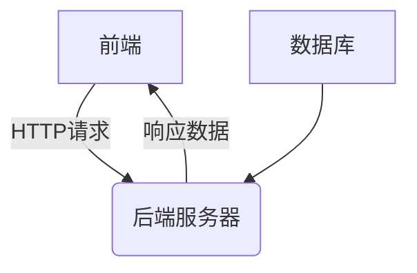

# 学生二手物品交易系统详细设计与具体代码实现

## 1.背景介绍

随着互联网的快速发展和移动设备的普及,二手交易市场变得越来越受欢迎。学生群体作为一个特殊的群体,他们往往有着大量闲置物品需要交易。然而,传统的二手交易平台往往存在一些缺陷,例如缺乏针对性、信任度低、交易流程繁琐等问题。因此,开发一个专门面向学生群体的二手物品交易系统就显得尤为重要。

## 2.核心概念与联系

### 2.1 用户管理

用户管理是整个系统的基础,包括用户注册、登录、个人信息管理等功能。系统需要对用户进行身份验证,确保只有学校内的学生才能注册和使用。

### 2.2 物品管理

物品管理是系统的核心功能,包括发布物品、搜索物品、查看物品详情、下单购买等。系统需要提供丰富的物品分类和筛选功能,方便用户快速找到所需物品。

### 2.3 订单管理

订单管理负责处理用户下单、付款、发货等流程。系统需要提供安全可靠的支付方式,并能够及时跟踪订单状态。

### 2.4 评价系统

评价系统允许买家和卖家对交易双方进行评价,提高交易的透明度和信任度。系统需要设计合理的评分机制,防止恶意评价。

### 2.5 消息通知

消息通知功能能够及时将系统内的重要事件通知给相关用户,例如新订单、物品更新、评价反馈等。

### 2.6 系统架构

整个系统采用前后端分离的架构设计,前端负责界面展示和交互,后端负责数据处理和业务逻辑。前后端通过 RESTful API 进行通信。



## 3.核心算法原理具体操作步骤

### 3.1 物品推荐算法

为了提高用户体验,系统需要为用户推荐感兴趣的物品。这里采用基于内容的推荐算法,根据用户浏览历史和物品描述,计算用户与物品之间的相似度,推荐相似度最高的物品。

1. 对物品描述进行分词和去停用词处理,得到关键词集合。
2. 计算关键词与物品的 TF-IDF 值作为物品的向量表示。
3. 对用户浏览过的物品进行向量求平均,得到用户兴趣向量。
4. 计算用户兴趣向量与所有物品向量的余弦相似度。
5. 将相似度最高的 N 个物品推荐给用户。

### 3.2 信任评分算法

为了提高交易安全性,系统需要对用户进行信任评分。信任评分的计算综合考虑用户的历史评价、交易次数等因素。

1. 初始化所有用户的信任评分为一个较低的值。
2. 每完成一次交易,买家和卖家的信任评分都会根据对方的评价进行调整。
3. 信任评分的计算公式为:

$$
   \text{新信任评分} = \alpha * \text{旧信任评分} + (1 - \alpha) * \text{新评价分数}
$$

其中 $\alpha$ 是一个调节参数,用于控制新旧评分的权重。

4. 交易次数越多,用户的信任评分就越稳定。

### 3.3 搜索排序算法

为了提高搜索效率,系统需要对搜索结果进行合理排序。这里采用的策略是:

1. 根据搜索关键词对物品进行初步筛选。
2. 根据发布时间、价格、销量等因素计算物品分数。
3. 将物品按分数从高到低排序。

物品分数的计算公式为:

$$
   \text{分数} = w_1 * \text{时间分数} + w_2 * \text{价格分数} + w_3 * \text{销量分数}
$$

其中 $w_1$、$w_2$、$w_3$ 是可调节的权重参数,用于控制各个因素的重要性。

## 4.数学模型和公式详细讲解举例说明

### 4.1 TF-IDF 模型

TF-IDF (Term Frequency-Inverse Document Frequency) 是一种用于反映词语对文档的重要程度的统计模型。在物品推荐算法中,我们使用 TF-IDF 来表示物品描述中的关键词对该物品的重要性。

TF-IDF 的计算公式为:

$$
\text{TF-IDF}(t, d) = \text{TF}(t, d) \times \text{IDF}(t)
$$

其中:

- $\text{TF}(t, d)$ 表示词语 $t$ 在文档 $d$ 中出现的频率,可以使用原始计数、归一化计数或其他变体。
- $\text{IDF}(t) = \log \frac{N}{n_t}$,其中 $N$ 是文档总数,而 $n_t$ 是包含词语 $t$ 的文档数量。IDF 用于衡量词语的普遍重要性。

例如,假设我们有 5 个物品描述,其中 3 个包含词语"书包",2 个包含词语"笔记本",那么:

- $\text{IDF}(\text{书包}) = \log \frac{5}{3} \approx 0.22$
- $\text{IDF}(\text{笔记本}) = \log \frac{5}{2} \approx 0.40$

可以看出,词语"笔记本"的 IDF 值更高,说明它对区分物品更有意义。

### 4.2 余弦相似度

余弦相似度是一种常用的计算向量之间相似度的方法。在物品推荐和搜索排序算法中,我们使用余弦相似度来衡量用户兴趣与物品描述之间的相似程度。

对于两个向量 $\vec{a}$ 和 $\vec{b}$,它们的余弦相似度定义为:

$$
\text{余弦相似度}(\vec{a}, \vec{b}) = \cos(\theta) = \frac{\vec{a} \cdot \vec{b}}{\|\vec{a}\| \|\vec{b}\|}
$$

其中 $\theta$ 是两个向量之间的夹角。

例如,假设用户兴趣向量为 $\vec{u} = (0.2, 0.5, 0.1)$,物品向量为 $\vec{v} = (0.3, 0.4, 0.2)$,那么它们的余弦相似度为:

$$
\begin{aligned}
\text{余弦相似度}(\vec{u}, \vec{v}) &= \frac{\vec{u} \cdot \vec{v}}{\|\vec{u}\| \|\vec{v}\|} \\
&= \frac{0.2 \times 0.3 + 0.5 \times 0.4 + 0.1 \times 0.2}{\sqrt{0.2^2 + 0.5^2 + 0.1^2} \sqrt{0.3^2 + 0.4^2 + 0.2^2}} \\
&\approx 0.93
\end{aligned}
$$

可以看出,用户兴趣与该物品描述之间的相似度较高。

## 5.项目实践:代码实例和详细解释说明

### 5.1 用户模块

用户模块负责处理用户注册、登录、个人信息管理等功能。下面是一个示例代码片段,展示了如何使用 Flask 框架实现用户注册功能:

```python
from flask import Flask, request, jsonify
from werkzeug.security import generate_password_hash, check_password_hash
import sqlite3

app = Flask(__name__)

# 连接到 SQLite 数据库
conn = sqlite3.connect('users.db')
c = conn.cursor()

# 创建用户表
c.execute('''CREATE TABLE IF NOT EXISTS users
             (id INTEGER PRIMARY KEY AUTOINCREMENT, email TEXT UNIQUE, password TEXT, name TEXT)''')

@app.route('/register', methods=['POST'])
def register():
    data = request.get_json()
    email = data.get('email')
    password = data.get('password')
    name = data.get('name')

    # 检查邮箱是否已被注册
    c.execute("SELECT * FROM users WHERE email = ?", (email,))
    existing_user = c.fetchone()
    if existing_user:
        return jsonify({'error': 'Email already registered'}), 400

    # 哈希密码并存储新用户
    hashed_password = generate_password_hash(password)
    c.execute("INSERT INTO users (email, password, name) VALUES (?, ?, ?)", (email, hashed_password, name))
    conn.commit()

    return jsonify({'message': 'User registered successfully'}), 201

if __name__ == '__main__':
    app.run(debug=True)
```

在这个示例中,我们首先创建了一个 SQLite 数据库并定义了 `users` 表的结构。然后,我们使用 Flask 框架定义了一个 `/register` 路由,用于处理用户注册请求。

1. 首先,我们从请求体中获取邮箱、密码和姓名等用户信息。
2. 然后,我们检查该邮箱是否已被注册。如果已被注册,返回错误信息。
3. 如果邮箱未被注册,我们使用 `generate_password_hash` 函数对密码进行哈希处理,然后将新用户信息插入到数据库中。
4. 最后,我们返回一个成功的响应。

### 5.2 物品模块

物品模块负责处理物品发布、搜索、查看详情等功能。下面是一个示例代码片段,展示了如何使用 Django 框架实现物品发布功能:

```python
from django.shortcuts import render
from django.contrib.auth.decorators import login_required
from .models import Item
from .forms import ItemForm

@login_required
def create_item(request):
    if request.method == 'POST':
        form = ItemForm(request.POST, request.FILES)
        if form.is_valid():
            item = form.save(commit=False)
            item.seller = request.user
            item.save()
            return redirect('item_detail', pk=item.pk)
    else:
        form = ItemForm()
    return render(request, 'items/create_item.html', {'form': form})
```

在这个示例中,我们定义了一个 `create_item` 视图函数,用于处理物品发布请求。

1. 首先,我们使用 `@login_required` 装饰器确保只有登录用户才能访问该视图。
2. 如果是 POST 请求,我们从请求体中获取表单数据,并使用 `ItemForm` 进行验证。
3. 如果表单数据有效,我们创建一个新的 `Item` 对象,并将当前用户设置为卖家,然后保存到数据库中。
4. 最后,我们重定向到物品详情页面。
5. 如果是 GET 请求,我们渲染一个包含空表单的模板。

### 5.3 订单模块

订单模块负责处理用户下单、付款、发货等流程。下面是一个示例代码片段,展示了如何使用 Node.js 和 Express 框架实现下单功能:

```javascript
const express = require('express');
const router = express.Router();
const Order = require('../models/order');

// 下单
router.post('/create', async (req, res) => {
  const { itemId, buyerId } = req.body;

  try {
    const order = new Order({
      item: itemId,
      buyer: buyerId,
      status: 'pending'
    });

    const savedOrder = await order.save();
    res.status(201).json(savedOrder);
  } catch (err) {
    res.status(400).json({ error: err.message });
  }
});

module.exports = router;
```

在这个示例中,我们定义了一个 `/create` 路由,用于处理下单请求。

1. 首先,我们从请求体中获取物品 ID 和买家 ID。
2. 然后,我们创建一个新的 `Order` 对象,并设置相应的属性。
3. 接着,我们调用 `save` 方法将订单保存到数据库中。
4. 如果保存成功,我们返回一个 201 状态码和新创建的订单对象。
5. 如果保存失败,我们返回一个 400 状态码和错误信息。

## 6.实际应用场景

学生二手物品交易系统可以应用于以下场景:

1. **校园内物品交易**:学生可以在系统内发布和购买各种闲置物品,如教科书、电子产品、运动用品等。这不仅方便了物品流通,还体现了环保理念。

2. **毕业生物品交易**:毕业生往往会有大量物品需要处理,如家具、电器等。系统为他们提供了一个快速出售物品的渠道。

3. **社团活动物品交易**:各种学生