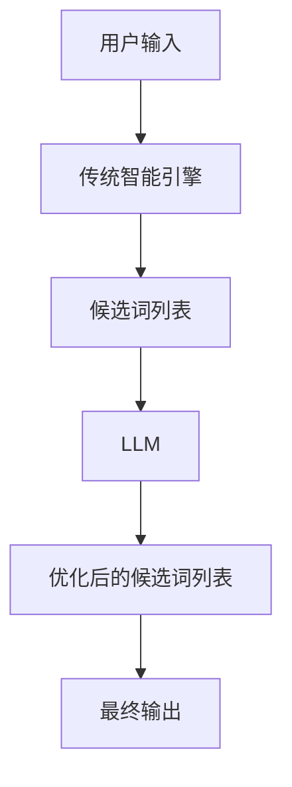

# 实时中文输入法中AI LLM的应用：更准确、更流畅

## 1.背景介绍

随着人工智能技术的不断发展,大型语言模型(LLM)在自然语言处理领域展现出了令人惊叹的能力。传统的基于统计和规则的输入法已经无法满足用户对输入体验的更高要求。引入LLM技术,可以极大提升中文输入法的准确性和流畅性。

### 1.1 中文输入法的挑战

中文作为一种表意文字,其输入过程存在着以下几个主要挑战:

- **同音字过多**:汉语拼音与汉字之间是一对多的映射关系,同一个拼音可能对应多个汉字。
- **语义歧义**:单个词语在不同语境下可能有不同的含义。
- **新词产生**:随着时代发展,新词不断涌现,传统词库难以覆盖。

### 1.2 LLM在输入法中的应用前景

LLM擅长捕捉上下文语义信息,能够更好地解决同音字歧义和新词识别问题。同时,LLM对自然语言有着深刻的理解能力,可以提供更加流畅、自然的输入体验。

## 2.核心概念与联系

### 2.1 大型语言模型(LLM)

LLM是一种基于自注意力机制(Self-Attention)的深度神经网络模型,通过在大规模语料库上进行预训练,学习到丰富的语言知识。常见的LLM包括GPT、BERT、XLNet等。

### 2.2 输入法智能引擎

输入法智能引擎是输入法系统的核心部分,负责将用户输入的拼音或字符序列转换为对应的文字。传统的智能引擎主要依赖统计语言模型和规则系统。

### 2.3 LLM与输入法智能引擎的结合

将LLM集成到输入法智能引擎中,可以充分利用LLM强大的语言理解能力,提升输入法的准确性和流畅性。LLM可以作为一种上层模型,在传统智能引擎的基础上进行语义理解和上下文预测。



## 3.核心算法原理具体操作步骤

### 3.1 LLM在输入法中的工作流程

1. **输入预处理**:将用户输入的拼音或字符序列进行标准化处理,以适应LLM的输入格式。
2. **上下文提取**:从输入法的历史缓存中提取上下文信息,作为LLM的辅助输入。
3. **LLM推理**:将预处理后的输入和上下文信息喂入LLM,进行语义理解和预测。
4. **候选词优化**:根据LLM的输出,对传统智能引擎生成的候选词列表进行优化,提高置信度并重新排序。
5. **最终输出**:将优化后的候选词列表呈现给用户,用户选择合适的词语作为最终输出。

### 3.2 LLM输入表示

为了充分利用LLM的语义理解能力,需要将输入法的上下文信息转换为LLM可以理解的表示形式。常见的做法是将上下文信息拼接成一个序列,并使用特殊符号(如[SEP])进行分隔。

例如,对于输入"我想去$location$吃$food$",可以将其表示为:

```
[CLS] 我 想 去 [LOCATION] 吃 [FOOD] [SEP] 上下文信息 [SEP]
```

其中,[LOCATION]和[FOOD]是需要由LLM预测的占位符。

### 3.3 LLM输出解析

LLM的输出通常是一个概率分布,表示每个可能的词语在当前上下文下出现的概率。我们需要对这个概率分布进行解析,得到最可能的词语序列。

常见的做法是使用贪婪搜索(Greedy Search)或束搜索(Beam Search)等算法,从概率分布中选取置信度最高的词语序列。同时,还需要考虑一些约束条件,如词语的长度、是否在词库中等。

### 3.4 候选词列表优化

传统智能引擎生成的候选词列表可能存在一些问题,如同音字歧义、新词识别不足等。我们可以利用LLM的输出,对候选词列表进行优化:

1. **置信度更新**:根据LLM输出的概率分布,更新每个候选词的置信度分数。
2. **重新排序**:按照更新后的置信度分数,对候选词列表进行重新排序。
3. **新词补充**:如果LLM输出的最可能序列不在候选词列表中,则将其作为新词补充到列表中。

通过这种方式,我们可以获得一个更加准确、流畅的候选词列表,为用户提供更好的输入体验。

## 4.数学模型和公式详细讲解举例说明

### 4.1 自注意力机制(Self-Attention)

自注意力机制是LLM中的核心组件,它能够捕捉输入序列中任意两个位置之间的依赖关系。对于一个长度为$n$的输入序列$X = (x_1, x_2, \dots, x_n)$,自注意力机制首先计算每个位置$i$与所有其他位置$j$之间的注意力分数:

$$
e_{ij} = \frac{(W_qx_i)(W_kx_j)^T}{\sqrt{d_k}}
$$

其中,$W_q$和$W_k$分别是查询(Query)和键(Key)的线性变换矩阵,$d_k$是缩放因子。

然后,使用Softmax函数将注意力分数转换为概率分布:

$$
\alpha_{ij} = \text{softmax}(e_{ij}) = \frac{e^{e_{ij}}}{\sum_{k=1}^n e^{e_{ik}}}
$$

最后,将注意力概率与值(Value)向量$W_vx_j$进行加权求和,得到注意力输出:

$$
\text{Attention}(X)_i = \sum_{j=1}^n \alpha_{ij}(W_vx_j)
$$

通过多头注意力(Multi-Head Attention)和层归一化(Layer Normalization)等技术,自注意力机制可以更好地建模长距离依赖关系。

### 4.2 掩码语言模型(Masked Language Model)

掩码语言模型是LLM预训练的一种常见方式。它的目标是根据上下文,预测被掩码(用特殊符号[MASK]替换)的词语。

对于一个长度为$n$的输入序列$X = (x_1, x_2, \dots, x_n)$,我们随机选择一些位置进行掩码,得到掩码序列$\hat{X}$。LLM的目标是最大化掩码位置的条件概率:

$$
\max_\theta \sum_{i=1}^n \mathbb{1}(x_i = \text{[MASK]}) \log P(x_i | \hat{X}, \theta)
$$

其中,$\theta$是LLM的参数,$ \mathbb{1}(\cdot)$是指示函数。

通过这种方式,LLM可以学习到丰富的语言知识,包括词义、语法和语义信息等。在输入法中,我们可以利用LLM对缺失词语进行预测,从而提高输入的准确性和流畅性。

## 5.项目实践:代码实例和详细解释说明

为了更好地理解LLM在输入法中的应用,我们提供了一个基于PyTorch实现的简单示例。该示例使用BERT作为LLM,并将其集成到一个简单的输入法智能引擎中。

### 5.1 数据准备

我们使用了一个小型的中文语料库,包含了常见的句子和短语。将语料库划分为训练集和测试集,并对文本进行了标记化和词典构建。

```python
import re
import torch
from transformers import BertTokenizer

# 加载语料库
corpus = open('corpus.txt', 'r', encoding='utf-8').read().split('\n')

# 数据预处理
def preprocess(text):
    text = re.sub(r'[^\u4e00-\u9fa5a-zA-Z0-9]', '', text)
    return text

corpus = [preprocess(sent) for sent in corpus]

# 构建词典
tokenizer = BertTokenizer.from_pretrained('bert-base-chinese')
vocab = tokenizer.vocab

# 划分训练集和测试集
train_data = corpus[:int(0.8*len(corpus))]
test_data = corpus[int(0.8*len(corpus)):]
```

### 5.2 输入法智能引擎

我们实现了一个简单的输入法智能引擎,它基于n-gram语言模型和最大匹配原则进行候选词生成。

```python
class InputEngine:
    def __init__(self, vocab, n=3):
        self.vocab = vocab
        self.n = n
        self.ngram_counts = {}
        
    def train(self, corpus):
        for sent in corpus:
            for i in range(len(sent)-self.n+1):
                ngram = sent[i:i+self.n]
                self.ngram_counts[ngram] = self.ngram_counts.get(ngram, 0) + 1
                
    def generate_candidates(self, input_str):
        candidates = []
        for i in range(len(input_str)-self.n+1):
            ngram = input_str[i:i+self.n]
            if ngram in self.ngram_counts:
                for word in self.vocab:
                    if word.startswith(ngram):
                        candidates.append(word)
        return list(set(candidates))
        
# 训练输入法智能引擎
input_engine = InputEngine(vocab)
input_engine.train(train_data)
```

### 5.3 LLM集成

我们使用BERT作为LLM,并将其集成到输入法智能引擎中,用于优化候选词列表。

```python
from transformers import BertForMaskedLM, BertTokenizer

# 加载BERT模型
tokenizer = BertTokenizer.from_pretrained('bert-base-chinese')
model = BertForMaskedLM.from_pretrained('bert-base-chinese')

def optimize_candidates(input_str, candidates, context):
    # 构造BERT输入
    input_ids = tokenizer.encode(context + '[MASK]' + input_str, return_tensors='pt')
    
    # BERT推理
    output = model(input_ids)[0]
    
    # 解析BERT输出
    masked_index = torch.where(input_ids[0] == tokenizer.mask_token_id)[1].item()
    logits = output[0, masked_index]
    
    # 更新候选词置信度
    candidate_scores = {}
    for candidate in candidates:
        token_id = tokenizer.encode(candidate, add_special_tokens=False)[0]
        score = logits[token_id].item()
        candidate_scores[candidate] = score
        
    # 重新排序候选词列表
    sorted_candidates = sorted(candidate_scores.items(), key=lambda x: x[1], reverse=True)
    optimized_candidates = [c for c, s in sorted_candidates]
    
    return optimized_candidates

# 示例输入
input_str = '我想去'
context = '今天天气不错,'
candidates = input_engine.generate_candidates(input_str)
optimized_candidates = optimize_candidates(input_str, candidates, context)

print('原始候选词列表:', candidates)
print('优化后的候选词列表:', optimized_candidates)
```

在这个示例中,我们首先使用输入法智能引擎生成初始的候选词列表。然后,我们构造BERT的输入序列,其中包含上下文信息和需要预测的位置([MASK])。

接下来,我们使用BERT进行推理,并解析输出的logits(对数概率)。对于每个候选词,我们计算其对应token的logits分数,并根据这些分数对候选词列表进行重新排序。

最后,我们得到了一个优化后的候选词列表,其中更加准确、流畅的词语被排在了前面。

通过这种方式,我们成功地将LLM集成到了输入法智能引擎中,提高了输入法的准确性和流畅性。

## 6.实际应用场景

LLM在中文输入法中的应用前景广阔,可以在多个场景下发挥作用:

### 6.1 移动设备输入法

在移动设备上,屏幕空间有限,用户希望获得高效、准确的输入体验。LLM可以帮助移动设备输入法更好地预测用户的输入意图,提供更加贴切的候选词。

### 6.2 语音输入

随着语音交互技术的发展,语音输入也成为一种重要的输入方式。LLM可以辅助语音转文本系统,提高识别的准确性,尤其是在处理同音字和新词方面。

### 