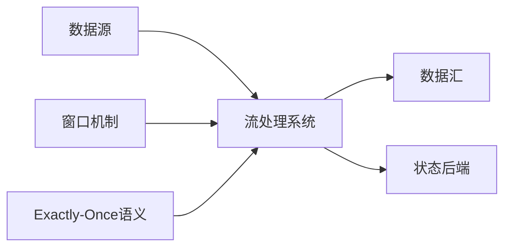

# 实时数据处理 原理与代码实例讲解

## 1.背景介绍
### 1.1 实时数据处理的重要性
在当今数字化时代,数据正以前所未有的速度和规模生成。从社交媒体平台到物联网设备,从金融交易到医疗监测,各行各业都在产生海量的实时数据。面对如此庞大而快速的数据流,传统的批处理方式已经无法满足实时性和响应性的需求。因此,实时数据处理技术应运而生,成为了大数据时代不可或缺的关键技术之一。

实时数据处理可以让企业和组织在数据生成的同时对其进行分析和处理,从而快速获得洞察力和决策支持。它广泛应用于金融风控、欺诈检测、推荐系统、智能交通、智慧城市等诸多领域。掌握实时数据处理的原理和技术,对于开发高性能、低延迟的数据驱动型应用至关重要。

### 1.2 实时数据处理的挑战
然而,实时数据处理也面临着诸多挑战:

1. 高吞吐量:实时数据往往以极高的速率生成,系统需要具备强大的处理能力来应对海量数据的涌入。
2. 低延迟:实时场景对响应时间有苛刻要求,需要在毫秒级甚至微秒级完成数据的处理和分析。
3. 容错性:由于数据量巨大且实时性要求高,系统必须能够容忍一定程度的故障,保证数据处理的连续性和稳定性。
4. 扩展性:随着数据规模和业务需求的增长,系统要能够灵活地进行水平或垂直扩展。
5. 数据一致性:在分布式环境下,如何保证数据处理的一致性和正确性也是一大挑战。

### 1.3 常见的实时数据处理框架
为了应对这些挑战,业界涌现出了一系列优秀的实时数据处理框架,例如:

- Apache Storm:Twitter开源的分布式实时计算系统
- Apache Flink:基于流处理的统一计算框架
- Apache Spark Streaming:Spark生态系统的流处理组件
- Apache Kafka Streams:基于Kafka构建的轻量级流处理库
- Apache Samza:LinkedIn开源的分布式流处理框架

这些框架在吞吐量、延迟、容错性等方面进行了深度优化,为实时数据处理提供了强大的支撑。

## 2.核心概念与联系
### 2.1 流处理
流处理是实时数据处理的核心概念之一。与传统的批处理不同,流处理以持续的数据流为处理对象,每条数据在到达的同时就进行处理。流处理系统通过定义一系列算子(如map、filter、reduce等)来描述数据的转换和计算逻辑,数据流经算子形成一个有向无环图(DAG)。

### 2.2 窗口
在流处理中,数据是无边界的,但许多分析场景需要在有限的数据集上进行计算。窗口(Window)就是将无边界的数据流切分成有界的数据集的机制。常见的窗口类型有:

- 滚动窗口(Tumbling Window):固定大小,不重叠,如每5分钟统计一次数据。
- 滑动窗口(Sliding Window):固定大小,可重叠,如每1分钟统计过去5分钟的数据。
- 会话窗口(Session Window):根据会话超时时间动态调整,如用户访问间隔超过30分钟划分为不同窗口。

### 2.3 状态管理
由于流处理面对的是持续的数据,因此需要跟踪和管理系统的状态。状态可以是每个算子的本地状态,也可以是多个算子间共享的全局状态。常见的状态类型包括:

- 值状态(Value State):存储单个值的状态,可以被更新和检索。
- 列表状态(List State):存储一组值的状态,支持添加和迭代。
- 映射状态(Map State):存储Key-Value对的状态,支持添加、更新和检索。

状态的管理涉及到持久化、故障恢复、状态迁移等问题,现代流处理框架提供了多种状态后端(如内存、RocksDB、HDFS等)来应对不同的需求。

### 2.4 Exactly-Once语义
实时数据处理面临着数据重复和丢失的风险,Exactly-Once语义保证了每条数据只被处理一次,既不重复也不丢失。实现Exactly-Once需要端到端的协调,包括:

- 数据源:需要支持重放和去重。
- 数据处理:需要通过事务机制、WAL等技术保证状态更新的原子性。
- 数据输出:需要支持幂等写入。

下图展示了这些核心概念之间的联系:



## 3.核心算法原理具体操作步骤
### 3.1 流处理的DAG构建
构建流处理的DAG需要以下步骤:

1. 定义数据源:指定数据的输入方式,如Kafka、文件、Socket等。
2. 定义算子:描述数据的转换和计算逻辑,如map、filter、aggregate等。
3. 指定算子之间的数据传递:通过shuffle、broadcast等方式在算子间分发数据。
4. 定义数据汇:指定数据的输出方式,如Kafka、文件、数据库等。
5. 提交DAG:将构建好的DAG提交给流处理引擎执行。

### 3.2 窗口的实现原理
窗口的实现一般基于以下原理:

1. 数据分配:根据数据的时间戳或其他属性将其分配到对应的窗口中。
2. 触发计算:当窗口满足触发条件(如时间、数据量等)时,对窗口内的数据执行计算。
3. 窗口管理:负责创建、销毁窗口,并维护窗口的状态。
4. 迟到数据处理:处理迟到的数据,如更新已触发的窗口或丢弃。

### 3.3 状态管理的实现原理 
状态管理的实现涉及以下关键点:

1. 状态编码:将状态对象序列化为字节数组,便于存储和传输。
2. 状态快照:定期对状态进行快照,用于故障恢复和状态迁移。
3. 状态分区:根据状态的Key将其分区,提高并行度和本地访问效率。
4. 状态恢复:从快照恢复状态,保证exactly-once。

### 3.4 Exactly-Once的实现原理
Exactly-Once的实现需要协调数据源、处理引擎和输出端,主要原理如下:

1. 数据源重放:通过offset或时间戳等机制追踪数据,实现数据的重放。
2. 处理引擎事务:利用WAL、两阶段提交等技术,保证状态更新与数据输出的原子性。
3. 输出端幂等:通过事务、版本号等机制,保证数据写入的幂等性。

## 4.数学模型和公式详细讲解举例说明
### 4.1 窗口模型
滑动窗口可以用数学公式表示为:

$W(t) = [t - s, t)$

其中,$W(t)$表示时间$t$的窗口,$s$为窗口的长度。例如,每5分钟统计过去1小时的数据,可以表示为:

$W(t) = [t - 60min, t), s = 60min$

### 4.2 聚合模型
常见的聚合操作如sum、avg、max等,可以用数学公式统一表示为:

$Agg(W) = f(\{x_i | x_i \in W\})$

其中,$Agg$为聚合函数,$W$为窗口,$f$为聚合操作。例如,对窗口内的数据求和:

$Sum(W) = \sum_{x_i \in W} x_i$

### 4.3 Exactly-Once模型
Exactly-Once可以用公式表示为:

$S_t = S_{t-1} \oplus I_t$

其中,$S_t$为时间$t$的状态,$I_t$为时间$t$的输入数据,$\oplus$为状态更新函数。在Exactly-Once语义下,状态更新与数据输出是原子的,可以表示为:

$$
\begin{aligned}
S_t &= S_{t-1} \oplus I_t \\
O_t &= f(S_t) \\
(S_t, O_t) &\text{ is atomic}
\end{aligned}
$$

其中,$O_t$为时间$t$的输出数据。

## 5.项目实践:代码实例和详细解释说明
下面以Flink为例,展示实时数据处理的代码实践。

### 5.1 环境准备
首先,需要引入Flink的依赖:

```xml
<dependency>
  <groupId>org.apache.flink</groupId>
  <artifactId>flink-streaming-java_2.12</artifactId>
  <version>1.12.0</version>
</dependency>
```

然后,创建Flink的执行环境:

```java
StreamExecutionEnvironment env = StreamExecutionEnvironment.getExecutionEnvironment();
```

### 5.2 数据源定义
从Kafka读取数据作为数据源:

```java
KafkaSource<String> source = KafkaSource.<String>builder()
    .setBootstrapServers("localhost:9092")
    .setTopics("input-topic")
    .setGroupId("my-group")
    .setStartingOffsets(OffsetsInitializer.earliest())
    .setValueOnlyDeserializer(new SimpleStringSchema())
    .build();

DataStream<String> inputStream = env.fromSource(source, WatermarkStrategy.noWatermarks(), "Kafka Source");
```

### 5.3 数据转换
对数据进行转换和计算:

```java
DataStream<Tuple2<String, Integer>> resultStream = inputStream
    .flatMap(new LineSplitter())
    .keyBy(value -> value.f0)
    .window(SlidingProcessingTimeWindows.of(Time.seconds(60), Time.seconds(5)))
    .sum(1);
```

其中,`LineSplitter`将每行数据按空格分割为单词,`keyBy`按单词分组,`window`定义了1分钟的滑动窗口,每5秒触发一次,`sum`对单词出现次数进行求和。

### 5.4 数据输出
将结果数据输出到Kafka:

```java
KafkaSink<String> sink = KafkaSink.<String>builder()
    .setBootstrapServers("localhost:9092")
    .setRecordSerializer(KafkaRecordSerializationSchema.builder()
        .setTopic("output-topic")
        .setValueSerializationSchema(new SimpleStringSchema())
        .build()
    )
    .build();

resultStream.map(value -> value.f0 + ": " + value.f1)
    .sinkTo(sink);
```

### 5.5 执行
最后,执行流处理程序:

```java
env.execute("Streaming WordCount");
```

以上就是一个简单的实时数据处理的代码示例,完整的代码可以在Flink官网找到。

## 6.实际应用场景
实时数据处理在各行各业都有广泛应用,下面列举几个典型场景:

### 6.1 实时金融风控
金融机构需要实时监测交易数据,识别欺诈、洗钱等异常行为。通过实时数据处理,可以在毫秒级检测出可疑交易,并及时阻断或报警。

### 6.2 实时推荐系统
电商平台利用实时数据处理分析用户行为,实时更新用户画像和商品推荐。当用户浏览或购买商品时,系统能立即做出个性化推荐。

### 6.3 实时交通监控
智慧交通系统通过实时数据处理分析车辆轨迹、路况信息等,优化交通信号灯,预测和疏导拥堵,提高交通效率。

### 6.4 实时舆情分析
政府和企业利用实时数据处理分析社交媒体数据,实时监测舆情动向,及时发现和处置负面事件,防范声誉风险。

## 7.工具和资源推荐
以下是一些实时数据处理的工具和学习资源推荐:

- Apache Flink官网:https://flink.apache.org/
- Apache Kafka官网:https://kafka.apache.org/
- Flink中文社区:https://flink-china.org/
- 《Stream Processing with Apache Flink》:Flink权威指南
- 《Streaming Systems》:流处理系统设计的理论与实践
- Coursera课程《Big Data Analysis with Apache Spark》:Spark流处理入门课程

## 8.总结:未来发展