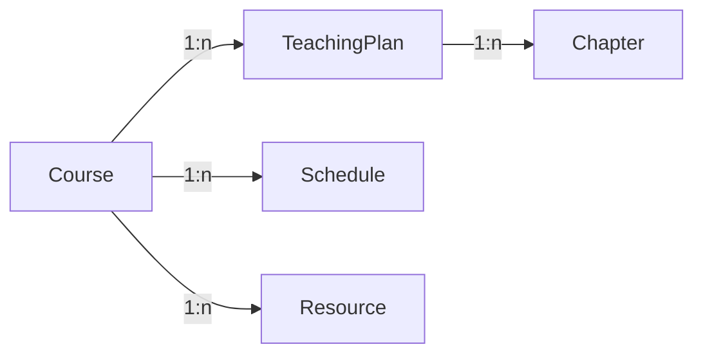

# 教学进度管理系统详细设计与具体代码实现

## 1.背景介绍
### 1.1 教学进度管理系统的重要性
在现代教育领域,高效管理教学进度对于保证教学质量和学生学习效果至关重要。传统的人工管理方式已经无法满足日益增长的教学管理需求。因此,开发一套功能完善、易于使用的教学进度管理系统势在必行。

### 1.2 教学进度管理系统的主要功能
一个优秀的教学进度管理系统应该包括以下主要功能:
- 教学计划管理:制定和调整教学计划,设置教学目标和里程碑。
- 课程进度跟踪:实时记录和查看各门课程的教学进度。
- 教学资源管理:管理和共享教学大纲、课件、作业等教学资源。
- 教学质量评估:对教学效果进行评估和反馈,不断改进教学方法。
- 数据统计与分析:生成教学进度报表,为教学管理决策提供数据支持。

### 1.3 教学进度管理系统的开发技术选型
为了开发一个高质量的教学进度管理系统,我们需要选择合适的技术栈。本项目拟采用以下主要技术:
- 前端:Vue.js + Element UI
- 后端:Spring Boot + MyBatis 
- 数据库:MySQL
- 版本控制:Git
- 项目管理:Maven

## 2.核心概念与联系
### 2.1 领域模型
在教学进度管理系统中,核心领域概念包括:
- Course(课程):一门具体的课程,如"数据结构"、"操作系统"等。
- TeachingPlan(教学计划):针对一门课程制定的教学计划,包括教学目标、授课老师、学时分配等。
- Chapter(章节):课程教学内容按章节组织,每个章节包含若干知识点。
- Schedule(进度):记录课程教学的实际进度,如已完成的章节、课时等。
- Resource(资源):与课程教学相关的资源,如教学大纲、课件、作业、参考资料等。

### 2.2 领域模型之间的关系
下面是领域模型之间的关系图:



- 一门课程(Course)对应多个教学计划(TeachingPlan)
- 一个教学计划(TeachingPlan)包含多个章节(Chapter)
- 一门课程(Course)对应多个教学进度记录(Schedule) 
- 一门课程(Course)关联多个教学资源(Resource)

## 3.核心算法原理具体操作步骤
### 3.1 教学进度自动统计算法
系统需要根据已完成的课时自动计算教学进度的完成百分比。核心算法步骤如下:
1. 根据课程ID查询总课时数totalHours
2. 根据课程ID查询已完成课时数finishedHours
3. 计算进度完成百分比: progress = finishedHours / totalHours * 100%
4. 将进度百分比progress更新到数据库中

### 3.2 教学计划与进度偏差预警算法
为了及时发现教学进度与计划的偏差,系统需要定期执行偏差预警算法:
1. 根据当前日期,遍历所有未结束的课程
2. 对每门课程,计算理论上应该完成的课时数: expectedHours = totalHours * 已过天数 / 总天数
3. 计算实际完成课时数与理论课时数的差值: deviation = finishedHours - expectedHours
4. 如果deviation小于预设的阈值(如-5),则触发预警,生成预警记录
5. 将预警记录推送给相关责任人,如授课老师、教务管理员等

## 4.数学模型和公式详细讲解举例说明
### 4.1 教学进度完成百分比的数学模型
教学进度的完成百分比progress可以用以下数学公式表示:

$$progress = \frac{finishedHours}{totalHours} \times 100\%$$

其中:
- $finishedHours$ 表示已完成课时数
- $totalHours$ 表示总课时数
- $progress$ 表示进度完成百分比,取值范围为[0,100]

举例说明:
假设一门课程"数据结构"总课时为64,当前已完成32课时,则进度完成百分比为:

$$progress = \frac{32}{64} \times 100\% = 50\%$$

即"数据结构"课程的教学进度已完成50%。

### 4.2 教学计划与进度偏差值的数学模型 
教学计划与进度的偏差值deviation可以用以下数学公式表示:

$$deviation = finishedHours - expectedHours$$

其中:
- $finishedHours$ 表示实际已完成课时数
- $expectedHours$ 表示理论上应该完成的课时数,可按比例估算: $expectedHours = totalHours \times \frac{elapsedDays}{totalDays}$
- $deviation$ 表示偏差值,当偏差值小于0时,表示进度落后于计划

举例说明:
假设"操作系统"课程总课时为48,计划在60天内完成。当前已过去20天,已完成12课时。则理论应完成课时为:

$$expectedHours = 48 \times \frac{20}{60} = 16$$

偏差值为:

$$deviation = 12 - 16 = -4$$

即"操作系统"课程当前进度落后4个课时。

## 5.项目实践：代码实例和详细解释说明
下面我们通过代码实例来演示如何实现教学进度管理系统的核心功能。

### 5.1 教学进度自动统计
#### 5.1.1 Mapper层
在Mapper层,我们需要编写SQL语句来查询总课时数和已完成课时数:

```xml
<select id="getTotalHoursByCourseId" resultType="int">
  SELECT SUM(class_hours) FROM chapter WHERE course_id = #{courseId}
</select>

<select id="getFinishedHoursByCourseId" resultType="int">
  SELECT IFNULL(SUM(finished_hours),0) FROM schedule WHERE course_id = #{courseId}
</select>
```

#### 5.1.2 Service层
在Service层,我们调用Mapper层的方法,计算进度百分比并更新到数据库:

```java
@Service
public class ScheduleService {

    @Autowired
    private ChapterMapper chapterMapper;
    
    @Autowired
    private ScheduleMapper scheduleMapper;
    
    @Transactional
    public void updateProgress(Long courseId) {
        // 获取总课时
        int totalHours = chapterMapper.getTotalHoursByCourseId(courseId);
        // 获取已完成课时
        int finishedHours = scheduleMapper.getFinishedHoursByCourseId(courseId);
        // 计算进度百分比
        double progress = (double)finishedHours / totalHours * 100;
        // 更新数据库
        scheduleMapper.updateProgressByCourseId(courseId, progress);
    }
}
```

#### 5.1.3 Controller层
在Controller层,我们提供一个REST接口,触发进度统计:

```java
@RestController
@RequestMapping("/schedule")
public class ScheduleController {

    @Autowired
    private ScheduleService scheduleService;
    
    @PutMapping("/progress/{courseId}")
    public void updateProgress(@PathVariable Long courseId) {
        scheduleService.updateProgress(courseId);
    }
}
```

### 5.2 教学计划与进度偏差预警
#### 5.2.1 Mapper层
在Mapper层,我们需要一个方法来插入预警记录:

```xml
<insert id="insertWarning">
  INSERT INTO warning (course_id, deviation, warn_time) 
  VALUES (#{courseId}, #{deviation}, #{warnTime})
</insert>
```

#### 5.2.2 Service层
在Service层,我们实现偏差预警算法:

```java
@Service
public class ScheduleService {
    
    @Autowired
    private CourseMapper courseMapper;
    
    @Autowired
    private WarningMapper warningMapper;
    
    @Transactional
    public void checkDeviationAndWarn() {
        // 获取所有未结束的课程
        List<Course> courses = courseMapper.getUnfinishedCourses();
        for (Course course : courses) {
            // 计算已过天数
            long elapsedDays = ChronoUnit.DAYS.between(course.getStartDate(), LocalDate.now());
            // 计算理论应完成课时
            int expectedHours = course.getTotalHours() * elapsedDays / course.getTotalDays();
            // 获取实际完成课时
            int finishedHours = course.getSchedule().getFinishedHours();
            // 计算偏差值
            int deviation = finishedHours - expectedHours;
            // 如果偏差过大,插入预警记录
            if (deviation < -5) {
                warningMapper.insertWarning(course.getId(), deviation, LocalDateTime.now());
            }
        }
    }
}
```

#### 5.2.3 定时任务
我们可以使用Spring的@Scheduled注解来定期执行偏差预警检查:

```java
@Component
public class ScheduleTask {
    
    @Autowired
    private ScheduleService scheduleService;
    
    @Scheduled(cron = "0 0 8 * * ?") // 每天8点执行
    public void checkDeviationAndWarn() {
        scheduleService.checkDeviationAndWarn();
    }
}
```

## 6.实际应用场景
教学进度管理系统可以应用于各级各类教育机构,如中小学、大学、培训机构等。以下是几个具体的应用场景:

### 6.1 高校教务管理
高校可以使用教学进度管理系统来规范和优化教学管理流程。教务处可以在系统中制定教学计划,开课排课。授课教师可以在系统中准备教学资源,记录授课进度。教务处可以通过系统实时监控各课程的教学进度,及时发现和处理进度异常情况。

### 6.2 中小学教学管理
中小学可以使用教学进度管理系统来提高教学管理效率。学校可以在系统中统一制定各学科的教学计划和进度安排。任课教师可以在系统中查看教学计划,并据此备课授课。教学管理人员可以通过系统随时了解各班级、各学科的教学进展情况,保证教学工作有序开展。

### 6.3 培训机构课程管理
培训机构可以使用教学进度管理系统来加强课程管理。培训机构可以在系统中发布培训课程计划,安排授课教师。学员可以通过系统了解课程安排,获取学习资料。管理人员可以通过系统掌握各培训班的上课进度,优化调整课程安排。

## 7.工具和资源推荐
### 7.1 项目管理工具
- Maven:Java项目构建和依赖管理工具。
- Git:分布式版本控制系统,便于团队协作开发。
- JIRA/Redmine:缺陷跟踪和项目管理平台,有助于提高项目可见性和过程管理。

### 7.2 开发工具
- IntelliJ IDEA:业界公认的优秀Java IDE,提供了丰富的编码辅助和重构功能。
- VS Code:轻量级代码编辑器,通过插件可支持多种语言开发。
- Postman:API测试工具,可以方便地对后端接口进行调试。

### 7.3 在线学习资源
- Spring官方文档:https://spring.io/projects/spring-boot
- Vue.js官方文档:https://vuejs.org/
- 阿里巴巴Java开发手册:https://github.com/alibaba/p3c
- LeetCode算法题库:https://leetcode-cn.com/

## 8.总结：未来发展趋势与挑战
### 8.1 个性化和智能化
未来教学进度管理系统将朝着个性化和智能化的方向发展。系统将根据学生的学习特点和进度,自动推荐个性化的学习资源和路径。同时,系统还将应用人工智能技术,通过对海量教学数据的挖掘分析,智能预警进度风险,提供优化建议。

### 8.2 在线教育支持
随着在线教育的兴起,教学进度管理系统需要提供更好的在线教学支持。包括直播课程与进度管理的无缝集成,在线学习行为与进度的关联分析等。让线上线下教学进度协同管理成为可能。

### 8.3 多维度教学质量分析
教学进度管理系统未来将加强教学质量的多维度分析。不仅要关注进度,还要结合考勤、作业、考试、评教等数据,多角度评估教学效果。进而优化教学方式,提高教学质量。

### 8.4 移动端支持
未来教学进度管理系统还应提供移动端支持,让教师和学生可以随时随地通过手机