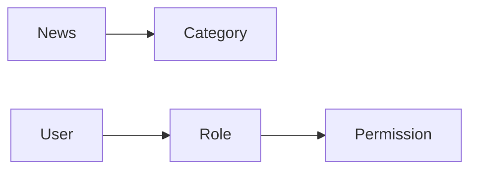

# 校园新闻发布管理系统详细设计与具体代码实现

## 1. 背景介绍

在现代化的校园管理中,新闻发布系统扮演着越来越重要的角色。它不仅是学校对外宣传和信息发布的重要渠道,也是加强校园文化建设、提高学校知名度和影响力的有效手段。一个功能完善、界面友好、安全可靠的校园新闻发布管理系统,可以大大提高学校新闻宣传工作的效率和质量。

本文将详细介绍一个基于 Web 的校园新闻发布管理系统的设计与实现。该系统采用 B/S 架构,前端使用 Vue.js 框架,后端使用 Spring Boot + MyBatis 框架,数据库使用 MySQL。系统主要包括新闻管理、用户管理、权限管理等模块,实现了新闻的发布、审核、修改、删除等功能。

## 2. 核心概念与联系

在开始详细设计之前,我们先来了解一下系统涉及的一些核心概念:

- 新闻(News):系统的核心数据,包括标题、内容、作者、发布时间、分类等属性。
- 分类(Category):用于对新闻进行分类,如学校要闻、教学科研、校园生活等。
- 用户(User):系统的使用者,分为管理员和普通用户两种角色。
- 角色(Role):用于对用户进行权限控制,不同角色拥有不同的操作权限。
- 权限(Permission):对系统功能的细粒度控制,如新闻发布权限、新闻审核权限等。

这些概念之间的关系可以用下面的 Mermaid 图来表示:



从图中可以看出:
- 一条新闻属于一个分类,一个分类包含多条新闻。
- 一个用户拥有一个角色,一个角色包含多个用户。  
- 一个角色拥有多个权限,一个权限可以属于多个角色。

理清了这些概念之间的关系,我们就可以着手进行系统的详细设计了。

## 3. 核心算法原理具体操作步骤

本系统的核心功能是新闻的发布和审核,涉及到的主要算法有:

### 3.1 新闻列表的分页查询

由于新闻数量可能很大,我们不能一次性将所有新闻都查询出来,而是需要使用分页查询的方式,每次只查询一页的数据。分页查询的基本步骤如下:

1. 前端传递分页参数,包括页码(page)和每页大小(size)。
2. 后端根据分页参数计算查询的起始位置(offset)和查询的条数(limit)。
   - offset = (page - 1) * size
   - limit = size
3. 后端执行分页查询 SQL,返回当前页的数据和总记录数。
4. 前端根据总记录数和每页大小,计算出总页数,并生成分页导航条。

### 3.2 新闻内容的富文本编辑

新闻内容通常是一段富文本,包含了文字、图片、视频等多种元素。为了方便编辑和展示富文本内容,我们可以使用现成的富文本编辑器组件,如 TinyMCE、CKEditor 等。

富文本编辑器的基本用法如下:

1. 在前端页面中引入富文本编辑器组件的 JS 和 CSS 文件。
2. 在表单中添加一个 textarea 元素,作为富文本编辑器的容器。
3. 初始化富文本编辑器,将 textarea 转换为富文本编辑器。
4. 在表单提交时,获取富文本编辑器的内容,一起提交到后端。
5. 在新闻详情页面,将后端返回的富文本内容设置到相应的元素中显示。

## 4. 数学模型和公式详细讲解举例说明

本系统主要是一个内容管理系统,涉及的数学模型和公式较少,这里主要介绍一下新闻排序算法中用到的时间衰减函数。

在新闻列表中,我们希望最新发布的新闻能够排在最前面,随着时间的推移,新闻的排序权重逐渐衰减。这个衰减过程可以用一个指数函数来表示:

$$
f(t) = e^{-\lambda t}
$$

其中:
- $t$ 表示新闻发布的时间与当前时间的差值,单位为天。
- $\lambda$ 表示衰减的速率,是一个需要根据实际情况调整的参数。

举个例子,假设一条新闻发布于 3 天前,当前的衰减速率为 0.1,则这条新闻的排序权重为:

$$
f(3) = e^{-0.1 \times 3} \approx 0.74
$$

可以看出,随着时间的推移,新闻的排序权重会越来越小,但不会减少到 0。我们可以将这个权重值与其他因素(如浏览量、点赞数等)综合考虑,得到新闻的最终排序值。

## 5. 项目实践:代码实例和详细解释说明

下面我们通过一些具体的代码实例,来说明系统的实现细节。

### 5.1 新闻列表查询接口

```java
@RestController
@RequestMapping("/news")
public class NewsController {

    @Autowired
    private NewsService newsService;

    @GetMapping("/list")
    public ResponseEntity<Page<NewsDTO>> listNews(@RequestParam(defaultValue = "1") Integer page,
                                                   @RequestParam(defaultValue = "10") Integer size) {
        Page<NewsDTO> newsList = newsService.listNews(page, size);
        return ResponseEntity.ok(newsList);
    }
}
```

这是一个典型的 RESTful 风格的接口,使用 GET 方法来获取新闻列表,支持分页查询。接口的实现要点如下:

- 使用 `@RestController` 注解标识这是一个 RESTful 接口类。
- 使用 `@RequestMapping` 注解指定接口的根路径为 `/news`。
- 使用 `@GetMapping` 注解指定 `/list` 接口支持 GET 方法。
- 使用 `@RequestParam` 注解接收分页参数 `page` 和 `size`,并设置默认值。
- 调用 `NewsService` 的 `listNews` 方法获取分页数据。
- 使用 `ResponseEntity` 包装返回结果,设置响应状态码为 200。

### 5.2 新闻发布页面

```html
<template>
  <div>
    <el-form ref="form" :model="news" label-width="80px">
      <el-form-item label="标题">
        <el-input v-model="news.title"></el-input>
      </el-form-item>
      <el-form-item label="分类">
        <el-select v-model="news.categoryId" placeholder="请选择">
          <el-option v-for="item in categories" :key="item.id" :label="item.name" :value="item.id"></el-option>
        </el-select>
      </el-form-item>
      <el-form-item label="内容">
        <editor v-model="news.content" :init="editorInit"></editor>
      </el-form-item>
      <el-form-item>
        <el-button type="primary" @click="onSubmit">发布</el-button>
      </el-form-item>
    </el-form>
  </div>
</template>

<script>
import Editor from '@tinymce/tinymce-vue'

export default {
  components: {
    'editor': Editor
  },
  data() {
    return {
      news: {
        title: '',
        categoryId: '',
        content: ''
      },
      categories: [],
      editorInit: {
        language_url: '/tinymce/langs/zh_CN.js',
        language: 'zh_CN',
        skin_url: '/tinymce/skins/ui/oxide',
        height: 500,
        plugins: ['advlist autolink lists link image charmap print preview anchor']
      }
    }
  },
  methods: {
    onSubmit() {
      // 提交表单
    }
  },
  created() {
    // 获取分类列表
  }
}
</script>
```

这是一个使用 Vue.js 编写的新闻发布页面,页面的要点如下:

- 使用 `el-form` 组件创建表单,通过 `v-model` 绑定表单数据。
- 使用 `el-input`、`el-select` 等组件实现各个表单项。
- 使用 `tinymce-vue` 组件实现富文本编辑器,通过 `v-model` 绑定编辑器内容。
- 在 `data` 中定义表单数据对象 `news` 和分类列表数据 `categories`。
- 在 `created` 钩子函数中获取分类列表数据。
- 在 `methods` 中定义表单提交方法 `onSubmit`。

## 6. 实际应用场景

校园新闻发布管理系统的实际应用场景主要包括:

- 学校官网的新闻模块:学校可以使用该系统来管理官网上的新闻内容,包括新闻的发布、修改、删除等。
- 校内信息发布平台:学校可以利用该系统建立一个校内信息发布平台,供各部门、各单位发布通知公告、活动信息等。
- 校园媒体管理:学校的校报、广播站、电视台等校园媒体,可以使用该系统来管理新闻稿件和节目内容。
- 校史资料管理:学校可以使用该系统来管理校史资料,如重要事件、领导讲话、老照片等,方便师生查阅。

总之,校园新闻发布管理系统可以为学校的新闻宣传和信息发布工作提供一个统一的平台,提高工作效率和管理水平。

## 7. 工具和资源推荐

在开发校园新闻发布管理系统时,我们可以使用以下工具和资源:

- 前端框架:Vue.js、React、Angular 等。
- UI 组件库:Element UI、Ant Design、Bootstrap 等。
- 后端框架:Spring Boot、Express、Laravel 等。
- 数据库:MySQL、MongoDB、PostgreSQL 等。
- 富文本编辑器:TinyMCE、CKEditor、Quill 等。
- 版本控制工具:Git、SVN 等。
- 构建工具:Webpack、Gulp、Grunt 等。
- 开发 IDE:IntelliJ IDEA、Visual Studio Code、Eclipse 等。

除了这些工具之外,我们还可以参考一些优秀的开源项目,如:

- Vue-Element-Admin:基于 Vue 和 Element UI 的后台管理系统解决方案。
- RuoYi:基于 Spring Boot 的权限管理系统。
- Guns:基于 Spring Boot 的开源管理系统。

这些项目都有完善的文档和活跃的社区,可以给我们的开发工作提供很多参考和帮助。

## 8. 总结:未来发展趋势与挑战

随着互联网技术的不断发展,校园新闻发布管理系统也面临着新的机遇和挑战。未来的发展趋势主要体现在以下几个方面:

- 移动化:随着移动设备的普及,学生获取信息的主要渠道已经从 PC 端转移到了移动端。因此,新闻发布系统需要提供移动端的访问支持,如响应式布局、移动 App 等。
- 个性化:不同的用户对新闻内容有不同的需求和喜好,新闻发布系统需要提供个性化的推荐和订阅功能,让用户能够方便地获取自己感兴趣的内容。
- 智能化:随着人工智能技术的发展,新闻发布系统可以引入智能算法,如智能分类、关键词提取、自动摘要等,提高新闻管理的效率和准确性。
- 多媒体化:除了文字和图片,新闻内容还应该包括音频、视频等多种形式,让新闻更加生动和直观。新闻发布系统需要支持多媒体内容的上传、管理和展示。
- 社交化:新闻不再是单向的传播,而是一个互动的过程。新闻发布系统需要加入社交元素,如评论、点赞、分享等,让用户能够参与到新闻的讨论和传播中来。

当然,在实现这些功能的过程中,我们也面临着一些挑战,如:

- 性能问题:如何在海量数据的情况下,保证系统的高性能和高可用。
- 安全问题:如何防范 XSS、CSRF、SQL 注入等各种安全威胁。
- 版权问题:如何在保护原创内容版权的同时,又能方便地进行转载和分享。

这些都是我们在开发和运营过程中需要重点考虑和解决的问题。

## 9. 附录:常见问题与解答

1. 问:如何