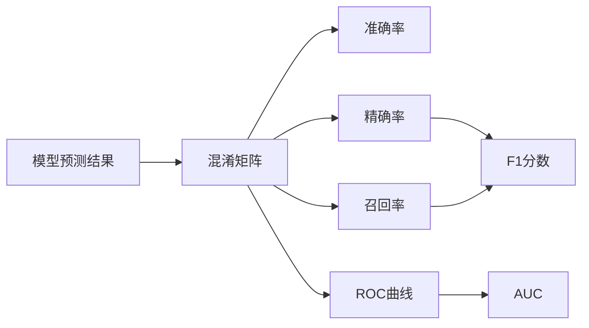

# 模型评估可视化：Matplotlib与Seaborn

## 1. 背景介绍

在机器学习和深度学习中,模型评估是一个至关重要的环节。通过评估模型在训练集和测试集上的表现,我们可以了解模型的优劣,进而对模型进行优化和改进。而可视化是模型评估中不可或缺的一部分,它能够直观、形象地展示模型的各项指标,帮助我们快速分析问题所在。

Python是当前应用最为广泛的数据分析语言,其丰富的可视化库为模型评估提供了强大的支持。本文将重点介绍Python中两个常用的可视化库——Matplotlib和Seaborn,并通过实例演示如何利用它们实现模型评估可视化。

### 1.1 为什么要进行模型评估可视化?

- 直观展示模型表现：通过图表,我们可以一目了然地看出模型的准确率、错误率、精确率、召回率等关键指标,快速评判模型优劣。
- 便于对比不同模型：将多个模型的评估指标绘制在同一张图表上,可以方便地比较它们的性能差异。  
- 发现问题所在：可视化能够帮助我们发现模型存在的问题,如过拟合、欠拟合、类别不平衡等,为后续的优化指明方向。
- 向非专业人士展示结果：图表比枯燥的数字更容易理解,适合向非技术人员汇报模型效果。

### 1.2 Matplotlib与Seaborn简介

Matplotlib是Python的一个绘图库,提供了丰富的绘图函数,可以绘制出各种静态、动态、交互式的图表。Matplotlib的绘图功能非常强大,不仅支持标准的折线图、散点图、柱状图、饼图等,还能绘制3D图形、图像、动画等。

Seaborn是基于Matplotlib开发的一个统计绘图库。它提供了一套高度封装的函数,使得绘制常见的统计图表变得更加简单。Seaborn的绘图风格也更加现代化,默认使用更美观的配色。

## 2. 核心概念与联系

要实现模型评估可视化,我们首先需要了解一些基本概念:

### 2.1 混淆矩阵(Confusion Matrix)

混淆矩阵用于总结分类模型的预测结果。矩阵的每一行表示实际类别,每一列表示预测类别。矩阵的第i行第j列的值表示实际类别为i但被预测为j的样本数。

### 2.2 准确率(Accuracy)

准确率衡量了分类器正确分类的样本数占总样本的比例。公式为:

$Accuracy = \frac{TP+TN}{TP+TN+FP+FN}$

其中,TP为真正例,TN为真反例,FP为假正例,FN为假反例。

### 2.3 精确率(Precision)

精确率衡量了被预测为正例的样本中,真正例所占的比例。公式为:

$Precision = \frac{TP}{TP+FP}$

### 2.4 召回率(Recall)

召回率衡量了真实的正例中,被预测为正例的比例。公式为:  

$Recall = \frac{TP}{TP+FN}$

### 2.5 F1分数(F1-score)

F1分数是精确率和召回率的调和平均数,兼顾了二者。公式为:

$F_1=\frac{2}{\frac{1}{Precision}+\frac{1}{Recall}}=2\cdot\frac{Precision \cdot Recall}{Precision + Recall}$

### 2.6 ROC曲线与AUC

ROC曲线反映了分类器在所有阈值下的表现。横坐标为假正例率(FPR),纵坐标为真正例率(TPR)。AUC为ROC曲线下的面积,取值在0到1之间,值越大表示分类器性能越好。

下图展示了这些概念之间的联系:



## 3. 核心算法原理与具体操作步骤

下面我们以一个二分类问题为例,演示如何使用Matplotlib和Seaborn进行模型评估可视化。

### 3.1 生成示例数据

首先,我们生成一些随机的预测结果和真实标签:

```python
import numpy as np

# 生成1000个样本的预测概率和真实标签
y_prob = np.random.rand(1000)  
y_true = np.random.choice([0, 1], 1000)
```

### 3.2 计算评估指标

接下来,我们使用sklearn计算各项评估指标:

```python
from sklearn.metrics import confusion_matrix, accuracy_score, precision_score, recall_score, f1_score, roc_curve, auc

# 将预测概率转为预测标签
y_pred = y_prob > 0.5

# 计算混淆矩阵
cm = confusion_matrix(y_true, y_pred)

# 计算准确率、精确率、召回率、F1分数  
acc = accuracy_score(y_true, y_pred)
pre = precision_score(y_true, y_pred) 
rec = recall_score(y_true, y_pred)
f1 = f1_score(y_true, y_pred)

# 计算ROC曲线和AUC
fpr, tpr, thresholds = roc_curve(y_true, y_prob)
roc_auc = auc(fpr, tpr)
```

### 3.3 混淆矩阵可视化

使用Seaborn的heatmap函数绘制混淆矩阵:

```python
import matplotlib.pyplot as plt
import seaborn as sns

plt.figure(figsize=(6, 4))
sns.heatmap(cm, annot=True, fmt='d', cmap='Blues')
plt.xlabel('Predicted label')
plt.ylabel('True label')
plt.title('Confusion Matrix')
plt.tight_layout()
plt.show()
```

### 3.4 准确率、精确率、召回率、F1分数可视化

使用Matplotlib的bar函数绘制柱状图:

```python
plt.figure(figsize=(6, 4))
x = ['Accuracy', 'Precision', 'Recall', 'F1']  
y = [acc, pre, rec, f1]
plt.bar(x, y, width=0.5, color=['#1f77b4', '#ff7f0e', '#2ca02c', '#d62728'])
for i, v in enumerate(y):
    plt.text(i, v+0.01, f'{v:.2f}', ha='center')  
plt.ylim(0, 1.1)
plt.title('Classification Metrics')
plt.tight_layout()
plt.show()
```

### 3.5 ROC曲线可视化

使用Matplotlib绘制ROC曲线:

```python
plt.figure(figsize=(6, 4))
plt.plot(fpr, tpr, color='darkorange', label=f'AUC = {roc_auc:.2f}')
plt.plot([0, 1], [0, 1], color='navy', linestyle='--')
plt.xlabel('False Positive Rate')
plt.ylabel('True Positive Rate')
plt.title('ROC Curve')
plt.legend(loc="lower right")
plt.tight_layout()
plt.show()
```

## 4. 数学模型和公式详解

前面我们已经给出了准确率、精确率、召回率、F1分数的计算公式,这里再对其中涉及的概念做一下说明:

### 4.1 真正例(TP)、真反例(TN)、假正例(FP)、假反例(FN)

以二分类问题为例,我们将样本的真实标签和预测标签分为正例(1)和反例(0)。那么就会出现四种情况:

- 真正例(TP):实际为正例,预测也为正例。
- 真反例(TN):实际为反例,预测也为反例。  
- 假正例(FP):实际为反例,但预测为正例。
- 假反例(FN):实际为正例,但预测为反例。

它们构成了混淆矩阵的四个部分:

$$
\begin{matrix}
  & Predicted Pos & Predicted Neg \\
Actual Pos & TP & FN \\ 
Actual Neg & FP & TN
\end{matrix}
$$

### 4.2 ROC曲线

ROC曲线的横坐标为假正例率(FPR),纵坐标为真正例率(TPR),它们的计算公式为:

$$FPR = \frac{FP}{FP+TN}$$

$$TPR = \frac{TP}{TP+FN}$$

在绘制ROC曲线时,我们通过改变分类阈值,计算每个阈值下的TPR和FPR,再将这些点连接起来,就得到了ROC曲线。一个完美的分类器的ROC曲线应该尽可能地靠近左上角,此时AUC为1;而随机猜测的分类器的ROC曲线应该接近对角线,此时AUC为0.5。

## 5. 项目实践:代码实例与详解

下面我们用一个完整的示例来演示模型评估可视化的完整流程。

### 5.1 加载数据集

我们使用scikit-learn自带的乳腺癌数据集,这是一个二分类问题。

```python
from sklearn.datasets import load_breast_cancer
from sklearn.model_selection import train_test_split

# 加载数据集
data = load_breast_cancer()
X, y = data.data, data.target

# 划分训练集和测试集
X_train, X_test, y_train, y_test = train_test_split(X, y, test_size=0.2, random_state=42)
```

### 5.2 训练模型

我们选择逻辑回归作为分类模型。

```python
from sklearn.linear_model import LogisticRegression

# 训练逻辑回归模型
model = LogisticRegression()
model.fit(X_train, y_train)
```

### 5.3 模型预测与评估

用训练好的模型对测试集进行预测,并计算评估指标。

```python
from sklearn.metrics import confusion_matrix, accuracy_score, precision_score, recall_score, f1_score, roc_curve, auc

# 模型预测
y_prob = model.predict_proba(X_test)[:, 1]  
y_pred = model.predict(X_test)

# 计算评估指标
cm = confusion_matrix(y_test, y_pred)
acc = accuracy_score(y_test, y_pred)
pre = precision_score(y_test, y_pred)
rec = recall_score(y_test, y_pred)
f1 = f1_score(y_test, y_pred)
fpr, tpr, thresholds = roc_curve(y_test, y_prob)
roc_auc = auc(fpr, tpr) 
```

### 5.4 可视化结果

使用Matplotlib和Seaborn进行可视化。

```python
# 绘制混淆矩阵
plt.figure(figsize=(6, 4))
sns.heatmap(cm, annot=True, fmt='d', cmap='Blues')
plt.xlabel('Predicted label')
plt.ylabel('True label') 
plt.title('Confusion Matrix')
plt.tight_layout()
plt.show()

# 绘制准确率、精确率、召回率、F1分数柱状图
plt.figure(figsize=(6, 4))
x = ['Accuracy', 'Precision', 'Recall', 'F1']
y = [acc, pre, rec, f1]  
plt.bar(x, y, width=0.5, color=['#1f77b4', '#ff7f0e', '#2ca02c', '#d62728'])
for i, v in enumerate(y):
    plt.text(i, v+0.01, f'{v:.2f}', ha='center')
plt.ylim(0, 1.1)
plt.title('Classification Metrics')
plt.tight_layout()
plt.show()

# 绘制ROC曲线
plt.figure(figsize=(6, 4))
plt.plot(fpr, tpr, color='darkorange', label=f'AUC = {roc_auc:.2f}')
plt.plot([0, 1], [0, 1], color='navy', linestyle='--')
plt.xlabel('False Positive Rate')
plt.ylabel('True Positive Rate')
plt.title('ROC Curve')
plt.legend(loc="lower right")
plt.tight_layout()
plt.show()
```

从可视化结果可以看出,该模型在乳腺癌数据集上的表现非常出色,混淆矩阵中对角线上的值远大于其他位置,准确率、精确率、召回率、F1分数都在0.9以上,ROC曲线也非常接近左上角,AUC高达0.99。

## 6. 实际应用场景

模型评估可视化在实际项目中有广泛的应用,下面列举几个常见场景:

- 评估不同机器学习算法的性能,选择最优模型。
- 调整模型超参数,通过可视化结果判断参数的影响。
- 监控模型在线上环境的表现,及时发现和解决问题。
- 向非技术人员展示项目成果,用直观的图表说明模型效果。

## 7. 工具和资源推荐