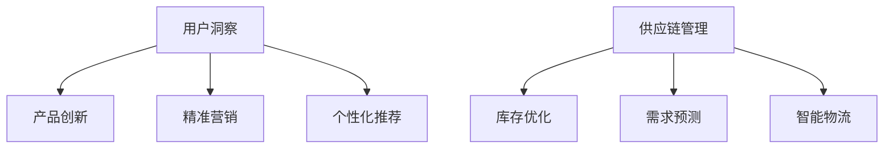

# 消费品行业从业经验分享

## 1. 背景介绍
### 1.1 消费品行业概述
消费品行业是指生产和销售直接面向消费者的产品和服务的行业,包括食品饮料、个人护理、家居用品等多个细分领域。这个行业与人们的日常生活息息相关,市场规模巨大,竞争也非常激烈。

### 1.2 消费品行业的特点
消费品行业有几个显著特点:
- 产品同质化严重,创新和差异化至关重要
- 消费者需求多变,企业需要快速响应
- 渠道复杂多样,线上线下融合发展
- 供应链管理是核心竞争力之一

### 1.3 IT技术在消费品行业的应用
近年来,以大数据、人工智能为代表的新一代信息技术在消费品行业得到广泛应用,成为驱动行业变革和创新的重要力量。企业利用这些技术优化产品开发、个性化营销、智能化生产、自动化物流等环节,大幅提升运营效率和用户体验。

## 2. 核心概念与联系 
### 2.1 用户洞察与产品创新
消费品企业要在激烈的市场竞争中脱颖而出,首先需要对用户有深刻洞察。通过收集分析用户数据,挖掘用户需求和行为特征,指导产品创新。大数据、用户画像等技术在这方面可以发挥重要作用。

### 2.2 精准营销与个性化推荐
消费者个性化需求日益增长,企业需要实现更加精准的营销和个性化的产品推荐。人工智能算法可以分析海量用户数据,自动为用户匹配最合适的产品和营销内容,大幅提升转化率和用户满意度。

### 2.3 智能供应链管理
供应链管理是消费品企业的核心能力之一。物联网、大数据等技术可以实现供应链的全流程可视化管理,优化库存周转、提高响应速度。AI算法还可以实现需求预测、生产计划、物流规划的智能化,降本增效。



## 3. 核心算法原理具体操作步骤
### 3.1 用户画像算法
用户画像是描绘用户特征的一种算法模型,通过收集用户的人口统计学信息、消费行为、偏好等数据,对用户进行多维度刻画。主要步骤如下:
1. 数据采集:收集用户各类数据
2. 数据清洗:去除噪音和异常数据
3. 特征工程:提取关键特征,进行特征编码
4. 用户分群:使用聚类算法将用户划分为不同群体
5. 画像建模:为每个用户群体总结画像标签
6. 应用:将画像应用于个性化推荐、精准营销等场景

### 3.2 个性化推荐算法
个性化推荐算法根据用户的历史行为和偏好,自动推荐用户可能感兴趣的产品。常见的算法包括:
1. 协同过滤:基于用户或物品的相似性进行推荐
2. 基于内容的推荐:根据物品的内容特征进行推荐
3. 组合推荐:结合多种算法,如矩阵分解、深度学习等

具体步骤:
1. 构建用户-物品评分矩阵
2. 计算用户或物品的相似度
3. 生成推荐列表
4. 实时更新模型

### 3.3 需求预测算法
需求预测算法通过分析历史销售数据、市场趋势等因素,预测未来一段时间内的产品需求量。常见的算法包括:
1. 时间序列模型:如ARIMA、Prophet等
2. 机器学习模型:如线性回归、随机森林等
3. 深度学习模型:如LSTM、GRU等

具体步骤:
1. 数据预处理:平滑、季节性调整等
2. 特征工程:提取相关因素如节假日、促销等
3. 模型训练:选择合适的模型并调优参数
4. 模型评估:计算MAPE等评估指标
5. 模型应用:生成未来需求预测值

## 4. 数学模型和公式详细讲解举例说明
### 4.1 协同过滤推荐算法
协同过滤推荐算法分为基于用户的协同过滤和基于物品的协同过滤两类。以基于用户的协同过滤为例,核心思想是找到与目标用户兴趣相似的其他用户,然后将这些相似用户喜欢的物品推荐给目标用户。

其数学原理可表示为:
$$
r_{ui} = \frac{\sum\limits_{v \in S(u;i)}{\rm sim}(u,v) \cdot r_{vi}}{\sum\limits_{v \in S(u;i)}|{\rm sim}(u,v)|}
$$
其中,$r_{ui}$表示预测用户$u$对物品$i$的评分,$S(u;i)$表示与用户$u$相似且对物品$i$有评分的用户集合,${\rm sim}(u,v)$表示用户$u$和用户$v$的相似度,通常用余弦相似度或皮尔逊相关系数计算。

举例说明:
假设用户A和用户B对一组电影的评分如下:

| 电影   | 用户A评分 | 用户B评分 |
|-------|----------|----------|
| 电影1 | 5        | 4        |
| 电影2 | 4        | 5        |
| 电影3 | ?        | 3        |
| 电影4 | 2        | ?        |

根据余弦相似度公式:
$$
\cos \theta = \frac{\vec{A} \cdot \vec{B}}{\|\vec{A}\| \|\vec{B}\|}
$$

计算出用户A和B的相似度为0.98,属于很高的相似度。那么可以用B的评分来预测A对电影3的评分:
$$
r_{A,电影3} = 0.98 \times 3 = 2.94 \approx 3
$$
即可以给用户A推荐电影3。

### 4.2 时间序列需求预测模型
在需求预测领域,ARIMA是应用非常广泛的一类时间序列模型,其全称是差分自回归移动平均模型。ARIMA(p,d,q)模型可以表示为:
$$
\phi(B)(1-B)^d x_t = \theta(B) \varepsilon_t
$$
其中:
- $x_t$表示$t$时刻的序列值
- $\varepsilon_t$表示$t$时刻的白噪声
- $B$是滞后算子,满足$B^k x_t = x_{t-k}$
- $d$表示差分阶数
- $\phi(B) = 1-\phi_1 B -\phi_2 B^2 - \cdots - \phi_p B^p$是$p$阶自回归系数多项式
- $\theta(B) = 1-\theta_1 B -\theta_2 B^2 - \cdots - \theta_q B^q$是$q$阶移动平均系数多项式

ARIMA模型的应用步骤如下:
1. 平稳性检验:通过ADF检验等方法判断序列是否平稳,不平稳需要进行差分
2. 模型定阶:根据自相关系数ACF和偏自相关系数PACF图判断$p$和$q$的取值
3. 参数估计:使用最大似然估计或最小二乘法估计模型参数
4. 模型诊断:对残差进行白噪声检验,判断模型是否可用
5. 模型预测:用估计出的模型对未来进行预测

举例说明:
下图为某款饮料过去50周的周销量数据:

对其建立ARIMA(1,1,1)模型:
$$
(1-\phi_1 B)(1-B)x_t = (1-\theta_1 B)\varepsilon_t
$$
估计出参数$\phi_1=0.7,\theta_1=0.4$。用该模型对未来4周的销量进行预测:

可见ARIMA模型能够较好地拟合数据,对短期需求的预测效果不错。

## 5. 项目实践:代码实例和详细解释说明
下面以Python为例,演示几个核心算法的简要实现。
### 5.1 用户画像
使用K-Means聚类算法给用户打标签:
```python
from sklearn.cluster import KMeans

# 用户特征数据
X = [[0.2,0.1],[0.3,0.5],[0.1,0.8],[0.6,0.8],[0.7,0.3]]

# 聚类为2类
kmeans = KMeans(n_clusters=2).fit(X) 

# 聚类结果
labels = kmeans.labels_
print(labels) # [1 0 0 0 1]
```
根据聚类结果可以给用户打上"低消费"和"高消费"的标签。

### 5.2 个性化推荐
使用基于物品的协同过滤算法:
```python
import numpy as np

# 用户-物品评分矩阵
ratings = np.array([[4,0,2,0],
                    [0,2,3,0],
                    [1,0,2,4],
                    [5,0,0,4]])

# 计算物品相似度矩阵
item_sims = np.corrcoef(ratings.T)
print(item_sims)

# 生成用户0的推荐列表
user_0_ratings = ratings[0]
preds = item_sims.dot(user_0_ratings) / np.array([np.abs(item_sims).sum(axis=1)]).T
print(preds) 
```
根据用户的历史评分和物品相似度,计算出推荐物品的评分预测值。

### 5.3 需求预测
使用Prophet库构建时间序列需求预测模型:
```python
from fbprophet import Prophet

# 历史销量数据
data = {
    'ds': ['2020-01-01', '2020-01-02', '2020-01-03', '2020-01-04', '2020-01-05'],
    'y': [100, 120, 105, 130, 110]
}
df = pd.DataFrame(data)

# 拟合模型
model = Prophet()
model.fit(df)

# 生成未来7天的预测
future = model.make_future_dataframe(periods=7)
forecast = model.predict(future)
print(forecast[['ds', 'yhat']])
```
Prophet会自动识别时间序列的趋势、季节性和节假日效应,生成比较准确的需求预测值。

## 6. 实际应用场景
IT技术在消费品行业有非常广泛的应用,下面列举几个典型场景:
### 6.1 智能新品开发
利用大数据分析消费者偏好,挖掘流行趋势,指导产品创新方向。通过数字化消费者研究,在新品开发的各个环节嵌入消费者洞察,提高产品成功率。
### 6.2 个性化精准营销
在传统的大规模营销的基础上,利用AI算法实现更加个性化的营销。比如根据用户的浏览、购买历史,实时推送相关产品和促销信息,提升点击率和转化率。
### 6.3 自动化需求预测与补货
通过机器学习算法准确预测未来一段时间的需求量,自动生成采购计划,优化库存水平。结合实时的POS销售数据、库存数据,对门店实现自动补货,减少缺货和过期。
### 6.4 无人店/智慧门店
利用人脸识别、RFID、智能货架等新一代IoT技术,打造全新的智慧门店体验。消费者扫脸即可进店,自动识别选购商品,移动支付即可离店,全程无需排队。后台可实现商品精准管理、防盗防损。
### 6.5 溯源与供应链透明
利用区块链等技术,实现产品全生命周期的信息溯源与透明。消费者可以扫码查看产品的原料来源、生产加工、物流配送等各环节信息,企业也可实现供应链各方的协同与监管。

## 7. 工具和资源推荐
### 7.1 数据分析与挖掘
- Python数据分析库:Numpy、Pandas、Matplotlib、Scikit-Learn等
- 商业智能(BI)工具:Tableau、PowerBI、FineBI等
- 数据仓库:Hive、Kylin、