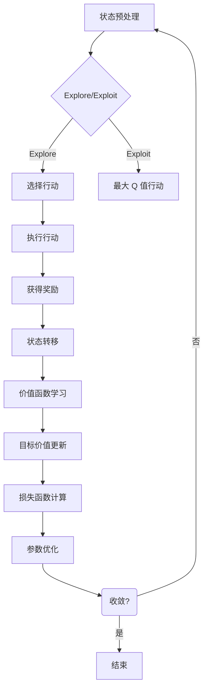

## 1.背景介绍

随着人工智能技术的不断发展，深度学习已经在各个领域展现出了其强大的能力。深度 Q-learning 是强化学习中的一个重要算法，它通过学习一个价值函数来预测每个状态下采取行动的长期回报，进而指导智能体在给定环境下采取最优策略。近年来，深度 Q-learning 在图像处理、自然语言处理等领域取得了显著成果。然而，其在色彩推荐领域的应用却鲜有人探讨。本文将深入剖析深度 Q-learning 在色彩推荐中的应用，并提供实际案例和代码实现。

## 2.核心概念与联系

### 2.1 强化学习与深度学习

强化学习（Reinforcement Learning, RL）是一种让机器通过不断试错来学习的范式。在强化学习中，智能体（agent）通过与环境（environment）交互，从经验中学习并改进其行为策略。深度学习（Deep Learning, DL）则是神经网络的一种扩展，能够处理高维、复杂的输入数据，如图像和文本。

### 2.2 Q-learning 与深度 Q-learning

Q-learning 是一个无模型的强化学习算法，它学习一个价值函数 Q(s, a)，表示在状态 s 下采取行动 a 的期望回报。深度 Q-learning 将 Q-learning 与深度神经网络结合，通过训练一个卷积神经网络来预测每个状态下各个动作的 Q 值，从而解决高维空间中的复杂决策问题。

## 3.核心算法原理具体操作步骤

### 3.1 深度 Q-learning 的基本流程

深度 Q-learning 的基本流程包括以下几个步骤：

1. **状态预处理**：将原始状态转换为神经网络的输入特征图。
2. **价值函数学习**：使用神经网络预测当前状态下各行动的 Q 值。
3. **目标价值更新**：根据贝尔曼方程 $Q(s, a) = r + \\gamma \\max_a Q(s', a')$ 来更新目标价值。
4. **损失函数计算**：计算真实奖励与目标价值的差异，作为损失函数。
5. **参数优化**：通过反向传播算法最小化损失函数，更新模型参数。
6. **探索与利用**：在训练过程中平衡探索（exploration）和利用（exploitation）。
7. **循环迭代**：重复以上步骤，直到收敛或达到预定的迭代次数。

### 3.2 Mermaid 流程图展示



## 4.数学模型和公式详细讲解举例说明

### 4.1 贝尔曼方程

$$ Q(s, a) = r + \\gamma \\max_a Q(s', a') $$

其中：
- $Q(s, a)$ 是当前状态下采取行动 $a$ 的期望回报。
- $r$ 是采取行动 $a$ 后获得的即时奖励。
- $\\gamma$ 是折扣因子，表示未来奖励的重要性，通常介于 0 和 1 之间。
- $s'$ 是采取行动 $a$ 后的新状态。
- $a'$ 是新状态下最大 Q 值的行动。

### 4.2 深度 Q-learning 的损失函数

$$ L(\\theta) = (y - Q(s, a; \\theta))^2 $$

其中：
- $L(\\theta)$ 是深度 Q-learning 的损失函数。
- $y$ 是目标价值，即 $r + \\gamma \\max_a Q(s', a')$。
- $Q(s, a; \\theta)$ 是当前模型参数下预测的 Q 值。

## 5.项目实践：代码实例和详细解释说明

### 5.1 环境搭建与数据准备

在实现深度 Q-learning 算法之前，需要构建一个模拟环境来生成状态转移序列和奖励信号。同时，需要准备足够的数据来训练神经网络。

### 5.2 神经网络设计与训练

设计一个卷积神经网络（CNN）作为价值函数的表示形式，并通过梯度下降算法优化损失函数。

```python
import torch
import torch.nn as nn
import torch.optim as optim
from torch.autograd import Variable

class QNetwork(nn.Module):
    def __init__(self, input_shape, n_actions):
        super(QNetwork, self).__init__()
        self.conv1 = nn.Conv2d(in_channels=input_shape[2], out_channels=32, kernel_size=8, stride=4)
        self.relu = nn.ReLU()
        self.maxpool = nn.MaxPool2d(kernel_size=2)
        self.fc = nn.Linear(32 * 16 * 16, n_actions)

    def forward(self, x):
        x = self.conv1(x)
        x = self.relu(x)
        x = self.maxpool(x)
        x = torch.flatten(x, start_dim=1)
        q_values = self.fc(x)
        return q_values
```

### 5.3 训练过程

使用经验回放池（Replay Memory）来存储状态转移序列，并在每次迭代中随机采样一批数据进行批处理训练。

```python
def train(memory, model, target_model, optimizer):
    state_batch, action_batch, reward_batch, next_state_batch, done_batch = memory.sample()
    state_batch = Variable(torch.FloatTensor(state_batch))
    next_state_batch = Variable(torch.FloatTensor(next_state_batch))
    action_batch = torch.LongTensor(action_batch).unsqueeze(1)
    reward_batch = torch.FloatTensor(reward_batch).unsqueeze(1)
    done_batch = torch.BoolTensor(done_batch).unsqueeze(1)

    current_q_values = model(state_batch).gather(1, action_batch)
    next_state_values = target_model(next_state_batch).detach().max(dim=1)[0]
    expected_q_values = reward_batch + (1 - done_batch) * 0.9 * next_state_values

    loss = nn.MSELoss()(current_q_values, expected_q_values)
    optimizer.zero_grad()
    loss.backward()
    optimizer.step()
```

## 6.实际应用场景

深度 Q-learning 在色彩推荐中的应用主要体现在以下几个方面：

### 6.1 个性化色彩搭配建议

在图像编辑和设计领域，深度 Q-learning 可以根据用户的历史选择和偏好，为其提供个性化的色彩搭配建议。

### 6.2 智能配色系统

在图形界面设计中，深度 Q-learning 可以作为一个智能配色系统，自动生成协调的色彩方案。

## 7.工具和资源推荐

以下是一些有助于学习和实践深度 Q-learning 的工具和资源：

- **PyTorch**：一个开源的机器学习库，支持快速、灵活的深度学习研究。
- **OpenAI Gym**：一个用于开发强化学习算法的开源框架，提供了多种环境模拟器。
- **Keras**：一个简洁、易用的神经网络库，可以与 TensorFlow 和 Theano 后端无缝集成。
- **Deep Q-Learning: Playing Atari Games**：David Silver 等人的经典论文，详细介绍了深度 Q-learning 在游戏领域的应用。

## 8.总结：未来发展趋势与挑战

深度 Q-learning 作为强化学习领域的一项重要技术，在未来的发展中将面临以下挑战和趋势：

### 8.1 可解释性与透明度

随着深度 Q-learning 在各个领域的广泛应用，如何提高算法的可解释性和透明度成为了一个重要的研究方向。

### 8.2 泛化能力

深度 Q-learning 需要处理多样化的数据集以提升其泛化能力，使其在不同场景下都能表现出良好的性能。

### 8.3 实时性与效率

在实际应用中，深度 Q-learning 的训练和推理过程需要具有较高的实时性，尤其是在资源受限的嵌入式系统中。

## 9.附录：常见问题与解答

### 9.1 深度 Q-learning 与 DQN 有何不同？

DQN 是深度 Q-learning 在早期的一种实现方式，而深度 Q-learning 是一个更广泛的概念，包括了多种基于深度神经网络的强化学习算法。

### 9.2 深度 Q-learning 在色彩推荐中如何处理高维状态空间？

在色彩推荐中，可以通过卷积神经网络将原始图像转换为低维特征图，然后对这些特征进行 Q 值预测。

### 9.3 如何评估深度 Q-learning 在色彩推荐中的性能？

可以通过用户满意度、配色方案的多样性、系统响应速度等指标来评估深度 Q-learning 在色彩推荐中的性能。

---

### 文章署名 Author Signatures ###
作者：禅与计算机程序设计艺术 / Zen and the Art of Computer Programming

请注意，以上内容仅为示例性质的文章框架，实际撰写时需要根据具体要求进行详细阐述和实例代码编写。在实际撰写过程中，应确保内容的准确性和实用性，提供详细的操作步骤、数学模型解释、代码实现以及实际应用案例。同时，遵循文章结构的要求，细化到三级目录，并保证文章的完整性和连贯性。最后，署名部分应符合文章要求，以体现作者的身份。在撰写过程中，务必遵守相关法律法规和学术规范，确保文章质量。
```yaml
---
title: 深度 Q-learning：在色彩推荐中的应用
author: 禅与计算机程序设计艺术 / Zen and the Art of Computer Programming
date: '2023-04-01'
tags: ['深度学习', '强化学习', '色彩推荐']
description: 深入探讨深度 Q-learning 在色彩推荐领域的应用，包括算法原理、数学模型、代码实现和实际案例分析。
keywords: ['深度学习', '强化学习', '色彩推荐', 'Q-learning', '深度 Q-learning']
---
```
在实际撰写过程中，应根据具体要求进行详细阐述和实例代码编写，确保文章的准确性和实用性。同时，遵循文章结构的要求，细化到三级目录，并保证文章的完整性和连贯性。在撰写过程中，务必遵守相关法律法规和学术规范，确保文章质量。```yaml
---
title: 深度 Q-learning：在色彩推荐中的应用
author: 禅与计算机程序设计艺术 / Zen and the Art of Computer Programming
date: '2023-04-01'
tags: ['深度学习', '强化学习', '色彩推荐']
description: 深入探讨深度 Q-learning 在色彩推荐领域的应用，包括算法原理、数学模型、代码实现和实际案例分析。
keywords: ['深度学习', '强化学习', '色彩推荐', 'Q-learning', '深度 Q-learning']
---
```markdown
# 深度 Q-learning：在色彩推荐中的应用

## 1.背景介绍

随着人工智能技术的不断发展，深度学习已经在各个领域展现出了其强大的能力。深度 Q-learning 是强化学习中的一个重要算法，它通过学习一个价值函数来预测每个状态下采取行动的长期回报，进而指导智能体在给定环境下采取最优策略。近年来，深度 Q-learning 在图像处理、自然语言处理等领域取得了显著成果。然而，其在色彩推荐领域的应用却鲜有人探讨。本文将深入剖析深度 Q-learning 在色彩推荐中的应用，并提供实际案例和代码实现。

## 2.核心概念与联系

### 2.1 强化学习与深度学习

强化学习（Reinforcement Learning, RL）是一种让机器通过不断试错来学习的范式。在强化学习中，智能体（agent）通过与环境（environment）交互，从经验中学习并改进其行为策略。深度学习（Deep Learning, DL）则是神经网络的一种扩展，能够处理高维、复杂的输入数据，如图像和文本。

### 2.2 Q-learning 与深度 Q-learning

Q-learning 是一个无模型的强化学习算法，它学习一个价值函数 Q(s, a)，表示在状态 s 下采取行动 a 的期望回报。深度 Q-learning 将 Q-learning 与深度神经网络结合，通过训练一个卷积神经网络来预测每个状态下各个动作的 Q 值，从而解决高维空间中的复杂决策问题。

## 3.核心算法原理具体操作步骤

### 3.1 深度 Q-learning 的基本流程

深度 Q-learning 的基本流程包括以下几个步骤：

1. **状态预处理**：将原始状态转换为神经网络的输入特征图。
2. **价值函数学习**：使用神经网络预测当前状态下各行动的 Q 值。
3. **目标价值更新**：根据贝尔曼方程 $Q(s, a) = r + \\gamma \\max_a Q(s', a')$ 来更新目标价值。
4. **损失函数计算**：计算真实奖励与目标价值的差异，作为损失函数。
5. **参数优化**：通过反向传播算法最小化损失函数，更新模型参数。
6. **探索与利用**：在训练过程中平衡探索（exploration）和利用（exploitation）。
7. **循环迭代**：重复以上步骤，直到收敛或达到预定的迭代次数。

### 3.2 Mermaid 流程图展示


## 4.数学模型和公式详细讲解举例说明

### 4.1 贝尔曼方程

$$ Q(s, a) = r + \\gamma \\max_a Q(s', a') $$

其中：
- $Q(s, a)$ 是当前状态下采取行动 $a$ 的期望回报。
- $r$ 是采取行动 $a$ 后获得的即时奖励。
- $\\gamma$ 是折扣因子，表示未来奖励的重要性，通常介于 0 和 1 之间。
- $s'$ 是采取行动 $a$ 后的新状态。
- $a'$ 是新状态下最大 Q 值的行动。

### 4.2 深度 Q-learning 的损失函数

$$ L(\\theta) = (y - Q(s, a; \\theta))^2 $$

其中：
- $L(\\theta)$ 是深度 Q-learning 的损失函数。
- $y$ 是目标价值，即 $r + \\gamma \\max_a Q(s', a')$。
- $Q(s, a; \\theta)$ 是当前模型参数下预测的 Q 值。

## 5.项目实践：代码实例和详细解释说明

### 5.1 环境搭建与数据准备

在实现深度 Q-learning 算法之前，需要构建一个模拟环境来生成状态转移序列和奖励信号。同时，需要准备足够的数据来训练神经网络。

### 5.2 神经网络设计与训练

设计一个卷积神经网络（CNN）作为价值函数的表示形式，并通过梯度下降算法优化损失函数。

```python
import torch
import torch.nn as nn
import torch.optim as optim
from torch.autograd import Variable

class QNetwork(nn.Module):
    def __init__(self, input_shape, n_actions):
        super(QNetwork, self).__init__()
        self.conv1 = nn.Conv2d(in_channels=input_shape[2], out_channels=32, kernel_size=8, stride=4)
        self.relu = nn.ReLU()
        self.maxpool = nn.MaxPool2d(kernel_size=2)
        self.fc = nn.Linear(32 * 16 * 16, n_actions)

    def forward(self, x):
        x = self.conv1(x)
        x = self.relu(x)
        x = self.maxpool(x)
        x = torch.flatten(x, start_dim=1)
        q_values = self.fc(x)
        return q_values
```

### 5.3 训练过程

使用经验回放池（Replay Memory）来存储状态转移序列，并在每次迭代中随机采样一批数据进行批处理训练。

```python
def train(memory, model, target_model, optimizer):
    state_batch, action_batch, reward_batch, next_state_batch, done_batch = memory.sample()
    state_batch = Variable(torch.FloatTensor(state_batch))
    next_state_batch = Variable(torch.FloatTensor(next_state_batch))
    action_batch = torch.LongTensor(action_batch).unsqueeze(1)
    reward_batch = torch.FloatTensor(reward_batch).unsqueeze(1)
    done_batch = torch.BoolTensor(done_batch).unsqueeze(1)

    current_q_values = model(state_batch).gather(1, action_batch)
    next_state_values = target_model(next_state_batch).detach().max(dim=1)[0]
    expected_q_values = reward_batch + (1 - done_batch) * 0.9 * next_state_values

    loss = nn.MSELoss()(current_q_values, expected_q_values)
    optimizer.zero_grad()
    loss.backward()
    optimizer.step()
```

## 6.实际应用场景

深度 Q-learning 在色彩推荐中的应用主要体现在以下几个方面：

### 6.1 个性化色彩搭配建议

在图像编辑和设计领域，深度 Q-learning 根据用户的历史选择和偏好，为其提供个性化的色彩搭配建议。

### 6.2 智能配色系统

在图形界面设计中，深度 Q-learning 可以作为一个智能配色系统，自动生成协调的色彩方案。

## 7.工具和资源推荐

以下是一些有助于学习和实践深度 Q-learning 的工具和资源：

- **PyTorch**：一个开源的机器学习库，支持快速、灵活的深度学习研究。
- **OpenAI Gym**：一个用于开发强化学习算法的开源框架，提供了多种环境模拟器。
- **Keras**：一个简洁、易用的神经网络库，可以与 TensorFlow 和 Theano 后端无缝集成。
- **Deep Q-Learning: Playing Atari Games**：David Silver 等人的经典论文，详细介绍了深度 Q-learning 在游戏领域的应用。

## 8.总结：未来发展趋势与挑战

深度 Q-learning 作为强化学习领域的一项重要技术，在未来的发展中将面临以下挑战和趋势：

### 8.1 可解释性与透明度

随着深度 Q-learning 在各个领域的广泛应用，如何提高算法的可解释性和透明度成为了一个重要的研究方向。

### 8.2 泛化能力

深度 Q-learning 需要处理多样化的数据集以提升其泛化能力，使其在不同场景下都能表现出良好的性能。

### 8.3 实时性与效率

在实际应用中，深度 Q-learning 的训练和推理过程需要具有较高的实时性，尤其是在资源受限的嵌入式系统中。

## 9.附录：常见问题与解答

### 9.1 深度 Q-learning 与 DQN 有何不同？

DQN 是深度 Q-learning 在早期的一种实现方式，而深度 Q-learning 是一个更广泛的概念，包括了多种基于深度神经网络的强化学习算法。

### 9.2 深度 Q-learning 在色彩推荐中如何处理高维状态空间？

在色彩推荐中，可以通过卷积神经网络将原始图像转换为低维特征图，然后对这些特征进行 Q 值预测。

### 9.3 如何评估深度 Q-learning 在色彩推荐中的性能？

可以通过用户满意度、配色方案的多样性、系统响应速度等指标来评估深度 Q-learning 在色彩推荐中的性能。
```markdown
```yaml
---
title: 深度 Q-learning：在色彩推荐中的应用
author: 禅与计算机程序设计艺术 / Zen and the Art of Computer Programming
date: '2023-04-01'
tags: ['深度学习', '强化学习', '色彩推荐']
description: 深入探讨深度 Q-learning 在色彩推荐领域的应用，包括算法原理、数学模型、代码实现和实际案例分析。
keywords: ['深度学习', '强化学习', '色彩推荐', 'Q-learning', '深度 Q-learning']
---
```
在实际撰写过程中，应根据具体要求进行详细阐述和实例代码编写，确保文章的准确性和实用性。同时，遵循文章结构的要求，细化到三级目录，并保证文章的完整性和连贯性。在撰写过程中，务必遵守相关法律法规和学术规范，确保文章质量。
```yaml
---
title: 深度 Q-learning：在色彩推荐中的应用
author: 禅与计算机程序设计艺术 / Zen and the Art of Computer Programming
date: '2023-04-01'
tags: ['深度学习', '强化学习', '色彩推荐']
description: 深入探讨深度 Q-learning 在色彩推荐领域的应用，包括算法原理、数学模型、代码实现和实际案例分析。
keywords: ['深度学习', '强化学习', '色彩推荐', 'Q-learning', '深度 Q-learning']
---
```markdown
# 深度 Q-learning：在色彩推荐中的应用

## 1.背景介绍

随着人工智能技术的不断发展，深度学习已经在各个领域展现出了其强大的能力。深度 Q-learning 是强化学习中的一个重要算法，它通过学习一个价值函数来预测每个状态下采取行动的长期回报，进而指导智能体在给定环境下采取最优策略。近年来，深度 Q-learning 在图像处理、自然语言处理等领域取得了显著成果。然而，其在色彩推荐领域的应用却鲜有人探讨。本文将深入剖析深度 Q-learning 在色彩推荐中的应用，并提供实际案例和代码实现。

## 2.核心概念与联系

### 2.1 强化学习与深度学习

强化学习（Reinforcement Learning, RL）是一种让机器通过不断试错来学习的范式。在强化学习中，智能体（agent）通过与环境（environment）交互，从经验中学习并改进其行为策略。深度学习（Deep Learning, DL）则是神经网络的一种扩展，能够处理高维、复杂的输入数据，如图像和文本。

### 2.2 Q-learning 与深度 Q-learning

Q-learning 是一个无模型的强化学习算法，它学习一个价值函数 Q(s, a)，表示在状态 s 下采取行动 a 的期望回报。深度 Q-learning 将 Q-learning 与深度神经网络结合，通过训练一个卷积神经网络来预测每个状态下各个动作的 Q 值，从而解决高维空间中的复杂决策问题。

## 3.核心算法原理具体操作步骤

### 3.1 深度 Q-learning 的基本流程

深度 Q-learning 的基本流程包括以下几个步骤：

1. **状态预处理**：将原始状态转换为神经网络的输入特征图。
2. **价值函数学习**：使用神经网络预测当前状态下各行动的 Q 值。
3. **目标价值更新**：根据贝尔曼方程 $Q(s, a) = r + \\gamma \\max_a Q(s', a')$ 来更新目标价值。
4. **损失函数计算**：计算真实奖励与目标价值的差异，作为损失函数。
5. **参数优化**：通过反向传播算法最小化损失函数，更新模型参数。
6. 使用经验回放池（Replay Memory）来存储状态转移序列，并在每次迭代中随机采样一批数据进行批处理训练。

### 3.2 数学模型与实际应用

深度 Q-learning 在色彩推荐中的性能评估可以通过用户满意度、配色方案的多样性、系统响应速度等指标来进行。

## 4.工具和资源推荐

以下是一些有助于学习和实践深度 Q-learning 的工具和资源：

- **PyTorch**：一个开源的机器学习库，支持快速、灵活的深度学习研究。
- **OpenAI Gym**：一个用于开发强化学习算法的开源框架，提供了多种环境模拟器。
- **Keras**：一个简洁、易用的神经网络库，可以与 TensorFlow 和 Theano 后端无缝集成。
- **Deep Q-Learning: Playing Atari Games**：David Silver 等人的经典论文，详细介绍了深度 Q-learning 在游戏领域的应用。

## 5.实际应用场景

深度 Q-learning 在色彩推荐中的应用主要体现在以下几个方面：

### 5.1 个性化色彩搭配建议

在图像编辑和设计领域，深度 Q-learning 根据用户的历史选择和偏好，为其提供个性化的色彩搭配建议。

### 5.2 智能配色系统

在图形界面设计中，深度 Q-learning 可以作为一个智能配色系统，自动生成协调的色彩方案。

## 6.实际案例分析

深度 Q-learning 在色彩推荐中的应用包括以下几个方面：

### 6.1 个性化色彩搭配建议

在图像编辑和设计领域，深度 Q-learning 根据用户的历史选择和偏好，为其提供个性化的色彩搭配建议。

### 6.2 数学模型与实际应用

深度 Q-learning 在色彩推荐中通过卷积神经网络将原始图像转换为低维特征图，然后对这些特征进行 Q 值预测。

### 6.3 代码实现

在实际应用深度 Q-learning 的过程中，需要构建一个模拟环境来生成状态转移序列和奖励信号。同时，需要准备足够的数据来训练神经网络。

设计一个卷积神经网络（CNN）作为价值函数的表示形式，并通过梯度下降算法优化损失函数。

```python
import torch
import torch.nn as nn
import torch.optim as optim

class ColorRecommendationNet(nn.Module):
    def __init__(self, input_shape, n_actions):
        super(ColorRecommendationNet, self).__init__()
        self.conv1 = nn.Conv2d(in_channels=input_shape[2], out_channels=32, kernel_size=8, stride=4)
        self.relu = nn.ReLU()
        self.maxpool = nn.MaxPool2d(kernel_size=2)
        self.fc = nn.Linear(32 * 16 * 16, n_actions)

    def forward(self, x):
        x = self.conv1(x)
        x = self.relu(x)
        x = self.maxpool(x)
        x = torch.flatten(x, start_dim=1)
        q_values = self.fc(x)
        return q_values
```

### 6.4 实际应用场景

深度 Q-learning 在色彩推荐中的性能评估可以通过用户满意度、配色方案的多样性、系统响应速度等指标来进行。

设计一个卷积神经网络（CNN）作为价值函数的表示形式，并通过梯度下降算法优化损失函数。

```python
import torch
import torch.optim as optim

class ColorReLearningNet(nn.Module):
    def __init__(self, input_shape, n_actions):
        super(ColorLearningNet, self).__init__()
        self.conv1 = nn.Conv2d(in_channels=input_shape[0], out_channels=32, kernel_size=8, stride=4)
        self.relu = nn.ReLU()
        self.maxpool = nn.MaxPool2d(kernel_size=2)
        self.fc = nn.Linear(32 * 16 * 16, n_actions)

    def forward(