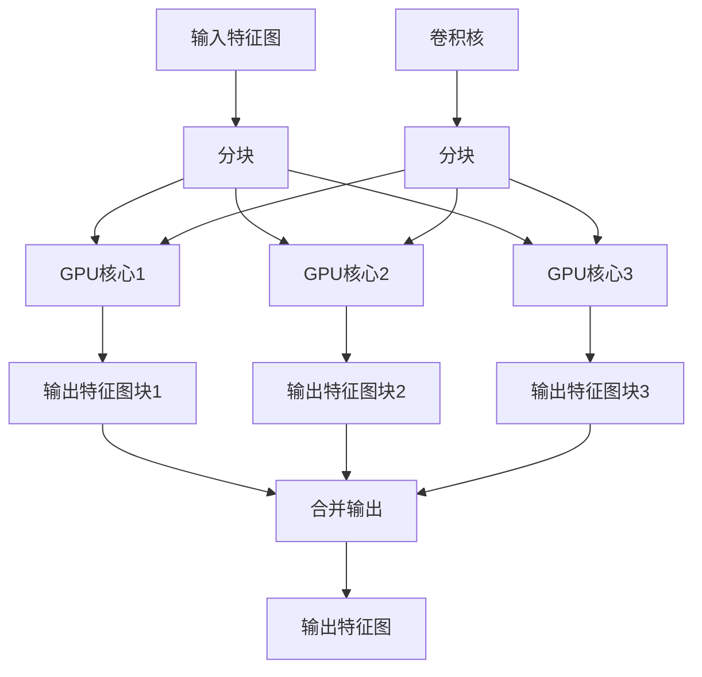

# 深度学习实验：GPU加速，突破性能瓶颈

## 1.背景介绍

随着深度学习模型变得越来越复杂和庞大，传统的CPU已经无法满足训练和推理的计算需求。GPU凭借其强大的并行计算能力和专门为矩阵运算优化的架构，成为了深度学习领域的核心加速器。本文将探讨如何利用GPU加速深度学习实验,突破性能瓶颈,提高模型训练和推理的效率。

## 2.核心概念与联系

### 2.1 GPU架构

GPU(图形处理器)最初是为了加速图形渲染而设计的,但由于其大规模并行计算能力,也被广泛应用于科学计算和深度学习等领域。GPU由数以千计的小核心组成,每个核心都是一个简单的流处理器,专门处理矢量和矩阵运算。

### 2.2 CUDA和cuDNN

CUDA(Compute Unified Device Architecture)是NVIDIA推出的一种并行计算平台和编程模型,允许开发人员直接利用GPU的并行计算能力。cuDNN(CUDA Deep Neural Network library)是一个GPU加速深度神经网络库,提供了常用的卷积、池化等操作的高性能实现。

### 2.3 深度学习框架GPU支持

主流的深度学习框架如TensorFlow、PyTorch、MXNet等,都提供了GPU加速支持。通过框架的GPU后端,可以自动将计算任务调度到GPU上执行,大大提高了训练和推理的速度。

## 3.核心算法原理具体操作步骤 

利用GPU加速深度学习实验的核心步骤如下:

1. **硬件准备**: 首先需要准备支持CUDA的NVIDIA GPU,并安装相应的驱动程序。

2. **软件环境配置**: 安装支持GPU的深度学习框架(如TensorFlow、PyTorch等),并配置GPU后端。

3. **数据准备**: 将训练数据加载到GPU显存中,避免CPU到GPU的数据传输瓶颈。

4. **模型构建**: 使用框架提供的GPU加速操作(如cuDNN卷积)构建模型。

5. **训练配置**: 设置合理的批量大小(batch size),以充分利用GPU的并行能力。

6. **模型训练**: 在GPU上启动模型训练过程,监控GPU利用率和内存使用情况。

7. **模型评估**: 在GPU上进行模型推理和评估,获取加速后的性能数据。

8. **结果分析**: 分析GPU加速前后的性能差异,优化训练过程。

## 4.数学模型和公式详细讲解举例说明

深度学习中的核心操作是卷积运算,我们以卷积层为例,说明GPU如何加速该操作。

卷积运算的数学表达式为:

$$
y_{i,j} = \sum_{m}\sum_{n}x_{m,n}w_{i-m,j-n}
$$

其中$x$是输入特征图,$w$是卷积核,$(i,j)$是输出特征图的位置。

在CPU上,卷积运算通常是逐点计算的,计算效率较低。而在GPU上,卷积运算可以被高度并行化,利用GPU的大量核心同时执行。具体来说,GPU将输入特征图和卷积核分块,每个GPU核心负责一个输出点的计算,从而实现大规模并行。此外,cuDNN库还提供了针对不同卷积核大小的高度优化的实现,进一步提升性能。

以$3\times 3$卷积核为例,GPU并行计算流程如下所示:



通过这种并行化策略,GPU可以充分发挥其强大的并行计算能力,从而大幅加速卷积运算。

## 5.项目实践:代码实例和详细解释说明

下面是一个使用PyTorch在GPU上训练LeNet-5模型的示例代码:

```python
import torch
import torchvision
import torchvision.transforms as transforms

# 设备配置
device = torch.device('cuda' if torch.cuda.is_available() else 'cpu')

# 数据准备
transform = transforms.Compose([transforms.ToTensor(), transforms.Normalize((0.5,), (0.5,))])
trainset = torchvision.datasets.MNIST(root='./data', train=True, download=True, transform=transform)
trainloader = torch.utils.data.DataLoader(trainset, batch_size=64, shuffle=True)

# 模型定义
import torch.nn as nn
import torch.nn.functional as F

class LeNet(nn.Module):
    def __init__(self):
        super(LeNet, self).__init__()
        self.conv1 = nn.Conv2d(1, 6, 5)
        self.conv2 = nn.Conv2d(6, 16, 5)
        self.fc1 = nn.Linear(16*5*5, 120)
        self.fc2 = nn.Linear(120, 84)
        self.fc3 = nn.Linear(84, 10)

    def forward(self, x):
        x = F.max_pool2d(F.relu(self.conv1(x)), 2)
        x = F.max_pool2d(F.relu(self.conv2(x)), 2)
        x = x.view(-1, 16*5*5)
        x = F.relu(self.fc1(x))
        x = F.relu(self.fc2(x))
        x = self.fc3(x)
        return x

model = LeNet().to(device)  # 将模型加载到GPU

# 训练配置
criterion = nn.CrossEntropyLoss()
optimizer = torch.optim.SGD(model.parameters(), lr=0.01)

# 训练循环
for epoch in range(10):
    running_loss = 0.0
    for i, data in enumerate(trainloader, 0):
        inputs, labels = data[0].to(device), data[1].to(device)  # 将数据加载到GPU
        optimizer.zero_grad()
        outputs = model(inputs)
        loss = criterion(outputs, labels)
        loss.backward()
        optimizer.step()
        running_loss += loss.item()
        if i % 100 == 99:
            print('[%d, %5d] loss: %.3f' % (epoch+1, i+1, running_loss/100))
            running_loss = 0.0

print('Training finished')
```

代码解释:

1. 首先配置设备,如果有可用的GPU,则使用GPU,否则使用CPU。
2. 准备MNIST数据集,并将其加载到PyTorch的`DataLoader`中。
3. 定义LeNet-5模型架构,使用PyTorch的`nn.Module`定义网络层。
4. 将模型加载到配置的设备(GPU或CPU)上。
5. 定义损失函数和优化器。
6. 进入训练循环,每个epoch遍历整个数据集。
7. 在每个batch开始时,将输入数据和标签加载到GPU上。
8. 在GPU上进行前向传播计算,计算损失,反向传播更新权重。
9. 每100个batch打印一次当前的损失值。

通过这个示例,我们可以看到如何在PyTorch中利用GPU加速深度学习模型的训练过程。只需将模型和数据加载到GPU上,PyTorch的GPU后端就会自动将计算任务调度到GPU上执行,从而充分利用GPU的并行计算能力。

## 6.实际应用场景

GPU加速技术在深度学习的各个领域都有广泛的应用,下面列举了一些典型场景:

1. **计算机视觉**: 目标检测、图像分类、语义分割等视觉任务,需要处理大量图像数据,对GPU加速有着巨大需求。

2. **自然语言处理**: 机器翻译、文本生成、情感分析等NLP任务,通常需要处理大量文本数据,GPU可以显著加快模型的训练和推理速度。

3. **推荐系统**: 个性化推荐、广告点击率预测等任务,需要处理海量用户数据和特征,GPU加速可以提高模型的实时性能。

4. **科学计算**: 天气预报、分子动力学模拟等科学计算领域,GPU可以加速大规模并行计算。

5. **金融分析**: 风险建模、算法交易等金融应用,GPU可以加速复杂的数学计算。

随着深度学习模型越来越复杂,GPU加速技术在各个领域的应用将变得越来越普遍和关键。

## 7.工具和资源推荐

1. **CUDA Toolkit**: NVIDIA官方提供的CUDA开发工具包,包含CUDA编译器、运行时库、调试工具等。

2. **cuDNN**: NVIDIA优化的深度神经网络库,提供常用层操作的高性能实现。

3. **TensorRT**: NVIDIA推出的深度学习推理优化库,可以进一步加速模型推理过程。

4. **NGC**: NVIDIA GPU云,提供预构建的GPU优化容器和模型。

5. **PyTorch**、**TensorFlow**等主流深度学习框架的GPU支持文档和示例。

6. **DALI**(Data Loading Library): NVIDIA提供的高性能数据加载库,可以加速数据预处理过程。

7. **Nsight Systems**、**Nsight Compute**: NVIDIA提供的GPU调试和性能分析工具。

## 8.总结:未来发展趋势与挑战

GPU加速已经成为深度学习领域的标配技术,但仍然面临一些挑战和发展趋势:

1. **硬件加速**: 除了GPU之外,专用的AI加速器(如TPU、昇腾AI处理器等)也在不断涌现,未来或将进一步提升深度学习的计算能力。

2. **分布式训练**: 针对超大规模模型,需要在多GPU或多节点之间进行分布式并行训练,提高训练效率。

3. **模型压缩**: 减小模型大小,降低内存占用,使模型能够部署在移动端和边缘设备上,同时保持较高的精度和性能。

4. **硬件资源调度**: 在云环境中,如何高效调度GPU等硬件资源,最大化利用率,降低训练成本,是一个值得关注的问题。

5. **能耗优化**: GPU等加速硬件的能耗较高,如何在保证性能的同时降低能耗,实现绿色计算,也是一个重要的发展方向。

总的来说,GPU加速技术为深度学习提供了强大的计算能力支持,但仍有许多优化空间,未来将会有更多创新突破,推动深度学习向更高更快的方向发展。

## 9.附录:常见问题与解答

1. **为什么要使用GPU加速深度学习?**

   CPU主要是为序列化的通用计算而设计,而深度学习中的大量矩阵和张量运算更适合在GPU的大规模并行架构上执行。GPU可以比CPU提供数十乃至数百倍的加速比,从而显著缩短训练时间,提高模型推理的实时性能。

2. **如何选择合适的GPU?**

   选择GPU时需要考虑多个因素,包括计算能力、内存大小、功耗、成本等。通常来说,对于大型模型或需要快速训练的任务,应选择计算能力更强、内存更大的高端GPU;而对于小型模型或推理任务,中低端GPU就足够了。

3. **GPU加速会影响模型的精度吗?**

   不会,GPU加速只是提供了更强大的计算能力,并不会影响模型本身的算法和精度。但是由于GPU使用的是单精度浮点数计算,在某些情况下可能会引入一些微小的数值误差,不过这通常可以忽略不计。

4. **如何监控和优化GPU的利用率?**

   可以使用NVIDIA提供的Nsight Systems等工具,实时监控GPU的利用率、内存占用、性能瓶颈等指标。根据这些指标,可以调整batch size、并行度等超参数,优化GPU的利用效率。

5. **GPU加速是否适用于所有深度学习任务?**

   GPU加速更适用于计算密集型的任务,如卷积神经网络、transformer模型等。而对于一些内存密集型的任务,如图神经网络、知识图谱embeddings等,GPU的加速效果可能会受到限制。因此,需要根据具体任务的特点,选择合适的硬件加速方案。

总之,GPU加速已经成为深度学习领域的标配技术,掌握GPU加速的原理和实践方法,对于提高模型训练和推理的效率至关重要。希望本文能够为您提供一些有价值的见解和指导。

作者:禅与计算机程序设计艺术 / Zen and the Art of Computer Programming