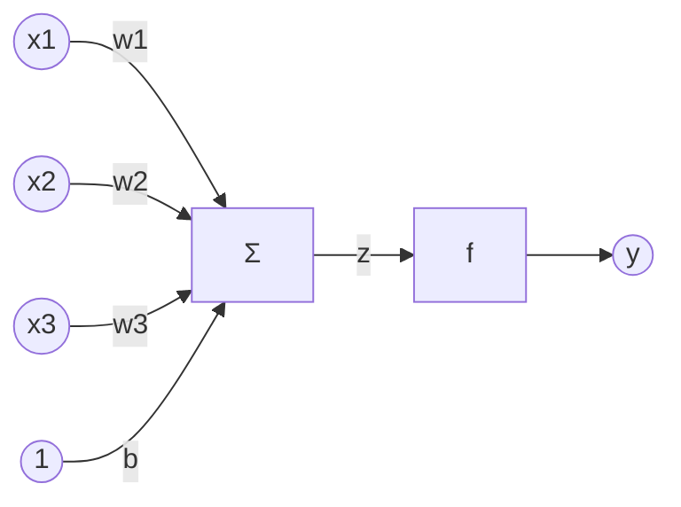
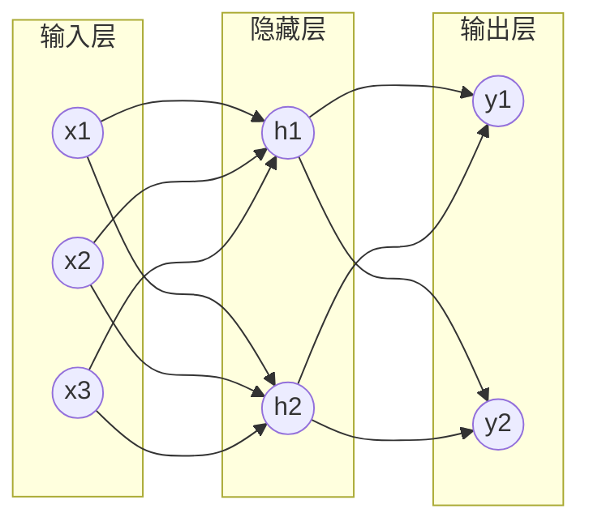

# 激活函数 (Activation Function) 原理与代码实例讲解

## 1. 背景介绍
### 1.1 人工神经网络概述
#### 1.1.1 人工神经元模型
#### 1.1.2 前馈神经网络
#### 1.1.3 反向传播算法
### 1.2 激活函数的作用与意义
#### 1.2.1 引入非线性
#### 1.2.2 模拟生物神经元的"激活"过程
#### 1.2.3 提高神经网络的表达能力

## 2. 核心概念与联系
### 2.1 激活函数的定义
### 2.2 激活函数的性质
#### 2.2.1 非线性
#### 2.2.2 可微性
#### 2.2.3 单调性
### 2.3 激活函数与神经网络的关系
#### 2.3.1 在前向传播中的作用
#### 2.3.2 在反向传播中的作用
#### 2.3.3 对网络性能的影响

## 3. 核心算法原理具体操作步骤
### 3.1 Sigmoid 函数
#### 3.1.1 数学定义
#### 3.1.2 导数计算
#### 3.1.3 优缺点分析
### 3.2 Tanh 函数 
#### 3.2.1 数学定义
#### 3.2.2 导数计算
#### 3.2.3 优缺点分析
### 3.3 ReLU 函数
#### 3.3.1 数学定义 
#### 3.3.2 导数计算
#### 3.3.3 优缺点分析
### 3.4 Leaky ReLU 函数
#### 3.4.1 数学定义
#### 3.4.2 导数计算 
#### 3.4.3 优缺点分析
### 3.5 其他激活函数
#### 3.5.1 ELU
#### 3.5.2 Swish
#### 3.5.3 GELU

## 4. 数学模型和公式详细讲解举例说明
### 4.1 Sigmoid 函数的数学模型与性质证明
### 4.2 Tanh 函数的数学模型与性质证明
### 4.3 ReLU 函数的数学模型与性质证明
### 4.4 Leaky ReLU 函数的数学模型与性质证明
### 4.5 激活函数选择的数学原理

## 5. 项目实践：代码实例和详细解释说明
### 5.1 使用 Numpy 实现各种激活函数
#### 5.1.1 Sigmoid
#### 5.1.2 Tanh
#### 5.1.3 ReLU
#### 5.1.4 Leaky ReLU
### 5.2 在 PyTorch 中使用内置的激活函数
#### 5.2.1 torch.nn.Sigmoid
#### 5.2.2 torch.nn.Tanh
#### 5.2.3 torch.nn.ReLU
#### 5.2.4 torch.nn.LeakyReLU
### 5.3 在 TensorFlow/Keras 中使用内置的激活函数 
#### 5.3.1 tf.nn.sigmoid
#### 5.3.2 tf.nn.tanh
#### 5.3.3 tf.nn.relu
#### 5.3.4 tf.nn.leaky_relu

## 6. 实际应用场景
### 6.1 图像分类任务中的激活函数选择
### 6.2 自然语言处理任务中的激活函数选择
### 6.3 生成对抗网络(GAN)中的激活函数选择
### 6.4 不同场景下激活函数的优化策略

## 7. 工具和资源推荐
### 7.1 常用深度学习框架
#### 7.1.1 PyTorch
#### 7.1.2 TensorFlow
#### 7.1.3 Keras
### 7.2 可视化工具
#### 7.2.1 TensorBoard
#### 7.2.2 Matplotlib
#### 7.2.3 Seaborn
### 7.3 相关论文与资源
#### 7.3.1 关于激活函数的经典论文
#### 7.3.2 在线课程与教程
#### 7.3.3 开源项目与代码库

## 8. 总结：未来发展趋势与挑战
### 8.1 激活函数的研究现状
### 8.2 自适应激活函数的探索
### 8.3 激活函数在新兴领域的应用
### 8.4 激活函数优化面临的挑战

## 9. 附录：常见问题与解答
### 9.1 如何选择适合的激活函数？
### 9.2 死亡 ReLU 问题如何解决？
### 9.3 激活函数的饱和问题如何缓解？
### 9.4 如何平衡激活函数的非线性与梯度消失问题？
### 9.5 激活函数对网络收敛速度的影响？

人工神经网络(Artificial Neural Network, ANN)是一种模仿生物神经网络(动物的中枢神经系统,特别是大脑)的结构和功能的数学模型或计算模型。神经网络由大量的人工神经元相互连接进行计算。大多数情况下人工神经网络能在外界信息的基础上改变内部结构,是一种自适应系统。

现代神经网络是一种非线性统计性数据建模工具。通常用来对输入和输出间复杂的关系进行建模,或用来探索数据的模式。使用的网络模型包括:前馈神经网络,径向基函数(RBF)网络,Hopfield网络,Kohonen自组织映射,学习矢量量化模型(LVQ)等。

人工神经元是神经网络的基本单元。如下图所示,一个人工神经元通常由输入,权重,偏置,求和单元,激活函数和输出组成。输入 $x_i$ 先乘以对应的权重 $w_i$,再把所有加权输入相加,得到求和值 $z$。激活函数 $f$ 接收 $z$ 并产生神经元的输出 $y$。偏置项 $b$ 可以看作是一个输入恒为1的"哑"神经元,它所连接的权重。

前馈神经网络(Feedforward Neural Network)是一种最常见的人工神经网络结构。信息在网络中从输入层经隐藏层传递到输出层,网络中没有反馈连接。下图为一个简单的三层前馈神经网络示意图:

反向传播(Backpropagation)是训练多层前馈神经网络的一种方法。该算法使用梯度下降法最小化网络的损失函数。反向传播主要包括两个阶段:前向传播和反向传播。在前向传播阶段,输入信号从输入层经隐藏层传递到输出层,产生实际输出。在反向传播阶段,将实际输出与期望输出比较,计算输出层的误差,然后将误差逐层反向传播,同时更新各层的权重和偏置,使网络输出尽可能接近期望输出。

激活函数在人工神经网络中起着至关重要的作用。它引入了非线性,使神经网络能够学习和表示复杂的非线性关系。没有激活函数,神经网络将仅仅是一个线性组合,无法学习非线性决策边界。此外,激活函数还模拟了生物神经元的"激活"过程。当神经元的输入超过某个阈值时,它就会被激活并向其他神经元传递信号。合适的激活函数可以提高神经网络的表达能力,加速训练过程。

激活函数 $f(z)$ 将神经元的加权输入 $z$ 映射为输出信号 $y$。数学上,激活函数通常要求满足以下性质:

1. 非线性:激活函数必须是非线性的,否则多层网络等价于单层网络。
2. 可微性:为了能够使用梯度下降法训练网络,激活函数必须是可微的(几乎处处可微)。
3. 单调性:单调的激活函数使网络更容易训练,梯度下降更稳定。

在前向传播过程中,激活函数将各层神经元的加权输入转化为输出信号,使网络能够逼近复杂的非线性函数。在反向传播过程中,激活函数的导数参与梯度的计算,影响网络权重的更新。激活函数的选择直接影响网络的性能,包括收敛速度,泛化能力等。

常见的激活函数包括Sigmoid函数,双曲正切(Tanh)函数,修正线性单元(ReLU)函数等。下面我们将详细讨论它们的数学定义,导数计算以及优缺点。

Sigmoid函数是一种常用的激活函数,其数学定义为:

$$f(z) = \frac{1}{1+e^{-z}}$$

其导数为:

$$f'(z) = f(z)(1-f(z))$$

Sigmoid函数将实数映射到(0,1)区间内,具有良好的解释性。但是,它容易出现梯度消失问题,导致深层网络难以训练。此外,Sigmoid函数的输出不是以0为中心的,这会降低权重更新的效率。

Tanh函数可以看作是Sigmoid函数的平移和伸缩版本,其数学定义为:

$$f(z) = \frac{e^z - e^{-z}}{e^z + e^{-z}}$$

其导数为:

$$f'(z) = 1 - f(z)^2$$

Tanh函数将实数映射到(-1,1)区间内,输出以0为中心。与Sigmoid函数类似,Tanh函数也存在梯度消失问题。

ReLU函数是目前最流行的激活函数之一,其数学定义为:

$$f(z) = \max(0, z)$$

其导数为:

$$
f'(z) = 
\begin{cases}
1, & z > 0 \\
0, & z \leq 0
\end{cases}
$$

ReLU函数计算简单,能够缓解梯度消失问题,加速网络收敛。但是,ReLU函数存在"死亡ReLU"现象,即某些神经元可能永远不会被激活,导致参数无法更新。

Leaky ReLU函数是对ReLU函数的改进,其数学定义为:

$$
f(z) =
\begin{cases} 
z, & z > 0 \\
\alpha z, & z \leq 0
\end{cases}
$$

其中 $\alpha$ 是一个很小的正数,如0.01。其导数为:

$$
f'(z) = 
\begin{cases}
1, & z > 0 \\
\alpha, & z \leq 0
\end{cases}
$$

Leaky ReLU函数在 $z \leq 0$ 时给出一个小的负斜率,缓解了"死亡ReLU"问题。但是,Leaky ReLU函数的超参数 $\alpha$ 需要手动设置。

除了以上常见的激活函数,还有一些其他的激活函数,如ELU(Exponential Linear Unit),Swish,GELU(Gaussian Error Linear Unit)等。它们在某些特定任务中表现出优于传统激活函数的性能。

下面我们通过数学推导来证明Sigmoid函数的一些性质。Sigmoid函数 $f(z) = \frac{1}{1+e^{-z}}$ 满足:

1. 值域为(0,1):

$$
\lim_{z \to -\infty} f(z) = \lim_{z \to -\infty} \frac{1}{1+e^{-z}} = 0 \\
\lim_{z \to +\infty} f(z) = \lim_{z \to +\infty} \frac{1}{1+e^{-z}} = 1
$$

2. 以0.5为中心对称:

$$
f(-z) = \frac{1}{1+e^z} = 1 - \frac{1}{1+e^{-z}} = 1 - f(z)
$$

3. 导数为 $f'(z) = f(z)(1-f(z))$:

$$
\begin{aligned}
f'(z) &= \frac{d}{dz} \frac{1}{1+e^{-z}} \\
      &= \frac