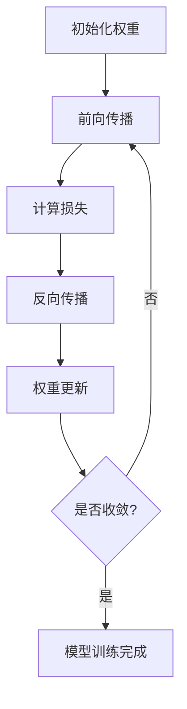

# 精确率与深度学习：探索神经网络潜力

## 1. 背景介绍

### 1.1 人工智能的兴起

人工智能(AI)已经成为当代科技发展的核心驱动力之一。从语音识别到自动驾驶,从医疗诊断到金融分析,AI系统正在渗透到我们生活的方方面面。在AI的多个分支中,深度学习(Deep Learning)凭借其强大的数据处理能力和模式识别能力,成为了最受关注的领域之一。

### 1.2 深度学习的重要性

深度学习是一种基于人工神经网络的机器学习技术,它能够从大量数据中自主学习特征表示,并对复杂模式进行建模和预测。与传统的机器学习算法相比,深度学习具有更强的泛化能力和适应性,可以处理高维、非线性和多变量数据。因此,深度学习已广泛应用于计算机视觉、自然语言处理、语音识别等领域,推动了这些领域的飞速发展。

### 1.3 精确率的重要性

尽管深度学习取得了巨大的成功,但提高模型的精确率(Accuracy)仍然是一个持续的挑战。精确率是衡量模型预测能力的关键指标之一,它直接影响着模型在实际应用中的可靠性和有效性。高精确率不仅可以提高模型的预测准确性,还能增强用户对模型输出的信任度,从而推动AI系统在更多领域的应用和落地。

## 2. 核心概念与联系

### 2.1 神经网络基础

神经网络是深度学习的核心,它是一种受生物神经系统启发而设计的计算模型。神经网络由多层节点(神经元)组成,每层节点通过加权连接与下一层相连。输入数据经过多层非线性变换,最终在输出层产生预测结果。


### 2.2 深度学习模型

深度学习模型是一种特殊的神经网络,它具有多个隐藏层,可以学习数据的高阶特征表示。常见的深度学习模型包括:

- 卷积神经网络(CNN): 擅长处理图像和视频数据。
- 循环神经网络(RNN): 擅长处理序列数据,如自然语言和时间序列。
- 长短期记忆网络(LSTM): 是RNN的一种变体,能够更好地捕捉长期依赖关系。
- transformer: 基于自注意力机制的模型,在自然语言处理领域取得了巨大成功。

### 2.3 精确率与泛化能力

精确率是衡量模型在测试数据集上的预测准确度。一个好的深度学习模型不仅需要在训练数据上表现良好,还需要具备良好的泛化能力,即在看不见的新数据上也能保持较高的精确率。

泛化能力与模型的复杂度、训练数据的质量和量、正则化技术等因素密切相关。提高模型精确率的关键在于平衡模型复杂度和泛化能力,避免过拟合和欠拟合。

## 3. 核心算法原理具体操作步骤

### 3.1 训练神经网络

训练神经网络的核心是通过优化算法(如梯度下降)调整网络权重,使模型在训练数据上的损失函数(如交叉熵)最小化。具体步骤如下:

1. 初始化网络权重
2. 前向传播:输入数据经过多层变换,产生预测输出
3. 计算损失:将预测输出与真实标签进行比较,计算损失函数值
4. 反向传播:根据链式法则,计算每个权重相对于损失的梯度
5. 权重更新:根据梯度下降法则,更新网络权重
6. 重复2-5,直至收敛或达到最大迭代次数



### 3.2 正则化技术

为了提高模型的泛化能力,防止过拟合,通常需要采用正则化技术,包括:

- 权重衰减(L1/L2正则化):在损失函数中加入权重范数的惩罚项,使权重值趋向于较小。
- Dropout: 在训练时随机丢弃部分神经元,避免神经元之间的过度协调。
- 批量归一化(Batch Normalization): 对每一层的输入进行归一化,加速收敛并提高泛化能力。
- 数据增强(Data Augmentation): 通过各种变换(翻转、旋转等)生成更多训练数据,增加数据多样性。

### 3.3 模型集成

模型集成是另一种提高精确率的有效方法。常见的集成技术包括:

- Bagging: 通过自助采样生成多个数据子集,分别训练基学习器,最后将它们的预测结果进行平均或投票。
- Boosting: 基于加权重采样的方式训练基学习器的序列,每一轮都加大上一轮错误样本的权重,从而使后续的学习器能够更好地预测这些难以预测的样本。
- 堆叠generalizer: 将多个基学习器的预测结果作为新的特征输入,训练一个generalizer模型进行最终预测。

## 4. 数学模型和公式详细讲解举例说明

### 4.1 损失函数

损失函数用于衡量模型预测与真实标签之间的差异。常见的损失函数包括:

- 均方误差(MSE): $\text{MSE}(y, \hat{y}) = \frac{1}{n}\sum_{i=1}^{n}(y_i - \hat{y}_i)^2$
- 交叉熵(Cross-Entropy): $\text{CE}(y, \hat{y}) = -\sum_{i=1}^{n}y_i\log(\hat{y}_i)$

其中 $y$ 表示真实标签, $\hat{y}$ 表示模型预测值, $n$ 表示样本数量。

### 4.2 优化算法

优化算法用于最小化损失函数,常见的优化算法包括:

- 梯度下降(Gradient Descent): $\theta_{t+1} = \theta_t - \eta \nabla_\theta J(\theta_t)$
- 动量优化(Momentum): $v_{t+1} = \gamma v_t + \eta\nabla_\theta J(\theta_t)$
  $\theta_{t+1} = \theta_t - v_{t+1}$
- RMSProp: $E[g^2]_{t+1} = 0.9E[g^2]_t + 0.1(g_t)^2$
  $\theta_{t+1} = \theta_t - \frac{\eta}{\sqrt{E[g^2]_{t+1} + \epsilon}}g_t$

其中 $\theta$ 表示模型参数, $\eta$ 表示学习率, $J(\theta)$ 表示损失函数, $v_t$ 表示动量项, $E[g^2]_t$ 表示梯度平方的指数加权移动平均值。

### 4.3 激活函数

激活函数引入非线性,使神经网络能够拟合更加复杂的函数。常见的激活函数包括:

- Sigmoid: $\sigma(x) = \frac{1}{1 + e^{-x}}$
- tanh: $\tanh(x) = \frac{e^x - e^{-x}}{e^x + e^{-x}}$
- ReLU: $\text{ReLU}(x) = \max(0, x)$

其中 $x$ 表示神经元的加权输入。ReLU函数由于计算简单且避免了梯度消失问题,在深度神经网络中被广泛使用。

## 5. 项目实践: 代码实例和详细解释说明

为了帮助读者更好地理解深度学习模型的实现,我们将使用Python和PyTorch框架,构建一个用于手写数字识别的卷积神经网络(CNN)模型。

### 5.1 导入必要的库

```python
import torch
import torch.nn as nn
import torch.optim as optim
from torchvision import datasets, transforms
```

### 5.2 定义CNN模型

```python
class CNN(nn.Module):
    def __init__(self):
        super(CNN, self).__init__()
        self.conv1 = nn.Conv2d(1, 32, 3, 1)
        self.conv2 = nn.Conv2d(32, 64, 3, 1)
        self.dropout1 = nn.Dropout2d(0.25)
        self.dropout2 = nn.Dropout2d(0.5)
        self.fc1 = nn.Linear(9216, 128)
        self.fc2 = nn.Linear(128, 10)

    def forward(self, x):
        x = self.conv1(x)
        x = nn.functional.relu(x)
        x = self.conv2(x)
        x = nn.functional.relu(x)
        x = nn.functional.max_pool2d(x, 2)
        x = self.dropout1(x)
        x = torch.flatten(x, 1)
        x = self.fc1(x)
        x = nn.functional.relu(x)
        x = self.dropout2(x)
        x = self.fc2(x)
        output = nn.functional.log_softmax(x, dim=1)
        return output
```

该CNN模型包含两个卷积层、两个全连接层和两个dropout层。`forward`函数定义了模型的前向传播过程。

### 5.3 加载数据集

```python
train_loader = torch.utils.data.DataLoader(
    datasets.MNIST('../data', train=True, download=True,
                   transform=transforms.Compose([
                       transforms.ToTensor(),
                       transforms.Normalize((0.1307,), (0.3081,))
                   ])),
    batch_size=64, shuffle=True)

test_loader = torch.utils.data.DataLoader(
    datasets.MNIST('../data', train=False, transform=transforms.Compose([
                       transforms.ToTensor(),
                       transforms.Normalize((0.1307,), (0.3081,))
                   ])),
    batch_size=1000, shuffle=True)
```

我们使用PyTorch内置的MNIST数据集,并对数据进行了标准化处理。

### 5.4 训练模型

```python
model = CNN()
optimizer = optim.Adam(model.parameters())
criterion = nn.NLLLoss()

for epoch in range(10):
    train_loss = 0.0
    for data, target in train_loader:
        optimizer.zero_grad()
        output = model(data)
        loss = criterion(output, target)
        loss.backward()
        optimizer.step()
        train_loss += loss.item()
    print(f'Epoch: {epoch+1}, Loss: {train_loss/len(train_loader)}')
```

我们定义了损失函数(NLLLoss)和优化器(Adam),并在训练循环中进行前向传播、反向传播和权重更新。每个epoch结束后,打印当前epoch的平均损失值。

### 5.5 评估模型

```python
correct = 0
total = 0
with torch.no_grad():
    for data in test_loader:
        images, labels = data
        outputs = model(images)
        _, predicted = torch.max(outputs.data, 1)
        total += labels.size(0)
        correct += (predicted == labels).sum().item()

print(f'Accuracy on test set: {100 * correct / total}%')
```

在测试集上评估模型的精确率,我们将模型设置为评估模式(`torch.no_grad()`)以加速计算。对于每个测试样本,我们获取模型的预测输出,并与真实标签进行比较,统计正确预测的数量。最后,计算并打印测试集上的精确率。

通过这个实例,读者可以更好地理解深度学习模型的构建、训练和评估过程。

## 6. 实际应用场景

深度学习在许多领域都取得了卓越的应用成果,下面列举了一些典型的应用场景:

### 6.1 计算机视觉

- 图像分类: 基于CNN的模型可以对图像进行分类,如识别图像中的物体、场景等。
- 目标检测: 在图像或视频中定位并识别特定目标的位置和类别。
- 语义分割: 对图像中的每个像素进行分类,将图像分割成不同的语义区域。
- 风格迁移: 将一幅图像的风格迁移到另一幅图像上,产生具有特定风格的新图像。

### 6.2 自然语言处理

- 机器翻译: 将一种自然语言翻译成另一种自然语言。
- 文本生成: 根据给定的上下文,生成连贯、流畅的自然语言文本。
- 情感分析: 分析文本中所表达的情感倾向,如正面、负面或