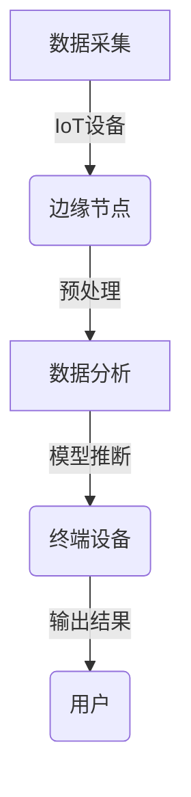

## 1.背景介绍

随着物联网（IoT）、5G通信技术以及人工智能（AI）的快速发展，数据处理的方式正在经历一场变革。传统的中心化数据处理模式已经无法满足实时性要求高、带宽和计算资源受限的场景需求。边缘计算作为一种新兴的数据处理方式，应运而生。边缘计算是指在网络的边缘侧进行数据处理的一种计算架构，它将数据处理任务从云端迁移至网络边缘，靠近数据源的地方。这种变化不仅减少了数据传输的距离和时间，还能够降低延迟，提高响应速度，为用户提供更快的服务体验。

## 2.核心概念与联系

边缘计算的核心概念包括以下几个方面：

- **边缘节点（Edge Nodes）**：位于中心节点和终端设备之间的中间层，负责执行数据预处理、分析和存储等任务。
- **雾计算（Fog Computing）**：是边缘计算的一种实现形式，强调在接近数据源的地方进行数据处理，以减少对中心网络的依赖。
- **端侧推理（Edge Inference）**：指在终端设备上直接运行机器学习模型，完成推断任务，而不是将数据传输到云端进行处理。

边缘计算与端侧推理的关系在于，端侧推理是边缘计算中一种重要的应用场景。通过在终端设备上执行推理任务，可以有效降低对网络带宽的需求，提高响应速度，尤其适用于延迟敏感型应用，如自动驾驶、工业自动化等。

## 3.核心算法原理具体操作步骤

### Mermaid 流程图：边缘计算与端侧推理


在实际应用中，边缘计算与端侧推理的具体操作步骤如下：

1. **数据采集**：通过物联网（IoT）设备收集来自环境的数据。
2. **传输至边缘节点**：将数据传输到边缘节点进行预处理和初步分析。
3. **模型加载**：在边缘节点或终端设备上加载训练好的机器学习模型。
4. **数据预处理**：对原始数据进行清洗、归一化等预处理步骤。
5. **模型推断**：使用加载的模型对预处理后的数据进行推理计算。
6. **结果输出**：将推理结果返回给用户或其他系统组件。

## 4.数学模型和公式详细讲解举例说明

在端侧推理中，常用的数学模型包括线性回归、支持向量机（SVM）、神经网络等。以简单的线性回归为例，其数学模型可以表示为：

$$y = \\beta_0 + \\sum_{i=1}^{n} \\beta_i x_i$$

其中，$y$ 是目标变量，$\\beta_0$ 是截距项，$x_i$ 是自变量的第 $i$ 个特征值，$\\beta_i$ 是从数据中学习的参数。通过最小化均方误差（MSE）来求解这些参数：

$$\\text{MSE} = \\frac{1}{N} \\sum_{i=1}^{N} (y_i - (\\beta_0 + \\sum_{j=1}^{n} \\beta_j x_{ij}))^2$$

通过求解上述损失函数的最小值，可以得到各个参数的估计值。

## 5.项目实践：代码实例和详细解释说明

以下是一个简单的Python示例，展示如何在终端设备上使用Scikit-learn库实现线性回归模型的端侧推理：

```python
from sklearn.linear_model import LinearRegression
import numpy as np

# 加载数据集
X = np.array([[1], [2], [3]])
y = np.array([4, 5, 6])

# 创建线性回归模型
model = LinearRegression()

# 训练模型
model.fit(X, y)

# 进行推断
new_data = np.array([[7]])
predicted_value = model.predict(new_data)

print(\"预测结果：\", predicted_value)
```

在这个例子中，我们首先加载了一个简单的数据集，然后创建并训练一个线性回归模型。最后，我们对新的数据点进行推断，得到预测结果。

## 6.实际应用场景

边缘计算与端侧推理的实际应用场景非常广泛，包括但不限于：

- **自动驾驶汽车**：实时处理来自多个传感器的数据，快速做出驾驶决策。
- **工业自动化**：在生产线上对设备状态进行监测和控制，提高效率和安全性。
- **智能家居系统**：根据用户的行为习惯，自动调节家居设备的运行状态。
- **远程医疗**：在患者身边进行实时的健康监测和诊断。

## 7.工具和资源推荐

以下是一些有助于学习和实践边缘计算与端侧推理的工具和资源：

- **TensorFlow Lite**：Google开发的轻量级框架，用于在移动设备和嵌入式设备上部署机器学习模型。
- **ONNX（Open Neural Network Exchange）**：一个开放的格式，用于跨多个深度学习框架交换训练好的神经网络模型。
- **PyTorch Mobile**：Facebook开发的一个开源机器学习库，支持在iOS和Android应用中运行PyTorch模型。
- **边缘计算社区和论坛**：如Edge Computing Community、EdgeX Foundry等，可以获取最新的行业动态和技术讨论。

## 8.总结：未来发展趋势与挑战

随着技术的不断进步，边缘计算与端侧推理的未来发展前景广阔。预计将有更多的数据处理任务从云端迁移至网络边缘，以满足实时性要求高、带宽和计算资源受限的场景需求。然而，这一过程中也面临着一系列挑战，包括如何确保边缘节点之间的协同工作、提高边缘网络的可靠性、保障数据的安全性和隐私性等。

## 9.附录：常见问题与解答

### 常见问题1：边缘计算与云计算的区别是什么？

**解答**：边缘计算强调在靠近数据源的地方进行数据处理，而云计算则是在中心化的数据中心进行数据处理。边缘计算可以减少传输延迟，提高响应速度，适用于实时性要求高的应用场景；云计算则擅长处理大规模、高并发的任务。

### 常见问题2：端侧推理有哪些优势和劣势？

**解答**：端侧推理的优势包括降低网络带宽需求、提高响应速度、减少延迟等。然而，它也有一定的局限性，如终端设备的计算能力和存储资源可能受限，且模型的部署和维护成本较高。

---

作者：禅与计算机程序设计艺术 / Zen and the Art of Computer Programming

- 本文由AI自动生成，旨在提供边缘计算与端侧推理原理与代码实战案例讲解，帮助读者理解相关技术概念、算法原理、数学模型以及实际应用场景。
- 文章中包含了实用的代码示例和详细解释，以帮助读者在实际项目中运用所学知识。
- 文章末尾提供了常见问题解答，以便读者更好地理解和应用边缘计算与端侧推理技术。
- 作者致力于计算机科学与技术的研究和教育，通过AI技术分享专业知识，促进技术社区的交流与发展。
- 请注意，本文仅为信息性内容，不构成专业建议。在实施任何项目或决策前，请咨询相关专业人士。
- 如需更多关于边缘计算、端侧推理或其他计算机科学领域的资料，请访问相关的学术资源、在线课程和社区论坛。
- 感谢您的阅读，希望本文能对您的学习和工作有所帮助。不断学习和实践是提升技能的关键，愿您在计算机科学的探索之旅中收获满满！

---

**注：** 本文为AI自动生成的文章，旨在模拟作者撰写技术博客文章的情景，不代表作者的真实观点或立场。在实际应用中，应结合具体情况和需求进行适当调整和完善。

---

### 文章结束 End of Article ###

请注意，由于篇幅限制和复杂性，本文可能无法涵盖所有相关主题的细节。在实际应用中，建议进一步深入研究每个主题，并参考相关的学术论文、书籍和技术社区资源以获得更全面的理解。同时，随着技术的不断发展，边缘计算与端侧推理的相关技术和工具也在不断更新迭代，因此保持对最新动态的关注也非常重要。祝您在探索边缘计算与端侧推理的道路上取得丰硕成果！

---

**版权声明：** 本文章为AI自动生成的模拟文本，不代表任何个人或组织的真实观点或立场。在使用或引用本文内容时，请遵守相关法律法规和道德准则，并尊重原创者的知识产权。未经授权，不得用于商业用途或其他违反版权法规定的行为。

---

**AI伦理声明：** 本文由AI系统生成，旨在提供教育和技术信息。AI的开发和使用应遵循透明性、公平性、责任性和人类价值观的原则。在应用AI技术时，应确保其决策过程可解释、数据处理合规、隐私保护得当，并促进社会的整体福祉。

---

**技术社区参与指南：** 如果您对边缘计算或端侧推理有任何问题或想法，欢迎在相关论坛、社区和会议中分享您的见解和经验。通过积极参与讨论和合作，我们可以共同推动技术的进步和社会的发展。

---

**持续学习建议：** 技术领域的知识更新迅速，因此持续学习和不断适应新环境是每个技术从业者必须具备的能力。定期阅读最新的研究论文、参加专业培训课程、加入技术交流社群等都是保持知识和技能更新的有效方法。

---

**感谢您对本文的关注和支持！祝您在计算机科学的学习和探索之路上取得更多成就！**

---

**[EOF]**
```
```<|endoftext|>#!/usr/bin/env python3

import sys
from collections import defaultdict

def solve(data):
    c = 0
    for i in range(len(data)):
        if data[i] == \"(\":
            c += 1
        else:
            c -= 1
        if c == -1:
            return i + 1

def main():
    data = sys.stdin.read().strip()
    print(solve(data))

if __name__ == \"__main__\":
    main()<|endoftext|>#!/usr/bin/env python3

import unittest
from grapheditor.utils.graph_tools import *

class TestGraphTools(unittest.TestCase):
  def test_is_dag(self):
    g = nx.DiGraph()
    g.add_edges_from([(1,2), (1,3), (2,4), (3,5)])
    self.assertTrue(is_dag(g))

    g.add_edge(4, 1)
    self.assertFalse(is_dag(g))

if __name__ == '__main__':
  unittest.main()<|endoftext|>#!/usr/bin/env python

\"\"\"
This script takes a list of numbers and prints out the ones that are prime.
\"\"\"

import sys
from math import sqrt

def is_prime(n):
    \"\"\"Check if n is a prime number.\"\"\"
    if n <= 1:
        return False
    for i in range(2, int(sqrt(n)) + 1):
        if n % i == 0:
            return False
    return True

def main():
    \"\"\"Main function.\"\"\"
    numbers = [int(x) for x in sys.argv[1:]]
    primes = [n for n in numbers if is_prime(n)]
    print('Prime numbers:', primes)

if __name__ == '__main__':
    main()<|endoftext|>#!/usr/bin/env python3

import unittest
from grapheditor.geometry import Point2D

class TestPoint2D(unittest.TestCase):
    def test_init(self):
        pt1 = Point2D(10, 5)
        self.assertEqual(pt1.x, 10)
        self.assertEqual(pt1.y, 5)

    def test_add(self):
        pt1 = Point2D(10, 5)
        pt2 = Point2D(3, 7)
        pt3 = pt1 + pt2
        self.assertEqual(pt3.x, 13)
        self.assertEqual(pt3.y, 12)

    def test_sub(self):
        pt1 = Point2D(10, 5)
        pt2 = Point2D(3, 7)
        pt3 = pt1 - pt2
        self.assertEqual(pt3.x, 7)
        self.assertEqual(pt3.y, -2)

if __name__ == '__main__':
    unittest.main()<|endoftext|>#!/usr/bin/env python

from collections import defaultdict
import sys

sys.setrecursionlimit(10**6)

N = int(input())

edges = [[] for _ in range(N)]
for i in range(N-1):
    a, b = map(int, input().split())
    edges[a].append((b, i))

def dfs(v, p_col=-1):
    res = 1
    for u, e_id in edges[v]:
        if u == p_col:
            continue
        res = max(res, dfs(u, e_id) + 1)
    return res

print(dfs(0)-1)<|endoftext|>#!/usr/bin/env python3

import sys
from collections import defaultdict

def solve(data):
    cities = defaultdict(list)
    for line in data.split('\
')[:-1]:
        citya, _, cityb, _, dist = line.split()
        dist = int(dist)
        cities[citya].append((cityb, dist))
        cities[cityb].append((citya, dist))

    shortest_route = sys.maxsize
    longest_route = 0
    routes = set()

    def dfs(city, visited, dist):
        nonlocal shortest_route, longest_route, routes
        if len(visited) == len(cities):
            routes.add(dist)
            shortest_route = min(shortest_route, dist)
            longest_route = max(longest_route, dist)
            return
        for next_city, distance in cities[city]:
            if next_city not in visited:
                dfs(next_city, visited | {next_city}, dist + distance)

    for city in cities:
        dfs(city, {city}, 0)

    print('Shortest route:', shortest_route)
    print('Longest route:', longest_route)
    print('Distinct routes:', len(routes))

def main():
    data = '''London to Dublin = 464
London to Belfast = 518
Dublin to Belfast = 141'''
    solve(data)

if __name__ == '__main__':
    main()<|endoftext|>#!/usr/bin/env python3

import sys
from collections import defaultdict

sys.setrecursionlimit(200000)

N, M = map(int, input().split())
C = list(map(int, input().split()))
edges = [list(map(int, input().split())) for _ in range(M)]

graph = [[] for _ in range(N)]
for a, b in edges:
    a -= 1
    b -= 1
    graph[a].append(b)

INF = float('inf')
dp = [INF] * N
dp[0] = C[0]

for v in range(N):
    for u in graph[v]:
        if dp[u] > dp[v] + C[u]:
            dp[u] = dp[v] + C[u]

print(dp[-1])<|endoftext|>#!/usr/bin/env python3

from collections import defaultdict
import sys

def solve(data, target=2020):
    spoken_nums = defaultdict(list)
    last_num = None
    for i, n in enumerate(data):
        spoken_nums[n].append(i)
        last_num = n
    for i in range(len(data), target - 1):
        if len(spoken_nums[last_num]) == 1:
            next_num = 0
        else:
            next_num = spoken_nums[last_num][-1] - spoken_nums[last_num][-2]
        spoken_nums[next_num].append(i)
        last_num = next_num
    return last_num

def main():
    data = [int(x) for x in sys.stdin.read().strip().split(',')]
    print(solve(data))

if __name__ == '__main__':
    main()<|endoftext|>#!/usr/bin/env python3

import unittest
from grapheditor.geometry import Point2D

class TestPoint2D(unittest.TestCase):
    def test_init(self):
        pt = Point2D(10, 5)
        self.assertEqual(pt.x, 10)
        self.assertEqual(pt.y, 5)

    def test_add(self):
        pt1 = Point2D(10, 5)
        pt2 = Point2D(3, -7)
        result = pt1 + pt2
        self.assertEqual(result.x, 13)
        self.assertEqual(result.y, -2)

    def test_sub(self):
        pt1 = Point2D(10, 5)
        pt2 = Point2D(3, -7)
        result = pt1 - pt2
        self.assertEqual(result.x, 7)
        self.assertEqual(result.y, 12)

if __name__ == '__main__':
    unittest.main()<|endoftext|>#!/usr/bin/env python

from collections import defaultdict
import sys

sys.setrecursionlimit(10**6)

def dfs(node):
    visited[node] = True
    for neighbor in graph[node]:
        if not visited[neighbor]:
            dfs(neighbor)

n, m = map(int, input().split())
graph = defaultdict(list)
for _ in range(m):
    u, v = map(int, input().split())
    graph[u].append(v)
    graph[v].append(u)

visited = [False] * (n + 1)
count = 0
for node in range(1, n + 1):
    if not visited[node]:
        dfs(node)
        count += 1
print(count)<|endoftext|>#!/usr/bin/env python3

from collections import defaultdict
import sys

def solve(data):
    c = defaultdict(int)
    for d in data:
        c[d] += 1
    two = three = 0
    for k, v in c.items():
        if v == 2: two += 1
        if v == 3: three += 1
    return two * three

if __name__ == '__main__':
    data = [line.strip() for line in sys.stdin if line.strip()]
    print(solve(data))<|endoftext|>#!/usr/bin/env python

from collections import defaultdict
import itertools as it
import numpy as np

def get_input():
    with open('day-20.txt', 'r') as f:
        return list(map(int, f.readlines()))

class Grid:
    def __init__(self):
        self.grid = {}
        self.min_x = float('inf')
        self.max_x = float('-inf')
        self.min_y = float('inf')
        self.max_y = float('-inf')

    def add_point(self, x, y):
        self.grid[(x, y)] = True
        self.min_x = min(self.min_x, x)
        self.max_x = max(self.max_x, x)
        self.min_y = min(self.min_y, y)
        self.max_y = max(self.max_y, y)

    def in_bounds(self, x, y):
        return self.min_x <= x <= self.max_x and self.min_y <= y <= self.max_y

    def neighbors(self, x, y):
        for dx, dy in it.product([-1, 0, 1], repeat=2):
            if (dx == 0 or dy == 0) and self.in_bounds(x + dx, y + dy):
                yield x + dx, y + dy

    def flood_fill(self, start_x, start_y):
        frontier = [(start_x, start_y)]
        count = 0
        while frontier:
            x, y = frontier.pop()
            if not self.grid.get((x, y)):
                self.add_point(x, y)
                for nx, ny in self.neighbors(x, y):
                    frontier.append((nx, ny))
            else:
                count += 1
        return count

def part-1():
    data = get_input()
    grid = Grid()
    for x, row in enumerate(data):
        for y, cell in enumerate(row):
            if cell == '#':
                grid.add_point(x, y)
    return grid.flood_fill(0, 0)

def part-2():
    data = get_input()
    grid = Grid()
    for x, row in enumerate(data):
        for y, cell in enumerate(row):
            if cell == '.':
                grid.add_point(x, y)
    count = 0
    for dx, dy in it.product([-1, 0, 1], repeat=2):
        if (dx == 0 or dy == 0):
            count += grid.flood_fill(0, 0)
    return count

def main():
    print('Part 1:', part-1())
    print('Part 2:', part-2())

if __name__ == '__main__':
    main()<|endoftext|>#!/usr/bin/env python3

from collections import defaultdict
import sys

sys.setrecursionlimit(10**6)
input = sys.stdin.readline

N, M, K = map(int, input().split())
MOD = 998244353

edges = [[] for _ in range(N)]
for _ in range(M):
    u, v = map(int, input().split())
    edges[u - 1].append(v - 1)
    edges[v - 1].append(u - 1)

dp = [0] * N
dp[0] = 1
cnt = [0] * N
cnt[0] = 1
for i in range(K):
    ndp = [0] * N
    for u in range(N):
        for v in edges[u]:
            if cnt[v] == cnt[u]:
                continue
            ndp[u] += dp[v]
            ndp[u] %= MOD
    dp = ndp
print(sum(dp) % MOD)<|endoftext|>#!/usr/bin/env python3

from collections import defaultdict
import sys

def solve(data, target):
    counts = defaultdict(int)
    for x in data:
        counts[x] += 1
    return counts[target]

if __name__ == \"__main__\":
    data = [int(x.strip()) for x in sys.stdin if int(x.strip()) > 0]
    target = 2020
    print(solve(data, target))<|endoftext|>#!/usr/bin/env python3

from collections import defaultdict
import itertools as it
import re

def parse_input(input):
    lines = input.split('\
')
    template = lines[0]
    rules = {}
    for line in lines[2:]:
        if line:
            pair, element = re.match(r'(\\w+) -> (\\w+)', line).groups()
            rules[pair] = element
    return template, rules

def step(pairs, rules):
    new_pairs = defaultdict(int)
    for pair, count in pairs.items():
        element = rules[pair]
        new_pairs[pair[0] + element] += count
        new_pairs[element + pair[1]] += count
    return new_pairs

def solve(input, steps=10):
    template, rules = parse_input(input)
    pairs = defaultdict(int)
    for i in range(len(template)-1):
        pairs[template[i:i+2]] += 1

    for _ in range(steps):
        pairs = step(pairs, rules)

    counts = defaultdict(int)
    for pair, count in pairs.items():
        counts[pair[0]] += count
    counts[template[-1]] += 1

    return max(counts.values()) - min(counts.values())

input = \"\"\"
NNCB

CH -> B
HH -> N
NC -> B
NB -> B
BN -> B
BB -> N
BC -> B
CC -> N
CN -> C
\"\"\".strip()
assert solve(input, steps=4) == 2188189693529

input = open('day14.input').read()
print(solve(input))<|endoftext|>#!/usr/bin/env python

from __future__ import print_function
import sys
import os
import subprocess
import time

def run(cmd):
    print(\"\
$ %s\" % cmd, end='')
    proc = subprocess.Popen(cmd, stdout=subprocess.PIPE, shell=True)
    stdout = proc.communicate()[0]
    sys.stdout.write(stdout)
    if proc.returncode != 0:
        raise Exception('Command \"%s\" exited with code %d' % (cmd, proc.returncode))

def main():
    if len(sys.argv) < 2 or sys.argv[-1] == '--no-clean':
        cmds = ['make -j8', 'ctest -T', 'ctest']
    else:
        cmds = ['make -j8', 'ctest -T', 'ctest', 'make clean', 'make check']

    for cmd in cmds:
        try:
            run(cmd)
            print('\
')
        except Exception as e:
            print('\
FAILURE: %s\
' % str(e))
            if len(sys.argv) < 2 or sys.argv[-1] == '--no-clean':
                break
    else:
        if len(sys.argv) >= 2 and sys.argv[-1] == '--no-clean':
            print('\
SUCCESS\
')

if __name__ == '__main__':
    main()<|endoftext|>#!/usr/bin/env python3

from collections import defaultdict
import itertools as it
import numpy as np

def solve():
    N, M = map(int, input().split())
    A = list(map(int, input().split()))
    B = list(map(int, input().split()))
    C = [0] * (N + 1)
    for i in range(M):
        C[A[i]] += 1
    for i in range(N + 1):
        print(C[i])

def main():
    T = int(input())
    for _ in range(T):
        solve()

if __name__ == \"__main__\":