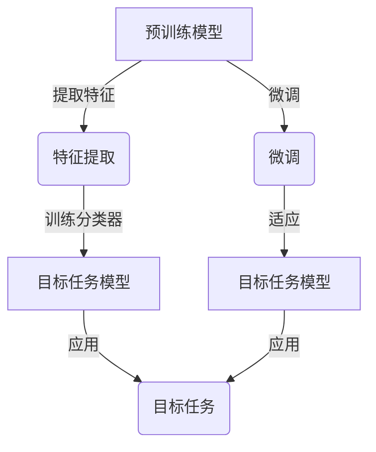

# 迁移学习 (Transfer Learning) 原理与代码实例讲解

## 1. 背景介绍

在当今的人工智能领域,数据是推动模型性能提升的关键驱动力。然而,在许多应用场景中,获取大量高质量的标注数据往往是一项艰巨的挑战。这种数据稀缺的问题严重阻碍了深度学习模型在特定领域的应用和发展。为了解决这一难题,迁移学习(Transfer Learning)应运而生。

迁移学习是一种机器学习技术,它允许我们将在一个领域(源领域)学习到的知识迁移并应用到另一个相似但不同的领域(目标领域)。通过这种方式,我们可以利用已有的大量标注数据来训练一个通用模型,然后将其迁移并微调以适应新的任务,从而避免了从头开始训练模型所需的大量数据和计算资源。

在深度学习时代,迁移学习已经成为解决数据稀缺问题的有效方法,并在计算机视觉、自然语言处理等多个领域取得了巨大成功。本文将详细探讨迁移学习的原理、核心算法、实现方法以及实际应用场景,为读者提供全面的理解和实践指导。

## 2. 核心概念与联系

### 2.1 预训练模型 (Pre-trained Model)

预训练模型是迁移学习的基础。它是在大规模标注数据上预先训练的深度神经网络模型,已经学习到了通用的特征表示能力。常见的预训练模型包括计算机视觉领域的 ResNet、VGGNet 等,以及自然语言处理领域的 BERT、GPT 等。

### 2.2 微调 (Fine-tuning)

微调是迁移学习的核心步骤。它指的是在目标任务的数据上,基于预训练模型进行进一步的训练和调整,使模型适应新的任务。通过微调,预训练模型可以学习到目标任务的特定特征,从而提高模型在该任务上的性能。

### 2.3 特征提取 (Feature Extraction)

特征提取是另一种迁移学习的方式。它利用预训练模型提取通用的特征表示,然后在这些特征的基础上训练一个新的分类器或回归器,用于解决目标任务。这种方法通常适用于目标任务与源任务存在较大差异的情况。

### 2.4 域适应 (Domain Adaptation)

域适应是迁移学习中的一个重要概念。它指的是将在源域学习到的知识适应到目标域的过程,旨在减小源域和目标域之间的分布差异,从而提高模型在目标域的性能。

### 2.5 Mermaid 流程图



上图展示了迁移学习的两种主要方式:特征提取和微调,以及它们如何应用于目标任务。

## 3. 核心算法原理具体操作步骤

迁移学习的核心算法原理可以概括为以下几个步骤:

1. **选择合适的预训练模型**:根据目标任务的特点,选择在相似领域预训练的深度神经网络模型作为基础。常见选择包括计算机视觉领域的 ResNet、VGGNet等,以及自然语言处理领域的BERT、GPT等。

2. **加载预训练模型权重**:将选定的预训练模型的权重加载到新的模型中,作为初始化参数。

3. **冻结或微调模型层**:根据目标任务的复杂程度和数据量,决定是完全冻结预训练模型的部分层(特征提取),还是对全部或部分层进行微调。通常情况下,对靠近输出层的层进行微调,而保持靠近输入层的层冻结。

4. **构建新的输出层**:根据目标任务的性质(分类、回归等),构建新的输出层,并将其连接到预训练模型的最后一层。

5. **准备目标任务数据**:收集并准备目标任务的训练数据和验证数据。

6. **训练和优化模型**:使用目标任务数据,对新构建的输出层以及解冻的预训练模型层进行训练和优化,以适应目标任务。可以使用常见的优化算法,如随机梯度下降(SGD)、Adam等。

7. **评估和调整模型**:在验证集上评估模型性能,根据需要调整超参数、训练策略等,以获得最佳性能。

8. **部署和应用模型**:将训练好的迁移学习模型部署到实际应用场景中,解决目标任务。

需要注意的是,上述步骤可能会根据具体的任务和数据而有所调整和优化。迁移学习的关键在于权衡利用预训练模型的知识和适应目标任务的需求之间的平衡。

## 4. 数学模型和公式详细讲解举例说明

迁移学习涉及到多种数学模型和公式,以下是一些常见的数学表示:

### 4.1 损失函数 (Loss Function)

在迁移学习中,我们通常使用与源任务相同的损失函数,例如交叉熵损失函数(Cross-Entropy Loss)用于分类任务:

$$
\mathcal{L}(\boldsymbol{y}, \hat{\boldsymbol{y}}) = -\sum_{i=1}^{C} y_i \log(\hat{y}_i)
$$

其中 $\boldsymbol{y}$ 是真实标签的一热编码向量, $\hat{\boldsymbol{y}}$ 是模型预测的概率分布, $C$ 是类别数。

对于回归任务,常用的损失函数是均方误差(Mean Squared Error, MSE):

$$
\mathcal{L}(\boldsymbol{y}, \hat{\boldsymbol{y}}) = \frac{1}{N} \sum_{i=1}^{N} (\hat{y}_i - y_i)^2
$$

其中 $\boldsymbol{y}$ 是真实目标值, $\hat{\boldsymbol{y}}$ 是模型预测值, $N$ 是样本数量。

### 4.2 正则化 (Regularization)

在迁移学习中,我们通常需要对模型进行正则化,以防止过拟合。常见的正则化方法包括 L1 正则化(Lasso Regularization)和 L2 正则化(Ridge Regularization)。

L1 正则化:

$$
\Omega(\boldsymbol{w}) = \lambda \sum_{i=1}^{d} |w_i|
$$

L2 正则化:

$$
\Omega(\boldsymbol{w}) = \lambda \sum_{i=1}^{d} w_i^2
$$

其中 $\boldsymbol{w}$ 是模型权重向量, $d$ 是权重维度, $\lambda$ 是正则化强度系数。

### 4.3 域适应 (Domain Adaptation)

在域适应中,我们需要减小源域和目标域之间的分布差异。一种常见的方法是最小化两个域的特征分布之间的最大均值差异(Maximum Mean Discrepancy, MMD):

$$
\text{MMD}(\mathcal{D}_s, \mathcal{D}_t) = \left\|\frac{1}{n_s} \sum_{i=1}^{n_s} \phi(x_i^s) - \frac{1}{n_t} \sum_{j=1}^{n_t} \phi(x_j^t)\right\|_{\mathcal{H}}
$$

其中 $\mathcal{D}_s$ 和 $\mathcal{D}_t$ 分别表示源域和目标域的数据分布, $\phi$ 是特征映射函数, $\mathcal{H}$ 是再生核希尔伯特空间(Reproducing Kernel Hilbert Space, RKHS)。

通过最小化 MMD,我们可以使源域和目标域的特征分布更加接近,从而提高模型在目标域的性能。

### 4.4 实例:图像分类任务

假设我们有一个预训练的 ResNet-50 模型,用于对 ImageNet 数据集进行图像分类。现在我们希望将这个模型迁移到一个新的图像分类任务,例如识别不同种类的植物。

我们可以使用交叉熵损失函数和 L2 正则化来训练模型:

$$
\mathcal{L}(\boldsymbol{y}, \hat{\boldsymbol{y}}) = -\sum_{i=1}^{C} y_i \log(\hat{y}_i) + \lambda \sum_{i=1}^{d} w_i^2
$$

其中 $\boldsymbol{y}$ 是真实标签的一热编码向量, $\hat{\boldsymbol{y}}$ 是模型预测的概率分布, $C$ 是植物种类数, $\boldsymbol{w}$ 是模型权重向量, $d$ 是权重维度, $\lambda$ 是正则化强度系数。

通过在新的植物数据集上微调预训练的 ResNet-50 模型,我们可以使模型适应新的任务,从而提高分类性能。

## 5. 项目实践: 代码实例和详细解释说明

在本节中,我们将提供一个基于 PyTorch 框架的代码示例,演示如何将预训练的 ResNet-50 模型迁移到一个新的图像分类任务。

### 5.1 导入必要的库

```python
import torch
import torch.nn as nn
import torchvision.models as models
from torchvision import transforms
from torch.utils.data import DataLoader
```

### 5.2 定义数据预处理和数据加载

```python
# 定义数据预处理
data_transforms = {
    'train': transforms.Compose([
        transforms.RandomResizedCrop(224),
        transforms.RandomHorizontalFlip(),
        transforms.ToTensor(),
        transforms.Normalize([0.485, 0.456, 0.406], [0.229, 0.224, 0.225])
    ]),
    'val': transforms.Compose([
        transforms.Resize(256),
        transforms.CenterCrop(224),
        transforms.ToTensor(),
        transforms.Normalize([0.485, 0.456, 0.406], [0.229, 0.224, 0.225])
    ]),
}

# 加载数据集
train_dataset = datasets.ImageFolder('path/to/train/data', data_transforms['train'])
val_dataset = datasets.ImageFolder('path/to/val/data', data_transforms['val'])

train_loader = DataLoader(train_dataset, batch_size=32, shuffle=True)
val_loader = DataLoader(val_dataset, batch_size=32, shuffle=False)
```

### 5.3 加载预训练模型并进行微调

```python
# 加载预训练的 ResNet-50 模型
model = models.resnet50(pretrained=True)

# 冻结卷积层
for param in model.parameters():
    param.requires_grad = False

# 替换最后一层全连接层
num_ftrs = model.fc.in_features
model.fc = nn.Linear(num_ftrs, num_classes)

# 定义优化器和损失函数
optimizer = torch.optim.Adam(model.fc.parameters(), lr=0.001)
criterion = nn.CrossEntropyLoss()

# 训练模型
for epoch in range(num_epochs):
    train_loss = 0.0
    val_loss = 0.0
    
    # 训练阶段
    model.train()
    for inputs, labels in train_loader:
        optimizer.zero_grad()
        outputs = model(inputs)
        loss = criterion(outputs, labels)
        loss.backward()
        optimizer.step()
        train_loss += loss.item() * inputs.size(0)
        
    # 验证阶段
    model.eval()
    with torch.no_grad():
        for inputs, labels in val_loader:
            outputs = model(inputs)
            loss = criterion(outputs, labels)
            val_loss += loss.item() * inputs.size(0)
            
    # 计算平均损失
    train_loss = train_loss / len(train_loader.dataset)
    val_loss = val_loss / len(val_loader.dataset)
    
    print(f'Epoch: {epoch+1}, Train Loss: {train_loss:.4f}, Val Loss: {val_loss:.4f}')
```

### 5.4 代码解释

1. 我们首先导入必要的库,包括 PyTorch、torchvision 等。

2. 定义数据预处理和数据加载函数。我们使用 `transforms.Compose` 组合多个数据增强和归一化操作,并使用 `ImageFolder` 加载图像数据集。

3. 加载预训练的 ResNet-50 模型,并冻结卷积层的参数。这是为了利用预训练模型提取的通用特征,同时避免破坏这些特征。

4. 替换最后一层全连接层,使其输出维度与新的分类任务相匹配。在这个示例中,我们假设有 `num_classes` 个类别。

5. 定义优化器和损失函数。我们使用 Adam 优化器和交叉