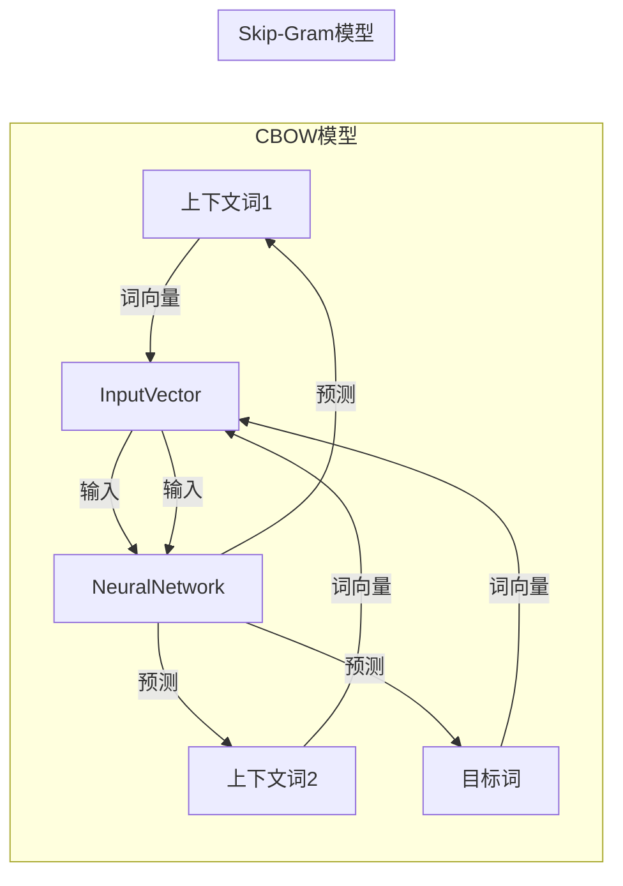

# 问君文本何所似： 词的向量表示Word2Vec和Embedding

## 1.背景介绍

在自然语言处理(NLP)领域中,将文本转换为计算机可以理解和处理的数值表示形式是一个关键挑战。传统的文本表示方法,如基于规则的方法和统计方法,存在一些局限性,难以捕捉词与词之间的语义关系和上下文信息。近年来,基于神经网络的词向量表示方法(Word Embedding)逐渐成为主流,其中最著名的是Word2Vec模型。

Word2Vec是一种高效的词嵌入学习技术,由Google的Tomas Mikolov等人于2013年提出。它通过神经网络模型从大规模语料库中学习词的向量表示,使得语义相似的词在向量空间中彼此靠近。这种分布式表示方式能够很好地捕捉词与词之间的语义关系,为许多自然语言处理任务提供了强大的语义表示能力。

## 2.核心概念与联系

Word2Vec模型的核心思想是通过神经网络模型从大规模语料库中学习词的向量表示,使得语义相似的词在向量空间中彼此靠近。它基于词的上下文信息,利用浅层神经网络对词进行编码,生成固定长度的向量表示。

Word2Vec模型包含两种主要的模型架构:连续词袋模型(Continuous Bag-of-Words,CBOW)和Skip-Gram模型。

### 2.1 连续词袋模型(CBOW)

CBOW模型的目标是根据源词的上下文(即周围的词)来预测源词本身。具体来说,给定一个序列的词,使用词窗口捕获源词的上下文,然后将这些上下文词的向量相加,作为输入传递给神经网络,最后预测源词的概率分布。

### 2.2 Skip-Gram模型

Skip-Gram模型的目标则相反,它是根据源词来预测其上下文。具体来说,给定一个源词,模型会预测该词的上下文词(在词窗口范围内的其他词)的概率分布。

这两种模型架构都利用了词与上下文之间的统计信息,通过最大化目标函数(预测概率)来学习词的向量表示。



## 3.核心算法原理具体操作步骤

Word2Vec模型的核心算法步骤如下:

1. **构建语料库**: 首先需要准备一个大规模的语料库,通常是纯文本格式。

2. **创建词表(Vocabulary)**: 从语料库中提取所有不同的词,并为每个词分配一个唯一的索引,构建词表。

3. **生成训练样本**: 使用滑动窗口(Window Size)在语料库上滑动,从中提取目标词(中心词)及其上下文词,生成训练样本对(目标词,上下文词)。

4. **初始化词向量**: 为每个词随机初始化一个固定长度的向量表示(通常长度为100-300维)。

5. **前向传播**: 根据选择的模型架构(CBOW或Skip-Gram),将输入词(目标词或上下文词)的词向量传递给神经网络,计算输出层的概率分布。

6. **计算损失函数**: 使用交叉熵损失函数(Cross-Entropy Loss)计算预测概率分布与真实目标词或上下文词之间的差异。

7. **反向传播**: 通过反向传播算法,计算损失函数相对于每个词向量的梯度,并使用优化算法(如随机梯度下降SGD)更新词向量。

8. **迭代训练**: 重复步骤5-7,不断迭代训练,直到模型收敛或达到指定的迭代次数。

9. **输出词向量**: 最终得到每个词的向量表示,可用于下游的自然语言处理任务。

## 4.数学模型和公式详细讲解举例说明

Word2Vec模型的数学表示可以用下面的公式来描述:

### 4.1 CBOW模型

在CBOW模型中,给定上下文词序列 $C = \{c_1, c_2, \ldots, c_C\}$,我们希望预测目标词 $w_t$。模型的目标是最大化目标词 $w_t$ 的条件概率:

$$P(w_t | c_1, c_2, \ldots, c_C) = \frac{e^{v_{w_t}^{\top}v_C}}{\sum_{w=1}^{V}e^{v_w^{\top}v_C}}$$

其中:
- $V$ 是词表的大小
- $v_w$ 是词 $w$ 的词向量
- $v_C$ 是上下文词向量的平均值或加权和,即 $v_C = \frac{1}{C}\sum_{i=1}^{C}v_{c_i}$

### 4.2 Skip-Gram模型

在Skip-Gram模型中,给定目标词 $w_t$,我们希望预测其上下文词序列 $C = \{c_1, c_2, \ldots, c_C\}$。模型的目标是最大化每个上下文词 $c_i$ 的条件概率:

$$P(c_i | w_t) = \frac{e^{v_{c_i}^{\top}v_{w_t}}}{\sum_{w=1}^{V}e^{v_w^{\top}v_{w_t}}}$$

其中符号的含义与CBOW模型相同。

在实际训练中,我们通常使用负采样(Negative Sampling)或层序Softmax(Hierarchical Softmax)等技术来加速训练过程和降低计算复杂度。

### 4.3 示例

假设我们有一个简单的语料库:"the cat sat on the mat"。我们可以使用CBOW模型来预测中心词"sat"的词向量。

首先,我们获取"sat"的上下文词:"the"、"cat"、"on"和"the"。然后,我们将这些上下文词的词向量相加,得到上下文向量 $v_C$。接下来,我们使用 $v_C$ 作为输入,通过softmax函数计算预测"sat"的概率。最后,我们根据预测概率和真实目标词"sat"之间的差异,使用反向传播算法更新所有词向量。

通过大量的训练样本和迭代,我们可以得到每个词的向量表示,其中语义相似的词(如"cat"和"dog")在向量空间中会彼此靠近。

## 5.项目实践:代码实例和详细解释说明

以下是使用Python和Gensim库实现Word2Vec模型的示例代码:

```python
import gensim

# 加载语料库
sentences = [['this', 'is', 'the', 'first', 'sentence'], 
             ['this', 'is', 'the', 'second', 'sentence']]

# 创建Word2Vec模型
model = gensim.models.Word2Vec(sentences, vector_size=100, window=5, min_count=1, workers=4)

# 查看词向量
print(model.wv['this'])

# 找到最相似的词
similar_words = model.wv.most_similar(positive=['woman', 'king'], negative=['man'])
print(similar_words)

# 保存模型
model.save('word2vec.model')

# 加载模型
new_model = gensim.models.Word2Vec.load('word2vec.model')
```

代码解释:

1. 首先,我们导入Gensim库,它提供了Word2Vec模型的实现。

2. 然后,我们准备了一个简单的语料库,包含两个句子。

3. 接下来,我们创建Word2Vec模型对象。`vector_size`参数指定词向量的维度,`window`参数指定上下文窗口的大小,`min_count`参数指定词频阈值,`workers`参数指定使用的并行线程数。

4. 我们可以使用`model.wv['word']`来查看某个词的词向量。

5. 使用`model.wv.most_similar()`方法可以找到与给定词向量最相似的词向量。在示例中,我们尝试找到与"woman"和"king"相似,但与"man"不同的词。

6. 最后,我们可以使用`model.save()`方法将训练好的模型保存到磁盘,以备将来使用。`gensim.models.Word2Vec.load()`方法可以加载保存的模型。

通过这个示例,您可以了解如何使用Gensim库来训练Word2Vec模型,查看词向量,找到相似词,以及保存和加载模型。

## 6.实际应用场景

Word2Vec模型及其词向量表示技术在自然语言处理领域有着广泛的应用,包括但不限于:

1. **文本相似度计算**: 通过计算两个句子或文档的词向量之间的余弦相似度,可以量化它们的语义相似程度,应用于文本聚类、重复内容检测等任务。

2. **信息检索**: 在搜索引擎中,可以使用词向量来改进查询理解和相关性排名,提高检索质量。

3. **机器翻译**: 在神经机器翻译系统中,词向量可以作为输入特征,帮助模型更好地捕捉词语的语义信息。

4. **情感分析**: 通过训练情感词向量,可以更好地理解文本中的情感倾向,应用于情感分析和观点挖掘等任务。

5. **命名实体识别**: 将词向量作为输入特征,可以提高命名实体识别模型的性能。

6. **词性标注和依存分析**: 词向量可以作为语言模型的输入特征,提高词性标注和依存分析的准确性。

7. **问答系统**: 在问答系统中,可以利用词向量计算问题和候选答案之间的语义相似度,从而找到最佳答案。

8. **推荐系统**: 通过分析用户历史行为数据,学习用户和物品的词向量表示,可以改进个性化推荐的效果。

总的来说,Word2Vec模型为自然语言处理任务提供了强大的语义表示能力,在各种应用场景中发挥着重要作用。

## 7.工具和资源推荐

以下是一些流行的Word2Vec模型实现工具和预训练词向量资源:

### 7.1 工具

- **Gensim**: 一个用Python实现的开源向量空间模型库,支持Word2Vec、FastText等模型。
- **Word2Vec Google Code**: Google开源的原始Word2Vec C++实现。
- **Stanford GloVe**: 斯坦福大学开发的基于全局词向量的模型,可以作为Word2Vec的替代方案。
- **fastText**: Facebook开源的用于高效文本分类和词向量学习的库,支持多种语言。

### 7.2 预训练词向量资源

- **Google News Word Vectors**: 由Google训练的大规模词向量集,基于约1000亿个单词的Google新闻语料库。
- **GloVe Pre-trained Vectors**: 斯坦福大学提供的基于维基百科和其他语料库训练的GloVe词向量。
- **fastText Pre-trained Vectors**: Facebook提供的基于维基百科等语料库预训练的fastText词向量,支持多种语言。
- **ConceptNet Numberbatch**: 由ConceptNet知识库训练的词向量和短语向量集合。

利用这些工具和资源,可以快速构建和应用Word2Vec模型,或直接使用预训练的高质量词向量,节省训练时间和计算资源。

## 8.总结:未来发展趋势与挑战

Word2Vec模型为自然语言处理领域带来了革命性的进步,但它也存在一些局限性和挑战:

1. **词义消歧**: Word2Vec模型为每个词学习一个固定的向量表示,无法区分同一个词在不同上下文中的不同含义。

2. **构件组合**: Word2Vec模型无法很好地捕捉词与词之间的组合关系,如短语和复合词的语义。

3. **动态语义**: 当前的Word2Vec模型是基于静态语料库训练的,无法适应语言的动态变化和新词的出现。

4. **计算效率**: 对于大规模语料库和词表,Word2Vec模型的训练过程可能非常耗时和计算密集。

为了解决这些问题,研究人员提出了一些改进方法和新模型,如:

- **子词向量(Subword Vectors)**: 将