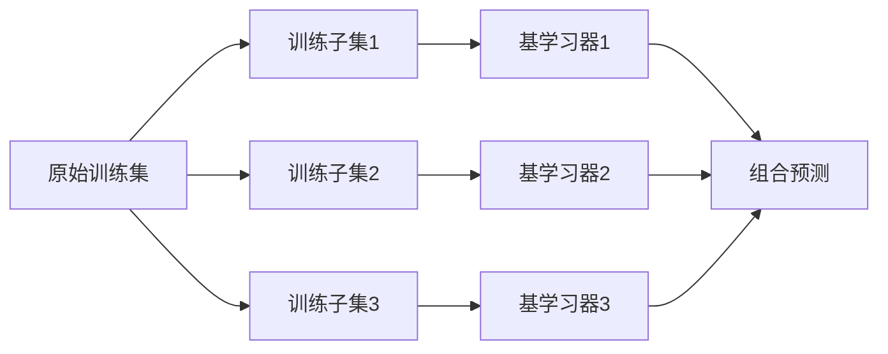
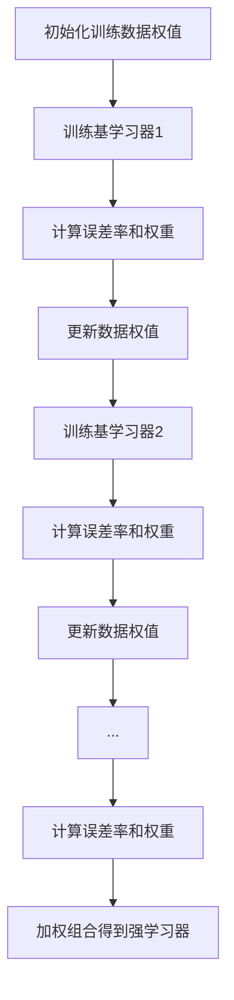
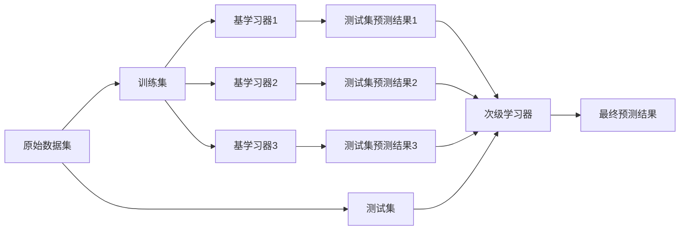

# 集成学习(Ensemble Learning)原理与代码实战案例讲解

## 1. 背景介绍
   
### 1.1 什么是集成学习
集成学习(Ensemble Learning)是机器学习中一种强大的技术,它通过组合多个基础模型的预测结果来提高整体预测性能。集成学习的基本思想是,通过构建并结合多个学习器来完成学习任务,从而获得比单个学习器显著优越的泛化性能。

### 1.2 集成学习的优势
集成学习之所以能够取得很好的效果,主要有以下几个原因:

- 集成学习可以有效地降低模型的方差(variance),从而提高模型的泛化能力。通过组合多个学习器的输出,可以降低单个学习器可能存在的过拟合问题。

- 集成学习可以减少模型的偏差(bias)。不同的学习器可能对数据有不同的"偏好",通过组合它们的输出,可以得到一个相对"中庸"的结果。

- 集成学习可以扩大模型的表示能力。不同的学习器可以捕捉数据的不同属性,通过集成,可以得到一个更加"完备"的模型。

### 1.3 集成学习的分类
集成学习主要可以分为两大类:

- 同质集成(Homogeneous Ensemble):基学习器都采用同种类型的算法,如Bagging和Boosting。

- 异质集成(Heterogeneous Ensemble):基学习器采用不同种类的算法,如Stacking。

## 2. 核心概念与联系

### 2.1 基学习器
基学习器(Base Learner)是集成学习的基本组成部分。通常要求基学习器是"好而不同",即要有一定的"准确性",同时要具有"多样性"。常见的基学习器有决策树、神经网络、支持向量机等。

### 2.2 Bagging
Bagging是并行式集成学习方法的代表。Bagging通过对训练集进行随机采样,产生多个不同的训练子集,再基于每个训练子集训练一个基学习器,然后将各个基学习器的预测结果进行组合。代表算法有随机森林(Random Forest)。

### 2.3 Boosting 
Boosting是串行式集成学习方法的代表。Boosting通过迭代训练多个基学习器,每一轮迭代会根据上一轮基学习器的表现对训练样本分布进行调整,使得先前基学习器做错的训练样本在后续受到更多关注。代表算法有AdaBoost和梯度提升树(GBDT)。

### 2.4 Stacking
Stacking是一种异质集成方法,它通过两层模型结构来组合不同类型的基学习器。第一层由多个基学习器组成,其输出被当作新的训练集来训练第二层的模型,从而得到最终的集成模型。

## 3. 核心算法原理与具体步骤

### 3.1 Bagging算法

#### 3.1.1 Bagging算法步骤

1. 从原始训练集中采样生成T个训练子集
2. 基于每个训练子集训练一个基学习器 
3. 对新样本,将T个基学习器的预测结果通过投票(分类)或平均(回归)的方式进行组合,得到最终的预测结果



#### 3.1.2 随机森林算法
随机森林是Bagging思想与决策树结合的产物。随机森林在以决策树为基学习器的基础上,进一步在决策树的训练过程中引入了随机属性选择。

### 3.2 Boosting算法

#### 3.2.1 AdaBoost算法步骤

1. 初始化训练数据的权值分布
2. for m = 1,2,...,M:
   - 使用当前的权值分布训练基学习器
   - 计算基学习器的误差率
   - 计算基学习器的权重系数
   - 更新训练数据的权值分布
3. 将M个基学习器加权组合得到最终的强学习器



#### 3.2.2 梯度提升树(GBDT)算法
GBDT是Boosting思想与决策树结合的产物。与传统的Boosting不同,GBDT每一轮迭代的目标是拟合上一轮迭代的残差,从而在函数空间中采用梯度下降的方式来最小化损失函数。

### 3.3 Stacking算法

#### 3.3.1 Stacking算法步骤

1. 将数据集分为训练集和测试集
2. 选择L个基学习器
3. for i = 1,2,...,L:
   - 使用训练集训练第i个基学习器
   - 使用第i个学习器预测测试集,得到预测结果作为新特征
4. 将测试集的预测结果作为新特征,训练次级学习器
5. 对新样本,先用L个基学习器预测得到L个预测结果,再用次级学习器预测得到最终结果



## 4. 数学模型和公式详细讲解举例说明

### 4.1 Bagging的数学描述
假设基学习器的个数为T,训练集大小为m。Bagging的数学描述如下:

1. for t = 1,2,...,T:
   - 从训练集中采样一个大小为m的子集$D_t$
   - 基于$D_t$训练学习器$h_t$
2. 对新样本x,Bagging的预测输出为:
   - 分类问题:$H(x) = \mathop{argmax}\limits_{y \in Y}\sum\limits_{t=1}^T \mathbb{I}(h_t(x)=y)$
   - 回归问题:$H(x) = \frac{1}{T}\sum\limits_{t=1}^T h_t(x)$

其中,$\mathbb{I}$为指示函数。

### 4.2 AdaBoost的数学描述
假设训练数据集为$D=\{(x_1,y_1),(x_2,y_2),...,(x_m,y_m)\}$,基学习器的个数为T。AdaBoost的数学描述如下:

1. 初始化训练数据的权值分布:$D_1 = (w_{11},...,w_{1i},...,w_{1m}), \quad w_{1i}=\frac{1}{m}, \quad i=1,2,...,m$
2. for t = 1,2,...,T:
   - 使用权值分布$D_t$训练基学习器$h_t$
   - 计算$h_t$在训练数据集上的误差率:$e_t = \sum\limits_{i=1}^m P(h_t(x_i) \neq y_i)$
   - 计算$h_t$的权重系数:$\alpha_t = \frac{1}{2} \ln \frac{1-e_t}{e_t}$
   - 更新训练数据的权值分布:$D_{t+1} = (w_{t+1,1},...,w_{t+1,i},...,w_{t+1,m})$ 
     $w_{t+1,i} = \frac{w_{ti}}{Z_t} \exp(-\alpha_t y_i h_t(x_i)), \quad i=1,2,...,m$
3. 构建基学习器的线性组合:$H(x) = sign(\sum\limits_{t=1}^T \alpha_t h_t(x))$

其中,$Z_t$是规范化因子,$sign$是符号函数。

### 4.3 Stacking的数学描述
假设基学习器的个数为L,第j个基学习器在第i个样本上的预测值为$z_i^j$。Stacking的数学描述如下:

1. for j = 1,2,...,L:
   - 使用训练集训练第j个基学习器$h_j$
   - 使用$h_j$预测测试集,得到预测值$\{z_i^j\}_{i=1}^m$
2. 将$\{z_i^j\}_{i=1}^m$作为新的训练集,训练次级学习器$H$
3. 对新样本x,Stacking的预测输出为:$H(z_1,...,z_L)$,其中$z_j=h_j(x)$

## 5. 项目实践：代码实例和详细解释说明

下面以Python语言为例,给出集成学习的代码实现。

### 5.1 Bagging和随机森林

```python
from sklearn.ensemble import BaggingClassifier, RandomForestClassifier
from sklearn.tree import DecisionTreeClassifier
from sklearn.datasets import make_classification
from sklearn.model_selection import train_test_split

# 生成示例数据集
X, y = make_classification(n_samples=1000, n_features=10, n_classes=2)
X_train, X_test, y_train, y_test = train_test_split(X, y, test_size=0.3)

# Bagging
bagging = BaggingClassifier(base_estimator=DecisionTreeClassifier(), n_estimators=10)
bagging.fit(X_train, y_train)
print("Bagging Accuracy:", bagging.score(X_test, y_test))

# 随机森林
rf = RandomForestClassifier(n_estimators=10)  
rf.fit(X_train, y_train)
print("Random Forest Accuracy:", rf.score(X_test, y_test))
```

### 5.2 AdaBoost和GBDT

```python
from sklearn.ensemble import AdaBoostClassifier, GradientBoostingClassifier
from sklearn.tree import DecisionTreeClassifier
from sklearn.datasets import make_classification
from sklearn.model_selection import train_test_split

# 生成示例数据集
X, y = make_classification(n_samples=1000, n_features=10, n_classes=2)  
X_train, X_test, y_train, y_test = train_test_split(X, y, test_size=0.3)

# AdaBoost
adaboost = AdaBoostClassifier(base_estimator=DecisionTreeClassifier(max_depth=2), n_estimators=10)
adaboost.fit(X_train, y_train)
print("AdaBoost Accuracy:", adaboost.score(X_test, y_test))

# GBDT
gbdt = GradientBoostingClassifier(n_estimators=10)
gbdt.fit(X_train, y_train)  
print("GBDT Accuracy:", gbdt.score(X_test, y_test))
```

### 5.3 Stacking

```python
from sklearn.ensemble import StackingClassifier
from sklearn.tree import DecisionTreeClassifier
from sklearn.neighbors import KNeighborsClassifier
from sklearn.svm import SVC
from sklearn.datasets import make_classification
from sklearn.model_selection import train_test_split

# 生成示例数据集
X, y = make_classification(n_samples=1000, n_features=10, n_classes=2)
X_train, X_test, y_train, y_test = train_test_split(X, y, test_size=0.3)

# 定义基学习器
estimators = [
    ('dt', DecisionTreeClassifier()),
    ('knn', KNeighborsClassifier()),
    ('svm', SVC(probability=True))
]

# Stacking
stacking = StackingClassifier(estimators=estimators, final_estimator=LogisticRegression())
stacking.fit(X_train, y_train)
print("Stacking Accuracy:", stacking.score(X_test, y_test))
```

## 6. 实际应用场景

集成学习在许多实际问题中都有广泛应用,下面列举几个典型场景:

- 计算机视觉:人脸识别、目标检测等任务通常会使用集成学习方法如Boosting来提高性能。

- 自然语言处理:文本分类、情感分析等任务中,Bagging和Stacking都是常用的集成策略。

- 推荐系统:将多个不同的推荐模型进行组合,可以得到更加准确和全面的推荐结果。

- 金融风控:在信用评分、反欺诈等风险控制场景中,集成学习可以有效地