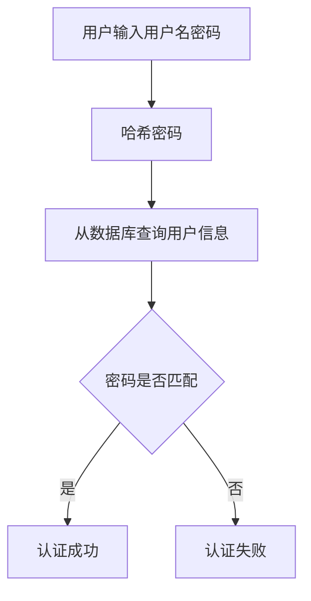
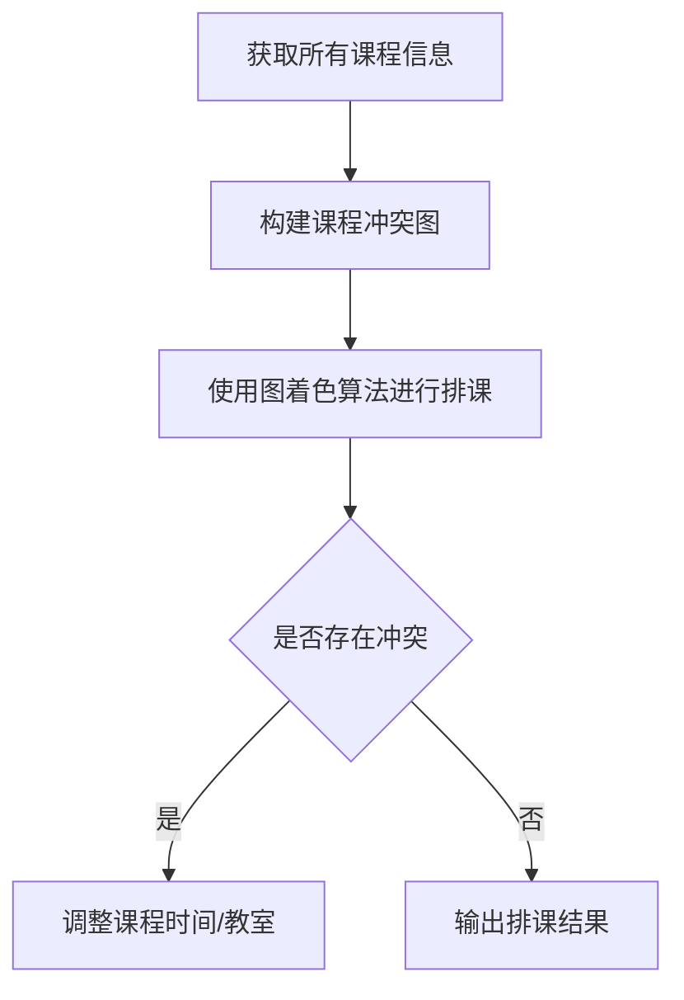
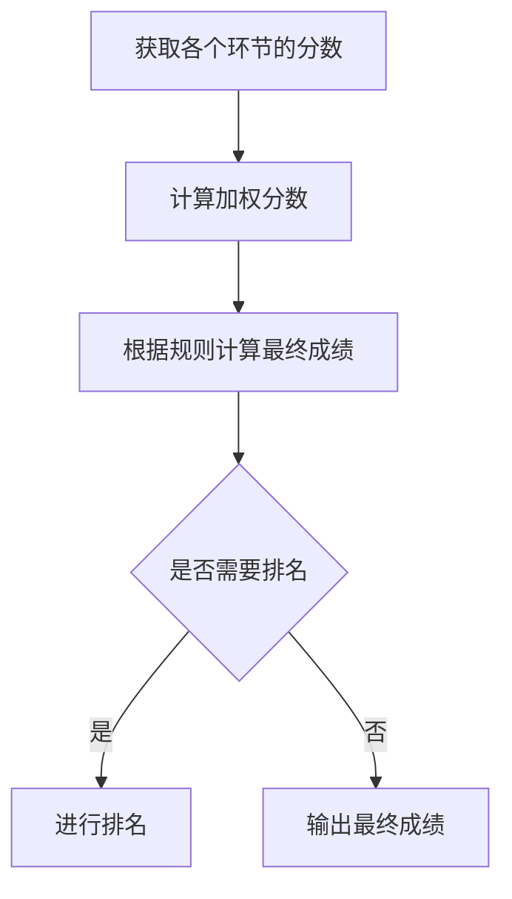

# 高校文学系统的设计与开发

## 1.背景介绍

随着信息技术的不断发展,高校文学系统的设计与开发已经成为高校教学管理的重要组成部分。文学系统不仅可以帮助学校管理学生的学习情况,还可以为教师提供便利的教学资源管理平台。因此,构建一个高效、实用的文学系统对于提高教学质量和管理效率至关重要。

### 1.1 系统需求分析

在设计文学系统之前,我们需要全面分析系统的需求,包括功能需求和非功能需求。

**功能需求**包括:

- 学生信息管理
- 课程管理
- 教学资源管理
- 成绩管理
- 考试安排
- 师生交流平台

**非功能需求**包括:

- 系统性能
- 系统安全性
- 可用性
- 可维护性

### 1.2 系统架构设计

根据需求分析的结果,我们可以设计出合适的系统架构。常见的架构模式有三层架构、MVC架构等。我们可以选择合适的架构模式,并根据具体情况进行优化和扩展。

## 2.核心概念与联系

在文学系统中,有几个核心概念需要理解和掌握。

### 2.1 用户管理

用户管理是系统的基础,包括学生用户、教师用户和管理员用户。每种用户都有不同的权限和操作界面。

### 2.2 课程管理

课程管理是系统的核心功能之一,包括课程信息维护、教学资源管理、课程安排等。

### 2.3 成绩管理

成绩管理模块用于记录和管理学生的成绩信息,包括考试成绩、平时成绩等。

### 2.4 教学资源管理

教学资源管理模块用于管理课程相关的教学资源,如课件、视频、参考资料等。

### 2.5 系统集成

上述各个模块需要进行有机的集成,形成一个完整的文学系统。系统集成需要考虑模块之间的数据交互、权限控制等问题。

## 3.核心算法原理具体操作步骤

文学系统的核心算法主要包括以下几个方面:

### 3.1 用户认证算法

用户认证算法用于验证用户的身份,确保系统的安全性。常见的用户认证算法有:

1. 密码哈希算法(如MD5、SHA-256等)
2. 密码加盐算法
3. 双重认证算法(如验证码、动态令牌等)

用户认证算法的具体操作步骤如下:



### 3.2 课程排课算法

课程排课算法用于自动安排课程的上课时间和教室,避免课程时间和教室的冲突。常见的课程排课算法有:

1. 图着色算法
2. 蚁群算法
3. 遗传算法

课程排课算法的具体操作步骤如下:



### 3.3 成绩计算算法

成绩计算算法用于根据各个环节的分数计算出最终的成绩。常见的成绩计算算法有:

1. 加权平均算法
2. 排名算法
3. 标准分数算法

成绩计算算法的具体操作步骤如下:



## 4.数学模型和公式详细讲解举例说明

在文学系统中,我们可能需要使用一些数学模型和公式来解决实际问题。下面我们将详细讲解几个常见的数学模型和公式。

### 4.1 图着色算法

图着色算法是一种常用的图论算法,可以应用于课程排课等问题。图着色算法的目标是使用最少的颜色为图中的所有顶点着色,并且相邻的顶点不能使用同一种颜色。

我们可以使用贪心算法来实现图着色。具体步骤如下:

1. 构建一个邻接表来表示图
2. 遍历所有顶点,对每个未着色的顶点,尝试使用最小的可用颜色进行着色
3. 如果所有顶点都被着色,则返回使用的最大颜色数

贪心算法的时间复杂度为 $O(V+E)$,其中 $V$ 表示顶点数,$ E$ 表示边数。

### 4.2 加权平均算法

加权平均算法是一种常用的成绩计算算法。它将各个环节的分数乘以对应的权重,然后求和并除以总权重,得到最终的加权平均分数。

加权平均分数的计算公式如下:

$$
\overline{x} = \frac{\sum_{i=1}^{n}w_ix_i}{\sum_{i=1}^{n}w_i}
$$

其中,$ \overline{x}$ 表示加权平均分数,$ x_i$ 表示第 $i$ 个环节的分数,$ w_i$ 表示第 $i$ 个环节的权重,$ n$ 表示总的环节数。

例如,假设一门课程有三个环节:平时作业(30%权重)、期中考试(30%权重)和期末考试(40%权重)。某学生的三个环节分数分别为 85、90 和 92。那么,该学生的加权平均分数为:

$$
\overline{x} = \frac{0.3 \times 85 + 0.3 \times 90 + 0.4 \times 92}{0.3 + 0.3 + 0.4} = 89.4
$$

### 4.3 标准分数算法

标准分数算法是另一种常用的成绩计算算法。它将原始分数转换为标准分数,使得分数分布符合正态分布。

标准分数的计算公式如下:

$$
z = \frac{x - \mu}{\sigma}
$$

其中,$ z$ 表示标准分数,$ x$ 表示原始分数,$ \mu$ 表示原始分数的均值,$ \sigma$ 表示原始分数的标准差。

例如,假设一门课程的原始分数均值为 75,标准差为 10。某学生的原始分数为 85。那么,该学生的标准分数为:

$$
z = \frac{85 - 75}{10} = 1
$$

这表示该学生的分数高于均值 1 个标准差。

## 5.项目实践:代码实例和详细解释说明

在这一部分,我们将提供一些代码实例,并对其进行详细的解释说明。

### 5.1 用户认证模块

下面是一个简单的用户认证模块的实现,使用 Python 编写。

```python
import hashlib

# 用户信息存储在一个字典中
users = {
    'alice': hashlib.sha256('password123'.encode()).hexdigest(),
    'bob': hashlib.sha256('qwerty'.encode()).hexdigest()
}

def authenticate(username, password):
    """
    用户认证函数
    :param username: 用户名
    :param password: 密码
    :return: 认证结果(True或False)
    """
    if username not in users:
        return False
    
    hashed_password = hashlib.sha256(password.encode()).hexdigest()
    return hashed_password == users[username]

# 测试用例
print(authenticate('alice', 'password123'))  # True
print(authenticate('bob', 'wrongpassword'))  # False
print(authenticate('eve', 'password'))  # False
```

在这个示例中,我们使用了 Python 的 `hashlib` 模块来计算密码的 SHA-256 哈希值。用户信息存储在一个字典中,键为用户名,值为密码的哈希值。

`authenticate` 函数首先检查用户名是否存在。如果存在,它会计算输入密码的哈希值,并与存储的哈希值进行比较。如果相同,则认证成功;否则,认证失败。

### 5.2 课程排课模块

下面是一个使用图着色算法实现的课程排课模块,使用 Python 编写。

```python
from collections import defaultdict

class Graph:
    def __init__(self):
        self.graph = defaultdict(list)

    def add_edge(self, u, v):
        self.graph[u].append(v)
        self.graph[v].append(u)

    def greedy_coloring(self, colors):
        color_map = {}
        for node in self.graph:
            assigned = set([color_map.get(neighbor) for neighbor in self.graph[node] if neighbor in color_map])
            color = next((color for color in colors if color not in assigned), None)
            color_map[node] = color
        return color_map

# 构建课程冲突图
g = Graph()
g.add_edge('课程A', '课程B')
g.add_edge('课程B', '课程C')
g.add_edge('课程C', '课程D')

# 使用图着色算法进行排课
colors = ['红色', '绿色', '蓝色']
schedule = g.greedy_coloring(colors)

# 输出排课结果
for course, color in schedule.items():
    print(f'{course} 安排在 {color} 时间段')
```

在这个示例中,我们首先定义了一个 `Graph` 类,用于表示课程之间的冲突关系。`add_edge` 方法用于添加两个课程之间的冲突边。

`greedy_coloring` 方法实现了贪心图着色算法。它遍历所有顶点,为每个未着色的顶点尝试使用最小的可用颜色进行着色。最后,它返回一个字典,其中键为课程名称,值为分配的颜色(即时间段)。

在主程序中,我们构建了一个包含四门课程的冲突图,并使用图着色算法进行排课。最后,我们输出了每门课程的安排时间段。

### 5.3 成绩计算模块

下面是一个实现加权平均算法和标准分数算法的成绩计算模块,使用 Python 编写。

```python
import math

def weighted_average(scores, weights):
    """
    计算加权平均分数
    :param scores: 各个环节的分数列表
    :param weights: 对应的权重列表
    :return: 加权平均分数
    """
    total_score = sum(score * weight for score, weight in zip(scores, weights))
    total_weight = sum(weights)
    return total_score / total_weight

def standard_score(score, mean, std_dev):
    """
    计算标准分数
    :param score: 原始分数
    :param mean: 原始分数均值
    :param std_dev: 原始分数标准差
    :return: 标准分数
    """
    return (score - mean) / std_dev

# 测试用例
scores = [85, 90, 92]
weights = [0.3, 0.3, 0.4]
avg_score = weighted_average(scores, weights)
print(f'加权平均分数: {avg_score}')  # 输出: 加权平均分数: 89.4

original_mean = 75
original_std_dev = 10
original_score = 85
std_score = standard_score(original_score, original_mean, original_std_dev)
print(f'标准分数: {std_score}')  # 输出: 标准分数: 1.0
```

在这个示例中,我们定义了两个函数 `weighted_average` 和 `standard_score`。

`weighted_average` 函数实现了加权平均算法。它接受两个参数:各个环节的分数列表和对应的权重列表。它使用 Python 的列表解析式计算加权分数的总和,然后除以总权重,得到加权平均分数。

`standard_score` 函数实现了标准分数算法。它接受三个参数:原始分数、原始分数均值和原始分数标准差。它使用公式 `(score - mean) / std_dev` 计算标准分数。

在主程序中,我们提供了两个测试用例,分别计算加权平均分数和标准分数。

## 6.实际应用场景

文学系统可以应用于各种高校场景,包括:

### 6.1 学生管理

文学系统可以用于管理学生的基本信息、课程选择、成绩查询等。学生可以通过系统查看个人信息、选课、查询成绩等。

### 6.2 教师管理

教师可以使用文