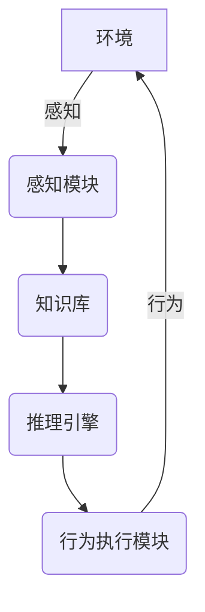
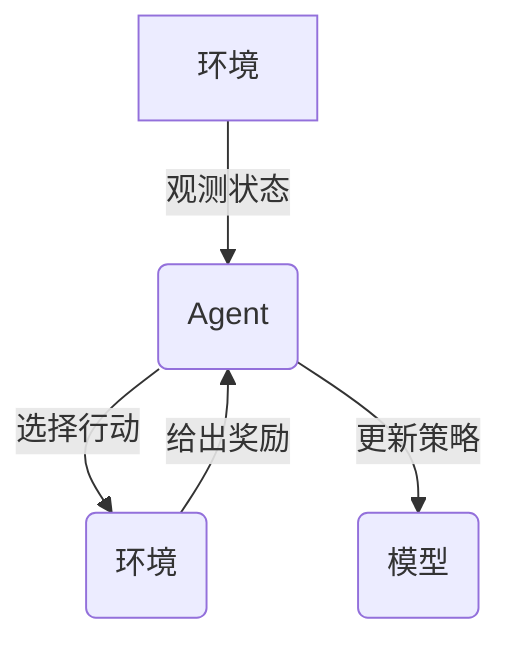

# AI人工智能 Agent：在人工智能伦理上的考量

## 1.背景介绍

随着人工智能(AI)技术的不断发展和广泛应用,AI系统已经逐渐融入到我们生活的方方面面。无论是虚拟助理、自动驾驶汽车、医疗诊断系统,还是金融风险评估模型,AI都在发挥着越来越重要的作用。然而,AI系统的快速发展也带来了一些伦理道德方面的挑战和担忧。

作为一种强大的技术,AI有能力改变世界,影响人类社会的方方面面。因此,我们必须审慎考虑AI系统在设计、开发和部署过程中所面临的伦理问题。我们需要确保AI系统能够以负责任和可控的方式运行,避免产生不利影响,并最大限度地保护人类的利益和价值观。

## 2.核心概念与联系

### 2.1 AI Agent

在探讨AI伦理问题之前,我们首先需要了解什么是AI Agent。AI Agent是指能够感知环境、处理信息、做出决策并采取行动的自主系统。它们可以是虚拟助理、机器人、游戏AI等各种形式。

AI Agent通常由以下几个核心组件组成:

1. **感知模块**:用于从环境中获取信息,例如视觉、听觉等传感器数据。
2. **知识库**:存储Agent所掌握的知识和规则。
3. **推理引擎**:根据知识库和感知数据,进行逻辑推理和决策。
4. **行为执行模块**:根据推理结果,执行相应的动作或行为。



### 2.2 AI伦理

AI伦理是一个新兴的研究领域,它探讨了AI系统在设计、开发和使用过程中所面临的道德和伦理问题。主要包括以下几个方面:

1. **算法公平性**:确保AI算法在做出决策时不会带有种族、性别、年龄等方面的偏见。
2. **隐私与安全**:保护个人隐私,防止AI系统被滥用或攻击。
3. **透明度与可解释性**:AI系统的决策过程应该是透明和可解释的。
4. **责任归属**:明确AI系统出现问题时,谁应该承担责任。
5. **人工智能的未来影响**:评估AI对就业、社会等长期影响。

AI伦理旨在确保AI的发展和应用符合人类的价值观和利益,促进AI的可持续和负责任的发展。

## 3.核心算法原理具体操作步骤

AI Agent的核心算法通常采用**强化学习**或**规划算法**等方法。以强化学习为例,其基本工作流程如下:



1. **初始化**:设置Agent的初始状态,包括策略模型、奖励函数等参数。

2. **观测环境**:Agent通过感知模块获取当前环境的状态信息。

3. **选择行动**:根据当前状态和策略模型,Agent选择一个可行的行动。

4. **执行行动**:Agent执行选定的行动,环境状态发生变化。

5. **获取奖励**:环境根据Agent的行动给出对应的奖励信号。

6. **更新策略**:Agent根据获得的奖励信号,更新策略模型的参数。

7. **重复上述过程**:不断重复观测-行动-奖励-更新的循环,直到达到目标或满足终止条件。

该算法的关键在于如何设计合理的奖励函数,并通过不断试错和调整,使Agent学习到最优的策略。

## 4.数学模型和公式详细讲解举例说明

在强化学习算法中,常用的数学模型是**马尔可夫决策过程(MDP)**。MDP可以形式化描述为一个五元组:

$$\langle\mathcal{S}, \mathcal{A}, \mathcal{P}, \mathcal{R}, \gamma\rangle$$

其中:

- $\mathcal{S}$是环境的**状态空间**集合
- $\mathcal{A}$是Agent的**行动空间**集合
- $\mathcal{P}$是**状态转移概率函数**,定义为$\mathcal{P}_{ss'}^a=\mathcal{P}(s'|s,a)$,表示在状态$s$下执行行动$a$后,转移到状态$s'$的概率
- $\mathcal{R}$是**奖励函数**,定义为$\mathcal{R}_s^a=\mathbb{E}[R_{t+1}|S_t=s,A_t=a]$,表示在状态$s$执行行动$a$后获得的期望奖励
- $\gamma\in[0,1)$是**折扣因子**,用于权衡当前奖励和未来奖励的权重

Agent的目标是找到一个最优策略$\pi^*$,使得在遵循该策略时,可以最大化期望的累积折扣奖励:

$$\pi^*=\arg\max_\pi \mathbb{E}_\pi\left[\sum_{t=0}^\infty \gamma^t R_{t+1}\right]$$

常用的强化学习算法包括Q-Learning、Deep Q-Network(DQN)、Policy Gradient等。以DQN为例,其使用深度神经网络来近似Q值函数$Q(s,a)$,表示在状态$s$下执行行动$a$后可获得的期望累积奖励。在训练过程中,通过不断更新Q网络的参数,使其能够学习到最优的Q值函数,从而得到最优策略。

## 5.项目实践:代码实例和详细解释说明

以下是一个使用Python和PyTorch实现的简单DQN算法示例,应用于经典的CartPole环境(控制一根杆保持平衡)。

### 5.1 导入库和定义参数

```python
import gym
import torch
import torch.nn as nn
import torch.optim as optim
import numpy as np

# 超参数设置
EPISODES = 500      # 最大训练回合数
EPS_START = 0.9     # 初始epsilon值(探索起始概率)
EPS_END = 0.05      # 最终epsilon值
EPS_DECAY = 200     # epsilon值递减的回合数
GAMMA = 0.99        # 折扣因子
LR = 1e-3           # 学习率
BATCH_SIZE = 64     # 批大小
TARGET_UPDATE = 10  # 目标网络更新频率(回合数)
```

### 5.2 定义DQN模型

```python
class DQN(nn.Module):
    def __init__(self, state_dim, action_dim):
        super(DQN, self).__init__()
        self.fc1 = nn.Linear(state_dim, 24)
        self.fc2 = nn.Linear(24, 24)
        self.fc3 = nn.Linear(24, action_dim)

    def forward(self, x):
        x = torch.relu(self.fc1(x))
        x = torch.relu(self.fc2(x))
        return self.fc3(x)
```

### 5.3 定义Replay Buffer

```python
class ReplayBuffer:
    def __init__(self, capacity):
        self.capacity = capacity
        self.buffer = []
        self.position = 0

    def push(self, state, action, reward, next_state, done):
        transition = (state, action, reward, next_state, done)
        if len(self.buffer) < self.capacity:
            self.buffer.append(transition)
        else:
            self.buffer[self.position] = transition
        self.position = (self.position + 1) % self.capacity

    def sample(self, batch_size):
        batch = random.sample(self.buffer, batch_size)
        state, action, reward, next_state, done = map(np.stack, zip(*batch))
        return state, action, reward, next_state, done

    def __len__(self):
        return len(self.buffer)
```

### 5.4 定义DQN Agent

```python
class DQNAgent:
    def __init__(self, state_dim, action_dim):
        self.action_dim = action_dim
        self.policy_net = DQN(state_dim, action_dim)
        self.target_net = DQN(state_dim, action_dim)
        self.target_net.load_state_dict(self.policy_net.state_dict())
        self.optimizer = optim.Adam(self.policy_net.parameters(), lr=LR)
        self.memory = ReplayBuffer(10000)
        self.steps_done = 0
        self.eps = EPS_START

    def select_action(self, state, eps_threshold):
        sample = random.random()
        if sample > eps_threshold:
            with torch.no_grad():
                state = torch.from_numpy(state).float().unsqueeze(0)
                q_values = self.policy_net(state)
                action = q_values.max(1)[1].item()
        else:
            action = random.randrange(self.action_dim)
        return action

    def optimize_model(self):
        if len(self.memory) < BATCH_SIZE:
            return
        transitions = self.memory.sample(BATCH_SIZE)
        batch_state, batch_action, batch_reward, batch_next_state, batch_done = transitions

        # 计算当前状态的Q值
        state_action_values = self.policy_net(batch_state).gather(1, batch_action.unsqueeze(1)).squeeze(1)

        # 计算下一状态的期望Q值
        next_state_values = self.target_net(batch_next_state).max(1)[0]
        next_state_values[batch_done] = 0.0
        next_state_values = next_state_values.detach()

        # 计算期望Q值
        expected_state_action_values = batch_reward + GAMMA * next_state_values

        # 计算损失并优化
        loss = nn.MSELoss()(state_action_values, expected_state_action_values)
        self.optimizer.zero_grad()
        loss.backward()
        self.optimizer.step()

    def update_target_network(self):
        self.target_net.load_state_dict(self.policy_net.state_dict())
```

### 5.5 训练循环

```python
env = gym.make('CartPole-v1')
agent = DQNAgent(env.observation_space.shape[0], env.action_space.n)

for episode in range(EPISODES):
    state = env.reset()
    total_reward = 0
    done = False

    while not done:
        eps_threshold = EPS_END + (EPS_START - EPS_END) * np.exp(-1. * agent.steps_done / EPS_DECAY)
        action = agent.select_action(state, eps_threshold)
        next_state, reward, done, _ = env.step(action)
        agent.memory.push(state, action, reward, next_state, done)
        state = next_state
        total_reward += reward
        agent.optimize_model()
        agent.steps_done += 1

    if episode % TARGET_UPDATE == 0:
        agent.update_target_network()

    print(f'Episode: {episode}, Total Reward: {total_reward}')
```

在上述示例中,我们首先定义了DQN模型、Replay Buffer和DQN Agent。在训练循环中,Agent根据当前状态和epsilon-greedy策略选择行动,并将状态转移存储在Replay Buffer中。每隔一定回合数,我们从Replay Buffer中采样一批数据,计算期望Q值与当前Q值之间的损失,并使用优化器更新DQN模型的参数。同时,我们也会定期将目标网络的参数更新为当前策略网络的参数。

通过不断地与环境交互、存储经验并学习,DQN Agent最终能够学习到一个较为优秀的策略,使杆能够保持平衡较长时间。

## 6.实际应用场景

AI Agent技术在现实世界中有着广泛的应用场景,例如:

1. **虚拟助理**:如Siri、Alexa等,可以通过语音或文本与用户进行自然交互,完成各种任务。
2. **游戏AI**:在视频游戏、棋牌游戏等领域,AI Agent可以作为玩家的对手或队友,提供智能化的游戏体验。
3. **机器人控制**:用于控制机器人在特定环境下执行任务,如家用服务机器人、工业机器人等。
4. **自动驾驶**:自动驾驶汽车中的决策系统就是一种AI Agent,能够感知环境、规划路径并控制车辆行驶。
5. **金融交易**:AI Agent可以分析市场数据,制定投资策略,执行智能化的金融交易决策。
6. **医疗诊断**:通过分析患者的症状、检查报告等数据,AI Agent可以辅助医生进行疾病诊断和治疗方案制定。

随着AI技术的不断进步,AI Agent的应用场景将会越来越广泛,对提高生产效率、优化决策过程和改善人类生活质量发挥重要作用。

## 7.工具和资源推荐

在开发AI Agent系统时,可以利用以下工具和资源:

1. **AI框架**