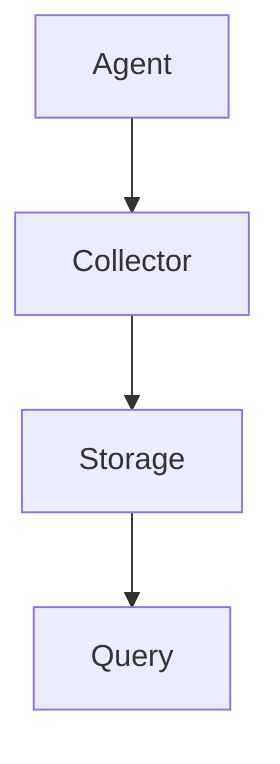

# AI系统Jaeger原理与代码实战案例讲解

## 1.背景介绍

在当今的技术世界中，人工智能（AI）系统已经成为各行各业的核心驱动力。无论是自动驾驶、医疗诊断还是金融分析，AI系统都在不断地改变我们的生活和工作方式。Jaeger是一个专为分布式系统设计的开源端到端分布式追踪系统，它在监控和调试复杂的微服务架构中发挥了重要作用。本文将深入探讨Jaeger的原理、核心算法、数学模型，并通过实际代码示例展示其应用。

## 2.核心概念与联系

### 2.1 分布式追踪

分布式追踪是一种用于监控和调试分布式系统的方法。它通过记录和分析系统中各个服务之间的调用关系，帮助开发者了解系统的运行状态和性能瓶颈。

### 2.2 Jaeger的基本架构

Jaeger的架构主要包括以下几个组件：

- **Agent**：运行在每个主机上的守护进程，负责接收追踪数据并将其转发到Collector。
- **Collector**：接收Agent发送的追踪数据，并将其存储到后端存储系统中。
- **Query**：提供一个用户界面，允许用户查询和分析追踪数据。
- **Storage**：存储追踪数据的后端系统，可以是Cassandra、Elasticsearch等。

### 2.3 追踪数据模型

Jaeger使用一种称为“Span”的数据结构来表示一次分布式调用。每个Span包含以下信息：

- **Trace ID**：唯一标识一次完整的分布式调用。
- **Span ID**：唯一标识一次具体的服务调用。
- **Parent Span ID**：标识当前Span的父Span。
- **Operation Name**：当前Span所代表的操作名称。
- **Start Time**和**Duration**：表示操作的开始时间和持续时间。

### 2.4 核心联系

Jaeger的各个组件通过网络进行通信，Agent将追踪数据发送到Collector，Collector将数据存储到后端存储系统，Query从存储系统中查询数据并展示给用户。以下是Jaeger的基本架构图：



## 3.核心算法原理具体操作步骤

### 3.1 数据收集

Jaeger的Agent运行在每个主机上，负责收集本地服务的追踪数据。Agent通过UDP协议接收来自应用程序的Span数据，并将其批量发送到Collector。

### 3.2 数据处理

Collector接收到Agent发送的Span数据后，会对其进行处理和验证。Collector会将Span数据进行聚合，并根据Trace ID将相关的Span数据关联起来。

### 3.3 数据存储

处理后的Span数据会被存储到后端存储系统中。Jaeger支持多种存储后端，包括Cassandra、Elasticsearch等。存储系统需要具备高可用性和高性能，以便能够快速存储和查询大量的追踪数据。

### 3.4 数据查询

用户可以通过Jaeger的Query组件查询和分析追踪数据。Query组件提供了一个用户友好的界面，允许用户根据Trace ID、时间范围、操作名称等条件进行查询。

### 3.5 数据展示

查询到的追踪数据会以图形化的方式展示给用户。用户可以通过图形界面查看每个Span的详细信息，包括开始时间、持续时间、操作名称等。

## 4.数学模型和公式详细讲解举例说明

### 4.1 追踪数据的数学表示

在数学上，我们可以将一次分布式调用表示为一个有向无环图（DAG），其中每个节点表示一个Span，每条边表示一次服务调用。假设我们有一个分布式系统，其中包含多个服务，每个服务之间的调用关系可以表示为：

$$
G = (V, E)
$$

其中，$V$表示节点集合，$E$表示边集合。每个节点$u \in V$表示一个Span，每条边$(u, v) \in E$表示从节点$u$到节点$v$的调用关系。

### 4.2 追踪数据的聚合

为了分析系统的性能瓶颈，我们需要对追踪数据进行聚合。假设我们有一组Span数据$S = \{s_1, s_2, \ldots, s_n\}$，每个Span包含开始时间$start_i$和持续时间$duration_i$。我们可以计算每个Span的结束时间：

$$
end_i = start_i + duration_i
$$

### 4.3 性能分析

为了分析系统的性能瓶颈，我们可以计算每个Span的响应时间和调用频率。假设我们有一组Span数据$S = \{s_1, s_2, \ldots, s_n\}$，每个Span包含开始时间$start_i$和结束时间$end_i$。我们可以计算每个Span的响应时间：

$$
response\_time_i = end_i - start_i
$$

我们还可以计算每个操作的调用频率：

$$
frequency(op) = \frac{count(op)}{total\_time}
$$

其中，$count(op)$表示操作$op$的调用次数，$total\_time$表示总的时间范围。

## 5.项目实践：代码实例和详细解释说明

### 5.1 环境搭建

首先，我们需要搭建Jaeger的运行环境。可以使用Docker来快速搭建Jaeger的各个组件。以下是一个简单的Docker Compose文件：

```yaml
version: '3'
services:
  jaeger:
    image: jaegertracing/all-in-one:1.22
    ports:
      - "5775:5775/udp"
      - "6831:6831/udp"
      - "6832:6832/udp"
      - "5778:5778"
      - "16686:16686"
      - "14268:14268"
      - "14250:14250"
      - "9411:9411"
```

### 5.2 代码示例

以下是一个使用Jaeger进行分布式追踪的Python示例代码：

```python
from jaeger_client import Config
import time

def init_jaeger_tracer(service_name='my_service'):
    config = Config(
        config={
            'sampler': {'type': 'const', 'param': 1},
            'logging': True,
        },
        service_name=service_name,
    )
    return config.initialize_tracer()

def main():
    tracer = init_jaeger_tracer()
    with tracer.start_span('first_span') as span:
        span.set_tag('example_tag', 'example_value')
        time.sleep(1)
        with tracer.start_span('second_span', child_of=span) as child_span:
            child_span.log_kv({'event': 'example_event', 'value': 42})
            time.sleep(2)
    tracer.close()

if __name__ == '__main__':
    main()
```

### 5.3 代码解释

1. **初始化Jaeger Tracer**：通过`init_jaeger_tracer`函数初始化Jaeger Tracer。
2. **创建Span**：使用`tracer.start_span`创建一个新的Span，并设置标签和日志。
3. **嵌套Span**：在第一个Span内部创建一个子Span，表示一次嵌套的服务调用。
4. **关闭Tracer**：在程序结束时关闭Tracer，确保所有的Span数据都被发送到Jaeger。

## 6.实际应用场景

### 6.1 微服务架构

在微服务架构中，每个服务都是独立部署和运行的，服务之间通过网络进行通信。Jaeger可以帮助开发者监控和调试微服务之间的调用关系，识别性能瓶颈和故障点。

### 6.2 云原生应用

云原生应用通常运行在动态和分布式的环境中，使用容器和编排工具进行管理。Jaeger可以与Kubernetes等编排工具集成，提供对云原生应用的全面监控和追踪。

### 6.3 大数据处理

在大数据处理系统中，数据处理任务通常分布在多个节点上运行。Jaeger可以帮助开发者追踪和分析数据处理任务的执行情况，优化数据处理流程。

## 7.工具和资源推荐

### 7.1 Jaeger官方文档

Jaeger的官方文档提供了详细的使用指南和API参考，是学习和使用Jaeger的最佳资源。

### 7.2 OpenTracing

OpenTracing是一个开源的分布式追踪标准，Jaeger是其实现之一。了解OpenTracing的概念和标准有助于更好地理解Jaeger的工作原理。

### 7.3 Prometheus

Prometheus是一个开源的监控系统和时间序列数据库，可以与Jaeger集成，提供更全面的监控和告警功能。

## 8.总结：未来发展趋势与挑战

### 8.1 未来发展趋势

随着分布式系统和微服务架构的普及，分布式追踪技术将变得越来越重要。未来，Jaeger可能会进一步