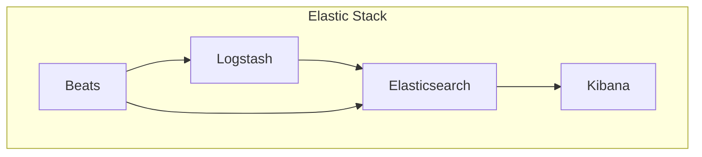

# AI系统Kibana原理与代码实战案例讲解

## 1.背景介绍

在当今数据爆炸时代，海量数据的存储、分析和可视化已成为企业和组织面临的重大挑战。Kibana作为Elastic Stack中的数据可视化和探索工具,为用户提供了强大的数据分析和可视化功能,使其能够从复杂的数据集中获取洞见和价值。

Kibana最初是作为Elasticsearch的配套工具而开发的,用于查询和可视化存储在Elasticsearch中的数据。随着时间的推移,Kibana已经发展成为一个独立的数据探索和可视化平台,支持多种数据源,包括Elasticsearch、Logstash、Beats等。

在大数据和人工智能(AI)时代,Kibana扮演着关键角色,它为数据科学家、分析师和工程师提供了强大的工具,帮助他们探索、分析和可视化复杂的数据集,从而发现隐藏的模式和洞见。无论是在日志分析、安全分析、业务智能还是机器学习等领域,Kibana都发挥着重要作用。

## 2.核心概念与联系

### 2.1 Elastic Stack

Kibana是Elastic Stack的核心组件之一。Elastic Stack是一套开源的数据分析和可视化平台,由以下几个核心组件组成:

- Elasticsearch: 一个分布式、RESTful风格的搜索和分析引擎,用于存储和索引结构化和非结构化数据。
- Logstash: 一个数据处理管道,用于从各种数据源收集、转换和传输数据到Elasticsearch。
- Beats: 一组轻量级数据发送器,用于从边缘机器(如服务器、容器或虚拟机)安全地传输数据到Logstash或Elasticsearch。
- Kibana: 一个用于可视化Elasticsearch数据的Web界面,提供搜索、查看、交互和可视化数据的功能。

这些组件紧密集成,共同构建了一个强大的数据分析和可视化平台。数据通过Beats或Logstash收集并传输到Elasticsearch进行存储和索引,然后由Kibana进行可视化和探索。



### 2.2 Kibana的核心功能

Kibana提供了多种功能,帮助用户探索和可视化数据,包括:

- **Discover**: 用于搜索、浏览和探索存储在Elasticsearch中的数据。
- **Visualize**: 使用各种图表类型(如柱状图、折线图、饼图等)创建交互式数据可视化。
- **Dashboard**: 将多个可视化组合在一个仪表板中,提供统一的数据视图。
- **Canvas**: 一个功能强大的数据演示工具,用于创建动态数据演示文稿。
- **Maps**: 在地理空间上可视化数据,支持多种地图层和样式。
- **Machine Learning**: 集成了Elasticsearch的机器学习功能,用于anomaly检测和数据分析。
- **Dev Tools**: 一个集成的控制台,用于与Elasticsearch进行交互和调试。

这些功能使Kibana成为一个全面的数据探索和可视化工具,满足了各种数据分析和报告需求。

## 3.核心算法原理具体操作步骤

### 3.1 Elasticsearch查询语言

Kibana的数据探索和可视化功能基于Elasticsearch的查询语言。Elasticsearch提供了一种灵活且功能强大的查询语言,称为Query DSL(Domain Specific Language),用于对索引中的数据执行搜索和聚合操作。

Query DSL由两个主要部分组成:

1. **Leaf Query Clauses**: 用于查询特定字段或值的查询子句,例如`match`、`term`、`range`等。
2. **Compound Query Clauses**: 用于组合多个查询子句的复合查询子句,例如`bool`、`boosting`、`constant_score`等。

以下是一个简单的查询示例,用于搜索标题中包含"elasticsearch"的文档:

```json
GET /_search
{
  "query": {
    "match": {
      "title": "elasticsearch"
    }
  }
}
```

在Kibana中,用户可以使用Discover应用程序或Dev Tools控制台直接执行Elasticsearch查询。

### 3.2 数据可视化

Kibana提供了多种可视化类型,用于将数据以图形和图表的形式呈现。以下是一些常见的可视化类型:

- **Data Table**: 以表格形式显示数据。
- **Metric**: 显示单个数值指标,例如总和、平均值或计数。
- **Pie Chart**: 使用饼图显示数据的比例分布。
- **Vertical Bar Chart**: 使用垂直条形图显示数据的分类分布。
- **Line Chart**: 使用折线图显示数据的趋势或时间序列。
- **Area Chart**: 使用面积图显示数据的累积趋势或时间序列。
- **Markdown**: 使用Markdown语法显示富文本内容。

要创建可视化,用户需要定义一个Elasticsearch查询,指定要可视化的数据源和聚合方式。Kibana会根据查询结果自动渲染可视化图形。

### 3.3 仪表板和Canvas

Kibana允许用户将多个可视化组合在一个仪表板中,提供统一的数据视图。仪表板可以包含各种可视化类型,如图表、指标和地图,并支持过滤器和查询控制。

Canvas是Kibana中一个强大的数据演示工具,用于创建动态和交互式的数据演示文稿。它提供了一个灵活的画布,用户可以在其中布置各种元素,如文本、图像、指标和图表,并使用表达式语言定义元素的行为和交互。

## 4.数学模型和公式详细讲解举例说明

在Kibana中,数学模型和公式主要用于机器学习和高级分析任务。Elasticsearch提供了一个称为X-Pack的扩展包,其中包含了机器学习功能。

### 4.1 异常检测

Elasticsearch的机器学习模块支持异常检测,可以自动学习数据的正常模式,并检测异常值或异常行为。异常检测广泛应用于各种场景,如安全分析、系统监控和欺诈检测等。

异常检测算法基于以下数学模型:

$$
s(t) = p(t) + \epsilon(t)
$$

其中,\(s(t)\)表示观测到的数据序列,\(p(t)\)表示数据的正常模式,\(\epsilon(t)\)表示异常分量。

算法的目标是从观测数据\(s(t)\)中分离出正常模式\(p(t)\)和异常分量\(\epsilon(t)\)。常用的异常检测算法包括:

- **单变量异常检测**: 适用于单个时间序列的异常检测,例如网络流量或系统指标。
- **多变量异常检测**: 适用于多个相关时间序列的异常检测,例如服务器指标集群。
- **人口统计数据异常检测**: 专门用于检测人口统计数据(如年龄、性别等)中的异常值。

### 4.2 回归分析

Kibana还支持回归分析,用于建立数据特征之间的关系模型。回归分析常用于预测和时间序列分析。

线性回归是最常见的回归技术,其数学模型如下:

$$
y = \beta_0 + \beta_1 x_1 + \beta_2 x_2 + ... + \beta_n x_n + \epsilon
$$

其中,\(y\)是因变量,\(x_1, x_2, ..., x_n\)是自变量,\(\beta_0, \beta_1, ..., \beta_n\)是回归系数,\(\epsilon\)是残差项。

算法的目标是通过最小化残差平方和来估计回归系数\(\beta\)。

$$
\min \sum_{i=1}^{m} (y_i - (\beta_0 + \beta_1 x_{i1} + \beta_2 x_{i2} + ... + \beta_n x_{in}))^2
$$

其中,\(m\)是观测值的数量。

除了线性回归,Kibana还支持其他回归技术,如逻辑回归、决策树回归和随机森林回归等。

## 5.项目实践:代码实例和详细解释说明

在本节中,我们将通过一个实际项目案例来演示如何使用Kibana进行数据探索和可视化。我们将使用一个开源的电子商务数据集,并展示如何使用Kibana的各种功能来分析和可视化这些数据。

### 5.1 数据集介绍

我们将使用一个名为"Brazilian E-Commerce Public Dataset by Olist"的开源电子商务数据集。该数据集包含了一家巴西电子商务公司Olist在2016至2018年期间的订单数据,涵盖了订单、客户、产品、卖家、评论等多个方面的信息。

数据集可以从Kaggle网站下载:https://www.kaggle.com/olistbr/brazilian-ecommerce

### 5.2 数据导入

首先,我们需要将数据导入到Elasticsearch中。有多种方式可以实现这一点,例如使用Logstash、Beats或Elasticsearch的批量API。在本示例中,我们将使用Elasticsearch的批量API直接导入数据。

以下是一个Python脚本示例,用于将CSV文件中的数据批量导入到Elasticsearch:

```python
from elasticsearch import Elasticsearch
import csv

# 创建Elasticsearch客户端
es = Elasticsearch()

# 定义索引名称和类型
index_name = 'ecommerce'
doc_type = 'orders'

# 打开CSV文件
with open('orders.csv', 'r') as f:
    reader = csv.DictReader(f)
    bulk_data = []

    # 遍历CSV行并构建批量数据
    for row in reader:
        data = {
            '_index': index_name,
            '_type': doc_type,
            '_source': row
        }
        bulk_data.append(data)

    # 使用批量API导入数据
    if bulk_data:
        res = es.bulk(index=index_name, body=bulk_data)
        print(f'Imported {res["items"]} documents')
```

在导入数据之后,我们就可以在Kibana中探索和可视化这些数据了。

### 5.3 数据探索

在Kibana的Discover应用程序中,我们可以搜索和浏览存储在Elasticsearch中的数据。以下是一个示例查询,用于搜索特定订单ID的订单详情:

```json
GET /ecommerce/_search
{
  "query": {
    "match": {
      "order_id": "e481f51cbdc54678b7cc49136f2d6af7"
    }
  }
}
```

我们还可以使用Discover应用程序的各种过滤器和聚合功能来进一步探索数据。例如,我们可以按照订单状态、客户位置或产品类别等维度对数据进行分组和统计。

### 5.4 数据可视化

在Kibana的Visualize应用程序中,我们可以创建各种图表和可视化来呈现数据。以下是一个示例,展示如何创建一个柱状图来可视化每个城市的订单数量:

1. 在Visualize应用程序中,选择"Create new visualization"。
2. 选择"Vertical Bar"作为可视化类型。
3. 在"Metrics & Buckets"部分,选择"X-Axis"作为"Buckets"类型,并选择"Split Rows"作为"Aggregation"。在"Field"中选择"customer_city"字段。
4. 在"Metrics & Buckets"部分,选择"Y-Axis"作为"Metrics"类型,并选择"Count"作为"Aggregation"。
5. 点击"Apply changes"按钮,Kibana将根据查询结果渲染柱状图。

我们还可以通过添加过滤器、自定义图表样式和配置其他选项来进一步自定义可视化效果。

### 5.5 仪表板和报告

在Kibana的Dashboard应用程序中,我们可以将多个可视化组合在一个仪表板中,提供统一的数据视图。以下是一个示例仪表板,包含了订单数量、销售额、顾客评论等多个可视化:


我们还可以使用Kibana的报告功能,将仪表板导出为PDF或PNG格式的报告,方便共享和发布。

## 6.实际应用场景

Kibana作为一个强大的数据探索和可视化平台,在各种领域都有广泛的应用场景。以下是一些常见的应用场景:

### 6.1 日志分析

在IT