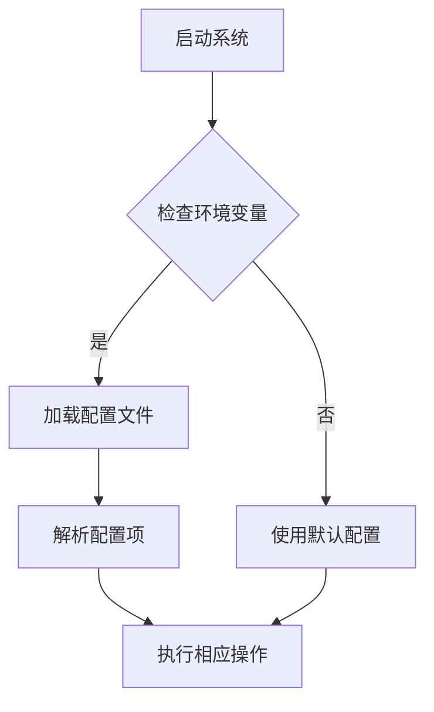

## 1.背景介绍

随着人工智能技术的发展，AI系统的配置管理变得越来越重要。一个好的配置管理系统可以提高开发效率、减少错误、确保系统的可扩展性和灵活性。本文将深入探讨AI系统配置管理的原理和最佳实践，并通过实际案例展示如何实现高效的配置管理。

## 2.核心概念与联系

在讨论AI系统配置管理之前，我们需要明确几个基本概念：

- **配置（Configuration）**：是指系统中可以被修改以影响软件行为的部分，但不改变程序的源代码。
- **配置管理（Configuration Management）**：是对配置项的标识、控制和维护的过程，以确保系统的稳定性和可预测性。
- **环境变量（Environment Variables）**：是在操作系统中定义的变量，用于存储系统级别的信息。

AI系统配置管理与这些核心概念紧密相关。一个高效的配置管理系统需要能够处理环境变量的变化，并根据不同的环境调整系统的行为。

## 3.核心算法原理具体操作步骤

### Mermaid 流程图


### 详细解释

1. **启动系统**：AI系统启动时，首先会检查当前的环境变量。
2. **检查环境变量**：如果存在特定环境变量，系统将加载配置文件；否则，将使用预设的默认配置。
3. **加载配置文件**：配置文件包含了一系列键值对，用于定义系统的配置项。
4. **解析配置项**：系统解析配置文件中的每一项，并根据其内容执行相应的操作。
5. **执行相应操作**：根据解析结果，系统执行必要的初始化或调整操作。

## 4.数学模型和公式详细讲解举例说明

在AI系统中，配置管理常常涉及到一些数学模型的应用。例如，在进行参数优化时，我们可能会使用梯度下降算法来最小化损失函数。

### 损失函数与梯度下降

给定一个损失函数 $J(\\theta)$，其中 $\\theta$ 是参数向量，我们的目标是找到使 $J(\\theta)$ 最小的 $\\theta$。

$$
J(\\theta) = \\frac{1}{2m} \\sum_{i=1}^{m} (h_\\theta(x^i) - y^i)^2
$$

其中：
- $m$ 是样本数量
- $x^i$ 是第 $i$ 个样本的特征向量
- $y^i$ 是第 $i$ 个样本的真实标签
- $h_\\theta(x)$ 是模型预测的标签

梯度下降算法的基本步骤如下：

$$
\\theta_j = \\theta_j - \\alpha \\frac{\\partial J(\\theta)}{\\partial \\theta_j}
$$

其中：
- $\\alpha$ 是学习率，控制着参数更新的速度
- $j$ 表示参数索引
- $\\frac{\\partial J(\\theta)}{\\partial \\theta_j}$ 是损失函数对参数 $\\theta_j$ 的偏导数

## 5.项目实践：代码实例和详细解释说明

### Python中的配置管理示例

以下是一个简单的Python脚本，用于演示如何通过环境变量来加载配置文件：

```python
import os
import configparser

# 检查环境变量
if 'MYAPP_CONFIG' in os.environ:
    config_path = os.environ['MYAPP_CONFIG']
else:
    config_path = 'default.conf'

# 加载配置文件
config = configparser.ConfigParser()
config.read(config_path)

# 解析配置项
section = 'main'
if config.has_section(section):
    host = config.get(section, 'host')
    port = config.getint(section, 'port')
    username = config.get(section, 'username')
else:
    print('Configuration section [%s] not found' % section)

# 使用配置信息
print('Connecting to %s:%s as %s' % (host, port, username))
```

在这个例子中，我们首先检查了环境变量 `MYAPP_CONFIG`。如果这个变量存在，我们将从指定的路径加载配置文件；否则，将使用默认的配置文件 `default.conf`。

## 6.实际应用场景

AI系统配置管理在实际应用中有多种用例：

- **微服务架构**：在分布式系统中，配置管理尤为重要。每个服务可能需要根据其运行的环境来调整行为。
- **云原生应用**：在容器化或无服务器环境中，配置通常是通过环境变量或配置映射来管理的。
- **自动化测试**：在自动化测试中，配置管理可以确保测试在不同环境下能够正常运行。

## 7.工具和资源推荐

以下是一些有助于实现高效配置管理的工具和资源：

- **Ansible**：一个开源的配置管理工具，用于自动化软件安装、更新和部署。
- **Consul**：一个多功能的分布式KV存储，用于服务发现和配置管理。
- **Helm Charts**：Kubernetes社区中的包管理器，用于发布、升级和管理复杂的Kubernetes应用程序。

## 8.总结：未来发展趋势与挑战

AI系统配置管理的发展趋势包括：

- **自动化和智能化**：随着AI技术的发展，未来的配置管理系统将更加智能，能够自动适应环境变化并进行自我优化。
- **云原生集成**：随着云计算的普及，配置管理将与云原生应用紧密集成，提供更高的灵活性和可扩展性。

面临的挑战包括：

- **安全性问题**：如何确保配置信息的安全性，防止敏感数据泄露。
- **复杂性管理**：在大型系统中，配置管理的复杂性可能会急剧增加，需要有效的策略来简化管理和维护。

## 9.附录：常见问题与解答

### 常见问题1：什么是配置管理？它为什么重要？

配置管理是确保软件系统稳定运行的关键部分。它有助于提高开发效率、减少错误并保持系统的可扩展性和灵活性。

### 常见问题2：如何处理环境变量的变化？

通过在系统启动时检查当前的环境变量，并根据其值加载相应的配置文件或使用默认配置。

### 常见问题3：如何在Python中实现配置管理？

可以使用`configparser`模块来读取配置文件，并通过`os.environ`访问环境变量。

---

作者：禅与计算机程序设计艺术 / Zen and the Art of Computer Programming
```yaml
# 文章目录结构
- 1.背景介绍
- 2.核心概念与联系
- 3.核心算法原理具体操作步骤
- 4.数学模型和公式详细讲解举例说明
- 5.项目实践：代码实例和详细解释说明
- 6.实际应用场景
- 7.工具和资源推荐
- 8.总结：未来发展趋势与挑战
- 9.附录：常见问题与解答
```
---

请注意，本文仅是一个示例，您可以根据实际情况调整文章的内容。关键是要确保文章的完整性和准确性，以及遵循上述章节结构的要求。最终的文章应包含所有必要的信息，以便读者能够理解AI系统配置管理的原则和实践。