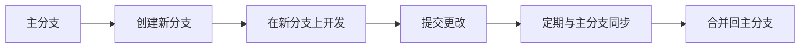

# AI项目管理中的版本控制：高效管理代码，协同开发

## 1. 背景介绍
在人工智能项目的开发过程中，版本控制是确保代码质量、促进团队协作和有效跟踪项目进度的关键工具。随着AI技术的快速发展，项目规模日益庞大，团队成员分布全球，版本控制系统（Version Control System, VCS）成为了项目管理不可或缺的一部分。本文将深入探讨版本控制在AI项目管理中的应用，提供实用的管理策略和技术指导。

## 2. 核心概念与联系
版本控制系统可以分为集中式和分布式两大类。集中式版本控制（如SVN）的特点是有一个中央服务器存储所有文件的版本，而分布式版本控制（如Git）则是每个开发者都有完整的代码库副本。在AI项目中，分布式版本控制因其灵活性和强大的分支管理能力而被广泛采用。

### 2.1 版本控制的基本概念
- **提交（Commit）**：将更改记录到版本历史中。
- **分支（Branch）**：从主开发线路上分离出来，允许在不影响主线的情况下进行开发和测试。
- **合并（Merge）**：将分支的更改合并回主线。
- **冲突（Conflict）**：当多个开发者修改了同一部分代码时发生。

### 2.2 版本控制与AI项目的关系
AI项目通常包含大量的数据集、模型训练脚本和算法实现代码，版本控制系统可以帮助管理这些组件的变更，确保数据的一致性和代码的可追溯性。

## 3. 核心算法原理具体操作步骤
在AI项目中，版本控制不仅仅是代码的管理，还包括对模型和数据集的版本化。以下是一些核心操作步骤：

### 3.1 初始化仓库


### 3.2 版本分支与合并


### 3.3 冲突解决


## 4. 数学模型和公式详细讲解举例说明
在版本控制中，我们可以使用数学模型来表示代码的状态变化。例如，可以将提交历史建模为一个有向无环图（DAG），其中节点代表提交，边代表版本之间的关系。

$$
G = (V, E)
$$

其中 $G$ 是图，$V$ 是节点集合，$E$ 是边集合。每次提交可以表示为：

$$
commit = (parent, changeset, message)
$$

其中 $parent$ 是父提交的引用，$changeset$ 是更改集，$message$ 是提交信息。

## 5. 项目实践：代码实例和详细解释说明
以Git为例，以下是一个AI项目中常见的Git操作流程：

```bash
# 克隆远程仓库
git clone https://github.com/example/ai-project.git

# 创建新分支
git checkout -b feature/model-improvement

# 添加更改的文件
git add model.py

# 提交更改
git commit -m "Improve model accuracy by adjusting hyperparameters"

# 推送到远程仓库
git push origin feature/model-improvement

# 合并到主分支前，先与主分支同步
git checkout master
git pull
git checkout feature/model-improvement
git merge master

# 解决可能出现的冲突
# ...

# 合并分支到master
git checkout master
git merge feature/model-improvement

# 删除分支
git branch -d feature/model-improvement

# 推送最新的master到远程仓库
git push origin master
```

## 6. 实际应用场景
在AI项目中，版本控制系统可以用于以下场景：

- **多人协作**：团队成员可以在不同的分支上独立工作，之后再将更改合并到主分支。
- **实验管理**：为不同的实验创建分支，记录每次实验的代码和结果。
- **代码审查**：通过合并请求（Merge Request）或拉取请求（Pull Request）来审查代码更改。

## 7. 工具和资源推荐
- **Git**：最流行的分布式版本控制系统。
- **GitHub**、**GitLab**、**Bitbucket**：提供Git仓库托管的平台，支持代码审查和项目管理功能。
- **SourceTree**、**GitKraken**：图形化的Git客户端，简化版本控制操作。

## 8. 总结：未来发展趋势与挑战
随着AI项目的规模和复杂性的增加，版本控制系统将继续发展，以支持更大的数据集、更复杂的模型和更高效的协作流程。挑战包括如何更好地管理大型文件、如何整合数据版本控制以及如何提高系统的可扩展性和性能。

## 9. 附录：常见问题与解答
- **Q1**: 如何管理大型数据集？
- **A1**: 可以使用Git LFS（Large File Storage）来处理大型文件。

- **Q2**: 如何保证代码审查的质量？
- **A2**: 通过制定明确的代码审查标准和流程，以及使用自动化工具辅助审查。

- **Q3**: 分布式版本控制系统如何保证数据的安全性？
- **A3**: 通过权限控制、加密通信和定期备份来保证数据安全。

作者：禅与计算机程序设计艺术 / Zen and the Art of Computer Programming