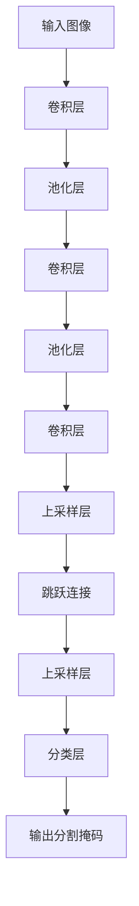

# FCN原理与代码实例讲解

## 1.背景介绍

全卷积网络(Fully Convolutional Networks, FCN)是一种用于语义分割任务的深度学习模型。语义分割是计算机视觉领域的一个重要任务,旨在对图像中的每个像素进行分类,将图像像素划分为不同的语义类别,如人、车辆、道路等。传统的卷积神经网络在分类任务上表现出色,但在像素级别的密集预测任务上存在局限性。FCN则通过有效地利用卷积网络的强大特征提取能力,同时采用一些创新的技术来解决语义分割任务,成为该领域的开创性工作。

## 2.核心概念与联系

### 2.1 FCN架构

FCN的核心思想是将传统的卷积神经网络中的全连接层替换为卷积层,使整个网络变成一个全卷积结构。这种结构允许输入图像的空间维度在网络中保持不变,从而可以对任意尺寸的输入图像进行像素级别的预测。

FCN的基本架构如下所示:



1. **卷积层**: 用于提取图像特征,通常使用VGG或ResNet等预训练模型作为基础。
2. **池化层**: 用于降低特征图的空间分辨率,减少计算量。
3. **上采样层**: 通过反卷积(也称为转置卷积)或其他插值方法将特征图的空间分辨率恢复到输入图像的尺寸。
4. **跳跃连接**: 将浅层特征图与上采样后的深层特征图进行融合,以保留更多的空间信息。
5. **分类层**: 对每个像素进行分类,输出语义分割掩码。

### 2.2 跳跃连接

跳跃连接是FCN中一个关键的创新点。由于卷积和池化操作会导致特征图的空间分辨率下降,直接对深层特征图进行上采样可能会丢失细节信息。跳跃连接通过将浅层特征图与上采样后的深层特征图进行融合,有效地保留了空间细节信息。

### 2.3 端到端训练

FCN采用端到端的训练方式,将整个网络作为一个整体进行优化。这种方式避免了传统分割方法中多个阶段的误差累积,提高了模型的性能和鲁棒性。

## 3.核心算法原理具体操作步骤

FCN的核心算法原理可以概括为以下几个步骤:

1. **特征提取**: 使用预训练的卷积神经网络(如VGG或ResNet)作为基础,对输入图像进行特征提取。这一步通过卷积和池化操作获得不同尺度的特征图。

2. **上采样**: 对深层特征图进行上采样,将其空间分辨率恢复到与输入图像相同的尺寸。常用的上采样方法包括反卷积(转置卷积)和双线性插值。

3. **跳跃连接**: 将上采样后的深层特征图与对应的浅层特征图进行融合,以保留更多的空间细节信息。

4. **分类**: 对融合后的特征图进行像素级别的分类,输出每个像素所属的语义类别。这一步通常使用1×1卷积核进行分类。

5. **损失计算**: 计算预测的分割结果与Ground Truth之间的损失,常用的损失函数包括交叉熵损失和Dice损失等。

6. **反向传播**: 根据计算得到的损失,利用反向传播算法更新网络的参数。

7. **迭代训练**: 重复执行上述步骤,直到模型收敛或达到预期性能。

以上步骤可以通过端到端的方式进行训练,使整个网络能够有效地学习图像的语义分割任务。

## 4.数学模型和公式详细讲解举例说明

在FCN中,有几个关键的数学模型和公式需要详细讲解。

### 4.1 卷积操作

卷积操作是FCN中最基础的操作之一。给定输入特征图 $X$ 和卷积核 $K$,卷积操作可以表示为:

$$
Y_{i,j} = \sum_{m}\sum_{n}X_{m,n}K_{i-m,j-n}
$$

其中 $Y$ 是输出特征图, $i,j$ 是输出特征图的像素坐标, $m,n$ 是卷积核的坐标。卷积操作实现了特征提取和权重共享,是FCN能够有效学习图像特征的关键。

### 4.2 池化操作

池化操作用于降低特征图的空间分辨率,减少计算量。最常用的池化方法是最大池化,它的数学表达式为:

$$
Y_{i,j} = \max_{(m,n) \in R_{i,j}}X_{m,n}
$$

其中 $R_{i,j}$ 表示输入特征图 $X$ 上的池化区域,通常为2×2或3×3的窗口。最大池化操作保留了每个池化区域内的最大值,从而实现了特征的下采样。

### 4.3 反卷积(转置卷积)

反卷积是FCN中用于上采样的关键操作。给定输入特征图 $X$ 和卷积核 $K$,反卷积操作可以表示为:

$$
Y_{i,j} = \sum_{m}\sum_{n}X_{m,n}K_{i-m\times stride,j-n\times stride}
$$

其中 $stride$ 是步长,用于控制输出特征图的空间分辨率。反卷积操作通过插值和卷积的方式,将特征图的空间分辨率放大到所需的尺寸。

### 4.4 跳跃连接

跳跃连接是FCN中一个关键的创新点,它通过将浅层特征图与上采样后的深层特征图进行融合,保留了更多的空间细节信息。跳跃连接的数学表达式可以表示为:

$$
Y = f(X_1, X_2)
$$

其中 $X_1$ 是浅层特征图, $X_2$ 是上采样后的深层特征图, $f$ 是融合函数,通常采用元素级别的相加或concatenate操作。

### 4.5 损失函数

FCN中常用的损失函数包括交叉熵损失和Dice损失等。

交叉熵损失的数学表达式为:

$$
L = -\sum_{i=1}^{N}\sum_{c=1}^{C}y_{i,c}\log(p_{i,c})
$$

其中 $N$ 是像素数量, $C$ 是类别数量, $y_{i,c}$ 是Ground Truth中第 $i$ 个像素属于第 $c$ 类的标记(0或1), $p_{i,c}$ 是模型预测第 $i$ 个像素属于第 $c$ 类的概率。

Dice损失的数学表达式为:

$$
L = 1 - \frac{2\sum_{i=1}^{N}p_{i}y_{i}}{\sum_{i=1}^{N}p_{i}+\sum_{i=1}^{N}y_{i}}
$$

其中 $p_{i}$ 和 $y_{i}$ 分别表示模型预测和Ground Truth中第 $i$ 个像素的值。Dice损失常用于评估分割结果与Ground Truth之间的重合程度。

通过上述数学模型和公式,FCN能够有效地学习图像的语义分割任务,实现端到端的像素级别预测。

## 5.项目实践:代码实例和详细解释说明

在这一部分,我们将提供一个基于PyTorch的FCN代码实例,并对关键部分进行详细解释。

### 5.1 导入必要的库

```python
import torch
import torch.nn as nn
import torch.nn.functional as F
```

### 5.2 定义FCN模型

```python
class FCN(nn.Module):
    def __init__(self, n_classes):
        super(FCN, self).__init__()
        
        # 使用预训练的VGG16作为基础网络
        vgg = models.vgg16(pretrained=True)
        features = list(vgg.features.children())
        
        self.conv_block1 = nn.Sequential(*features[:5])
        self.conv_block2 = nn.Sequential(*features[5:10])
        self.conv_block3 = nn.Sequential(*features[10:17])
        
        # 替换VGG16的全连接层为卷积层
        self.conv4 = nn.Conv2d(512, 512, kernel_size=3, padding=1)
        self.conv5 = nn.Conv2d(512, 512, kernel_size=3, padding=1)
        
        # 转置卷积层用于上采样
        self.upsample5 = nn.ConvTranspose2d(512, 512, kernel_size=2, stride=2)
        self.upsample4 = nn.ConvTranspose2d(512, 256, kernel_size=2, stride=2)
        self.upsample3 = nn.ConvTranspose2d(256, 128, kernel_size=2, stride=2)
        self.upsample2 = nn.ConvTranspose2d(128, 64, kernel_size=2, stride=2)
        self.upsample1 = nn.ConvTranspose2d(64, 64, kernel_size=2, stride=2)
        
        # 分类层
        self.classifier = nn.Conv2d(64, n_classes, kernel_size=1)
        
    def forward(self, x):
        # 编码器部分
        conv1 = self.conv_block1(x)
        conv2 = self.conv_block2(conv1)
        conv3 = self.conv_block3(conv2)
        conv4 = F.relu(self.conv4(conv3))
        conv5 = F.relu(self.conv5(conv4))
        
        # 解码器部分
        up5 = self.upsample5(conv5)
        up4 = self.upsample4(F.relu(up5 + conv4))
        up3 = self.upsample3(F.relu(up4 + conv3))
        up2 = self.upsample2(F.relu(up3 + conv2))
        up1 = self.upsample1(F.relu(up2 + conv1))
        
        # 分类层
        out = self.classifier(up1)
        
        return out
```

在上面的代码中,我们定义了FCN模型的结构。主要步骤如下:

1. 使用预训练的VGG16作为基础网络,提取图像特征。
2. 将VGG16的全连接层替换为卷积层,实现全卷积结构。
3. 定义转置卷积层,用于上采样特征图。
4. 在解码器部分,利用跳跃连接将浅层特征图与上采样后的深层特征图进行融合。
5. 最后使用1×1卷积核进行像素级别的分类。

### 5.3 训练和测试

```python
# 定义损失函数和优化器
criterion = nn.CrossEntropyLoss()
optimizer = optim.Adam(model.parameters(), lr=0.001)

# 训练循环
for epoch in range(num_epochs):
    for inputs, labels in train_loader:
        inputs, labels = inputs.to(device), labels.to(device)
        
        # 前向传播
        outputs = model(inputs)
        loss = criterion(outputs, labels)
        
        # 反向传播和优化
        optimizer.zero_grad()
        loss.backward()
        optimizer.step()
        
    # 测试
    model.eval()
    with torch.no_grad():
        for inputs, labels in test_loader:
            inputs, labels = inputs.to(device), labels.to(device)
            outputs = model(inputs)
            # 计算指标
            ...
```

在上面的代码中,我们展示了如何进行FCN模型的训练和测试。主要步骤包括:

1. 定义损失函数(如交叉熵损失)和优化器(如Adam优化器)。
2. 在训练循环中,对每个批次的数据进行前向传播、计算损失、反向传播和优化。
3. 在测试阶段,将模型设置为评估模式,并在测试数据集上进行前向传播,计算相关指标(如准确率、IoU等)。

以上代码只是一个简单的示例,在实际应用中还需要进行数据预处理、模型保存和加载、超参数调整等操作。

## 6.实际应用场景

FCN在语义分割领域有着广泛的应用,包括但不限于以下场景:

1. **自动驾驶**: 在自动驾驶系统中,语义分割可以用于识别道路、行人、车辆等关键目标,为决策和规划提供重要信息。

2. **医疗影像分析**: 通过对医学影像(如CT、MRI等)进行语义分割,可以自