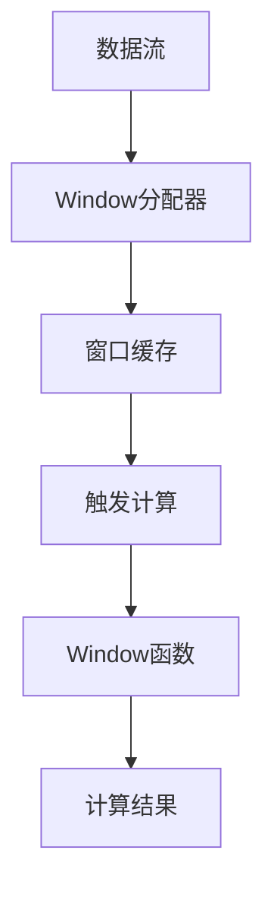

# Flink Window原理与代码实例讲解

## 1.背景介绍

### 1.1 流式计算的兴起

随着大数据时代的到来,数据量呈现爆炸式增长,传统的批处理模式已经无法满足实时数据处理的需求。流式计算(Stream Processing)应运而生,它能够实时处理持续到来的数据流,并及时产出计算结果。流式计算在物联网、电信计费、在线广告、金融风控等领域发挥着重要作用。

### 1.2 Flink 简介

Apache Flink 是一个分布式、高性能、高可靠的流式数据处理引擎,具有低延迟、高吞吐、精确一次语义等优点。Flink 不仅支持纯流式计算,还支持批流统一的数据处理范式。Flink 的核心是流式数据的窗口(Window)计算,本文将重点介绍 Flink Window 的原理和使用方法。

## 2.核心概念与联系

### 2.1 Window 概念

Window 是指逻辑上对无限数据流进行切分,从而获取有限大小的数据集合(称为窗口)。每个窗口包含特定时间范围内的数据,可以在窗口上进行计算操作,例如求和、计数等。Window 是实现有状态计算的关键。

### 2.2 Window 类型

Flink 支持以下几种常用的 Window 类型:

#### 2.2.1 时间窗口(Time Window)

根据时间范围对数据流进行切分,包括:

- 滚动时间窗口(Tumbling Time Window):无重叠的时间窗口
- 滑动时间窗口(Sliding Time Window):有固定时间重叠的窗口
- 会话窗口(Session Window):以不活动时间段为界,对活动期数据进行分组

#### 2.2.2 计数窗口(Count Window)  

根据元素个数对数据流进行切分,包括:

- 滚动计数窗口(Tumbling Count Window)
- 滑动计数窗口(Sliding Count Window)

### 2.3 Window 分配器

Window 分配器(Window Assigner)负责将每个数据元素分配到对应的窗口中。常用的分配器有:

- 时间窗口分配器(Tumbling/Sliding/Session Window Assigner)
- 计数窗口分配器(Tumbling/Sliding Count Window Assigner)

### 2.4 Window 函数

Window 函数用于对窗口中的数据进行计算,Flink 提供了丰富的窗口函数,如 ReduceFunction、AggregateFunction、FoldFunction 等。开发者也可以自定义窗口函数。

## 3.核心算法原理具体操作步骤

### 3.1 Window 操作流程

Flink 中 Window 操作的核心流程如下:



1. 数据流中的每个元素通过 Window 分配器分配到对应的窗口
2. 窗口缓存暂存属于该窗口的所有数据元素
3. 当窗口触发计算条件满足时,执行 Window 函数对窗口数据进行计算
4. 产生计算结果,输出或进行下游计算

### 3.2 窗口触发计算条件

窗口何时触发计算是 Window 操作的关键,Flink 支持以下几种触发条件:

#### 3.2.1 基于时间的触发

- 对于时间窗口,当 Watermark 超过窗口的结束时间时,触发该窗口计算
- 对于会话窗口,当数据在一定时间内没有到达时,触发该窗口计算

#### 3.2.2 基于计数的触发  

对于计数窗口,当窗口中元素个数达到计数阈值时,触发该窗口计算

#### 3.2.3 其他触发条件

- 处理时间超时触发
- 主动触发(通过侧输出流)

### 3.3 增量聚合

对于可交换可并行的聚合函数(如 ReduceFunction),Flink 采用增量聚合的方式,可以有效减少状态大小:

1. 对于每个 Key,维护一个局部聚合值
2. 当触发窗口计算时,将局部聚合值发送到下游任务进行全局聚合

这种方式避免了在窗口计算时重新聚合所有数据,从而降低了状态存储开销。

## 4.数学模型和公式详细讲解举例说明

### 4.1 Window 模型

假设数据流为 $\{x_t\}_{t \in \mathbb{N}}$,其中 $x_t$ 表示第 $t$ 个时间点的数据元素。对于给定的 Window 函数 $f$,窗口起始时间 $s$ 和窗口长度 $w$,窗口计算可以表示为:

$$
y_t = f(\{x_i\}_{s \le i \le t-w+1})
$$

其中 $y_t$ 为第 $t$ 个时间点的计算结果。

### 4.2 滚动窗口示例

对于滚动时间窗口,假设窗口长度为 $w$,则第 $t$ 个窗口的计算结果为:

$$
y_t = f(\{x_i\}_{t-w+1 \le i \le t})
$$

例如,对于求和函数 $f(X) = \sum_{x \in X} x$,窗口长度为 3,数据流为 $\{1, 2, 3, 4, 5, 6\}$,则各个窗口的计算结果为:

$$
\begin{aligned}
y_1 &= f(\{1\}) = 1\\
y_2 &= f(\{2\}) = 2\\
y_3 &= f(\{3\}) = 3\\
y_4 &= f(\{1, 2, 3\}) = 6\\
y_5 &= f(\{2, 3, 4\}) = 9\\
y_6 &= f(\{3, 4, 5\}) = 12\\
y_7 &= f(\{4, 5, 6\}) = 15
\end{aligned}
$$

### 4.3 滑动窗口示例

对于滑动时间窗口,假设窗口长度为 $w$,滑动步长为 $s$,则第 $t$ 个窗口的计算结果为:

$$
y_t = f(\{x_i\}_{t-w+1 \le i \le t-w+s})
$$

例如,对于求和函数 $f(X) = \sum_{x \in X} x$,窗口长度为 4,滑动步长为 2,数据流为 $\{1, 2, 3, 4, 5, 6\}$,则各个窗口的计算结果为:

$$
\begin{aligned}
y_1 &= f(\{1, 2, 3, 4\}) = 10\\
y_2 &= f(\{3, 4, 5, 6\}) = 18
\end{aligned}
$$

## 5.项目实践：代码实例和详细解释说明

### 5.1 环境准备

```xml
<!-- Flink依赖 -->
<dependency>
    <groupId>org.apache.flink</groupId>
    <artifactId>flink-streaming-java</artifactId>
    <version>1.13.0</version>
</dependency>
```

### 5.2 滚动时间窗口示例

```java
// 创建流执行环境
StreamExecutionEnvironment env = StreamExecutionEnvironment.getExecutionEnvironment();

// 从socket读取数据流
DataStream<String> text = env.socketTextStream("localhost", 9999);

// 将字符串转换为整数
DataStream<Integer> nums = text.map(new MapFunction<String, Integer>() {
    @Override
    public Integer map(String value) throws Exception {
        return Integer.parseInt(value);
    }
});

// 定义10秒的滚动时间窗口，并求和
DataStream<Integer> sumStream = nums
    .keyBy(num -> true) // 为所有数据分配同一个key
    .window(TumblingEventTimeWindows.of(Time.seconds(10))) // 10秒滚动窗口
    .sum(0); // 对窗口数据求和,初始值为0

// 打印结果
sumStream.print();

env.execute("Tumbling Time Window");
```

上述代码定义了一个10秒的滚动时间窗口,对窗口内的数据求和。其中:

1. `keyBy(num -> true)`为所有数据分配同一个 key,使所有数据进入同一个窗口
2. `TumblingEventTimeWindows.of(Time.seconds(10))`创建10秒的滚动时间窗口
3. `sum(0)`使用 sum 函数对窗口数据求和,初始值为 0

### 5.3 滑动时间窗口示例  

```java
DataStream<Integer> sumStream = nums
    .keyBy(num -> true)
    .window(SlidingEventTimeWindows.of(Time.seconds(10), Time.seconds(5))) // 10秒窗口,5秒滑动
    .sum(0);
```

上述代码定义了一个窗口长度为10秒,滑动步长为5秒的滑动时间窗口,对窗口内数据求和。

`SlidingEventTimeWindows.of(Time.seconds(10), Time.seconds(5))`创建了一个长度为10秒,滑动步长为5秒的滑动窗口。

### 5.4 会话窗口示例

```java
DataStream<Integer> sumStream = nums
    .keyBy(num -> true)
    .window(EventTimeSessionWindows.withGap(Time.seconds(5))) // 5秒会话间隔
    .sum(0);
```

上述代码定义了一个会话窗口,如果5秒内没有新数据到达,则触发计算。

`EventTimeSessionWindows.withGap(Time.seconds(5))`创建了一个会话间隔为5秒的会话窗口。

### 5.5 计数窗口示例

```java
DataStream<Integer> sumStream = nums
    .keyBy(num -> true)
    .countWindow(5) // 计数窗口长度为5
    .sum(0);
```

上述代码定义了一个长度为5的滚动计数窗口,对窗口内数据求和。

`countWindow(5)`创建了一个长度为5的滚动计数窗口。

## 6.实际应用场景

### 6.1 电商用户行为分析

通过分析用户的浏览、购买等行为数据,可以对用户进行精准营销。例如,对最近一小时内浏览过某商品的用户发送折扣优惠信息。可以使用滑动时间窗口来实现这一需求。

### 6.2 网络流量监控

对网络流量进行实时监控,当流量在一段时间内超过阈值时,发出报警。可以使用滚动时间窗口或会话窗口来统计一段时间内的流量。

### 6.3 物联网数据处理

物联网设备产生大量实时数据流,需要对这些数据进行处理、分析。例如,统计一段时间内某传感器的平均值、最大值等,可以使用滚动时间窗口或滑动时间窗口。

### 6.4 金融实时计算

在金融领域,需要对实时到来的交易数据进行风控、欺诈检测等。可以使用会话窗口对用户的交易行为进行分析,发现异常交易模式。

## 7.工具和资源推荐

### 7.1 Flink 官方文档

Apache Flink 官方文档(https://nightlies.apache.org/flink/flink-docs-release-1.13/)提供了详细的概念介绍、API使用说明和最佳实践。

### 7.2 Flink 训练营

华为云的 Flink 训练营(https://edu.huaweicloud.com/courses/course-v1:HuaweiX+CBUCNXE032+Self-paced/about)包含了系列视频课程,涵盖 Flink 核心概念、API 使用、性能优化等内容。

### 7.3 开源项目

- Apache Bahir: Flink 流批一体的机器学习框架
- Flink ML: Flink 机器学习库

### 7.4 书籍资料

- 《Stream Processing with Apache Flink》
- 《数据算法》

## 8.总结:未来发展趋势与挑战

### 8.1 流批一体

未来,流式计算和批处理计算将进一步融合,实现真正的流批一体架构。Flink 已经支持批流统一的处理范式,但在性能、API 等方面还有待优化。

### 8.2 流式机器学习

结合流式计算和机器学习算法,实现对实时数据流的在线学习和预测,将是未来的发展趋势之一。Flink 已经在这方面做了一些尝试,但距离产品化应用还有一定距离。

### 8.3 状态管理

有状态的流式计算对状态管理提出了更高的要求,需要在高可用、高吞吐、低延迟等方面