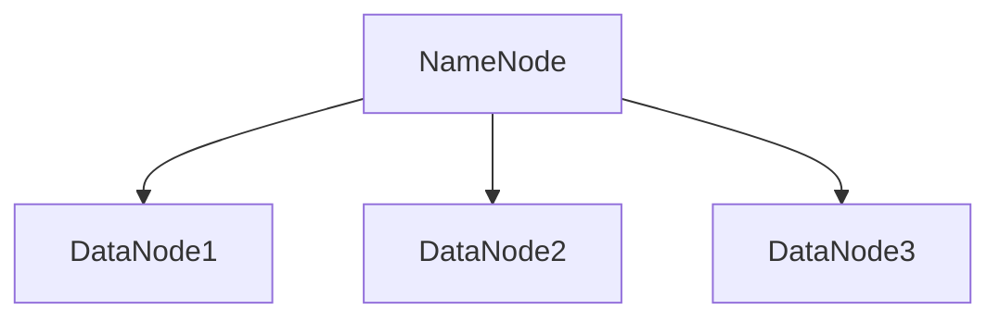
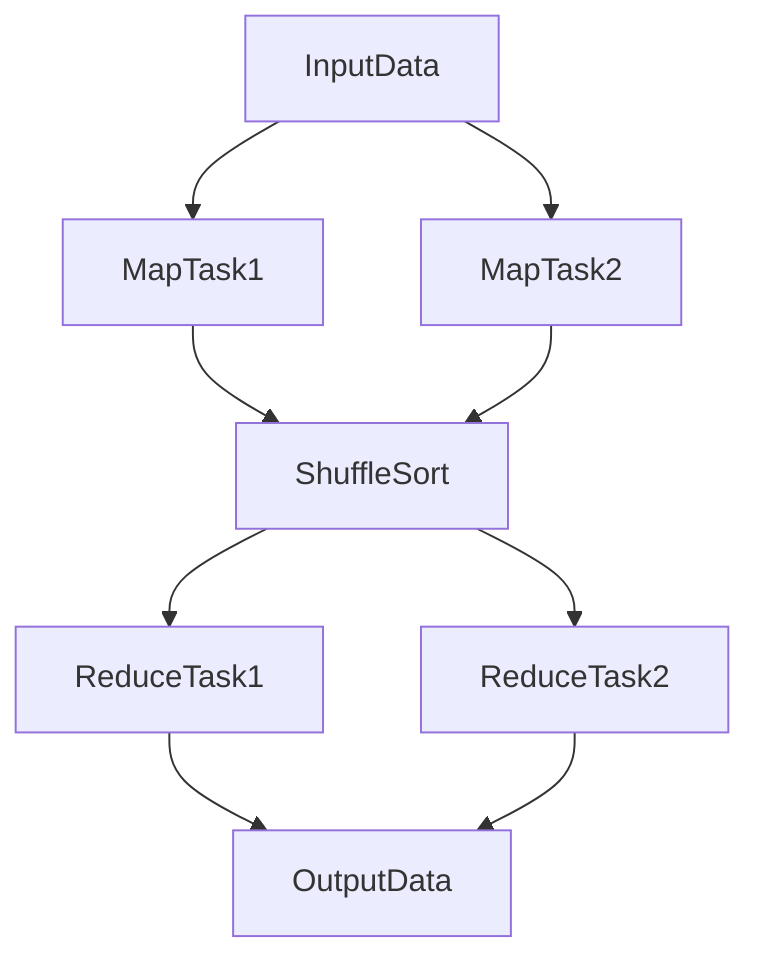
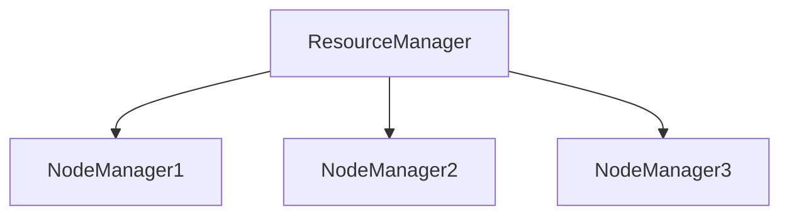

# Hadoop 原理与代码实例讲解

## 1.背景介绍

### 1.1 大数据时代的到来

随着互联网、物联网和移动设备的普及，数据量呈现爆炸式增长。传统的单机处理方式已经无法满足海量数据的存储和计算需求。大数据技术应运而生，Hadoop作为其中的代表性技术，提供了分布式存储和计算的解决方案。

### 1.2 Hadoop的诞生与发展

Hadoop最初由Doug Cutting和Mike Cafarella开发，灵感来源于Google的MapReduce和GFS（Google File System）论文。2006年，Hadoop成为Apache的顶级项目，并迅速发展成为大数据处理的事实标准。

### 1.3 Hadoop的核心组件

Hadoop主要由两个核心组件组成：HDFS（Hadoop Distributed File System）和MapReduce。HDFS负责分布式存储，而MapReduce负责分布式计算。除此之外，Hadoop生态系统还包括许多其他工具和框架，如Hive、Pig、HBase等。

## 2.核心概念与联系

### 2.1 HDFS：分布式文件系统

HDFS是Hadoop的分布式文件系统，设计用于在大规模集群上存储海量数据。它具有高容错性和高吞吐量的特点，能够在廉价的硬件上运行。

#### 2.1.1 HDFS架构

HDFS采用主从架构，由一个NameNode和多个DataNode组成。NameNode负责管理文件系统的元数据，而DataNode负责存储实际的数据块。



#### 2.1.2 数据存储与复制

HDFS将文件分割成多个数据块（默认64MB或128MB），并将每个数据块复制到多个DataNode上，以提高容错性和数据可用性。

### 2.2 MapReduce：分布式计算模型

MapReduce是Hadoop的分布式计算框架，基于“Map”和“Reduce”两个阶段来处理大规模数据集。它的核心思想是将复杂的计算任务分解为多个简单的任务，并在集群中并行执行。

#### 2.2.1 Map阶段

在Map阶段，输入数据被分割成多个小片段，每个片段由一个Map任务处理。Map任务将输入数据转换为键值对。

#### 2.2.2 Shuffle和Sort阶段

在Map阶段之后，MapReduce框架会对键值对进行Shuffle和Sort操作，将相同键的值聚集在一起。

#### 2.2.3 Reduce阶段

在Reduce阶段，Reduce任务对聚集后的键值对进行处理，生成最终的输出结果。



### 2.3 YARN：资源管理与调度

YARN（Yet Another Resource Negotiator）是Hadoop的资源管理和调度框架。它将资源管理和任务调度分离，使得Hadoop可以支持多种计算框架。

#### 2.3.1 YARN架构

YARN由ResourceManager和NodeManager组成。ResourceManager负责全局资源管理和任务调度，而NodeManager负责单个节点的资源管理和任务执行。



## 3.核心算法原理具体操作步骤

### 3.1 HDFS文件读写流程

#### 3.1.1 文件写入流程

1. 客户端向NameNode请求上传文件。
2. NameNode检查文件是否存在，并返回DataNode列表。
3. 客户端将文件分块，并将数据块写入DataNode。
4. DataNode将数据块复制到其他DataNode。
5. NameNode更新元数据。

#### 3.1.2 文件读取流程

1. 客户端向NameNode请求读取文件。
2. NameNode返回文件的元数据和DataNode列表。
3. 客户端从DataNode读取数据块。

### 3.2 MapReduce作业执行流程

#### 3.2.1 作业提交

1. 客户端向YARN的ResourceManager提交作业。
2. ResourceManager分配资源，并启动ApplicationMaster。

#### 3.2.2 Map任务执行

1. ApplicationMaster向NodeManager请求启动Map任务。
2. Map任务读取输入数据，生成键值对。
3. Map任务将键值对写入本地磁盘。

#### 3.2.3 Shuffle和Sort

1. Map任务完成后，MapReduce框架对键值对进行Shuffle和Sort。
2. 将相同键的值聚集在一起。

#### 3.2.4 Reduce任务执行

1. ApplicationMaster向NodeManager请求启动Reduce任务。
2. Reduce任务读取Shuffle和Sort后的数据，生成最终输出。

## 4.数学模型和公式详细讲解举例说明

### 4.1 HDFS的副本策略

HDFS通过副本策略来提高数据的容错性和可用性。假设一个文件被分成 $n$ 个数据块，每个数据块有 $r$ 个副本，则总的存储空间需求为 $n \times r$。

### 4.2 MapReduce的计算复杂度

假设输入数据集大小为 $D$，Map任务数为 $M$，Reduce任务数为 $R$，则MapReduce的计算复杂度可以表示为：

$$
T_{total} = T_{map} + T_{shuffle} + T_{reduce}
$$

其中，$T_{map}$ 是Map阶段的时间复杂度，$T_{shuffle}$ 是Shuffle和Sort阶段的时间复杂度，$T_{reduce}$ 是Reduce阶段的时间复杂度。

### 4.3 负载均衡与数据局部性

Hadoop通过负载均衡和数据局部性来提高计算效率。假设集群中有 $N$ 个节点，每个节点的计算能力为 $C$，则总的计算能力为 $N \times C$。通过将计算任务分配到数据所在的节点，可以减少数据传输，提高计算效率。

## 5.项目实践：代码实例和详细解释说明

### 5.1 HDFS操作示例

#### 5.1.1 文件上传

```java
import org.apache.hadoop.conf.Configuration;
import org.apache.hadoop.fs.FileSystem;
import org.apache.hadoop.fs.Path;

public class HDFSUpload {
    public static void main(String[] args) throws Exception {
        Configuration conf = new Configuration();
        FileSystem fs = FileSystem.get(conf);
        Path src = new Path("/local/path/to/file");
        Path dst = new Path("/hdfs/path/to/file");
        fs.copyFromLocalFile(src, dst);
        fs.close();
    }
}
```

#### 5.1.2 文件读取

```java
import org.apache.hadoop.conf.Configuration;
import org.apache.hadoop.fs.FileSystem;
import org.apache.hadoop.fs.Path;
import org.apache.hadoop.io.IOUtils;

import java.io.InputStream;

public class HDFSRead {
    public static void main(String[] args) throws Exception {
        Configuration conf = new Configuration();
        FileSystem fs = FileSystem.get(conf);
        Path path = new Path("/hdfs/path/to/file");
        InputStream in = fs.open(path);
        IOUtils.copyBytes(in, System.out, 4096, false);
        in.close();
        fs.close();
    }
}
```

### 5.2 MapReduce示例

#### 5.2.1 WordCount示例

```java
import org.apache.hadoop.conf.Configuration;
import org.apache.hadoop.fs.Path;
import org.apache.hadoop.io.IntWritable;
import org.apache.hadoop.io.Text;
import org.apache.hadoop.mapreduce.Job;
import org.apache.hadoop.mapreduce.Mapper;
import org.apache.hadoop.mapreduce.Reducer;
import org.apache.hadoop.mapreduce.lib.input.FileInputFormat;
import org.apache.hadoop.mapreduce.lib.output.FileOutputFormat;

import java.io.IOException;
import java.util.StringTokenizer;

public class WordCount {
    public static class TokenizerMapper extends Mapper<Object, Text, Text, IntWritable> {
        private final static IntWritable one = new IntWritable(1);
        private Text word = new Text();

        public void map(Object key, Text value, Context context) throws IOException, InterruptedException {
            StringTokenizer itr = new StringTokenizer(value.toString());
            while (itr.hasMoreTokens()) {
                word.set(itr.nextToken());
                context.write(word, one);
            }
        }
    }

    public static class IntSumReducer extends Reducer<Text, IntWritable, Text, IntWritable> {
        private IntWritable result = new IntWritable();

        public void reduce(Text key, Iterable<IntWritable> values, Context context) throws IOException, InterruptedException {
            int sum = 0;
            for (IntWritable val : values) {
                sum += val.get();
            }
            result.set(sum);
            context.write(key, result);
        }
    }

    public static void main(String[] args) throws Exception {
        Configuration conf = new Configuration();
        Job job = Job.getInstance(conf, "word count");
        job.setJarByClass(WordCount.class);
        job.setMapperClass(TokenizerMapper.class);
        job.setCombinerClass(IntSumReducer.class);
        job.setReducerClass(IntSumReducer.class);
        job.setOutputKeyClass(Text.class);
        job.setOutputValueClass(IntWritable.class);
        FileInputFormat.addInputPath(job, new Path(args[0]));
        FileOutputFormat.setOutputPath(job, new Path(args[1]));
        System.exit(job.waitForCompletion(true) ? 0 : 1);
    }
}
```

## 6.实际应用场景

### 6.1 数据仓库

Hadoop可以用作数据仓库，存储和处理海量的结构化和非结构化数据。通过Hive和Pig等工具，可以方便地进行数据查询和分析。

### 6.2 日志分析

Hadoop在日志分析中有广泛应用。通过MapReduce，可以高效地处理和分析服务器日志、应用日志等，提取有价值的信息。

### 6.3 机器学习

Hadoop可以用于大规模机器学习任务。通过Mahout等工具，可以在Hadoop集群上运行各种机器学习算法，如聚类、分类、推荐等。

### 6.4 图数据处理

Hadoop可以用于处理大规模图数据。通过Giraph等工具，可以在Hadoop集群上运行图算法，如PageRank、最短路径等。

## 7.工具和资源推荐

### 7.1 开发工具

- **Eclipse/IntelliJ IDEA**：Java开发的集成开发环境（IDE）。
- **Hadoop Eclipse Plugin**：用于在Eclipse中开发和调试Hadoop应用程序。

### 7.2 数据处理工具

- **Hive**：基于Hadoop的数据仓库工具，提供SQL查询功能。
- **Pig**：用于分析大规模数据集的高层次数据流语言。
- **HBase**：Hadoop生态系统中的分布式数据库。

### 7.3 资源推荐

- **《Hadoop: The Definitive Guide》**：Hadoop权威指南，详细介绍了Hadoop的各个方面。
- **Apache Hadoop官网**：提供Hadoop的最新版本、文档和社区支持。

## 8.总结：未来发展趋势与挑战

### 8.1 未来发展趋势

随着大数据技术的不断发展，Hadoop也在不断演进。未来，Hadoop将更加注重性能优化、资源管理和易用性。同时，Hadoop生态系统将继续扩展，支持更多的数据处理和分析工具。

### 8.2 面临的挑战

尽管Hadoop在大数据处理方面有显著优势，但也面临一些挑战。例如，Hadoop的学习曲线较陡，配置和管理复杂。此外，随着数据量的不断增长，如何提高Hadoop的性能和可扩展性也是一个重要问题。

## 9.