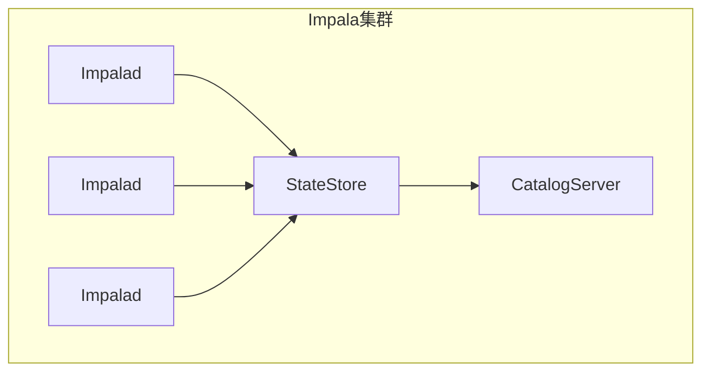

# Impala原理与代码实例讲解

## 1.背景介绍

### 1.1 大数据时代的到来

随着互联网、物联网、社交网络等新兴技术的迅猛发展,数据量呈现出爆炸式增长。根据国际数据公司(IDC)的预测,到2025年,全球数据总量将达到175ZB(1ZB=1万亿TB)。传统的数据库系统在存储和处理如此庞大的数据集时,已经捉襟见肘,无法满足实时查询分析的需求。这促使了大数据技术的兴起和发展。

### 1.2 大数据处理的演进

为了应对大数据挑战,业界先后提出了MapReduce、Spark等分布式计算框架,用于并行处理海量数据。然而,这些通用计算框架在处理交互式数据分析查询时,性能和效率都不尽如人意。为了更好地支持大数据分析,出现了一系列专门的大数据分析型数据库和SQL查询引擎,如Hive、Impala、Presto等。它们在保留SQL的易用性的同时,提供了高并发、低延迟的交互式查询能力。

### 1.3 Impala的诞生

Impala由Cloudera公司于2012年推出,是最早的大数据分析型查询引擎之一。它集成了Google的Dremel查询引擎和Parliamentary函数式语言的核心思想,并针对大数据场景进行了优化和改进。Impala的设计目标是提供低延迟、高吞吐量的SQL查询服务,支持对存储在Hadoop生态系统中的海量数据进行实时分析。

## 2.核心概念与联系

### 2.1 Impala架构概览

Impala采用无共享架构,由三个主要组件构成:

1. **Impala Daemon(Impalad)**:负责接收查询请求、协调查询执行、管理查询资源等。
2. **StateStore**:存储集群元数据和运行时状态。
3. **Catalog Server**:管理Impala的元数据,如表、视图、函数等。



### 2.2 查询执行流程

1. 客户端提交SQL查询到任意一个Impalad实例。
2. Impalad解析SQL,生成执行计划,并与其他Impalad实例协调任务划分。
3. 每个Impalad启动多个执行线程,并行读取和处理HDFS数据块。
4. 中间结果通过数据管道在执行线程间传递和合并。
5. 最终结果返回给客户端。


### 2.3 Impala与Hadoop生态圈集成

Impala与Hadoop生态系统高度集成,可以无缝访问HDFS、HBase、Hive等数据源。它支持大多数Hive文件格式,如Parquet、ORC、Avro等,并可重用Hive的元数据、UDF等。这种紧密集成使Impala可以充分利用Hadoop生态系统的数据和资源,提供统一的SQL查询服务。

## 3.核心算法原理具体操作步骤  

### 3.1 查询解析与优化

Impala使用ANTLR和LLVM技术实现高效的SQL解析和代码生成。查询解析分为以下几个阶段:

1. **词法分析**:将SQL语句拆分为一系列标记(token)。
2. **语法分析**:根据SQL语法规则构建语法树。
3. **语义分析**:验证语法树的正确性,解析表名、列名等对象引用。
4. **逻辑优化**:对语法树进行一系列等价变换,如投影剪裁、谓词下推等。
5. **物理优化**:为逻辑计划选择最优的物理执行策略。
6. **代码生成**:利用LLVM生成高度优化的机器码。

### 3.2 并行执行引擎

Impala采用无共享架构,查询执行由多个执行线程并行完成:

1. **协调器线程**:负责解析SQL、生成执行计划、协调任务划分。
2. **扫描线程**:并行读取HDFS数据块,执行投影、过滤等操作。
3. **交换线程**:通过数据管道在执行线程间传输中间结果。
4. **合并线程**:合并来自多个执行线程的中间结果。

这种无共享架构避免了中央节点的瓶颈,提高了并行度和吞吐量。

### 3.3 代码内联和向量化

Impala广泛采用了代码内联和向量化技术,以提高CPU利用率:

1. **代码内联**:在编译期间将函数调用内联到调用点,减少函数调用开销。
2. **向量化**:以SIMD指令集批量方式处理数据,充分利用现代CPU的并行能力。

这些技术使Impala在处理批量数据时,能够最大限度地利用现代硬件的计算能力。

### 3.4 数据管道

Impala使用高效的数据管道在执行线程间传输中间结果,避免了不必要的数据写入和读取:

1. **无盘传输**:中间结果直接在内存中流动,无需写入磁盘。
2. **编解码**:使用高效的行批(RowBatch)数据格式传输数据。
3. **流控**:通过反压机制控制发送速率,避免接收端缓冲区溢出。

数据管道架构确保了高效的数据传输,降低了查询延迟。

## 4.数学模型和公式详细讲解举例说明

### 4.1 代价模型

Impala的查询优化器使用基于代价的搜索策略选择最优执行计划。它基于以下代价模型估算每个候选计划的代价:

$$
Cost = \sum\limits_{i=1}^{n}(CPU\_Cost_i + IO\_Cost_i + Transfer\_Cost_i)
$$

其中:

- $CPU\_Cost_i$表示第i个操作符的CPU代价
- $IO\_Cost_i$表示第i个操作符的IO代价
- $Transfer\_Cost_i$表示第i个操作符的数据传输代价
- n为查询计划中操作符的总数

每个操作符的代价由其输入大小、选择率、执行效率等多个因素决定。优化器会搜索所有可能的执行计划,选择代价最小的作为最优计划。

### 4.2 数据分区

Impala支持基于范围、HASH或计算列的数据分区,以提高查询效率。对于范围分区,Impala使用以下公式计算每个分区的边界:

$$
boundary_i = min + (max - min) \times \frac{i}{num\_partitions}
$$

其中:

- $boundary_i$表示第i个分区的边界值
- $min$和$max$分别为最小值和最大值
- $num\_partitions$为分区数量

对于HASH分区,Impala使用以下公式计算每个值的HASH桶:

$$
hash\_bucket = hash(value) \% num\_buckets
$$

其中:

- $hash\_bucket$表示值的HASH桶编号
- $hash(value)$为对值应用的HASH函数
- $num\_buckets$为HASH桶的总数

通过数据分区,Impala可以跳过不相关的数据块,提高查询效率。

## 5.项目实践:代码实例和详细解释说明

本节将通过一个简单的数据分析项目,演示如何使用Impala进行交互式SQL查询。我们将使用Impala查询一个包含航班延误信息的数据集,并对查询性能进行分析和优化。

### 5.1 环境准备

1. 下载并解压Impala二进制包。
2. 启动Impala集群服务(Impalad、StateStore、Catalog Server)。
3. 使用`impala-shell`连接到Impala集群。

### 5.2 创建表

我们首先需要在Impala中创建表来存储航班延误数据。数据文件`flight_delays.parquet`位于HDFS的`/data`路径下,使用Parquet列式存储格式。

```sql
CREATE EXTERNAL TABLE flight_delays (
  year INT,
  month INT,
  day INT,
  day_of_week INT,
  airline STRING,
  flight_num INT,
  origin_airport STRING,
  dest_airport STRING,
  departure_delay INT,
  arrival_delay INT
)
STORED AS PARQUET
LOCATION '/data/flight_delays';
```

### 5.3 交互式查询分析

接下来,我们可以使用SQL查询对航班延误数据进行分析。

#### 5.3.1 查找最大延误航班

```sql
SELECT airline, flight_num, origin_airport, dest_airport,
       departure_delay, arrival_delay
FROM flight_delays
ORDER BY arrival_delay DESC
LIMIT 10;
```

该查询返回到达延误时间最长的前10个航班。我们可以观察到,某些航班的到达延误时间超过了8小时。

#### 5.3.2 统计延误航班数量

```sql
SELECT airline, count(*) as num_delays
FROM flight_delays
WHERE departure_delay > 0 OR arrival_delay > 0  
GROUP BY airline
ORDER BY num_delays DESC;
```

该查询统计了每家航空公司延误航班的数量,并按延误航班数量降序排列。通过这个查询,我们可以发现哪些航空公司的航班较容易延误。

#### 5.3.3 分析延误原因

```sql
WITH flight_stats AS (
  SELECT airline, origin_airport, dest_airport,
         avg(departure_delay) as avg_dep_delay,
         avg(arrival_delay) as avg_arr_delay
  FROM flight_delays
  GROUP BY airline, origin_airport, dest_airport
)
SELECT airline, origin_airport, dest_airport,
       avg_dep_delay, avg_arr_delay
FROM flight_stats
WHERE avg_dep_delay > 30 OR avg_arr_delay > 30
ORDER BY avg_arr_delay DESC;
```

这个查询使用了公用表表达式(CTE),首先计算每条航线的平均起飞延误和到达延误时间,然后筛选出平均延误时间超过30分钟的航线。通过分析这些航线的延误情况,我们可以发现导致延误的潜在原因,如天气、机场拥堵等。

### 5.4 查询性能分析

Impala提供了`EXPLAIN`和`SUMMARY`命令,用于分析查询的执行计划和性能特征。

#### 5.4.1 查看执行计划

```sql
EXPLAIN SELECT airline, count(*) as num_delays
FROM flight_delays
WHERE departure_delay > 0 OR arrival_delay > 0
GROUP BY airline
ORDER BY num_delays DESC;
```

执行该命令后,Impala会输出查询的详细执行计划,包括每个操作符的逻辑和物理实现、数据流程、估计代价等信息。通过分析执行计划,我们可以发现查询的潜在瓶颈,并进行相应的优化。

#### 5.4.2 查看查询摘要

```sql
SELECT airline, count(*) as num_delays
FROM flight_delays
WHERE departure_delay > 0 OR arrival_delay > 0
GROUP BY airline
ORDER BY num_delays DESC;
--- SUMMARY ---
```

执行完查询后,Impala会输出查询摘要信息,包括查询持续时间、读取数据量、内存使用情况等。这些信息有助于我们评估查询的实际性能,并与预期进行对比。

### 5.5 性能优化

根据查询性能分析的结果,我们可以采取以下措施来优化查询性能:

1. **数据分区**:根据查询模式对数据进行分区,减少需要扫描的数据量。
2. **列裁剪**:只读取查询所需的列,避免不必要的IO操作。
3. **代码内联**:启用代码内联优化,减少函数调用开销。
4. **向量化**:启用向量化执行,充分利用CPU的SIMD指令集。
5. **缓存**:对热点数据启用HDFS缓存,减少IO等待时间。

通过上述优化措施,我们可以显著提升Impala查询的性能和效率。

## 6.实际应用场景

Impala广泛应用于各种大数据分析场景,例如:

1. **交互式数据探索**:Impala支持低延迟的ad-hoc查询