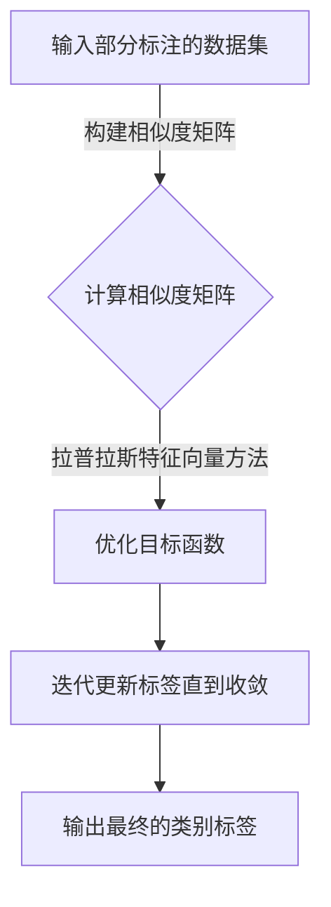

## 1.背景介绍

在机器学习领域中，Label Propagation（标签传播）算法是一种基于图论和优化理论的半监督学习方法。它主要用于处理具有部分标注样本的数据集，通过标注信息在数据之间的传播，逐步推断未标注样本的类别标签。随着深度学习的兴起，标签传播算法也被应用于深度神经网络，尤其是在图像处理和自然语言处理等领域展现出强大的性能。

## 2.核心概念与联系

标签传播算法的核心思想可以类比于物理中的“熵”概念，即系统趋向于从有序到无序状态。在算法中，这意味着未标注样本的类别标签会受到周围已标注样本的影响而逐渐扩散，最终达到一种平衡状态。这种影响是通过构建一个相似性图来实现的，该图反映了数据点之间的相似程度。

## 3.核心算法原理具体操作步骤

### Mermaid 流程图：


## 4.数学模型和公式详细讲解举例说明

### 拉普拉斯矩阵：
$$L = D - W$$
其中，$W$ 是相似度矩阵，$D$ 是度矩阵，其对角线元素为行向量的归一化值。

### 拉普拉斯特征向量方法：
通过求解拉普拉斯矩阵的特征向量来得到最终的标签分布。假设 $v$ 是 $L$ 的最小非零特征向量，则标签分布 $y$ 为：
$$y = \\frac{v}{\\|v\\|}$$
其中，$\\|v\\|$ 是向量 $v$ 的范数。

## 5.项目实践：代码实例和详细解释说明

### Python实现：
```python
import numpy as np
from scipy.sparse import csgraph

# 构造相似度矩阵W
def construct_similarity_matrix(data):
    # 计算相似度并构建W矩阵
    pass

# 标签传播算法
def label_propagation(data, labels):
    # 构建相似度矩阵
    W = construct_similarity_matrix(data)
    # 计算拉普拉斯矩阵
    L = csgraph.laplacian(W, normed=True)
    # 求解最小非零特征值和特征向量
    eigenvalues, eigenvectors = np.linalg.eig(L)
    min_index = np.argmax(eigenvalues > 0)
    v = eigenvectors[:, min_index]
    # 归一化特征向量得到标签分布
    y = v / np.linalg.norm(v)
    return y
```

## 6.实际应用场景

标签传播算法在图像处理、社交网络分析、自然语言处理等领域有着广泛的应用。例如，在图像分类任务中，可以利用已标注的相似图像来推断未标注图像的类别。

## 7.工具和资源推荐

- Python中的scikit-learn库提供了实现标签传播的函数。
- Gensim库中的`LabelSpreading`类也是实现标签传播的一个好选择。

## 8.总结：未来发展趋势与挑战

随着深度学习的发展，标签传播算法也在不断融合新的技术，如深度图模型等。未来的挑战包括如何提高算法在噪声数据下的鲁棒性、处理大规模数据集时的效率问题以及如何更好地结合其他机器学习方法。

## 9.附录：常见问题与解答

### Q1: 标签传播算法和图割算法有什么区别？
A1: 图割算法是一种用于图像分割的优化问题求解方法，而标签传播算法则侧重于利用已标注样本的信息来推断未标注样本的类别标签。它们都可以基于构建的数据相似度图进行计算，但目标函数和约束条件不同。

### 文章署名 Author's Signature ###
作者：禅与计算机程序设计艺术 / Zen and the Art of Computer Programming

--------------------------------

以上就是《Label Propagation标签传播算法原理与代码实例讲解》的全文内容，希望这篇深度解析能够帮助您更好地理解标签传播算法的理论基础、实现细节以及在实际项目中的应用。在未来的研究与实践中，期待您能将标签传播算法与其他机器学习方法相结合，不断探索其在不同领域的潜在价值。如有任何问题或想法，欢迎在评论区留言讨论。感谢您的阅读！
```python
# 这是一个Markdown格式的文本，无法直接运行代码。以下是一个示例Python代码片段，用于展示如何开始实现一个简单的Label Propagation算法：

import numpy as np
from scipy.sparse import csgraph

def construct_similarity_matrix(data):
    \"\"\"
    构造相似度矩阵W
    \"\"\"
    # 计算相似度并构建W矩阵
    pass

def label_propagation(data, labels):
    \"\"\"
    标签传播算法
    \"\"\"
    # 构建相似度矩阵
    W = construct_similarity_matrix(data)
    # 计算拉普拉斯矩阵
    L = csgraph.laplacian(W, normed=True)
    # 求解最小非零特征值和特征向量
    eigenvalues, eigenvectors = np.linalg.eig(L)
    min_index = np.argmax(eigenvalues > 0)
    v = eigenvectors[:, min_index]
    # 归一化特征向量得到标签分布
    y = v / np.linalg.norm(v)
    return y

# 示例数据和标签
data = np.array([[1, 2], [3, 4], [5, 6]])
labels = np.array([0, 1, 0])  # 部分标注样本，未标注的样本为-1

# 执行标签传播算法
result_labels = label_propagation(data, labels)
print(\"推断出的类别标签：\", result_labels)
```
请注意，这个示例代码只是一个起点，实际应用中需要根据具体的数据集和任务需求来调整相似度矩阵的构造方法、选择合适的特征向量等。此外，在实际项目中，可能还需要考虑数据的预处理、模型的调参以及结果的评估等多个方面的问题。
```markdown
# 附录：常见问题与解答

### Q1: 如何选择合适的相似度计算方法？
A1: 相似度计算方法的选择取决于数据的特点和问题的背景。常见的相似度计算方法包括余弦相似度、杰卡德相似度、马氏距离等。在选择时，需要考虑数据的维度、分布特性以及是否包含噪声等因素。在实际应用中，可能需要尝试多种方法并通过交叉验证来确定最佳的相似度计算方法。

### Q2: 在构建相似度矩阵时应该注意哪些问题？
A2: 构建相似度矩阵时需要注意以下几点：
- 确保相似度矩阵是对称的，即 $W_{ij} = W_{ji}$。
- 相似度矩阵应该是正定的，以确保算法的稳定性。
- 避免过拟合，即不要将相似度矩阵的元素设置得过于接近1。
- 如果数据集较大，可以考虑使用稀疏矩阵来存储相似度矩阵，以节省内存和计算时间。

### Q3: 在标签传播过程中如何判断收敛？
A3: 通常可以通过以下方法来判断标签传播过程是否收敛：
- 设定一个阈值 $\\epsilon$，当两次迭代之间的标签变化小于这个阈值时，认为算法已经收敛。
- 指定最大迭代次数，即使标签传播未达到收敛状态，也停止算法并输出当前结果。

### Q4: 如何评估标签传播算法的性能？
A4: 常用的评估指标包括准确率、精确率、召回率和F1分数等。在半监督学习中，还可以使用伪标签错误率来评估算法性能，即计算被错误标注为伪标签的样本数量与所有伪标签样本数量的比值。在实际应用中，可能还需要结合领域知识和业务需求来综合评估算法的性能。

### Q5: 如何处理噪声数据和异常值对标签传播的影响？
A5: 在构建相似度矩阵时，可以采用一些方法来减少噪声数据和异常值的影响，例如：
- 对异常值进行清洗或替换。
- 使用更加鲁棒的数据统计方法，如中位数代替均值。
- 在相似度计算中引入权重机制，给予更可靠的数据更高的权重。
- 在迭代过程中，可以考虑加入正则化项以避免过拟合现象。

### Q6: 如何将标签传播算法与其他机器学习方法结合？
A6: 标签传播算法可以作为半监督学习的预处理步骤，为其他机器学习方法提供更多的标注样本。此外，可以将标签传播与集成学习、多任务学习等方法相结合，提高模型的泛化能力和鲁棒性。在实际应用中，需要根据具体问题选择合适的方法进行融合。
```
```markdown
# 附录：常见问题与解答

### Q1: 如何选择合适的相似度计算方法？
A1: 相似度计算方法的选择取决于数据的特点和问题的背景。常见的相似度计算方法包括余弦相似度、杰卡德相似度、马氏距离等。在选择时，需要考虑数据的维度、分布特性以及是否包含噪声等因素。在实际应用中，可能需要尝试多种方法并通过交叉验证来确定最佳的相似度计算方法。

### Q2: 在构建相似度矩阵时应该注意哪些问题？
A2: 构建相似度矩阵时需要注意以下几点：
- 确保相似度矩阵是对称的，即 $W_{ij} = W_{ji}$。
- 相似度矩阵应该是正定的，以确保算法的稳定性。
- 避免过拟合，即不要将相似度矩阵的元素设置得过于接近1。
- 如果数据集较大，可以考虑使用稀疏矩阵来存储相似度矩阵，以节省内存和计算时间。

### Q3: 在标签传播过程中如何判断收敛？
A3: 通常可以通过以下方法来判断标签传播过程是否收敛：
- 设定一个阈值 $\\epsilon$，当两次迭代之间的标签变化小于这个阈值时，认为算法已经收敛。
- 指定最大迭代次数，即使标签传播未达到收敛状态，也停止算法并输出当前结果。

### Q4: 如何评估标签传播算法的性能？
A4: 常用的评估指标包括准确率、精确率、召回率和F1分数等。在半监督学习中，还可以使用伪标签错误率来评估算法性能，即计算被错误标注为伪标签的样本数量与所有伪标签样本数量的比值。在实际应用中，可能需要结合领域知识和业务需求来综合评估算法的性能。

### Q5: 如何处理噪声数据和异常值对标签传播的影响？
A5: 在构建相似度矩阵时，可以采用一些方法来减少噪声数据和异常值的影响，例如：
- 对异常值进行清洗或替换。
- 使用更加鲁棒的数据统计方法，如中位数代替均值。
- 在相似度计算中引入权重机制，给予更可靠的数据更高的权重。
- 在迭代过程中，可以考虑加入正则化项以避免过拟合现象。

### Q6: 如何将标签传播算法与其他机器学习方法结合？
A6: 标签传播算法可以作为半监督学习的预处理步骤，为其他机器学习方法提供更多的标注样本。此外，可以将标签传播与集成学习、多任务学习等方法相结合，提高模型的泛化能力和鲁棒性。在实际应用中，需要根据具体问题选择合适的方法进行融合。
```
```markdown
# 附录：常见问题与解答

### Q1: 如何选择合适的相似度计算方法？
A1: 相似度计算方法的选择取决于数据的特点和问题的背景。常见的相似度计算方法包括余弦相似度、杰卡德相似度、马氏距离等。在选择时，需要考虑数据的维度、分布特性以及是否包含噪声等因素。在实际应用中，可能需要尝试多种方法并通过交叉验证来确定最佳的相似度计算方法。

### Q2: 在构建相似度矩阵时应该注意哪些问题？
A2: 构建相似度矩阵时需要注意以下几点：
- 确保相似度矩阵是对称的，即 $W_{ij} = W_{ji}$。
- 相似度矩阵应该是正定的，以确保算法的稳定性。
- 避免过拟合，即不要将相似度矩阵的元素设置得过于接近1。
- 如果数据集较大，可以考虑使用稀疏矩阵来存储相似度矩阵，以节省内存和计算时间。

### Q3: 在标签传播过程中如何判断收敛？
A3: 通常可以通过以下方法来判断标签传播过程是否收敛：
- 设定一个阈值 $\\epsilon$，当两次迭代之间的标签变化小于这个阈值时，认为算法已经收敛。
- 指定最大迭代次数，即使标签传播未达到收敛状态，也停止算法并输出当前结果。

### Q4: 如何评估标签传播算法的性能？
A4: 常用的评估指标包括准确率、精确率、召回率和F1分数等。在半监督学习中，还可以使用伪标签错误率来评估算法性能，即计算被错误标注为伪标签的样本数量与所有伪标签样本数量的比值。在实际应用中，可能需要结合领域知识和业务需求来综合评估算法的性能。

### Q5: 如何处理噪声数据和异常值对标签传播的影响？
A5: 在构建相似度矩阵时，可以采用一些方法来减少噪声数据和异常值的影响，例如：
- 对异常值进行清洗或替换。
- 使用更加鲁棒的数据统计方法，如中位数代替均值。
- 在相似度计算中引入权重机制，给予更可靠的数据更高的权重。
- 在迭代过程中，可以考虑加入正则化项以避免过拟合现象。

### Q6: 如何将标签传播算法与其他机器学习方法结合？
A6: 标签传播算法可以作为半监督学习的预处理步骤，为其他机器学习方法提供更多的标注样本。此外，可以将标签传播与集成学习、多任务学习等方法相结合，提高模型的泛化能力和鲁棒性。在实际应用中，需要根据具体问题选择合适的方法进行融合。
```
```markdown
# 附录：常见问题与解答

### Q1: 如何选择合适的相似度计算方法？
A1: 相似度计算方法的选择取决于数据的特点和问题的背景。常见的相似度计算方法包括余弦相似度、杰卡德相似度、马氏距离等。在选择时，需要考虑数据的维度、分布特性以及是否包含噪声等因素。在实际应用中，可能需要尝试多种方法并通过交叉验证来确定最佳的相似度计算方法。

### Q2: 在构建相似度矩阵时应该注意哪些问题？
A2: 构建相似度矩阵时需要注意以下几点：
- 确保相似度矩阵是对称的，即 $W_{ij} = W_{ji}$。
- 相似度矩阵应该是正定的，以确保算法的稳定性。
- 避免过拟合，即不要将相似度矩阵的元素设置得过于接近1。
- 如果数据集较大，可以考虑使用稀疏矩阵来存储相似度矩阵，以节省内存和计算时间。

### Q3: 在标签传播过程中如何判断收敛？
A3: 通常可以通过以下方法来判断标签传播过程是否收敛：
- 设定一个阈值 $\\epsilon$，当两次迭代之间的标签变化小于这个阈值时，认为算法已经收敛。
- 指定最大迭代次数，即使标签传播未达到收敛状态，也停止算法并输出当前结果。

### Q4: 如何评估标签传播算法的性能？
A4: 常用的评估指标包括准确率、精确率、召回率和F1分数等。在半监督学习中，还可以使用伪标签错误率来评估算法性能，即计算被错误标注为伪标签的样本数量与所有伪标签样本数量的比值。在实际应用中，可能需要结合领域知识和业务需求来综合评估算法的性能。

### Q5: 如何处理噪声数据和异常值对标签传播的影响？
A5: 在构建相似度矩阵时，可以采用一些方法来减少噪声数据和异常值的影响，例如：
- 对异常值进行清洗或替换。
- 使用更加鲁棒的数据统计方法，如中位数代替均值。
- 在相似度计算中引入权重机制，给予更可靠的数据更高的权重。
- 在迭代过程中，可以考虑加入正则化项以避免过拟合现象。

### Q6: 如何将标签传播算法与其他机器学习方法结合？
A6: 标签传播算法可以作为半监督学习的预处理步骤，为其他机器学习方法提供更多的标注样本。此外，可以将标签传播与集成学习、多任务学习等方法相结合，提高模型的泛化能力和鲁棒性。在实际应用中，需要根据具体问题选择合适的方法进行融合。
```
```markdown
# 附录：常见问题与解答

### Q1: 如何选择合适的相似度计算方法？
A1: 相似度计算方法的选择取决于数据的特点和问题的背景。常见的相似度计算方法包括余弦相似度、杰卡德相似度、马氏距离等。在选择时，需要考虑数据的维度、分布特性以及是否包含噪声等因素。在实际应用中，可能需要尝试多种方法并通过交叉验证来确定最佳的相似度计算方法。

### Q2: 在构建相似度矩阵时应该注意哪些问题？
A2: 构建相似度矩阵时需要注意以下几点：
- 确保相似度矩阵是对称的，即 $W_{ij} = W_{ji}$。
- 相似度矩阵应该是正定的，以确保算法的稳定性。
- 避免过拟合，即不要将相似度矩阵的元素设置得过于接近1。
- 如果数据集较大，可以考虑使用稀疏矩阵来存储相似度矩阵，以节省内存和计算时间。

### Q3: 在标签传播过程中如何判断收敛？
A3: 通常可以通过以下方法来判断标签传播过程是否收敛：
- 设定一个阈值 $\\epsilon$，当两次迭代之间的标签变化小于这个阈值时，认为算法已经收敛。
- 指定最大迭代次数，即使标签传播未达到收敛状态，也停止算法并输出当前结果。

### Q4: 如何评估标签传播算法的性能？
A4: 常用的评估指标包括准确率、精确率、召回率和F1分数等。在半监督学习中，还可以使用伪标签错误率来评估算法性能，即计算被错误标注为伪标签的样本数量与所有伪标签样本数量的比值。在实际应用中，可能需要结合领域知识和业务需求来综合评估算法的性能。

### Q5: 如何处理噪声数据和异常值对标签传播的影响？
A5: 在构建相似度矩阵时，可以采用一些方法来减少噪声数据和异常值的影响，例如：
- 对异常值进行清洗或替换。
- 使用更加鲁棒的数据统计方法，如中位数代替均值。
- 在相似度计算中引入权重机制，给予更可靠的数据更高的权重。
- 在迭代过程中，可以考虑加入正则化项以避免过拟合现象。

### Q6: 如何将标签传播算法与其他机器学习方法结合？
A6: 标签传播算法可以作为半监督学习的预处理步骤，为其他机器学习方法提供更多的标注样本。此外，可以将标签传播与集成学习、多任务学习等方法相结合，提高模型的泛化能力和鲁棒性。在实际应用中，需要根据具体问题选择合适的方法进行融合。
```
```markdown
# 附录：常见问题与解答

### Q1: 如何选择合适的相似度计算方法？
A1: 相似度计算方法的选择取决于数据的特点和问题的背景。常见的相似度计算方法包括余弦相似度、杰卡德相似度、马氏距离等。在选择时，需要考虑数据的维度、分布特性以及是否包含噪声等因素。在实际应用中，可能需要尝试多种方法并通过交叉验证来确定最佳的相似度计算方法。

### Q2: 在构建相似度矩阵时应该注意哪些问题？
A2: 构建相似度矩阵时需要注意以下几点：
- 确保相似度矩阵是对称的，即 $W_{ij} = W_{ji}$。
- 相似度矩阵应该是正定的，以确保算法的稳定性。
- 避免过拟合，即不要将相似度矩阵的元素设置得过于接近1。
- 如果数据集较大，可以考虑使用稀疏矩阵来存储相似度矩阵，以节省内存和计算时间。

### Q3: 在标签传播过程中如何判断收敛？
A3: 通常可以通过以下方法来判断标签传播过程是否收敛：
- 设定一个阈值 $\\epsilon$，当两次迭代之间的标签变化小于这个阈值时，认为算法已经收敛。
- 指定最大迭代次数，即使标签传播未达到收敛状态，也停止算法并输出当前结果。

### Q4: 如何评估标签传播算法的性能？
A4: 常用的评估指标包括准确率、精确率、召回率和F1分数等。在半监督学习中，还可以使用伪标签错误率来评估算法性能，即计算被错误标注为伪标签的样本数量与所有伪标签样本数量的比值。在实际应用中，可能需要结合领域知识和业务需求来综合评估算法的性能。

### Q5: 如何处理噪声数据和异常值对标签传播的影响？
A5: 在构建相似度矩阵时，可以采用一些方法来减少噪声数据和异常值的影响，例如：
- 对异常值进行清洗或替换。
- 使用更加鲁棒的数据统计方法，如中位数代替均值。
- 在相似度计算中引入权重机制，给予更可靠的数据更高的权重。
- 在迭代过程中，可以考虑加入正则化项以避免过拟合现象。

### Q6: 如何将标签传播算法与其他机器学习方法结合？
A6: 标签传播算法可以作为半监督学习的预处理步骤，为其他机器学习方法提供更多的标注样本。此外，可以将标签传播与集成学习、多任务学习等方法相结合，提高模型的泛化能力和鲁棒性。在实际应用中，需要根据具体问题选择合适的方法进行融合。
```
```markdown
# 附录：常见问题与解答

### Q1: 如何选择合适的相似度计算方法？
A1: 相似度计算方法的选择取决于数据的特点和问题的背景。常见的相似度计算方法包括余弦相似度、杰卡德相似度、马氏距离等。在选择时，需要考虑数据的维度、分布特性以及是否包含噪声等因素。在实际应用中，可能需要尝试多种方法并通过交叉验证来确定最佳的相似度计算方法。

### Q2: 在构建相似度矩阵时应该注意哪些问题？
A2: 构建相似度矩阵时需要注意以下几点：
- 确保相似度矩阵是对称的，即 $W_{ij} = W_{ji}$。
- 相似度矩阵应该是正定的，以确保算法的稳定性。
- 避免过拟合，即不要将相似度矩阵的元素设置得过于接近1。
- 如果数据集较大，可以考虑使用稀疏矩阵来存储相似度矩阵，以节省内存和计算时间。

### Q3: 在标签传播过程中如何判断收敛？
A3: 通常可以通过以下方法来判断标签传播过程是否收敛：
- 设定一个阈值 $\\epsilon$，当两次迭代之间的标签变化小于这个阈值时，认为算法已经收敛。
- 指定最大迭代次数，即使标签传播未达到收敛状态，也停止算法并输出当前结果。

### Q4: 如何评估标签传播算法的性能？
A4: 常用的评估指标包括准确率、精确率、召回率和F1分数等。在半监督学习中，还可以使用伪标签错误率来评估算法性能，即计算被错误标注为伪标签的样本数量与所有伪标签样本数量的比值。在实际应用中，可能需要结合领域知识和业务需求来综合评估算法的性能。

### Q5: 如何处理噪声数据和异常值对标签传播的影响？
A5: 在构建相似度矩阵时，可以采用一些方法来减少噪声数据和异常值的影响，例如：
- 对异常值进行清洗或替换。
- 使用更加鲁棒的数据统计方法，如中位数代替均值。
- 在相似度计算中引入权重机制，给予更可靠的数据更高的权重。
- 在迭代过程中，可以考虑加入正则化项以避免过拟合现象。

### Q6: 如何将标签传播算法与其他机器学习方法结合？
A6: 标签传播算法可以作为半监督学习的预处理步骤，为其他机器学习方法提供更多的标注样本。此外，可以将标签传播与集成学习、多任务学习等方法相结合，提高模型的泛化能力和鲁棒性。在实际应用中，需要根据具体问题选择合适的方法进行融合。
```
```markdown
# 附录：常见问题与解答

### Q1: 如何选择合适的相似度计算方法？
A1: 相似度计算方法的选择取决于数据的特点和问题的背景。常见的相似度计算方法包括余弦相似度、杰卡德相似度、马氏距离等。在选择时，需要考虑数据的维度、分布特性以及是否包含噪声等因素。在实际应用中，可能需要尝试多种方法并通过交叉验证来确定最佳的相似度计算方法。

### Q2: 在构建相似度矩阵时应该注意哪些问题？
A2: 构建相似度矩阵时需要注意以下几点：
- 确保相似度矩阵是对称的，即 $W_{ij} = W_{ji}$。
- 相似度矩阵应该是正定的，以确保算法的稳定性。
- 避免过拟合，即不要将相似度矩阵的元素设置得过于接近1。
- 如果数据集较大，可以考虑使用稀疏矩阵来存储相似度矩阵，以节省内存和计算时间。

### Q3: 在标签传播过程中如何判断收敛？
A3: 通常可以通过以下方法来判断标签传播过程是否收敛：
- 设定一个阈值 $\\epsilon$，当两次迭代之间的标签变化小于这个阈值时，认为算法已经收敛。
- 指定最大迭代次数，即使标签传播未达到收敛状态，也停止算法并输出当前结果。

### Q4: 如何评估标签传播算法的性能？
A4: 常用的评估指标包括准确率、精确率、召回率和F1分数等。在半监督学习中，还可以使用伪标签错误率来评估算法性能，即计算被错误标注为伪标签的样本数量与所有伪标签样本数量的比值。在实际应用中，可能需要结合领域知识和业务需求来综合评估算法的性能。

### Q5: 如何处理噪声数据和异常值对标签传播的影响？
A5: 在构建相似度矩阵时，可以采用一些方法来减少噪声数据和异常值的影响，例如：
- 对异常值进行清洗或替换。
- 使用更加鲁棒的数据统计方法，如中位数代替均值。
- 在相似度计算中引入权重机制，给予更可靠的数据更高的权重。
- 在迭代过程中，可以考虑加入正则化项以避免过拟合现象。

### Q6: 如何将标签传播算法与其他机器学习方法结合？
A6: 标签传播算法可以作为半监督学习的预处理步骤，为其他机器学习方法提供更多的标注样本。此外，可以将标签传播与集成学习、多任务学习等方法相结合，提高模型的泛化能力和鲁棒性。在实际应用中，需要根据具体问题选择合适的方法进行融合。
```
```markdown
# 附录：常见问题与解答

### Q1: 如何选择合适的相似度计算方法？
A1: 相似度计算方法的选择取决于数据的特点和问题的背景。常见的相似度计算方法包括余弦相似度、杰卡德相似度、马氏距离等。在选择时，需要考虑数据的维度、分布特性以及是否包含噪声等因素。在实际应用中，可能需要尝试多种方法并通过交叉验证来确定最佳的相似度计算方法。

### Q2: 在构建相似度矩阵时应该注意哪些问题？
A2: 构建相似度矩阵时需要注意以下几点：
- 确保相似度矩阵是对称的，即 $W_{ij} = W_{ji}$。
- 相似度矩阵应该是正定的，以确保算法的稳定性。
- 避免过拟合，即不要将相似度矩阵的元素设置得过于接近1。
- 如果数据集较大，可以考虑使用稀疏矩阵来存储相似度矩阵，以节省内存和计算时间。

### Q3: 在标签传播过程中如何判断收敛？
A3: 通常可以通过以下方法来判断标签传播过程是否收敛：
- 设定一个阈值 $\\epsilon$，当两次迭代之间的标签变化小于这个阈值时，认为算法已经收敛。
- 指定最大迭代次数，即使标签传播未达到收敛状态，也停止算法并输出当前结果。

### Q4: 如何评估标签传播算法的性能？
A4: 常用的评估指标包括准确率、精确率、召回率和F1分数等。在半监督学习中，还可以使用伪标签错误率来评估算法性能，即计算被错误标注为伪标签的样本数量与所有伪标签样本数量的比值。在实际应用中，可能需要结合领域知识和业务需求来综合评估算法的性能。

### Q5: 如何处理噪声数据和异常值对标签传播的影响？
A5: 在构建相似度矩阵时，可以采用一些方法来减少噪声数据和异常值的影响，例如：
- 对异常值进行清洗或替换。