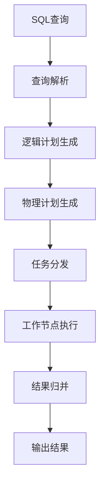
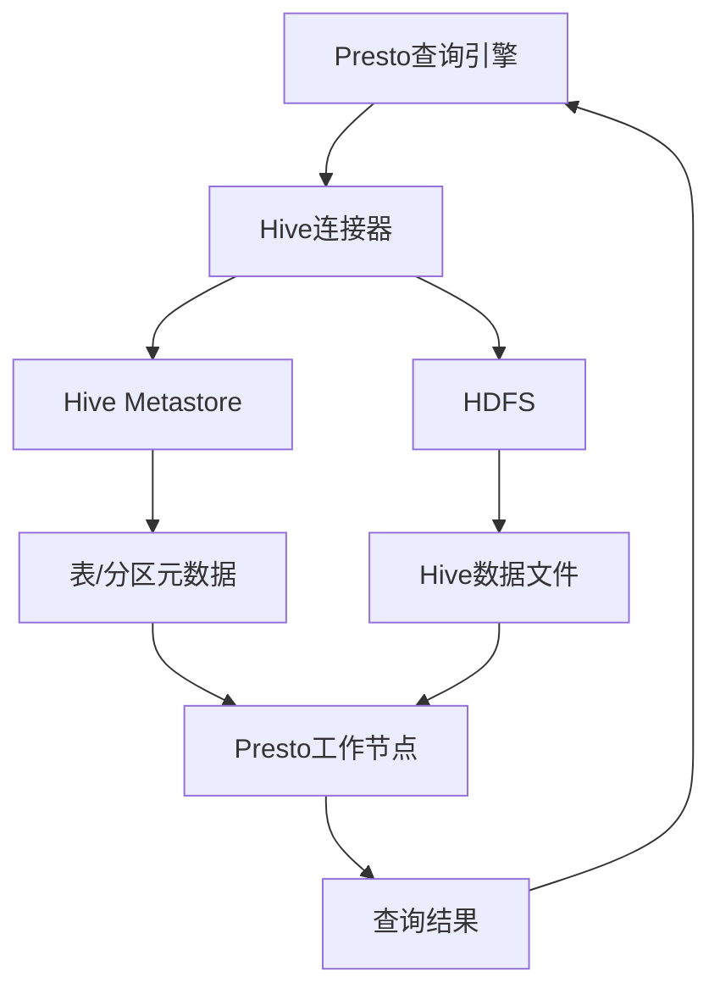

# Presto-Hive整合原理与代码实例讲解

## 1.背景介绍

在大数据时代,海量数据的存储和计算成为了一个巨大的挑战。Apache Hive作为构建在Hadoop之上的数据仓库工具,为结构化数据的存储和查询提供了强大的SQL支持。然而,由于Hive基于MapReduce计算框架,其查询延迟较高,难以满足实时分析的需求。

Apache Presto则是一种开源的分布式SQL查询引擎,旨在对各种数据源(包括Hive)进行低延迟的交互式分析。Presto能够直接查询Hive中的数据,无需进行数据移动或转换,从而实现了两者的无缝集成。通过将Presto与Hive相结合,我们可以充分利用Hive强大的数据管理能力,同时享受Presto出色的查询性能。

本文将深入探讨Presto与Hive整合的原理,并通过代码示例详细说明如何在实践中实现这一整合。我们将介绍两者的核心概念、架构设计、查询执行流程,以及优化技巧和最佳实践。

## 2.核心概念与联系

在深入探讨Presto-Hive整合之前,我们需要了解一些核心概念:

### 2.1 Presto概念

- **查询引擎(Query Engine)**: Presto的核心组件,负责解析SQL查询、生成执行计划并协调各个工作节点的执行。
- **工作节点(Worker Node)**: 执行实际的数据处理和计算工作。
- **元数据存储(Metadata Store)**: 存储有关数据源、表、分区等元数据信息的存储系统。
- **连接器(Connector)**: 用于连接不同数据源的插件,如Hive连接器、Kafka连接器等。

### 2.2 Hive概念

- **Metastore**: 存储Hive表、分区、Schema等元数据信息的中央存储库。
- **HiveServer2**: 允许客户端使用各种编程语言(Java、Python等)通过开放的JDBC/ODBC接口与Hive交互。

### 2.3 Presto与Hive的联系

Presto利用Hive连接器直接查询Hive中的数据,无需进行数据移动或转换。Presto查询引擎会从Hive Metastore获取表和分区的元数据信息,并将查询分解为多个小任务,分发到工作节点上执行。工作节点直接读取HDFS上的Hive数据文件(如ORC、Parquet等),并在内存中进行计算和聚合操作。

通过这种方式,Presto可以充分利用Hive强大的数据管理能力,同时避免了MapReduce的高延迟问题,从而实现了高效的交互式分析。

## 3.核心算法原理具体操作步骤

### 3.1 Presto查询执行流程

Presto查询执行流程可以概括为以下几个步骤:



1. **查询解析**: 将SQL查询解析为抽象语法树(AST)。
2. **逻辑计划生成**: 根据AST生成逻辑执行计划,包括投影、过滤、连接等操作。
3. **物理计划生成**: 将逻辑计划转换为可执行的物理计划,包括任务划分、数据分布等细节。
4. **任务分发**: 将物理计划划分为多个小任务,分发到工作节点上执行。
5. **工作节点执行**: 工作节点读取数据源(如Hive)中的数据,并执行计算和聚合操作。
6. **结果归并**: 将工作节点的结果进行归并和整理。
7. **输出结果**: 将最终结果返回给客户端。

### 3.2 Hive连接器工作原理

Presto通过Hive连接器与Hive进行交互,其工作原理如下:



1. Presto查询引擎将查询发送给Hive连接器。
2. Hive连接器从Hive Metastore获取表和分区的元数据信息。
3. 连接器根据元数据信息,确定需要读取HDFS上的哪些Hive数据文件。
4. Presto工作节点直接从HDFS读取Hive数据文件,并在内存中进行计算和聚合操作。
5. 工作节点将计算结果返回给查询引擎,由查询引擎进行结果归并和输出。

通过这种方式,Presto可以避免启动MapReduce作业的开销,直接读取和处理Hive数据,从而实现低延迟的交互式查询。

## 4.数学模型和公式详细讲解举例说明

在Presto查询执行过程中,有一些关键的数学模型和公式需要注意。

### 4.1 数据分片和并行度

为了充分利用集群资源,Presto会将数据分割为多个分片(Split),并在工作节点之间进行并行计算。分片的数量和大小会影响查询的并行度和性能。

假设我们有一个表T,包含N行数据,存储在HDFS上的M个数据文件中。Presto会将这M个文件划分为S个分片,其中:

$$S = \min(M, \max(1, \frac{N}{targetMaxSplitSize}))$$

其中,targetMaxSplitSize是一个配置参数,用于控制每个分片的最大行数。

如果我们有足够的工作节点,那么每个分片可以被分配到一个工作节点上进行并行计算。理想情况下,查询的执行时间将与处理单个分片的时间成正比:

$$T_{query} \approx \frac{N}{S} \cdot T_{split}$$

其中,T_query是查询的总执行时间,T_split是处理单个分片的时间。

通过适当调整分片大小和工作节点数量,我们可以实现更好的并行度和查询性能。

### 4.2 数据局部性优化

为了减少数据传输开销,Presto会尽可能将计算任务调度到存储相关数据的节点上执行,从而利用数据局部性。

假设我们有一个连接查询,需要连接两个表T1和T2。如果T1和T2位于不同的节点上,那么需要进行数据重分布(Data Reshuffling),将相关数据传输到同一个节点上进行连接操作。

数据重分布的成本可以用下面的公式估计:

$$C_{reshuffling} = \sum_{i=1}^{n} \sum_{j=1}^{m} d_{ij} \cdot c_{ij}$$

其中,n是T1的分片数量,m是T2的分片数量,d_ij是从T1的第i个分片到T2的第j个分片需要传输的数据量,c_ij是相应的网络传输成本。

为了减小数据重分布的成本,Presto会尝试在物理执行计划生成阶段,对数据进行合理的分区和排序,从而最大化数据局部性。

## 5.项目实践:代码实例和详细解释说明

在本节中,我们将通过一个实际的代码示例,演示如何使用Presto查询Hive中的数据。

### 5.1 环境准备

首先,我们需要准备以下环境:

- Hadoop集群(包括HDFS和Yarn)
- Hive元数据库(如MySQL)
- Presto集群

假设我们已经在Hive中创建了一个名为`sales`的表,用于存储销售数据。表结构如下:

```sql
CREATE TABLE sales (
    order_id BIGINT,
    product_id INT,
    customer_id INT,
    order_date DATE,
    order_amount DOUBLE
)
PARTITIONED BY (year INT, month INT)
STORED AS ORC;
```

我们可以使用Hive命令或Beeline客户端向表中插入一些示例数据。

### 5.2 Presto查询示例

接下来,我们将使用Presto查询引擎来查询Hive中的`sales`表。

首先,我们需要启动Presto服务器和命令行客户端。然后,在客户端中执行以下命令,连接到Hive数据源:

```sql
presto> USE hive.default;
```

现在,我们可以像在Hive中一样,使用SQL查询`sales`表:

```sql
presto> SELECT
           year,
           month,
           sum(order_amount) AS total_sales
         FROM sales
         WHERE order_date >= DATE '2022-01-01'
           AND order_date < DATE '2023-01-01'
         GROUP BY year, month
         ORDER BY year, month;
```

这个查询将计算2022年每个月的总销售额,并按年月排序输出结果。

在执行过程中,Presto会从Hive Metastore获取`sales`表的元数据信息,确定需要读取的Hive数据文件,并将查询分发到工作节点上执行。工作节点会直接从HDFS读取ORC格式的数据文件,在内存中进行计算和聚合操作,最终将结果返回给查询引擎。

### 5.3 代码解释

让我们来详细解释一下上面查询的执行过程:

1. **查询解析**:
   Presto将SQL查询解析为抽象语法树(AST),包括投影(SELECT子句)、过滤(WHERE子句)、聚合(GROUP BY子句)和排序(ORDER BY子句)等操作。

2. **逻辑计划生成**:
   根据AST,Presto生成逻辑执行计划,包括以下步骤:
   - 从Hive Metastore获取`sales`表的元数据信息,包括表结构、分区信息等。
   - 根据过滤条件(`order_date >= '2022-01-01' AND order_date < '2023-01-01'`)确定需要读取的分区。
   - 将聚合操作(`sum(order_amount)`)和分组(`GROUP BY year, month`)合并为一个聚合节点。
   - 添加投影节点,用于选择需要的列(`year`, `month`, `total_sales`)。
   - 添加排序节点,用于实现`ORDER BY`子句。

3. **物理计划生成**:
   将逻辑计划转换为可执行的物理计划,包括以下步骤:
   - 确定需要读取的Hive数据文件(ORC格式)。
   - 将数据文件划分为多个分片,以实现并行计算。
   - 为每个分片生成一个扫描节点,用于从HDFS读取数据。
   - 为聚合节点生成一个本地聚合节点和一个部分聚合节点,用于在工作节点上进行本地聚合和全局聚合。
   - 为排序节点生成一个本地排序节点和一个部分排序节点,用于在工作节点上进行本地排序和全局排序。

4. **任务分发**:
   将物理计划划分为多个小任务,分发到工作节点上执行。每个工作节点负责处理一个或多个分片。

5. **工作节点执行**:
   工作节点执行以下操作:
   - 从HDFS读取分配的Hive数据文件(ORC格式)。
   - 对读取的数据执行过滤、投影、本地聚合和本地排序操作。
   - 将本地聚合和排序结果发送给协调节点,进行全局聚合和排序。

6. **结果归并**:
   协调节点将工作节点的结果进行归并,得到最终的查询结果。

7. **输出结果**:
   将查询结果返回给客户端,显示在命令行界面上。

通过这个示例,我们可以看到Presto如何高效地查询Hive中的数据,并利用分布式计算和内存处理技术实现低延迟的交互式分析。

## 6.实际应用场景

Presto-Hive整合在实际应用中有着广泛的用途,包括但不限于以下几个场景:

1. **交互式数据探索和分析**:
   Presto可以提供低延迟的SQL查询,支持对存储在Hive中的海量数据进行交互式探索和分析,满足数据分析师和业务用户的需求。

2. **实时数据仓库**:
   将Presto与Hive相结合,可以构建一个高效的实时数据仓库系统。Hive用于管理和存储