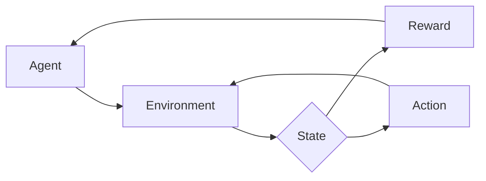

# Python深度学习实践：深度强化学习与机器人控制

## 1.背景介绍
### 1.1 深度强化学习的兴起
### 1.2 深度强化学习在机器人控制中的应用前景
### 1.3 Python在深度学习领域的优势

## 2.核心概念与联系
### 2.1 强化学习基本概念
#### 2.1.1 Agent、Environment、State、Action、Reward
#### 2.1.2 策略(Policy)、价值函数(Value Function)
#### 2.1.3 探索与利用(Exploration vs. Exploitation)
### 2.2 深度学习基本概念  
#### 2.2.1 神经网络(Neural Network) 
#### 2.2.2 卷积神经网络(CNN)
#### 2.2.3 循环神经网络(RNN)
### 2.3 深度强化学习 = 深度学习 + 强化学习
#### 2.3.1 DQN(Deep Q-Network)
#### 2.3.2 A3C(Asynchronous Advantage Actor-Critic)
#### 2.3.3 DDPG(Deep Deterministic Policy Gradient)

## 3.核心算法原理具体操作步骤
### 3.1 Q-Learning算法
#### 3.1.1 Q表格(Q-Table)
#### 3.1.2 状态(State)、动作(Action)、奖励(Reward)
#### 3.1.3 Q值更新公式
### 3.2 DQN算法
#### 3.2.1 经验回放(Experience Replay) 
#### 3.2.2 目标网络(Target Network)
#### 3.2.3 DQN损失函数与优化
### 3.3 A3C算法
#### 3.3.1 Actor-Critic框架
#### 3.3.2 异步训练多个Agent
#### 3.3.3 A3C损失函数与优化
### 3.4 DDPG算法
#### 3.4.1 Actor网络与Critic网络
#### 3.4.2 探索噪声(Exploration Noise)
#### 3.4.3 DDPG损失函数与优化

## 4.数学模型和公式详细讲解举例说明
### 4.1 MDP(Markov Decision Process)模型
#### 4.1.1 状态转移概率(State Transition Probability)
#### 4.1.2 奖励函数(Reward Function) 
#### 4.1.3 Bellman最优性方程
### 4.2 策略梯度定理(Policy Gradient Theorem)
#### 4.2.1 策略梯度公式推导
#### 4.2.2 蒙特卡洛策略梯度(REINFORCE)
#### 4.2.3 带Baseline的策略梯度
### 4.3 时序差分学习(Temporal-Difference Learning) 
#### 4.3.1 TD(0)与TD(λ)
#### 4.3.2 Sarsa与Q-Learning
#### 4.3.3 n步Sarsa与n步Q-Learning

## 5.项目实践：代码实例和详细解释说明
### 5.1 基于OpenAI Gym环境的DQN智能体 
#### 5.1.1 Gym环境介绍
#### 5.1.2 DQN网络结构设计
#### 5.1.3 DQN训练与测试
### 5.2 基于MuJoCo环境的DDPG机器人控制
#### 5.2.1 MuJoCo环境介绍
#### 5.2.2 DDPG Actor-Critic网络设计
#### 5.2.3 DDPG训练与测试
### 5.3 分布式A3C算法并行训练Atari游戏
#### 5.3.1 Atari游戏环境介绍
#### 5.3.2 A3C网络结构设计
#### 5.3.3 A3C分布式训练与测试

## 6.实际应用场景
### 6.1 自动驾驶中的深度强化学习应用
### 6.2 机器人操纵与运动规划中的深度强化学习
### 6.3 游戏AI中的深度强化学习应用

## 7.工具和资源推荐
### 7.1 深度学习框架：TensorFlow、PyTorch
### 7.2 强化学习环境：OpenAI Gym、MuJoCo 
### 7.3 开源项目与教程推荐

## 8.总结：未来发展趋势与挑战
### 8.1 深度强化学习的研究热点
### 8.2 深度强化学习面临的挑战
### 8.3 深度强化学习的发展前景

## 9.附录：常见问题与解答
### 9.1 如何平衡探索与利用？
### 9.2 如何加速深度强化学习的训练？
### 9.3 深度强化学习容易陷入的陷阱有哪些？

深度强化学习是人工智能领域近年来的研究热点,它将深度学习与强化学习巧妙结合,为解决复杂的序列决策问题提供了新的思路。深度强化学习在机器人控制、自动驾驶、游戏AI等诸多领域展现出了巨大的应用潜力。而Python凭借其简洁优雅的语法和丰富的生态,已经成为了深度学习的首选编程语言。

本文将全面介绍Python深度强化学习在机器人控制领域的实践。首先,我们将从强化学习和深度学习的基本概念出发,理清它们之间的联系,引出深度强化学习的核心思想。接着,我们将重点剖析几种经典的深度强化学习算法,如DQN、A3C、DDPG等,深入探讨它们的原理和具体操作步骤。在理论分析的基础上,本文还将配以详细的数学公式推导和代码实例讲解,力求将抽象的模型与具体的实现相结合,帮助读者真正掌握深度强化学习的精髓。

除了算法本身,如何将深度强化学习应用到实际的机器人控制任务中也是一个关键问题。本文将以几个有代表性的项目为例,手把手教你如何利用OpenAI Gym、MuJoCo等强化学习环境,构建实用的机器人控制系统。从Atari游戏到机器人操纵,从仿真环境到真实世界,你将体验到深度强化学习在不同场景下的魅力。

当然,理论联系实际不能仅停留在项目实践层面,还要放眼整个人工智能产业,思考深度强化学习技术在其中扮演的角色。无人驾驶、智能机器人等前沿领域都对深度强化学习寄予厚望。本文将分析几个具有代表性的应用案例,展望深度强化学习在未来的发展趋势和面临的挑战。

总而言之,本文致力于为读者提供一份全方位的Python深度强化学习实践指南,不仅注重知识的系统性和连贯性,更强调理论与实践的紧密结合。无论你是深度学习的研究者,还是对人工智能感兴趣的爱好者,都可以从本文中汲取营养,提升自己的认知和技能。让我们一起踏上Python深度强化学习的探索之旅吧!

### 强化学习的基本概念

强化学习是机器学习的一个重要分支,它研究如何让智能体(Agent)通过与环境(Environment)的交互来学习最优策略,从而获得最大的累积奖励。在强化学习中,智能体在每个时间步(time step)都观察到当前的状态(State),然后选择一个动作(Action)去执行。环境根据智能体的动作,给出下一个状态和一个即时奖励(Reward)。智能体的目标就是要找到一个最优策略(Optimal Policy),使得在该策略下获得的期望累积奖励最大化。

形式化地说,一个强化学习问题通常被建模为一个马尔可夫决策过程(Markov Decision Process, MDP):

$$
\mathcal{M}=\langle\mathcal{S}, \mathcal{A}, \mathcal{P}, \mathcal{R}, \gamma\rangle
$$

其中,$\mathcal{S}$表示有限的状态集,$\mathcal{A}$表示有限的动作集,$\mathcal{P}$是状态转移概率矩阵,$\mathcal{R}$是奖励函数,$\gamma\in[0,1]$是折扣因子。

在MDP中,状态转移满足马尔可夫性质,即下一个状态$s'$只取决于当前状态$s$和当前动作$a$,与之前的状态和动作无关:

$$
\mathcal{P}_{ss'}^a=\mathbb{P}[S_{t+1}=s'|S_t=s,A_t=a]
$$

奖励函数$\mathcal{R}$定义了在状态$s$下选择动作$a$后获得的即时奖励的期望:

$$
\mathcal{R}_s^a=\mathbb{E}[R_{t+1}|S_t=s,A_t=a]
$$

强化学习的核心是价值函数(Value Function)和策略(Policy)。价值函数衡量了每个状态或状态-动作对的长期价值,常见的价值函数有状态价值函数$V^\pi(s)$和动作价值函数$Q^\pi(s,a)$:

$$
V^\pi(s)=\mathbb{E}_\pi[\sum_{k=0}^\infty \gamma^k R_{t+k+1}|S_t=s]
$$

$$
Q^\pi(s,a)=\mathbb{E}_\pi[\sum_{k=0}^\infty \gamma^k R_{t+k+1}|S_t=s,A_t=a]
$$

其中,$\pi$表示一个策略,即在每个状态下选择动作的概率分布。最优策略$\pi^*$使得状态价值函数$V^{\pi^*}(s)$在所有状态下都达到最大。

强化学习的目标就是通过不断与环境交互,利用获得的奖励信号来学习最优策略$\pi^*$。常见的强化学习算法包括值迭代(Value Iteration)、策略迭代(Policy Iteration)、蒙特卡洛方法(Monte Carlo Methods)、时序差分学习(Temporal-Difference Learning)等。这些算法都遵循一个通用的思路:根据当前策略去探索环境,用获得的经验去评估和改进策略,不断迭代直到找到最优策略。

### 深度学习的基本概念

深度学习是机器学习的一个分支,它利用多层神经网络(Deep Neural Networks, DNNs)来自动学习数据中的层次化特征表示。与传统的机器学习方法相比,深度学习在处理大规模复杂数据(如图像、语音、文本等)时表现出了显著的优势。

一个典型的前馈神经网络(Feedforward Neural Network)由输入层、若干隐藏层和输出层组成。每一层都包含多个神经元,神经元之间通过权重(weights)和偏置(biases)进行全连接。前一层的输出经过非线性激活函数(如sigmoid、tanh、ReLU等)变换后,作为后一层的输入。网络的前向传播(forward propagation)过程可以表示为:

$$
\begin{aligned}
\mathbf{z}^{(l+1)} &= \mathbf{W}^{(l)}\mathbf{a}^{(l)} + \mathbf{b}^{(l)} \\
\mathbf{a}^{(l+1)} &= \sigma(\mathbf{z}^{(l+1)})
\end{aligned}
$$

其中,$\mathbf{z}^{(l)}$和$\mathbf{a}^{(l)}$分别表示第$l$层的净输入和激活值,$\mathbf{W}^{(l)}$和$\mathbf{b}^{(l)}$是第$l$层到第$l+1$层的权重矩阵和偏置向量,$\sigma$是激活函数。

神经网络的训练过程就是调整权重和偏置以最小化损失函数(loss function)的过程。常用的损失函数有均方误差(Mean Squared Error, MSE)、交叉熵(Cross Entropy)等。网络通过反向传播算法(Backpropagation)来计算损失函数对每个权重和偏置的梯度,并使用梯度下降法(Gradient Descent)来更新参数:

$$
\begin{aligned}
\mathbf{W}^{(l)} &:= \mathbf{W}^{(l)} - \alpha \frac{\partial J}{\partial \mathbf{W}^{(l)}} \\
\mathbf{b}^{(l)} &:= \mathbf{b}^{(l)} - \alpha \frac{\partial J}{\partial \mathbf{b}^{(l)}}
\end{aligned}
$$

其中,$J$是损失函数,$\alpha$是学习率。

除了前馈神经网络,深度学习还发展出了许多专门用于处理序列数据、图像数据的网络结构