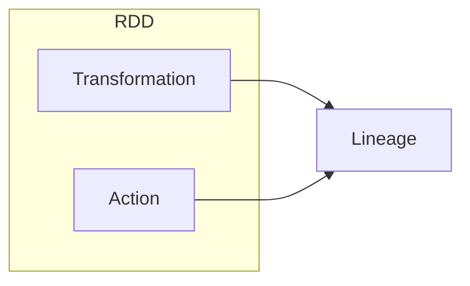
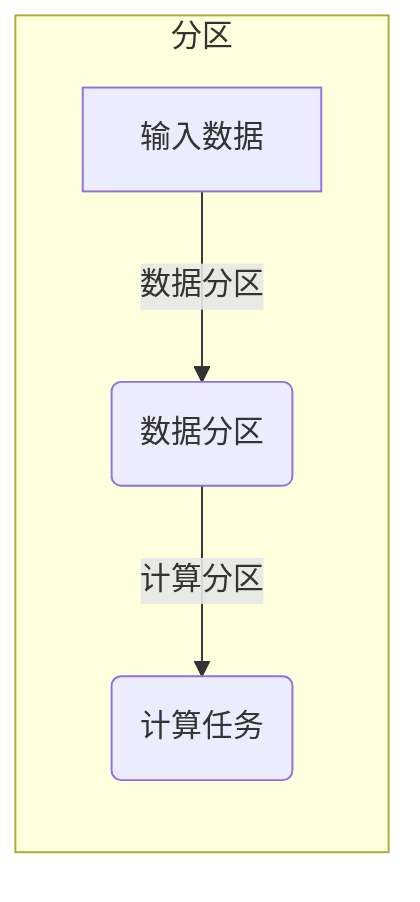
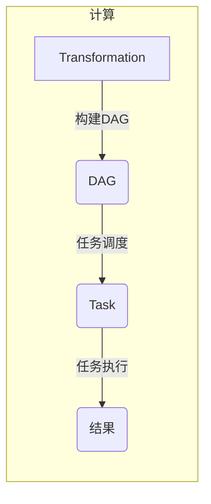
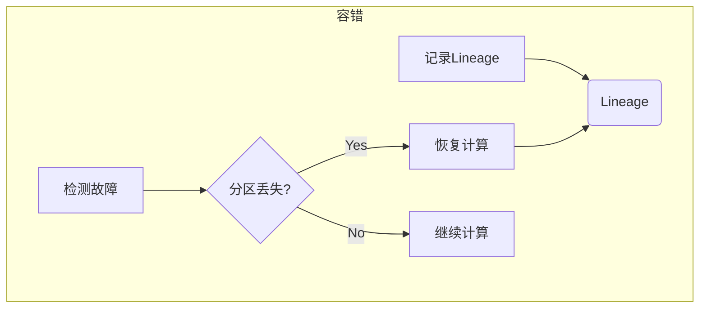

# RDD 原理与代码实例讲解

## 1.背景介绍

在大数据时代，数据量的爆炸式增长对传统的数据处理系统带来了巨大挑战。Apache Spark 作为一种快速、通用的大规模数据处理引擎,其核心抽象 RDD(Resilient Distributed Dataset) 为分布式数据处理提供了一种高效、容错的方式。RDD 可以说是 Spark 的核心,理解 RDD 的原理对于掌握 Spark 至关重要。

## 2.核心概念与联系

RDD(Resilient Distributed Dataset)是Spark中最核心的数据抽象,表示一个不可变、分区的数据集合。

- **不可变(Immutable)**: RDD 本身是只读的,不支持数据的修改,这使得 RDD 在分布式环境下具有良好的容错性。
- **分区(Partitioned)**: RDD 的数据集是分区的,可以分布在集群的多个节点上并行计算。
- **容错(Resilient)**: RDD 具有容错性,可以从错误中自动恢复。

RDD 支持两种操作:transformation(从现有数据集创建新的数据集)和action(对数据集进行计算并返回结果)。



Transformation 会生成新的 RDD,而 Action 会触发实际的计算过程。Lineage(血统)记录了 RDD 的转换过程,用于容错恢复。

## 3.核心算法原理具体操作步骤

RDD 的核心算法原理包括:分区(Partitioning)、计算(Computing)和容错(Fault Tolerance)。

### 3.1 分区(Partitioning)

RDD 的数据集是分区的,每个分区可以并行计算,从而提高处理效率。分区的过程包括:

1. **数据分区(Data Partitioning)**: 将输入数据划分为逻辑分区。
2. **计算分区(Compute Partitioning)**: 将计算任务划分为多个任务,每个任务处理一个或多个分区。



### 3.2 计算(Computing)

计算过程遵循延迟计算(Lazy Evaluation)策略,只有在 Action 操作触发时才会真正执行计算。

1. **构建 DAG(Directed Acyclic Graph)**: 根据 Transformation 操作构建计算逻辑的有向无环图。
2. **任务调度(Task Scheduling)**: 根据 DAG 和分区情况,将任务分发到各个 Executor 上执行。
3. **任务执行(Task Execution)**: Executor 执行任务,并将结果返回给 Driver。



### 3.3 容错(Fault Tolerance)

RDD 通过 Lineage 实现容错,当分区数据丢失时,可以根据 Lineage 重新计算:

1. **记录 Lineage**: 在创建 RDD 时,记录转换操作的血统关系。
2. **检测故障(Fault Detection)**: 通过检查点(Checkpoint)机制检测分区数据丢失。
3. **恢复计算(Recovery Computation)**: 根据 Lineage 重新计算丢失的分区数据。



## 4.数学模型和公式详细讲解举例说明

在 RDD 的分区和计算过程中,涉及到一些数学模型和公式,下面将详细讲解并给出示例说明。

### 4.1 数据分区

数据分区的目标是将输入数据均匀地划分为多个分区,以便并行计算。常用的分区策略有:

1. **哈希分区(Hash Partitioning)**

哈希分区根据数据的键(Key)的哈希值将数据划分到不同的分区。假设有 $N$ 个分区,对于一个键值对 $(k, v)$,它被分配到第 $i$ 个分区的概率为:

$$
P(i) = \frac{hash(k)}{2^{32}} \bmod N
$$

其中 $hash(k)$ 是键 $k$ 的哈希值。

2. **范围分区(Range Partitioning)**

范围分区根据数据键的范围将数据划分到不同的分区。假设有 $N$ 个分区,键的范围为 $[a, b]$,则第 $i$ 个分区包含的键范围为:

$$
\left[a + \frac{i(b-a)}{N}, a + \frac{(i+1)(b-a)}{N}\right)
$$

### 4.2 任务调度

任务调度的目标是将计算任务合理地分配到各个 Executor 上,以实现负载均衡和高效计算。常用的调度策略有:

1. **延迟调度(Delay Scheduling)**

延迟调度策略会等待一段时间,尽可能将任务调度到已经缓存了相关数据的节点上,从而减少数据传输的开销。假设有 $M$ 个节点,第 $i$ 个节点缓存了 $n_i$ 个相关分区,则第 $j$ 个任务被调度到第 $i$ 个节点的概率为:

$$
P(i, j) = \frac{n_i}{\sum_{k=1}^{M}n_k}
$$

2. **局部性调度(Locality Scheduling)**

局部性调度策略会优先将任务调度到存储了相关数据的节点上,以减少数据传输的开销。假设有 $M$ 个节点,第 $i$ 个节点缓存了 $n_i$ 个相关分区,则第 $j$ 个任务被调度到第 $i$ 个节点的优先级为:

$$
\text{Priority}(i, j) = \begin{cases}
n_i & \text{if } n_i > 0\\
0 & \text{otherwise}
\end{cases}
$$

## 5.项目实践:代码实例和详细解释说明

下面通过一个实际的代码示例,详细解释 RDD 的创建、转换和行动操作。

### 5.1 创建 RDD

可以通过多种方式创建 RDD,例如从文件系统、集合或其他 RDD 创建。

```scala
// 从文件系统创建 RDD
val textFile = sc.textFile("data/README.md")

// 从集合创建 RDD
val numbers = sc.parallelize(List(1, 2, 3, 4, 5))

// 从其他 RDD 创建
val lineLengths = textFile.map(line => line.length)
```

### 5.2 Transformation 操作

Transformation 操作会生成新的 RDD,常用的操作有 `map`、`filter`、`flatMap`、`union`等。

```scala
// map 操作
val lengthRDD = textFile.map(line => line.length)

// filter 操作
val filterRDD = lengthRDD.filter(length => length > 10)

// flatMap 操作
val wordRDD = textFile.flatMap(line => line.split(" "))

// union 操作
val unionRDD = lengthRDD.union(filterRDD)
```

### 5.3 Action 操作

Action 操作会触发实际的计算过程,常用的操作有 `count`、`collect`、`reduce`、`foreach`等。

```scala
// count 操作
val lineCount = textFile.count()

// collect 操作
val allLines = textFile.collect()

// reduce 操作
val totalLength = lengthRDD.reduce((a, b) => a + b)

// foreach 操作
lengthRDD.foreach(println)
```

### 5.4 Lineage 示例

下面是一个简单的 Lineage 示例,展示了 RDD 的转换过程和容错恢复。

```scala
// 从文件创建 RDD
val textFile = sc.textFile("data/README.md")

// 转换操作
val wordRDD = textFile.flatMap(line => line.split(" "))
val lengthRDD = wordRDD.map(word => word.length)

// Action 操作
val totalLength = lengthRDD.reduce((a, b) => a + b)
println(s"Total length of all words: $totalLength")

// 模拟分区丢失
val lostPartition = lengthRDD.partitions(0)
lengthRDD.removePartition(0)

// 容错恢复
val recoveredRDD = lengthRDD.mapPartitionsWithIndex {
  case (idx, iter) if iter.isEmpty && idx == lostPartition.index =>
    lostPartition.iterator.map(_.toString.length)
  case (idx, iter) => iter
}

// 重新计算
val recoveredLength = recoveredRDD.reduce((a, b) => a + b)
println(s"Recovered total length: $recoveredLength")
```

在上面的示例中,我们首先从文件创建了一个 RDD,然后进行了一系列转换操作。在执行 Action 操作时,会触发实际的计算过程。接下来,我们模拟了一个分区数据丢失的情况,并根据 Lineage 进行了容错恢复,最后重新计算得到正确的结果。

## 6.实际应用场景

RDD 作为 Spark 的核心抽象,在许多实际应用场景中发挥着重要作用,例如:

1. **大数据处理**: RDD 可以高效地处理大规模数据集,支持各种数据源和数据格式。
2. **机器学习**: Spark MLlib 库基于 RDD 实现,可以进行分布式机器学习算法的训练和预测。
3. **流式计算**: Spark Streaming 使用 DStream(Discretized Stream)抽象,其底层实现基于 RDD。
4. **图计算**: Spark GraphX 库基于 RDD 实现,用于分布式图计算。
5. **SQL查询**: Spark SQL 使用 DataFrame 和 Dataset 抽象,它们底层也是基于 RDD 实现的。

## 7.工具和资源推荐

如果您想进一步学习和使用 RDD,以下是一些推荐的工具和资源:

1. **Apache Spark 官方文档**: https://spark.apache.org/docs/latest/
2. **Spark编程指南**: https://spark.apache.org/docs/latest/rdd-programming-guide.html
3. **Spark源代码**: https://github.com/apache/spark
4. **Spark交互式 Notebook**: Apache Zeppelin、Jupyter Notebook
5. **Spark可视化工具**: Apache Spark UI、Spark监控工具
6. **Spark学习资源**: 书籍、在线课程、博客等

## 8.总结:未来发展趋势与挑战

RDD 为分布式数据处理提供了一种高效、容错的方式,推动了大数据处理的发展。但是,随着数据量和计算需求的不断增长,RDD 也面临着一些挑战:

1. **内存管理**: RDD 的不可变性导致需要保存大量中间结果,对内存压力较大。
2. **延迟计算**: 延迟计算策略可能导致计算开销增加,影响性能。
3. **数据格式**: RDD 主要支持内存数据格式,对于大型数据集可能效率较低。
4. **动态调度**: RDD 的任务调度策略可能无法适应动态变化的集群环境。

未来,Spark 可能会在以下方面进行优化和改进:

1. **内存管理优化**: 引入更高效的内存管理机制,减少中间结果的存储开销。
2. **增量计算**: 支持增量计算,避免重复计算已有的结果。
3. **新的数据抽象**: 引入新的数据抽象,支持更多数据格式和计算模型。
4. **动态调度优化**: 优化任务调度策略,提高动态环境下的调度效率。
5. **硬件加速**: 利用 GPU、FPGA 等硬件加速器,提升计算性能。

总的来说,RDD 是 Spark 的核心,理解 RDD 的原理对于掌握 Spark 至关重要。随着大数据领域的不断发展,RDD 也将继续演进,以满足未来的计算需求。

## 9.附录:常见问题与解答

1. **什么是 RDD?**

RDD(Resilient Distributed Dataset)是 Spark 中最核心的数据抽象,表示一个不可变、分区的数据集合。它支持两种操作:转换(Transformation)和行动(Action),并通过 Lineage 实现容错。

2. **RDD 的优点是什么?**

RDD 的优点包括:

- 不可变性,提高了容错性和并行计算效率。
- 分区,支持数据并行处理。
- 容错性,可以从错误中自动恢