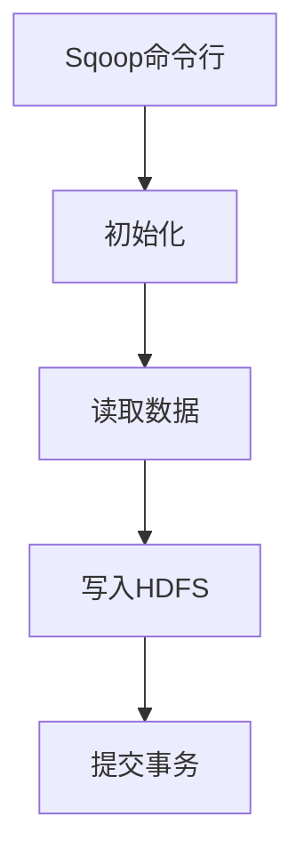
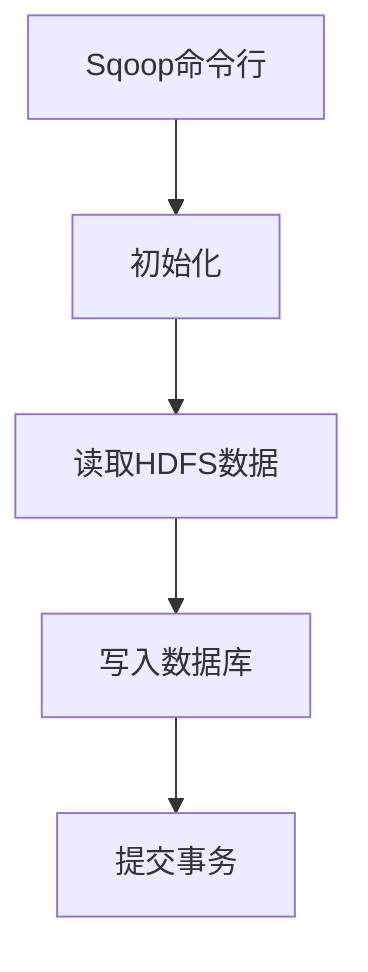

# Sqoop导入导出原理与代码实例讲解

## 1.背景介绍

在当今大数据时代，数据已经成为企业的核心资产之一。企业内部通常会存储大量结构化数据在关系型数据库中,同时也会产生海量的非结构化数据,如日志数据、网络数据等。为了充分利用这些数据的价值,需要将它们导入到大数据平台(如Hadoop)进行存储和分析。Sqoop就是一个高效传输大数据的工具,可以在Hadoop与关系型数据库之间方便地导入导出数据。

## 2.核心概念与联系

### 2.1 Sqoop概念

Sqoop(SQL到Hadoop)是Apache旗下的一个工具,它可以将关系型数据库中的数据导入到Hadoop的HDFS中,也可以将HDFS的数据导出到关系型数据库中。Sqoop底层使用MapReduce来实现导入导出,因此可以高效并行地传输大量数据。

### 2.2 Sqoop与Hadoop生态系统

Sqoop作为Hadoop生态系统中的一员,与其他组件密切配合:

- HDFS: Hadoop分布式文件系统,Sqoop可将数据导入导出到HDFS
- MapReduce: Sqoop底层使用MapReduce实现并行数据传输
- Hive: 可将导入HDFS的数据注册为Hive表,以SQL查询方式分析
- HBase: 可将RDBMS数据导入HBase进行实时随机读写访问

### 2.3 Sqoop数据导入导出模式

Sqoop支持以下几种导入导出模式:

- 全量导入(import-all-tables)
- 单表导入(import)
-增量导入(import-last-modified)
-基于查询导入(import-query)
- 增量导入追加(merge)
- 导出(export)

## 3.核心算法原理具体操作步骤 

### 3.1 Sqoop导入原理

Sqoop的导入过程可分为以下几个步骤:

1. **初始化**:解析命令行参数,连接目标数据库和HDFS
2. **读取数据**:使用多个并行的Map任务从数据库读取分片数据
3. **写入HDFS**:Map任务将数据写入到HDFS文件
4. **提交事务**:所有Map任务完成后,提交事务,确保数据完整性



### 3.2 Sqoop导出原理  

导出过程与导入过程类似,但流程方向相反:

1. **初始化**:解析命令行参数,连接HDFS和目标数据库
2. **读取HDFS数据**:使用多个并行Map任务读取HDFS文件数据
3. **写入数据库**:Map任务将数据写入目标数据库表
4. **提交事务**:所有Map任务完成后,提交事务



### 3.3 Sqoop并行化

Sqoop通过以下几种方式实现并行化:

- **分片并行(Parallel Streams)**:将数据分片并行读写
- **Map任务并行(Map Tasks)**:使用多个并行Map任务传输数据
- **压缩(Compression)**:压缩数据以减少网络传输量

## 4.数学模型和公式详细讲解举例说明

### 4.1 分片并行模型

Sqoop将待导入表切分为多个分片(split),每个Map任务并行处理一个分片。分片大小可控制并行度。

假设表T有n行记录,分片大小为s,则分片数量为:

$$分片数量 = \lceil \frac{n}{s} \rceil$$

其中$\lceil x \rceil$表示向上取整。

例如,若表T有100万行,分片大小为10万行,则分片数为:

$$分片数量 = \lceil \frac{1000000}{100000} \rceil = 10$$

将使用10个Map任务并行导入数据。

### 4.2 Map任务并行模型

每个Map任务读取一个分片的数据,并行传输到HDFS。假设有m个Map插槽,则最多可并行m个Map任务。

如果分片数n大于m,则Map任务分多个波次(wave)执行:

$$波次数 = \lceil \frac{n}{m} \rceil$$

例如,有10个分片,4个Map插槽,则需3个波次:

$$波次数 = \lceil \frac{10}{4} \rceil = 3$$

### 4.3 压缩模型

Sqoop支持对传输数据进行压缩,以减少网络传输量。假设原始数据大小为D,压缩率为r(0<r<1),则压缩后数据量为:

$$压缩后数据量 = D \times r$$

例如,原始数据1GB,压缩率0.3,则压缩后数据量为:

$$压缩后数据量 = 1GB \times 0.3 = 300MB$$

## 5.项目实践:代码实例和详细解释说明

### 5.1 全量导入示例

将MySQL的employees表全量导入到HDFS:

```bash
sqoop import \
--connect jdbc:mysql://localhost/employees \
--username root \
--table employees \
--target-dir /user/hadoop/employees \
--m 4
```

- `--connect`: 指定JDBC连接字符串
- `--username`: 指定数据库用户名 
- `--table`: 指定要导入的表
- `--target-dir`: 指定HDFS导入路径
- `--m 4`: 使用4个Map任务并行导入

### 5.2 增量导入示例

增量导入employees表中最近修改的数据:

```bash
sqoop import \
--connect jdbc:mysql://localhost/employees \
--username root \
--table employees \
--target-dir /user/hadoop/employees \
--m 4 \
--check-column updated \
--incremental append \
--last-value '2021-01-01 00:00:00'
```

- `--check-column`: 指定用于增量的列
- `--incremental`: 指定增量模式
- `--last-value`: 指定上次导入的最大值

### 5.3 基于查询导入示例

导入employees表中部分列和部分行:

```bash 
sqoop import \
--connect jdbc:mysql://localhost/employees \
--username root \
--query 'SELECT emp_no, birth_date, first_name, last_name FROM employees WHERE emp_no >= 10001 AND $CONDITIONS' \
--target-dir /user/hadoop/employees \
--split-by emp_no \
--m 4
```

- `--query`: 指定SQL查询语句,可过滤列和行
- `--split-by`: 指定用于分片的列

### 5.4 导出示例 

将HDFS上的employees数据导出到MySQL:

```bash
sqoop export \
--connect jdbc:mysql://localhost/employees \
--username root \
--table employees_export \
--export-dir /user/hadoop/employees \
--m 4 \
--input-fields-terminated-by ','
```

- `--table`: 指定导出到的表
- `--export-dir`: 指定HDFS数据路径
- `--input-fields-terminated-by`: 指定字段分隔符

## 6.实际应用场景

Sqoop在企业大数据应用中发挥着重要作用:

- **数据迁移**: 将企业已有的结构化数据从RDBMS迁移到Hadoop平台
- **日志分析**: 将网站/系统日志导入Hadoop进行离线分析
- **数据集成**: 将企业内外部数据源数据集成到Hadoop数据湖
- **数据同步**: 实现RDBMS与Hadoop之间的数据实时/增量同步

## 7.工具和资源推荐

- **Sqoop官方文档**: https://sqoop.apache.org/docs/
- **Sqoop源码**: https://github.com/apache/sqoop
- **Sqoop实战书籍**: Sqoop Cookbook by Kathleen Ting
- **Sqoop可视化工具**: Hadoop数据可视化工具HUE中集成了Sqoop

## 8.总结:未来发展趋势与挑战

### 8.1 发展趋势

- **云集成**: 支持导入导出云数据库/存储
- **流式传输**: 支持流式实时传输数据
- **元数据管理**: 改进元数据管理和数据治理
- **高可用性**: 提高Sqoop的可靠性和容错能力

### 8.2 挑战

- **性能优化**: 提高Sqoop的导入导出性能
- **安全增强**: 增强Sqoop的安全性和权限控制
- **连接器扩展**: 支持更多数据源的连接器
- **云原生支持**: 与云原生大数据平台更好地集成

## 9.附录:常见问题与解答

1. **Sqoop与Flume/Kafka的区别?**
   
   Sqoop主要用于批量导入导出结构化数据,而Flume/Kafka主要用于流式传输非结构化数据。

2. **Sqoop是否支持增量导入HBase?**
   
   Sqoop本身不直接支持HBase,但可先导入HDFS,再使用HBase的bulk load将数据载入HBase。

3. **Sqoop是否支持压缩?** 
   
   是的,Sqoop支持对传输数据进行压缩,可使用`--compress`和`--compression-codec`选项。

4. **Sqoop是否支持Kerberos认证?**
   
   是的,Sqoop支持Kerberos认证,可使用`--username`和`--password`选项,或使用kinit获取票据。

作者: 禅与计算机程序设计艺术 / Zen and the Art of Computer Programming