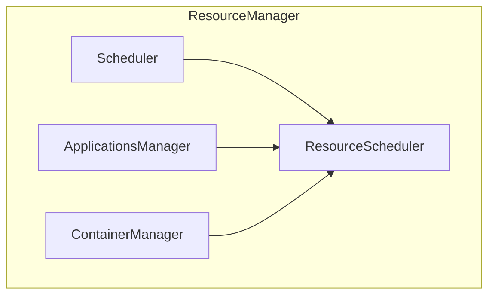

# YARN Resource Manager原理与代码实例讲解

## 1.背景介绍

### 1.1 YARN架构概述

Apache Hadoop YARN(Yet Another Resource Negotiator)是Hadoop 2.x版本中引入的全新的资源管理和任务调度框架,旨在解决Hadoop 1.x中存在的可扩展性、集群利用率低等问题。YARN将资源管理和作业调度/监控从单一的JobTracker中分离出来,由专门的ResourceManager(RM)负责集群资源的管理和分配,而ApplicationMaster(AM)负责应用程序的执行和监控。

```mermaid
graph TD
    subgraph Cluster
        RM[ResourceManager]
        NM1[NodeManager]
        NM2[NodeManager]
        NM3[NodeManager]
        
        RM-->NM1
        RM-->NM2 
        RM-->NM3
    end

    subgraph Client
        Client[Client]
    end

    Client-->RM
```

### 1.2 YARN架构组件

YARN主要由ResourceManager、NodeManager、ApplicationMaster、Container等组件构成:

- **ResourceManager(RM)**: 整个集群的资源管理和调度总控制器,负责跟踪集群中可用资源,并将资源分配给运行的应用程序。
- **NodeManager(NM)**: 运行在每个节点上的资源和任务管理器,负责管理本节点上的资源使用和任务运行情况,并定期向RM发送心跳信号和资源使用报告。
- **ApplicationMaster(AM)**: 每个应用程序的"大脑",负责向RM申请资源,并将获得的资源分配给内部任务运行。
- **Container**: 资源抽象的单位,封装了一定量的资源(CPU、内存等),任务就运行在Container中。

### 1.3 YARN工作流程

YARN的基本工作流程如下:

1. 客户端向RM提交应用程序运行环境;
2. RM分配第一个Container,启动AM;
3. AM向RM申请资源运行任务;
4. RM分配Container资源给AM;
5. AM分配资源并启动任务运行;
6. 任务运行完成后,AM向RM释放资源,应用程序运行结束。

## 2.核心概念与联系

### 2.1 资源模型

YARN采用了抽象的资源模型,资源由内存和CPU组成。每个节点上的可用资源由NM管理,并定期向RM报告。当应用程序提交时,RM会根据集群资源状况分配Container给AM,AM再将获得的Container资源分配给具体任务运行。

### 2.2 调度器

RM负责决定将资源分配给哪些应用程序,这个决定过程由调度器(Scheduler)控制。Hadoop自带的调度器有FIFO、FairShare等,也可以根据需求开发自定义调度器。调度器根据调度策略和集群资源状况等信息做出资源分配决定。

### 2.3 应用程序部署

应用程序在YARN上的部署过程如下:

1. 客户端向RM提交应用程序运行环境(包括AM程序、配置等);
2. RM分配第一个Container,启动AM;
3. AM向RM申请资源运行任务;
4. RM根据调度策略分配Container资源给AM;
5. AM将获得的Container资源分配给具体任务运行;
6. 任务运行完成后,AM向RM释放资源,应用程序运行结束。

## 3.核心算法原理具体操作步骤

### 3.1 ResourceManager主要功能

ResourceManager作为YARN的核心组件,主要负责以下功能:

1. **资源管理**: 跟踪集群中所有节点的资源使用情况,维护一个资源池;
2. **资源调度**: 根据调度策略和应用程序优先级,将资源分配给运行的应用程序;
3. **容错处理**: 监控节点和AM的健康状态,发生故障时释放相应资源并重新调度;
4. **安全认证**: 启用Kerberos安全认证,保证集群安全。

### 3.2 ResourceManager内部架构

ResourceManager内部主要由以下几个重要组件构成:



- **Scheduler**: 调度器,负责根据调度策略和集群资源状况做出资源分配决定;
- **ApplicationsManager**: 管理应用程序,跟踪其运行状态和资源使用情况;
- **ContainerManager**: 管理Container,分配和回收Container资源;
- **ResourceScheduler**: 资源调度器,将Scheduler的决定转化为资源分配计划。

### 3.3 资源调度算法

YARN中的资源调度算法主要包括以下几个步骤:

1. **资源需求计算**: 根据应用程序的资源需求和优先级,计算出每个应用程序应该获得的资源量;
2. **资源分配**: 遍历资源池,按照一定策略(如公平调度、容量调度等)将资源分配给应用程序;
3. **容量检查**: 检查节点上是否有足够资源运行分配的Container;
4. **Container分配**: 在有资源的节点上为应用程序分配Container;
5. **资源平衡**: 尽量使集群资源保持平衡,避免资源浪费。

## 4.数学模型和公式详细讲解举例说明

在资源调度过程中,YARN使用了一些数学模型和公式来计算资源分配方案。以下是一些常见模型:

### 4.1 公平资源分配模型

公平资源分配模型旨在为所有运行的应用程序分配公平的资源份额。假设集群总资源为$R$,运行的应用程序数量为$n$,则每个应用程序的理想资源份额为:

$$理想资源份额 = \frac{R}{n}$$

对于任意应用程序$i$,其公平资源份额为:

$$应用程序i的公平资源份额 = 理想资源份额 \times 应用程序i的权重$$

其中,权重是一个大于0的实数,用于调节应用程序的优先级。

### 4.2 容量资源分配模型

容量资源分配模型将集群资源划分为多个队列,每个队列被分配一个资源容量。设队列$q$的资源容量为$C_q$,队列中运行的应用程序数量为$n_q$,则队列$q$中每个应用程序的理想资源份额为:

$$队列q中应用程序的理想资源份额 = \frac{C_q}{n_q}$$

同样,可以为每个应用程序设置权重,调节其获得的实际资源份额。

### 4.3 多资源约束调度

在实际场景中,资源往往包括多种维度(如CPU、内存等)。假设有$m$种资源维度,用向量$\vec{r} = (r_1, r_2, ..., r_m)$表示某个Container的资源需求,用$\vec{R} = (R_1, R_2, ..., R_m)$表示集群总资源。则Container的资源需求向量$\vec{r}$必须满足:

$$\sum_{i=1}^m \frac{r_i}{R_i} \leq 1$$

这样可以保证分配给Container的资源不会超过集群总资源。

## 5.项目实践:代码实例和详细解释说明

以下是一个简单的YARN应用程序示例,展示了如何在YARN上运行一个分布式应用程序。

### 5.1 客户端代码

```java
// 创建YarnClient实例
YarnClient yarnClient = YarnClient.createYarnClient();
yarnClient.init(conf);

// 创建应用程序提交上下文
YarnClientApplication app = yarnClient.createApplication();
GetNewApplicationResponse appResponse = app.getNewApplicationResponse();

// 设置AM启动命令和资源需求
ApplicationSubmissionContext appContext = app.getApplicationSubmissionContext();
appContext.setApplicationName("MyApp");
appContext.setAMContainerSpec(amSpec);

// 提交应用程序
yarnClient.submitApplication(appContext);
```

客户端首先创建YarnClient实例,并通过`createApplication`方法创建一个新的应用程序。然后设置AM的启动命令和资源需求,最后调用`submitApplication`方法将应用程序提交到YARN上运行。

### 5.2 ApplicationMaster代码

```java
// 向RM申请Container运行任务
for (int i = 0; i < numTasks; i++) {
    ContainerRequest containerAsk = new ContainerRequest(capability, null, null, priority);
    amRMClient.addContainerRequest(containerAsk);
}

// 启动任务运行
while (numCompletedTasks < numTasks) {
    List<ContainerStatus> containerStatuses = amRMClient.getContainerStatuses();
    for (ContainerStatus status : containerStatuses) {
        if (status.getState() == ContainerState.COMPLETE) {
            numCompletedTasks++;
        }
    }
    
    List<Container> containers = amRMClient.getAssignedContainers();
    for (Container container : containers) {
        // 启动任务运行在Container中
        launchTask(container);
    }
}
```

AM首先向RM申请运行任务所需的Container资源。当获得分配的Container后,AM会启动具体的任务在Container中运行。AM会一直监控任务运行状态,直到所有任务完成。

### 5.3 NodeManager代码

```java
// 启动容器
public void startContainer(Container container) {
    ContainerLaunchContext launchContext = container.getLaunchContext();
    String containerIdStr = container.getId().toString();
    
    // 设置容器运行环境
    ContainerManager.setCapabilities();
    
    // 启动容器
    ContainerManager.launch(launchContext);
}

// 监控容器状态
public void monitorContainer(ContainerId containerId) {
    ContainerStatus containerStatus = null;
    while (true) {
        // 获取容器状态
        containerStatus = ContainerManager.getContainerStatus(containerId);
        
        // 如果容器已完成,则退出
        if (containerStatus.getState() == ContainerState.COMPLETE) {
            int exitCode = containerStatus.getExitStatus();
            break;
        }
    }
}
```

NodeManager负责在本节点上启动和监控容器的运行。当收到RM的指令后,NM会设置容器运行环境并启动容器。NM会持续监控容器状态,直到容器运行完成。

## 6.实际应用场景

YARN作为Hadoop的新一代资源管理和任务调度框架,在实际生产环境中得到了广泛应用,尤其在大数据计算和分析领域。以下是一些典型的应用场景:

1. **Hadoop生态圈**: YARN为Hadoop生态圈中的各种大数据应用提供了统一的资源管理和调度平台,如Spark、Flink、Hive等。
2. **深度学习**: 利用YARN可以方便地在Hadoop集群上运行深度学习任务,并对GPU等硬件资源进行高效调度。
3. **流处理**: 像Kafka Streams、Flink等流处理系统都可以在YARN上运行,实现高吞吐、低延迟的流数据处理。
4. **机器学习**: YARN为机器学习任务提供了弹性的资源管理和容错能力,如TensorFlow on YARN等。
5. **云计算**: 一些公有云服务商如AWS EMR等也采用了YARN架构,为客户提供弹性的大数据计算服务。

总的来说,YARN为各种大数据应用提供了一个通用的、可扩展的资源管理和调度框架,大大提高了集群资源利用率和应用运行效率。

## 7.工具和资源推荐

以下是一些与YARN相关的有用工具和学习资源:

1. **Apache Hadoop官网**: https://hadoop.apache.org/
2. **YARN官方文档**: https://hadoop.apache.org/docs/current/hadoop-yarn/hadoop-yarn-site/YARN.html
3. **YARN UI**: YARN自带的Web UI,可以查看集群资源使用情况、应用程序运行状态等。
4. **Apache Slider**: 一个可以在YARN上部署和运行长期服务的框架。
5. **Apache Twill**: 一个用于编写和部署分布式应用程序的抽象层。
6. **YARN书籍**:
   - "Apache Hadoop YARN: Moving beyond MapReduce and Batch Processing with Apache Hadoop 2"
   - "Apache Hadoop YARN: Concepts, Design, and Applications"
7. **YARN视频教程**:
   - Coursera上的"Cluster Computing in the Cloud"
   - Udemy上的"Apache Hadoop YARN: Going Massively Parallel with Cloud Tools"

通过学习和使用这些工具和资源,可以帮助您更好地理解和运用YARN技术。

## 8.总结:未来发展趋势与挑战

YARN作为Apache Hadoop的新一代资源管理和任务调度框架,已经得到了广泛应用和认可。但是,随着大数据场景的不断演进,YARN也面临着一些新的发展趋势和挑战:

1. **云原生支持**: 未来YARN需要更好地支持云原生环境,如