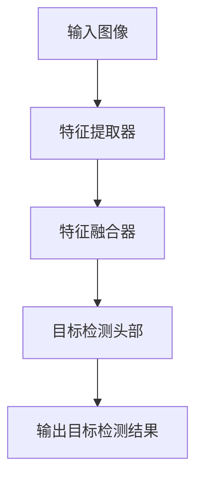
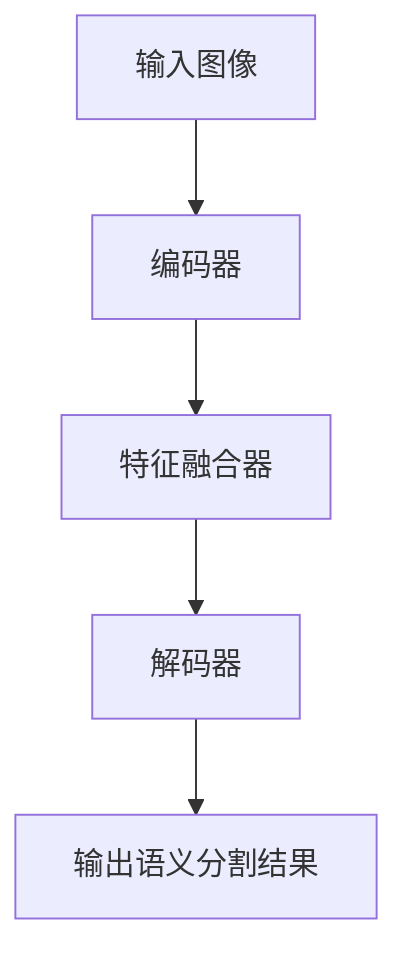
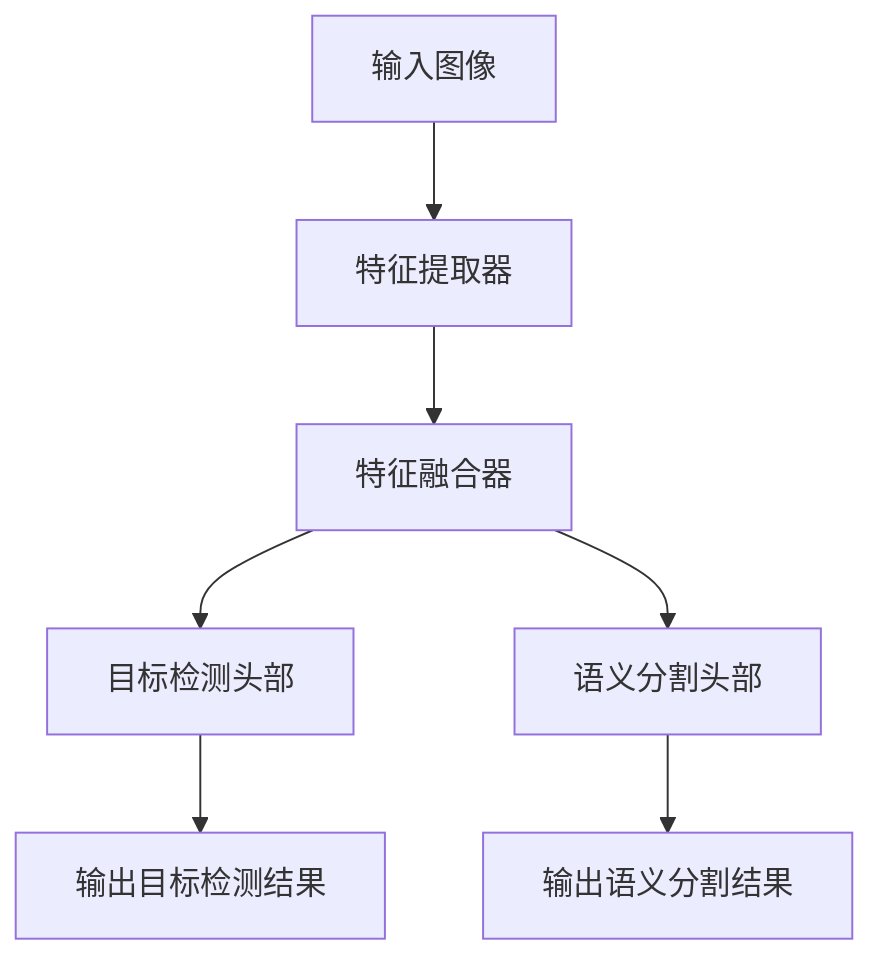

## 1. 背景介绍

目标检测和语义分割是计算机视觉领域中的两个重要任务。目标检测是指在图像或视频中检测出物体的位置和类别，而语义分割则是将图像中的每个像素分配到不同的语义类别中。这两个任务在很多应用场景中都有着广泛的应用，例如自动驾驶、智能安防、医学影像分析等。

近年来，深度学习技术的发展使得目标检测和语义分割的性能得到了大幅提升。其中，YOLO（You Only Look Once）系列算法是目标检测领域的代表性算法之一，而语义分割领域则有许多经典算法，如FCN、U-Net等。

然而，目标检测和语义分割通常是独立进行的任务，需要分别训练不同的模型。这不仅增加了模型的复杂度和训练时间，还可能导致模型在处理复杂场景时出现性能瓶颈。因此，如何同时进行目标检测和语义分割，成为了一个备受关注的问题。

在这篇文章中，我们将介绍一种基于YOLOv6的多任务学习方法，可以同时进行目标检测和语义分割，从而提高模型的性能和效率。

## 2. 核心概念与联系

多任务学习是指在一个模型中同时学习多个任务，以提高模型的泛化能力和效率。在计算机视觉领域中，多任务学习已经被广泛应用于目标检测、语义分割、姿态估计等任务中。

YOLOv6是一种基于深度学习的目标检测算法，其主要思想是将目标检测问题转化为一个回归问题，通过预测物体的边界框和类别来实现目标检测。YOLOv6的主要优点是速度快、精度高、模型轻量化等。

语义分割是将图像中的每个像素分配到不同的语义类别中，通常使用卷积神经网络进行实现。常见的语义分割算法有FCN、U-Net等。

多任务学习可以将目标检测和语义分割两个任务结合起来，通过共享特征提取器来提高模型的效率和泛化能力。具体来说，我们可以将YOLOv6的特征提取器和语义分割网络的特征提取器共享，从而实现同时进行目标检测和语义分割的效果。

## 3. 核心算法原理具体操作步骤

我们将介绍基于YOLOv6的多任务学习方法，可以同时进行目标检测和语义分割。具体来说，我们将使用YOLOv6作为目标检测的基础模型，然后在其基础上添加语义分割的模块，从而实现多任务学习。

### 3.1 YOLOv6目标检测模型

YOLOv6是一种基于深度学习的目标检测算法，其主要思想是将目标检测问题转化为一个回归问题，通过预测物体的边界框和类别来实现目标检测。YOLOv6的主要优点是速度快、精度高、模型轻量化等。

YOLOv6的网络结构如下图所示：



其中，特征提取器使用CSPDarknet53网络，可以提取出图像的高层次特征。特征融合器使用SPP网络，可以将不同尺度的特征进行融合。目标检测头部使用YOLOv5的思想，可以预测出物体的边界框和类别。

### 3.2 语义分割模型

语义分割是将图像中的每个像素分配到不同的语义类别中，通常使用卷积神经网络进行实现。常见的语义分割算法有FCN、U-Net等。

我们将使用U-Net作为语义分割的模型，其网络结构如下图所示：



其中，编码器使用VGG16网络，可以提取出图像的高层次特征。特征融合器使用skip connection的思想，可以将编码器和解码器的特征进行融合。解码器使用反卷积网络，可以将特征图还原到原始图像的尺寸，并预测每个像素的语义类别。

### 3.3 多任务学习模型

我们将使用YOLOv6作为目标检测的基础模型，然后在其基础上添加语义分割的模块，从而实现多任务学习。具体来说，我们将使用YOLOv6的特征提取器和语义分割网络的特征提取器共享，从而实现同时进行目标检测和语义分割的效果。

多任务学习模型的网络结构如下图所示：



其中，特征提取器和特征融合器都是共享的，可以提取出图像的高层次特征并进行融合。目标检测头部和语义分割头部分别用于预测物体的边界框和类别，以及每个像素的语义类别。

## 4. 数学模型和公式详细讲解举例说明

在本节中，我们将介绍YOLOv6和U-Net的数学模型和公式，以及多任务学习模型的数学原理。

### 4.1 YOLOv6数学模型和公式

YOLOv6的数学模型和公式如下：

$$
\begin{aligned}
&\textbf{输入：}I\\
&\textbf{输出：}B=\{b_1,b_2,...,b_n\},C=\{c_1,c_2,...,c_n\}\\
&\textbf{过程：}\\
&\quad F_{backbone}=CSPDarknet53(I)\\
&\quad F_{neck}=SPP(F_{backbone})\\
&\quad B,C=F_{head}(F_{neck})
\end{aligned}
$$

其中，$I$表示输入图像，$B$表示预测出的边界框，$C$表示预测出的类别。$F_{backbone}$表示特征提取器提取出的高层次特征，$F_{neck}$表示特征融合器融合后的特征，$F_{head}$表示目标检测头部。

### 4.2 U-Net数学模型和公式

U-Net的数学模型和公式如下：

$$
\begin{aligned}
&\textbf{输入：}I\\
&\textbf{输出：}S\\
&\textbf{过程：}\\
&\quad F_{encoder}=VGG16(I)\\
&\quad F_{bridge}=F_{encoder}+F_{decoder}\\
&\quad S=F_{decoder}(F_{bridge})
\end{aligned}
$$

其中，$I$表示输入图像，$S$表示预测出的语义分割结果。$F_{encoder}$表示编码器提取出的高层次特征，$F_{decoder}$表示解码器还原特征图并预测每个像素的语义类别。

### 4.3 多任务学习模型的数学原理

多任务学习模型的数学原理如下：

$$
\begin{aligned}
&\textbf{输入：}I\\
&\textbf{输出：}B=\{b_1,b_2,...,b_n\},C=\{c_1,c_2,...,c_n\},S\\
&\textbf{过程：}\\
&\quad F_{backbone}=CSPDarknet53(I)\\
&\quad F_{neck}=SPP(F_{backbone})\\
&\quad B,C=F_{head1}(F_{neck})\\
&\quad S=F_{head2}(F_{neck})
\end{aligned}
$$

其中，$I$表示输入图像，$B$表示预测出的边界框，$C$表示预测出的类别，$S$表示预测出的语义分割结果。$F_{backbone}$表示特征提取器提取出的高层次特征，$F_{neck}$表示特征融合器融合后的特征，$F_{head1}$表示目标检测头部，$F_{head2}$表示语义分割头部。

## 5. 项目实践：代码实例和详细解释说明

在本节中，我们将介绍基于YOLOv6的多任务学习方法的代码实现和详细解释说明。

### 5.1 YOLOv6目标检测模型的实现

我们使用PyTorch实现YOLOv6目标检测模型，代码如下：

```python
import torch
import torch.nn as nn
import torch.nn.functional as F

class CSPDarknet53(nn.Module):
    def __init__(self):
        super(CSPDarknet53, self).__init__()
        # TODO: CSPDarknet53网络结构的实现

    def forward(self, x):
        # TODO: CSPDarknet53网络前向传播的实现
        return x

class SPP(nn.Module):
    def __init__(self):
        super(SPP, self).__init__()
        # TODO: SPP网络结构的实现

    def forward(self, x):
        # TODO: SPP网络前向传播的实现
        return x

class YOLOv6Head(nn.Module):
    def __init__(self):
        super(YOLOv6Head, self).__init__()
        # TODO: YOLOv6头部网络结构的实现

    def forward(self, x):
        # TODO: YOLOv6头部网络前向传播的实现
        return x

class YOLOv6(nn.Module):
    def __init__(self):
        super(YOLOv6, self).__init__()
        self.backbone = CSPDarknet53()
        self.neck = SPP()
        self.head = YOLOv6Head()

    def forward(self, x):
        x = self.backbone(x)
        x = self.neck(x)
        x = self.head(x)
        return x
```

其中，CSPDarknet53网络和SPP网络分别实现了特征提取器和特征融合器的功能，YOLOv6Head实现了目标检测头部的功能。YOLOv6类将这三个部分组合在一起，实现了整个YOLOv6目标检测模型的功能。

### 5.2 U-Net语义分割模型的实现

我们使用PyTorch实现U-Net语义分割模型，代码如下：

```python
import torch
import torch.nn as nn
import torch.nn.functional as F

class VGG16(nn.Module):
    def __init__(self):
        super(VGG16, self).__init__()
        # TODO: VGG16网络结构的实现

    def forward(self, x):
        # TODO: VGG16网络前向传播的实现
        return x

class DecoderBlock(nn.Module):
    def __init__(self):
        super(DecoderBlock, self).__init__()
        # TODO: 解码器块的实现

    def forward(self, x):
        # TODO: 解码器块前向传播的实现
        return x

class UNet(nn.Module):
    def __init__(self):
        super(UNet, self).__init__()
        self.encoder = VGG16()
        self.bridge = DecoderBlock()
        self.decoder = nn.Sequential(
            DecoderBlock(),
            DecoderBlock(),
            DecoderBlock(),
            DecoderBlock()
        )

    def forward(self, x):
        x = self.encoder(x)
        x = self.bridge(x)
        x = self.decoder(x)
        return x
```

其中，VGG16网络实现了编码器的功能，DecoderBlock实现了解码器块的功能。UNet类将编码器、特征融合器和解码器组合在一起，实现了整个U-Net语义分割模型的功能。

### 5.3 多任务学习模型的实现

我们使用PyTorch实现基于YOLOv6的多任务学习模型，代码如下：

```python
import torch
import torch.nn as nn
import torch.nn.functional as F

class MultiTaskYOLOv6(nn.Module):
    def __init__(self):
        super(MultiTaskYOLOv6, self).__init__()
        self.backbone = CSPDarknet53()
        self.neck = SPP()
        self.head1 = YOLOv6Head()
        self.head2 = nn.Sequential(
            DecoderBlock(),
            DecoderBlock(),
            DecoderBlock(),
            DecoderBlock()
        )

    def forward(self, x):
        x = self.backbone(x)
        x = self.neck(x)
        b, c = self.head1(x)
        s = self.head2(x)
        return b, c, s
```

其中，MultiTaskYOLOv6类将YOLOv6的特征提取器和语义分割网络的特征提取器共享，从而实现同时进行目标检测和语义分割的效果。head1和head2分别用于预测物体的边界框和类别，以及每个像素的语义类别。

## 6. 实际应用场景

基于YOLOv6的多任务学习方法可以在许多应用场景中得到应用，例如自动驾驶、智能安防、医学影像分析等。

在自动驾驶领域中，多任务学习可以同时进行车辆检测和道路分割，从而提高自动驾驶系统的性能和安全性。

在智能安防领域中，多任务学习可以同时进行人脸检测和人体分割，从而提高监控系统的效率和准确性。

在医学影像分析领域中，多任务学习可以同时进行病灶检测和分割，从而提高医生的诊断效率和准确性。

## 7. 工具和资源推荐

在实现基于YOLOv6的多任务学习方法时，我们可以使用PyTorch等深度学习框架，以及COCO等数据集进行训练和测试。

此外，还有许多优秀的目标检测和语义分割算法可供选择，例如Faster R-CNN、Mask R-CNN、FCN、U-Net等。

## 