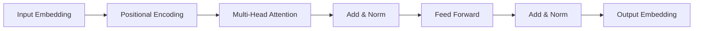

# Transformer 原理与代码实例讲解

## 1. 背景介绍
### 1.1 Transformer 的诞生
### 1.2 Transformer 的重要性
### 1.3 Transformer 的应用领域

## 2. 核心概念与联系
### 2.1 Attention 机制
#### 2.1.1 Attention 的定义
#### 2.1.2 Attention 的类型
#### 2.1.3 Self-Attention
### 2.2 Transformer 架构
#### 2.2.1 Encoder
#### 2.2.2 Decoder
#### 2.2.3 Encoder-Decoder 结构
### 2.3 位置编码
#### 2.3.1 位置编码的必要性
#### 2.3.2 位置编码的实现方式

## 3. 核心算法原理具体操作步骤
### 3.1 Self-Attention 计算过程
#### 3.1.1 计算 Query、Key、Value 矩阵
#### 3.1.2 计算 Attention Scores
#### 3.1.3 计算 Attention Weights
#### 3.1.4 计算 Attention Output
### 3.2 Multi-Head Attention
#### 3.2.1 Multi-Head Attention 的意义
#### 3.2.2 Multi-Head Attention 的计算过程
### 3.3 Feed Forward Network
#### 3.3.1 Feed Forward Network 的结构
#### 3.3.2 残差连接和Layer Normalization

## 4. 数学模型和公式详细讲解举例说明 
### 4.1 Scaled Dot-Product Attention
$$
Attention(Q,K,V) = softmax(\frac{QK^T}{\sqrt{d_k}})V
$$
其中，$Q$, $K$, $V$ 分别表示 Query、Key、Value 矩阵，$d_k$ 表示 Key 的维度。

### 4.2 Multi-Head Attention
$$
MultiHead(Q,K,V) = Concat(head_1,...,head_h)W^O \\
head_i = Attention(QW_i^Q, KW_i^K, VW_i^V)
$$
其中，$W_i^Q$, $W_i^K$, $W_i^V$ 和 $W^O$ 是可学习的权重矩阵。

### 4.3 位置编码
$$
PE_{(pos,2i)} = sin(pos/10000^{2i/d_{model}}) \\
PE_{(pos,2i+1)} = cos(pos/10000^{2i/d_{model}})
$$
其中，$pos$ 表示位置，$i$ 表示维度，$d_{model}$ 表示词嵌入的维度。

## 5. 项目实践：代码实例和详细解释说明
### 5.1 Self-Attention 的 PyTorch 实现
```python
import torch
import torch.nn as nn

class SelfAttention(nn.Module):
    def __init__(self, embed_dim, num_heads):
        super().__init__()
        self.embed_dim = embed_dim
        self.num_heads = num_heads
        self.head_dim = embed_dim // num_heads

        self.query = nn.Linear(embed_dim, embed_dim)
        self.key = nn.Linear(embed_dim, embed_dim)
        self.value = nn.Linear(embed_dim, embed_dim)

        self.fc = nn.Linear(embed_dim, embed_dim)

    def forward(self, x):
        batch_size, seq_len, _ = x.size()

        query = self.query(x).view(batch_size, seq_len, self.num_heads, self.head_dim).transpose(1, 2)
        key = self.key(x).view(batch_size, seq_len, self.num_heads, self.head_dim).transpose(1, 2)
        value = self.value(x).view(batch_size, seq_len, self.num_heads, self.head_dim).transpose(1, 2)

        scores = torch.matmul(query, key.transpose(-2, -1)) / (self.head_dim ** 0.5)
        attn_weights = nn.functional.softmax(scores, dim=-1)
        attn_output = torch.matmul(attn_weights, value)

        attn_output = attn_output.transpose(1, 2).contiguous().view(batch_size, seq_len, self.embed_dim)
        attn_output = self.fc(attn_output)

        return attn_output
```

以上代码实现了 Self-Attention 机制，主要步骤如下：
1. 通过线性层将输入 $x$ 转换为 Query、Key、Value 矩阵。
2. 将 Query、Key、Value 矩阵分割为多个头。
3. 计算 Attention Scores 和 Attention Weights。
4. 计算 Attention Output，并通过线性层进行转换。

### 5.2 Transformer 的 PyTorch 实现
```python
import torch
import torch.nn as nn

class TransformerEncoderLayer(nn.Module):
    def __init__(self, embed_dim, num_heads, ff_dim, dropout=0.1):
        super().__init__()
        self.self_attn = nn.MultiheadAttention(embed_dim, num_heads, dropout=dropout)
        self.ff = nn.Sequential(
            nn.Linear(embed_dim, ff_dim),
            nn.ReLU(),
            nn.Linear(ff_dim, embed_dim)
        )
        self.norm1 = nn.LayerNorm(embed_dim)
        self.norm2 = nn.LayerNorm(embed_dim)
        self.dropout1 = nn.Dropout(dropout)
        self.dropout2 = nn.Dropout(dropout)

    def forward(self, x):
        attn_output = self.self_attn(x, x, x)[0]
        x = x + self.dropout1(attn_output)
        x = self.norm1(x)

        ff_output = self.ff(x)
        x = x + self.dropout2(ff_output)
        x = self.norm2(x)

        return x

class TransformerEncoder(nn.Module):
    def __init__(self, num_layers, embed_dim, num_heads, ff_dim, dropout=0.1):
        super().__init__()
        self.layers = nn.ModuleList([
            TransformerEncoderLayer(embed_dim, num_heads, ff_dim, dropout)
            for _ in range(num_layers)
        ])

    def forward(self, x):
        for layer in self.layers:
            x = layer(x)
        return x
```

以上代码实现了 Transformer 的 Encoder 部分，主要包括以下组件：
1. Multi-Head Attention
2. Feed Forward Network
3. 残差连接和Layer Normalization
4. Encoder 由多个 Encoder Layer 组成

## 6. 实际应用场景
### 6.1 机器翻译
### 6.2 文本摘要
### 6.3 语言模型预训练
### 6.4 图像分类
### 6.5 语音识别

## 7. 工具和资源推荐
### 7.1 PyTorch
### 7.2 TensorFlow
### 7.3 Hugging Face Transformers
### 7.4 Attention is All You Need 论文
### 7.5 The Illustrated Transformer 博客

## 8. 总结：未来发展趋势与挑战
### 8.1 Transformer 的优势
### 8.2 Transformer 的局限性
### 8.3 未来研究方向
#### 8.3.1 模型压缩与加速
#### 8.3.2 长文本建模
#### 8.3.3 多模态学习

## 9. 附录：常见问题与解答
### 9.1 Transformer 相比 RNN 和 CNN 有什么优势？
### 9.2 Self-Attention 与传统 Attention 有何区别？
### 9.3 如何理解 Transformer 中的位置编码？
### 9.4 Transformer 能否处理变长序列？
### 9.5 Transformer 的计算复杂度如何？

Transformer 作为一种革命性的神经网络架构，自 2017 年提出以来，迅速成为自然语言处理领域的主流模型。它摒弃了传统的循环神经网络和卷积神经网络，完全依赖于 Attention 机制来建模序列数据，极大地提升了并行计算效率和长距离依赖建模能力。

Transformer 的核心思想在于 Self-Attention，通过计算序列中每个位置与其他位置的相关性，实现了全局信息的捕获和融合。Multi-Head Attention 进一步增强了模型的表达能力，使其能够从不同的子空间中提取特征。此外，Transformer 还引入了位置编码，以显式地为模型提供序列中各个位置的信息。

在实际应用中，Transformer 已经成为各种自然语言处理任务的首选模型，如机器翻译、文本摘要、语言模型预训练等。同时，Transformer 的思想也被拓展到了计算机视觉、语音识别等领域，展现出了广泛的适用性。

尽管 Transformer 取得了巨大的成功，但它仍然面临着一些挑战，如模型的巨大计算开销、对长文本的建模难度等。未来的研究方向可能包括模型压缩与加速、长文本建模、多模态学习等。

总之，Transformer 是深度学习领域的一个里程碑式的创新，它重新定义了序列建模的范式，为人工智能的发展注入了新的活力。相信通过研究者们的不断探索和优化，Transformer 必将在更广阔的领域释放出它的潜力，推动人工智能技术的进一步发展。

作者：禅与计算机程序设计艺术 / Zen and the Art of Computer Programming

