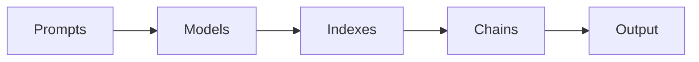

# 【LangChain编程：从入门到实践】变化与重构

## 1. 背景介绍
### 1.1 人工智能的发展历程
#### 1.1.1 早期的人工智能
#### 1.1.2 机器学习的崛起  
#### 1.1.3 深度学习的突破

### 1.2 自然语言处理的挑战
#### 1.2.1 语言的复杂性
#### 1.2.2 语义理解的困难
#### 1.2.3 上下文依赖性

### 1.3 LangChain的出现
#### 1.3.1 LangChain的定义
#### 1.3.2 LangChain的特点
#### 1.3.3 LangChain的发展现状

## 2. 核心概念与联系
### 2.1 LangChain的核心组件
#### 2.1.1 Prompts
#### 2.1.2 Models
#### 2.1.3 Indexes
#### 2.1.4 Chains

### 2.2 组件之间的联系
#### 2.2.1 Prompts与Models的关系
#### 2.2.2 Models与Indexes的关系 
#### 2.2.3 Indexes与Chains的关系

### 2.3 LangChain的工作流程


## 3. 核心算法原理具体操作步骤
### 3.1 Prompts的构建
#### 3.1.1 Prompt模板的设计
#### 3.1.2 Few-shot Learning
#### 3.1.3 Prompt优化技巧

### 3.2 Models的选择与使用
#### 3.2.1 常用的预训练语言模型
#### 3.2.2 微调与适应
#### 3.2.3 模型推理与生成

### 3.3 Indexes的构建与查询
#### 3.3.1 文本数据的预处理
#### 3.3.2 向量化与索引
#### 3.3.3 相似度搜索与查询优化

### 3.4 Chains的组合与执行
#### 3.4.1 顺序链
#### 3.4.2 条件链
#### 3.4.3 循环链

## 4. 数学模型和公式详细讲解举例说明
### 4.1 Transformer模型
#### 4.1.1 自注意力机制
$Attention(Q,K,V) = softmax(\frac{QK^T}{\sqrt{d_k}})V$
#### 4.1.2 多头注意力
$MultiHead(Q,K,V) = Concat(head_1, ..., head_h)W^O$
#### 4.1.3 位置编码
$PE_{(pos,2i)} = sin(pos/10000^{2i/d_{model}})$
$PE_{(pos,2i+1)} = cos(pos/10000^{2i/d_{model}})$

### 4.2 Word2Vec词嵌入
#### 4.2.1 CBOW模型
$p(w_t|w_{t-2},w_{t-1},w_{t+1},w_{t+2}) = softmax(W^T \cdot \frac{1}{4}(w_{t-2}+w_{t-1}+w_{t+1}+w_{t+2}))$
#### 4.2.2 Skip-Gram模型 
$p(w_{t-2},w_{t-1},w_{t+1},w_{t+2}|w_t) = \prod_{-2 \leq j \leq 2, j \neq 0} p(w_{t+j}|w_t)$

### 4.3 TF-IDF文本表示
#### 4.3.1 词频(TF)
$TF(t,d) = \frac{f_{t,d}}{\sum_{t' \in d} f_{t',d}}$
#### 4.3.2 逆文档频率(IDF)
$IDF(t,D) = log \frac{|D|}{|\{d \in D: t \in d\}|}$
#### 4.3.3 TF-IDF权重
$TFIDF(t,d,D) = TF(t,d) \times IDF(t,D)$

## 5. 项目实践：代码实例和详细解释说明
### 5.1 Prompts的使用示例
```python
from langchain import PromptTemplate

template = """
你是一个AI助手，专门用于回答用户的问题。
根据以下对话历史，请给出一个友好、专业、有帮助的回答。

对话历史:
{history}

用户: {input}
AI助手:"""

prompt = PromptTemplate(
    input_variables=["history", "input"], 
    template=template
)
```

这个示例展示了如何使用`PromptTemplate`类来创建一个Prompt模板。模板中定义了AI助手的角色以及对话历史和用户输入的占位符。通过传入实际的对话历史和用户输入，可以生成完整的Prompt文本。

### 5.2 Models的使用示例
```python
from langchain.llms import OpenAI

llm = OpenAI(model_name="text-davinci-002", temperature=0.7)

text = "What are the three main branches of government in the United States?"
print(llm(text))
```

这个示例展示了如何使用OpenAI的语言模型进行推理。通过创建一个`OpenAI`实例，指定模型名称和生成参数，然后传入文本即可获得模型的输出结果。

### 5.3 Indexes的使用示例
```python
from langchain.indexes import VectorstoreIndexCreator
from langchain.document_loaders import TextLoader

loader = TextLoader('document.txt')
index = VectorstoreIndexCreator().from_loaders([loader])

query = "What is the main topic of this document?"
print(index.query(query))
```

这个示例展示了如何使用`VectorstoreIndexCreator`来创建一个向量存储索引。首先通过`TextLoader`加载文本文档，然后传入`from_loaders`方法创建索引。最后，可以使用`query`方法进行相似度搜索并获取查询结果。

### 5.4 Chains的使用示例
```python
from langchain.chains import LLMChain
from langchain.prompts import PromptTemplate
from langchain.llms import OpenAI

llm = OpenAI(temperature=0.9)
prompt = PromptTemplate(
    input_variables=["product"],
    template="What is a good name for a company that makes {product}?",
)

chain = LLMChain(llm=llm, prompt=prompt)

print(chain.run("colorful socks"))
```

这个示例展示了如何使用`LLMChain`来组合Prompt和Models。首先创建一个`OpenAI`实例作为语言模型，然后定义一个包含`product`变量的Prompt模板。接着，将语言模型和Prompt传入`LLMChain`的构造函数中创建一个链。最后，通过调用`run`方法并传入实际的`product`值，即可获得链的执行结果。

## 6. 实际应用场景
### 6.1 智能客服
#### 6.1.1 用户意图识别
#### 6.1.2 问答系统
#### 6.1.3 情感分析

### 6.2 个性化推荐
#### 6.2.1 用户画像构建
#### 6.2.2 推荐算法
#### 6.2.3 解释性推荐

### 6.3 智能写作助手
#### 6.3.1 文本生成
#### 6.3.2 文本纠错
#### 6.3.3 风格转换

## 7. 工具和资源推荐
### 7.1 LangChain官方文档
#### 7.1.1 快速入门指南
#### 7.1.2 API参考手册
#### 7.1.3 最佳实践案例

### 7.2 相关开源项目
#### 7.2.1 Hugging Face Transformers
#### 7.2.2 Haystack
#### 7.2.3 Jina

### 7.3 学习资源
#### 7.3.1 在线课程
#### 7.3.2 博客与教程
#### 7.3.3 学术论文

## 8. 总结：未来发展趋势与挑战
### 8.1 LangChain的发展前景
#### 8.1.1 与其他框架的集成
#### 8.1.2 性能优化与扩展性
#### 8.1.3 社区生态建设

### 8.2 自然语言处理的未来方向
#### 8.2.1 知识增强学习
#### 8.2.2 跨模态理解
#### 8.2.3 可解释性与鲁棒性

### 8.3 挑战与机遇并存
#### 8.3.1 数据隐私与安全
#### 8.3.2 模型偏见与公平性
#### 8.3.3 人机协作与伦理问题

## 9. 附录：常见问题与解答
### 9.1 LangChain与其他NLP库的区别？
LangChain是一个专注于构建语言模型应用链的框架，提供了一套灵活的组件和工具，用于快速搭建端到端的自然语言处理流程。与其他NLP库相比，LangChain更加关注应用层面，强调组件的可组合性和可扩展性，同时提供了丰富的预训练模型和示例代码，降低了开发门槛。

### 9.2 如何选择合适的语言模型？
选择合适的语言模型需要考虑以下几个因素：
1. 任务类型：不同的任务对模型的要求不同，如文本分类、命名实体识别、文本生成等。
2. 数据规模：模型的性能与训练数据的规模密切相关，需要根据实际情况选择合适的模型。
3. 计算资源：大型语言模型需要更多的计算资源，需要权衡模型性能与硬件成本。
4. 推理速度：实时应用对推理速度有较高要求，需要选择合适的模型架构和优化技术。

### 9.3 LangChain的可扩展性如何？
LangChain采用了模块化的设计理念，各个组件之间通过统一的接口进行交互，具有很好的可扩展性。用户可以根据实际需求，自定义Prompts、Models、Indexes和Chains，并将它们灵活组合形成复杂的应用逻辑。同时，LangChain也提供了插件机制，方便集成第三方库和工具，进一步增强了框架的扩展能力。

作者：禅与计算机程序设计艺术 / Zen and the Art of Computer Programming