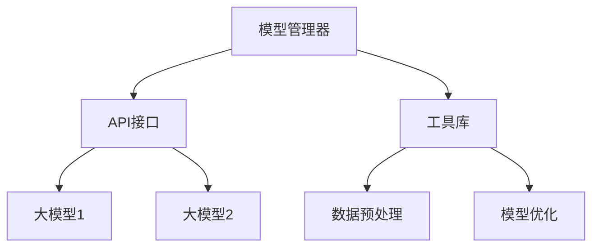

# 【LangChain编程：从入门到实践】大模型接口

## 1.背景介绍

在人工智能和自然语言处理领域，语言模型（Language Model, LM）已经成为了不可或缺的工具。特别是随着深度学习技术的发展，基于大规模数据训练的语言模型如GPT-3、BERT等，展现出了强大的语言理解和生成能力。LangChain作为一种新兴的编程框架，旨在简化和优化大模型的使用，使开发者能够更高效地构建和部署基于大模型的应用。

## 2.核心概念与联系

### 2.1 什么是LangChain

LangChain是一个专门为大语言模型（LLM）设计的编程框架，提供了一系列工具和接口，帮助开发者更方便地调用和管理大模型。它不仅支持多种大模型的无缝集成，还提供了丰富的API和工具库，简化了模型的训练、推理和部署过程。

### 2.2 大模型接口的作用

大模型接口是LangChain的核心组件之一，负责与各种大模型进行交互。通过这些接口，开发者可以轻松地调用不同的大模型，进行文本生成、分类、翻译等任务。

### 2.3 LangChain与其他框架的区别

与其他框架相比，LangChain的优势在于其高度的灵活性和可扩展性。它不仅支持多种大模型，还提供了丰富的工具和库，帮助开发者更高效地进行模型管理和优化。

## 3.核心算法原理具体操作步骤

### 3.1 LangChain的架构设计

LangChain的架构设计包括以下几个核心组件：

- **模型管理器**：负责管理和调度不同的大模型。
- **API接口**：提供统一的接口，简化模型的调用和交互。
- **工具库**：提供丰富的工具，帮助开发者进行数据预处理、模型优化等操作。



### 3.2 操作步骤

1. **选择大模型**：根据任务需求选择合适的大模型。
2. **数据预处理**：使用LangChain提供的工具库进行数据预处理。
3. **模型调用**：通过API接口调用大模型进行推理。
4. **结果处理**：对模型输出的结果进行处理和分析。

## 4.数学模型和公式详细讲解举例说明

### 4.1 语言模型的基本原理

语言模型的基本原理是通过统计语言中的词汇和句子的共现关系，来预测下一个词或生成新的句子。常见的语言模型包括n-gram模型、隐马尔可夫模型（HMM）和基于神经网络的模型。

### 4.2 数学公式

以n-gram模型为例，其基本公式为：

$$
P(w_1, w_2, ..., w_n) = \prod_{i=1}^{n} P(w_i | w_{i-1}, w_{i-2}, ..., w_{i-(n-1)})
$$

其中，$P(w_i | w_{i-1}, w_{i-2}, ..., w_{i-(n-1)})$ 表示在给定前$n-1$个词的情况下，第$i$个词的概率。

### 4.3 举例说明

假设我们有一个3-gram模型，句子为“我爱自然语言处理”，则其概率计算为：

$$
P(我, 爱, 自然, 语言, 处理) = P(我) \cdot P(爱 | 我) \cdot P(自然 | 我, 爱) \cdot P(语言 | 爱, 自然) \cdot P(处理 | 自然, 语言)
$$

## 5.项目实践：代码实例和详细解释说明

### 5.1 环境配置

首先，我们需要配置开发环境，安装LangChain和相关依赖。

```bash
pip install langchain
```

### 5.2 代码实例

以下是一个简单的代码实例，展示如何使用LangChain调用GPT-3模型进行文本生成。

```python
from langchain import LangChain

# 初始化LangChain
lc = LangChain(api_key='your_api_key')

# 选择大模型
model = lc.get_model('gpt-3')

# 输入文本
input_text = "今天天气怎么样？"

# 调用模型进行文本生成
output_text = model.generate(input_text)

print(output_text)
```

### 5.3 详细解释

1. **初始化LangChain**：使用API密钥初始化LangChain。
2. **选择大模型**：通过`get_model`方法选择GPT-3模型。
3. **输入文本**：定义输入文本。
4. **调用模型**：使用`generate`方法调用模型进行文本生成。
5. **输出结果**：打印生成的文本。

## 6.实际应用场景

### 6.1 文本生成

大模型可以用于生成高质量的文本内容，如新闻报道、技术文档等。

### 6.2 机器翻译

通过大模型，可以实现高精度的多语言翻译，提升跨语言交流的效率。

### 6.3 情感分析

大模型可以用于分析文本的情感倾向，帮助企业了解用户反馈和市场情绪。

### 6.4 对话系统

基于大模型的对话系统可以提供更加自然和智能的用户交互体验。

## 7.工具和资源推荐

### 7.1 开发工具

- **Jupyter Notebook**：用于数据分析和模型训练的交互式开发环境。
- **VS Code**：功能强大的代码编辑器，支持多种编程语言和插件。

### 7.2 在线资源

- **LangChain官方文档**：提供详细的API文档和使用指南。
- **GitHub**：LangChain的开源代码库，包含丰富的示例和教程。

### 7.3 学习资源

- **Coursera**：提供多种人工智能和自然语言处理相关的在线课程。
- **arXiv**：最新的研究论文和技术报告，帮助了解前沿技术动态。

## 8.总结：未来发展趋势与挑战

### 8.1 未来发展趋势

随着大模型技术的不断进步，LangChain将会在以下几个方面取得重要发展：

- **模型优化**：通过更高效的算法和硬件加速，提升模型的性能和效率。
- **多模态融合**：结合图像、语音等多模态数据，提升模型的理解和生成能力。
- **自动化工具**：开发更多自动化工具，简化模型的训练和部署过程。

### 8.2 面临的挑战

- **数据隐私**：如何在保证数据隐私的前提下，进行大规模数据训练和模型应用。
- **模型解释性**：提升大模型的解释性，帮助用户理解模型的决策过程。
- **资源消耗**：大模型的训练和推理需要大量的计算资源，如何优化资源使用是一个重要挑战。

## 9.附录：常见问题与解答

### 9.1 LangChain支持哪些大模型？

LangChain支持多种大模型，包括GPT-3、BERT、T5等。开发者可以根据任务需求选择合适的模型。

### 9.2 如何优化大模型的性能？

可以通过以下几种方法优化大模型的性能：

- **模型剪枝**：去除冗余的模型参数，提升模型的推理速度。
- **量化技术**：将模型参数从浮点数转换为低精度整数，减少计算资源消耗。
- **分布式训练**：使用多台机器进行分布式训练，加速模型的训练过程。

### 9.3 LangChain是否支持多语言？

是的，LangChain支持多语言。开发者可以使用LangChain调用多语言模型，进行文本生成、翻译等任务。

### 9.4 如何处理大模型的输出结果？

可以使用LangChain提供的工具库，对大模型的输出结果进行处理和分析。例如，可以使用文本分析工具进行情感分析、关键词提取等操作。

### 9.5 LangChain的未来发展方向是什么？

LangChain将继续优化模型的性能和效率，开发更多自动化工具，提升用户体验。同时，LangChain也将探索多模态融合和模型解释性等前沿技术，推动大模型技术的发展。

---

作者：禅与计算机程序设计艺术 / Zen and the Art of Computer Programming