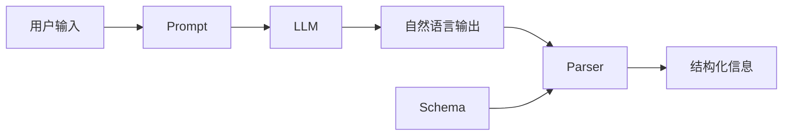

# 【LangChain编程：从入门到实践】输出解析器

## 1. 背景介绍

### 1.1 LangChain是什么？
LangChain是一个用于开发由语言模型驱动的应用程序的开发框架。它可以帮助开发者更容易地将语言模型集成到他们的应用程序中，提供了一系列工具和组件来构建端到端的语言模型应用。

### 1.2 输出解析器的作用
在使用LangChain构建应用时，输出解析器扮演着非常重要的角色。它负责解析和提取语言模型生成的输出中的结构化信息，以便应用程序可以进一步处理和使用这些信息。没有输出解析器，应用程序将难以理解和利用语言模型生成的自然语言输出。

### 1.3 本文的目的
本文旨在深入探讨LangChain中的输出解析器，介绍其核心概念、工作原理、使用方法以及在实际项目中的应用。通过本文，读者将全面了解输出解析器，并学会如何在自己的LangChain项目中有效地使用它。

## 2. 核心概念与联系

### 2.1 LLM（大语言模型）
LLM是输出解析器的基础。它负责接收用户输入的提示，并生成相应的自然语言响应。输出解析器需要处理LLM生成的响应，提取其中有用的信息。

### 2.2 Prompt（提示）
Prompt是输入到LLM中的文本，用于指导模型生成所需的输出。设计好的Prompt可以引导LLM生成结构化、易于解析的输出，从而简化输出解析器的工作。

### 2.3 Schema（模式）
Schema定义了输出的结构和格式。它告诉输出解析器如何解释LLM生成的输出，哪些部分包含需要提取的信息。设计合适的Schema对于输出解析器的正确运行至关重要。

### 2.4 Parser（解析器）
Parser是输出解析器的核心组件，负责根据定义的Schema解析LLM生成的输出，提取结构化信息。LangChain提供了多种内置的Parser，也允许开发者自定义Parser。

### 2.5 组件之间的关系
下图展示了LLM、Prompt、Schema和Parser之间的关系和数据流：



## 3. 核心算法原理具体操作步骤

### 3.1 定义Schema
首先需要根据应用需求定义输出的Schema。Schema描述了输出中需要提取的字段以及每个字段的类型。例如：

```python
from langchain.output_parsers import ResponseSchema

schema = ResponseSchema(
    name=str,
    age=int,
    city=str
)
```

### 3.2 选择Parser
根据Schema的复杂程度和格式，选择合适的内置Parser或自定义Parser。常用的内置Parser包括：

- `StructuredOutputParser`：通用的结构化输出解析器
- `CommaSeparatedListOutputParser`：解析逗号分隔的列表输出
- `PydanticOutputParser`：基于Pydantic模型的解析器

例如使用`StructuredOutputParser`：

```python
from langchain.output_parsers import StructuredOutputParser

parser = StructuredOutputParser.from_response_schemas(schema)
```

### 3.3 定义Prompt
设计Prompt来引导LLM生成符合预期Schema的输出。Prompt中应包含清晰的指令和示例。例如：

```python
prompt = PromptTemplate(
    template="""请以如下格式提供用户信息：
    
    名字：{name}
    年龄：{age}
    城市：{city}
    
    填充上述模板：""",
    input_variables=["name", "age", "city"],
    response_schemas=schema
)
```

### 3.4 解析输出
将LLM的输出传递给Parser进行解析，得到结构化的信息：

```python
output = llm(prompt.format(name="John", age=30, city="New York"))
result = parser.parse(output)

print(result)
# {'name': 'John', 'age': 30, 'city': 'New York'}
```

## 4. 数学模型和公式详细讲解举例说明

输出解析器主要基于字符串匹配和正则表达式等技术，通常不涉及复杂的数学模型。但在某些情况下，可能会用到一些基本的概率统计和信息论知识。

例如，如果输出中存在多个可能的解析结果，可以利用语言模型的概率输出，选择概率最大的解析：

$$
\hat{y} = \arg\max_{y \in Y} P(y|x)
$$

其中$x$为输入的提示，$Y$为所有可能的解析结果集合，$\hat{y}$为最优解析结果。

又如，在评估解析器的性能时，可以用信息论中的指标如准确率、召回率、F1值等：

- 准确率（Precision）：$P = \frac{TP}{TP+FP}$
- 召回率（Recall）：$R = \frac{TP}{TP+FN}$  
- F1值：$F1 = \frac{2PR}{P+R}$

其中$TP$为真正例，$FP$为假正例，$FN$为假反例。

## 5. 项目实践：代码实例和详细解释说明

下面通过一个完整的示例来演示如何在LangChain项目中使用输出解析器。该示例将构建一个简单的问答应用，能够从用户提供的文本中提取关键信息并回答问题。

```python
from langchain.llms import OpenAI
from langchain.prompts import PromptTemplate
from langchain.output_parsers import ResponseSchema, StructuredOutputParser

# 定义Schema
schema = ResponseSchema(
    name=str,
    age=int,
    city=str,
    question=str,
    answer=str
)

# 选择Parser
parser = StructuredOutputParser.from_response_schemas(schema)

# 定义Prompt
prompt = PromptTemplate(
    template="""以下是一段用户提供的信息：

    {user_info}
    
    请从中提取关键信息，并以如下格式回答问题：

    名字：{name}
    年龄：{age}  
    城市：{city}
    问题：{question}
    回答：{answer}
    
    填充上述模板：""",
    input_variables=["user_info"],
    response_schemas=schema  
)

# 实例化LLM
llm = OpenAI(temperature=0)

# 输入用户信息和问题
user_info = "John是一位30岁的软件工程师，目前居住在纽约。"
question = "John的职业是什么？"

# 格式化Prompt
formatted_prompt = prompt.format(user_info=user_info, question=question)

# 生成LLM输出
llm_output = llm(formatted_prompt)

# 解析输出
result = parser.parse(llm_output)

print(result)
# {
#     'name': 'John',
#     'age': 30,
#     'city': '纽约',
#     'question': 'John的职业是什么？',
#     'answer': 'John是一位软件工程师。'
# }
```

以上代码首先定义了Schema，然后选择合适的Parser。接着设计Prompt模板，将用户信息和问题作为输入变量。

实例化LLM后，将用户输入的信息和问题填入Prompt模板，生成格式化的Prompt。将其传递给LLM，得到自然语言输出。

最后，用Parser解析LLM的输出，提取结构化信息，完成问答。

## 6. 实际应用场景

输出解析器在许多实际应用中都扮演着重要角色，例如：

### 6.1 智能客服
利用输出解析器，可以从用户的咨询信息中提取关键细节，如姓名、订单号、问题描述等，然后生成相应的回复。这有助于自动化处理大量的客户咨询。

### 6.2 数据标注
在准备训练数据时，可以用输出解析器从非结构化的文本中提取所需的字段和标签，自动完成部分标注任务，减轻人工标注的工作量。

### 6.3 信息抽取
对于一些半结构化的文本数据，如简历、医疗病历、法律合同等，输出解析器可以帮助快速抽取关键信息，用于后续的分析和处理。

### 6.4 代码生成
在代码生成任务中，输出解析器可以帮助确保生成的代码符合预期的结构和格式，如函数定义、类定义、注释等，提高代码的可读性和可维护性。

## 7. 工具和资源推荐

除了LangChain，还有一些其他优秀的工具和库可以用于构建语言模型应用和进行输出解析：

- OpenAI GPT-3 API：强大的语言模型API，可用于各种自然语言处理任务。
- Hugging Face Transformers：流行的自然语言处理库，提供了多种预训练语言模型。
- spaCy：全面的自然语言处理库，包含丰富的预训练模型和实用工具。
- Pydantic：用于数据验证和设置管理的Python库，可用于定义输出Schema。
- FastAPI：高性能的Web框架，便于快速构建API服务。

此外，关注LangChain的官方文档和示例，可以了解更多使用技巧和最佳实践。加入LangChain社区，与其他开发者交流经验，也是提升技能的好方法。

## 8. 总结：未来发展趋势与挑战

输出解析器是语言模型应用的重要组成部分，随着语言模型的不断发展，输出解析器也面临着新的机遇和挑战。

未来，输出解析器将朝着更加智能、灵活、高效的方向发展。一些可能的趋势包括：

- 自适应解析：根据不同的任务和上下文，自动调整解析策略和Schema。
- 多模态解析：结合文本、图像、语音等多种模态的信息，进行综合解析。
- 知识增强解析：利用外部知识库和推理能力，提高解析的准确性和全面性。
- 解析器的自动生成：利用元学习等技术，自动生成适用于特定任务的解析器。

同时，输出解析器也面临一些挑战：

- 处理歧义和不确定性：语言模型的输出可能存在歧义和不确定性，需要解析器能够恰当地处理。
- 应对语言的多样性：不同语言和领域的文本有其独特的特点，需要解析器能够适应。
- 提高鲁棒性：解析器需要能够应对各种异常和边缘情况，保证稳定性。
- 数据隐私和安全：在处理敏感数据时，要注意保护用户隐私，确保数据安全。

总之，输出解析器是连接语言模型和应用的重要桥梁，其发展与语言模型技术的进步密切相关。未来，打造更加智能、高效、安全的输出解析器，将是语言模型应用走向成熟的关键一步。

## 9. 附录：常见问题与解答

### Q1: 如何选择合适的Parser？
A1: 选择Parser主要取决于输出的格式和复杂程度。对于简单的结构化输出，可以使用`StructuredOutputParser`或`CommaSeparatedListOutputParser`等内置Parser。对于更复杂的格式，可能需要自定义Parser。Pydantic库可以帮助定义复杂的数据模型。

### Q2: Prompt设计有哪些技巧？
A2: 设计Prompt时，应尽量明确、具体，给出清晰的指令和格式要求。可以提供一些示例来说明所需的输出格式。避免使用含糊或容易产生歧义的表述。在复杂的Prompt中，可以使用模板语言如Jinja2来组织和管理。

### Q3: 如何处理解析错误？
A3: 解析错误通常由Prompt设计不当或LLM输出不符合预期格式导致。可以通过改进Prompt、调整LLM参数、增加数据清洗和后处理等方法来减少错误。在代码中，对解析结果进行异常处理，捕获和记录错误，以便分析和改进。必要时，可以引入人工反馈和纠错机制。

### Q4: 输出解析器可以用于非英语语言吗？
A4: 输出解析器本身与具体语言无关，主要依赖于LLM和Prompt。只要有适合目标语言的LLM和相应的Prompt，就可以应用到非英语语言中。但要注意不同语言的特点，如词序、格式惯例等，需要在Prompt和Parser设计时加以考虑。

作者：禅与计算机程序设计艺