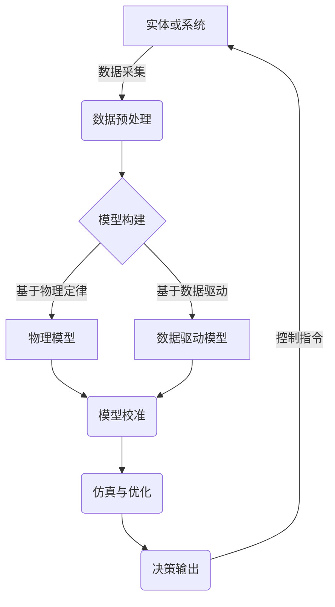
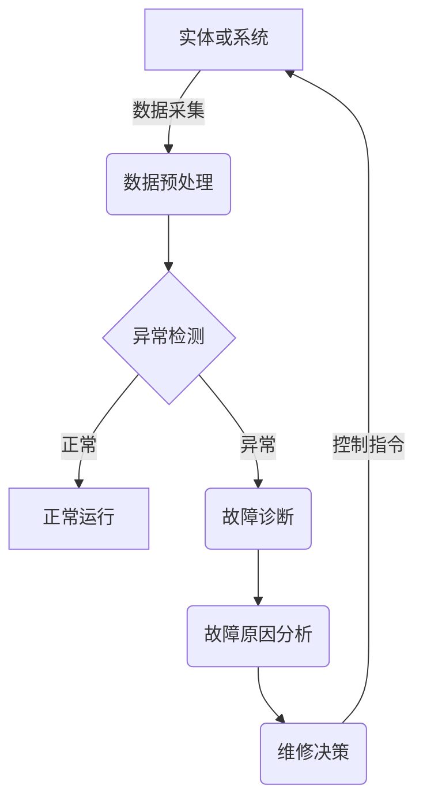
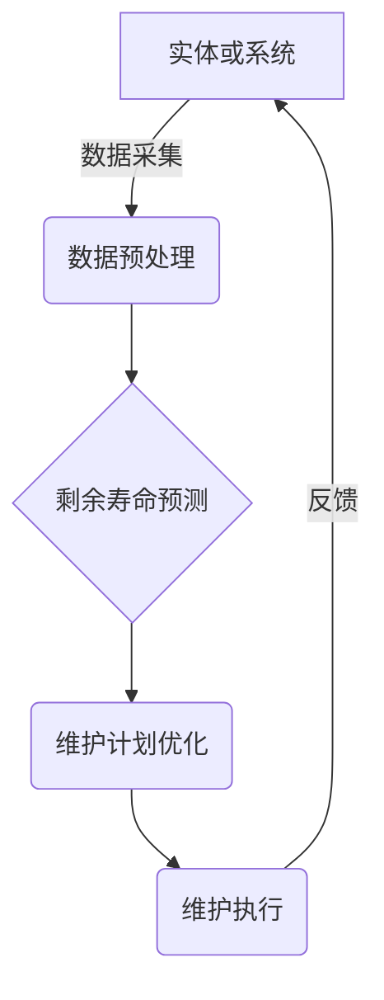

# 企业数字化转型中的数字孪生技术应用

## 1. 背景介绍

### 1.1 数字化转型的重要性

在当今快节奏的商业环境中，企业面临着前所未有的挑战和机遇。为了保持竞争力并实现可持续发展,企业必须紧跟数字化浪潮,主动拥抱数字化转型。数字化转型是指利用数字技术来彻底重塑业务模式、流程和运营,以提高效率、增强敏捷性并创造新的价值。

### 1.2 数字孪生技术概述

数字孪生(Digital Twin)技术作为数字化转型的关键驱动力,正在引领企业向智能化和自动化的方向发展。数字孪生是一种通过虚拟模型精准映射和模拟现实世界中的实体、过程或系统,从而实现双向数据交互和优化决策的技术。它将物理世界与数字世界紧密融合,为企业提供了全新的洞察力和控制能力。

## 2. 核心概念与联系

### 2.1 数字孪生的核心概念

数字孪生的核心概念包括以下几个方面:

1. **虚拟模型**: 利用计算机模拟技术构建与现实世界中的实体或系统高度吻合的虚拟模型,包括其物理特性、行为和环境等。

2. **数据集成**: 通过各种传感器和数据采集设备,实时获取实体或系统的运行数据,并将其与虚拟模型进行双向数据交互和同步。

3. **模拟与优化**: 在虚拟模型中进行各种情景模拟和分析,优化设计、预测维护需求、评估决策影响等,从而指导现实世界中的操作。

4. **闭环控制**: 基于虚拟模型的分析结果,对实体或系统进行实时监控、诊断和控制,形成闭环优化管理。

### 2.2 数字孪生与其他技术的关系

数字孪生技术与多种先进技术密切相关,包括:

- **物联网(IoT)**: 物联网为数字孪生提供了实时数据采集和远程控制的基础设施。
- **大数据与人工智能**: 大数据分析和人工智能算法赋予数字孪生强大的数据处理和决策能力。
- **云计算与边缘计算**: 云计算为数字孪生提供了灵活的计算资源,边缘计算则支持实时响应。
- **增强现实(AR)与虚拟现实(VR)**: 这些技术为数字孪生提供了直观的可视化界面。

## 3. 核心算法原理具体操作步骤

数字孪生技术的核心算法原理主要包括以下几个方面:

### 3.1 建模与仿真



1. **数据采集**: 通过各种传感器和数据采集设备,获取实体或系统的运行数据,如温度、压力、振动等。

2. **数据预处理**: 对采集的原始数据进行清洗、标准化和特征提取等预处理,为后续建模做准备。

3. **模型构建**:
   - **物理模型**: 基于物理定律和理论,构建实体或系统的数学模型,如有限元模型、流体动力学模型等。
   - **数据驱动模型**: 利用机器学习等技术,从历史数据中学习实体或系统的行为模式,构建数据驱动模型。

4. **模型校准**: 通过实际运行数据,对模型进行校准和优化,提高模型的精度和可靠性。

5. **仿真与优化**: 在校准后的模型上进行各种情景模拟和优化,评估不同决策的影响,寻找最优解。

6. **决策输出**: 根据仿真和优化结果,输出控制决策,指导实体或系统的实际运行。

7. **闭环控制**: 实体或系统的运行数据将反馈回数字孪生系统,形成闭环控制和持续优化。

### 3.2 在线监测与故障诊断



1. **数据采集**: 实时采集实体或系统的运行数据,如振动、温度、压力等。

2. **数据预处理**: 对采集的原始数据进行清洗、标准化和特征提取等预处理。

3. **异常检测**: 利用机器学习等技术,对预处理后的数据进行异常检测,判断实体或系统是否运行正常。

4. **故障诊断**: 对检测到的异常进行故障诊断,确定故障类型和位置。

5. **故障原因分析**: 结合历史数据和专家知识,分析故障的根本原因。

6. **维修决策**: 根据故障原因和严重程度,制定维修策略和计划。

7. **控制指令**: 向实体或系统发送维修指令,或者暂时调整运行参数,避免故障扩大。

8. **闭环优化**: 根据维修结果和新的运行数据,持续优化故障诊断模型和维修策略。

### 3.3 预测性维护



1. **数据采集**: 持续采集实体或系统的运行数据,如振动、温度、压力等。

2. **数据预处理**: 对采集的原始数据进行清洗、标准化和特征提取等预处理。

3. **剩余寿命预测**: 利用机器学习等技术,基于历史数据和当前状态,预测实体或系统的剩余寿命。

4. **维护计划优化**: 根据剩余寿命预测,优化维护计划,平衡维护成本和运行风险。

5. **维护执行**: 按照优化后的计划,执行预防性维护,延长实体或系统的使用寿命。

6. **反馈**: 维护后的实体或系统运行数据将反馈回数字孪生系统,用于持续优化剩余寿命预测模型和维护策略。

## 4. 数学模型和公式详细讲解举例说明

数字孪生技术中常用的数学模型和公式包括:

### 4.1 物理模型

物理模型通常基于物理定律和理论,使用微分方程、有限元方法等数学工具进行建模。以下是一个简单的质量-弹簧-阻尼系统的物理模型示例:

$$m\ddot{x}+c\dot{x}+kx=F(t)$$

其中:
- $m$: 质量
- $x$: 位移
- $c$: 阻尼系数
- $k$: 弹簧刚度
- $F(t)$: 外力

通过求解该微分方程,可以获得系统的响应,并用于振动分析和控制。

### 4.2 数据驱动模型

数据驱动模型利用机器学习等技术,从历史数据中学习实体或系统的行为模式。以下是一个基于长短期记忆网络(LSTM)的时序预测模型示例:

$$\begin{aligned}
f_t &= \sigma(W_f\cdot[h_{t-1}, x_t] + b_f) \\
i_t &= \sigma(W_i\cdot[h_{t-1}, x_t] + b_i) \\
\tilde{C}_t &= \tanh(W_C\cdot[h_{t-1}, x_t] + b_C) \\
C_t &= f_t \odot C_{t-1} + i_t \odot \tilde{C}_t \\
o_t &= \sigma(W_o\cdot[h_{t-1}, x_t] + b_o) \\
h_t &= o_t \odot \tanh(C_t)
\end{aligned}$$

其中:
- $f_t$: 遗忘门
- $i_t$: 输入门
- $\tilde{C}_t$: 候选细胞状态
- $C_t$: 细胞状态
- $o_t$: 输出门
- $h_t$: 隐藏状态

通过训练该模型,可以预测实体或系统的未来状态,用于预测性维护等应用。

### 4.3 故障诊断模型

故障诊断模型通常采用机器学习技术,从历史数据中学习故障模式。以下是一个基于支持向量机(SVM)的故障分类模型示例:

$$\begin{aligned}
\min_{\mathbf{w}, b, \boldsymbol{\xi}} \quad & \frac{1}{2}\|\mathbf{w}\|^2 + C\sum_{i=1}^{n}\xi_i \\
\text{s.t.} \quad & y_i(\mathbf{w}^T\phi(\mathbf{x}_i) + b) \geq 1 - \xi_i, \quad i=1,\ldots,n \\
& \xi_i \geq 0, \quad i=1,\ldots,n
\end{aligned}$$

其中:
- $\mathbf{w}$: 权重向量
- $b$: 偏置项
- $\xi_i$: 松弛变量
- $C$: 惩罚参数
- $\phi(\mathbf{x}_i)$: 核函数

通过训练该模型,可以对新的数据样本进行故障分类,辅助故障诊断和维修决策。

## 5. 项目实践: 代码实例和详细解释说明

以下是一个基于 Python 和 TensorFlow 实现的 LSTM 时序预测模型示例,用于预测机器的振动状态:

```python
import tensorflow as tf
from tensorflow.keras.models import Sequential
from tensorflow.keras.layers import LSTM, Dense

# 加载数据
data = load_vibration_data()
X_train, y_train = data['train']
X_test, y_test = data['test']

# 构建 LSTM 模型
model = Sequential()
model.add(LSTM(64, input_shape=(X_train.shape[1], X_train.shape[2])))
model.add(Dense(1))

# 编译模型
model.compile(optimizer='adam', loss='mse')

# 训练模型
model.fit(X_train, y_train, epochs=100, batch_size=32, validation_data=(X_test, y_test))

# 预测
y_pred = model.predict(X_test)
```

代码解释:

1. 首先导入所需的库和模块。

2. 加载振动数据,包括训练集和测试集。

3. 构建 LSTM 模型,包括一个 LSTM 层和一个全连接层。LSTM 层的输入形状由训练数据的时间步长和特征数量决定。

4. 编译模型,指定优化器和损失函数。

5. 使用 `model.fit()` 函数训练模型,指定训练数据、epochs 数、批大小和验证数据。

6. 在测试集上进行预测,获取预测值 `y_pred`。

该模型可用于预测机器的未来振动状态,从而实现预测性维护。根据预测结果,可以制定合理的维护计划,延长机器的使用寿命并降低维护成本。

## 6. 实际应用场景

数字孪生技术在各个领域都有广泛的应用前景,以下是一些典型的应用场景:

### 6.1 制造业

- **产品设计优化**: 利用数字孪生技术,可以在虚拟环境中模拟和优化产品设计,缩短开发周期,降低成本。
- **智能制造**: 通过数字孪生技术,可以实现工厂设备和生产线的实时监控、故障诊断和预测性维护,提高生产效率和产品质量。
- **供应链优化**: 数字孪生技术可以模拟整个供应链流程,优化库存管理、物流路线和资源调度,提高供应链灵活性和响应能力。

### 6.2 能源与公用事业

- **智能电网**: 利用数字孪生技术,可以模拟和优化电网运行,实现故障预测、自愈合和负载均衡,提高电网的可靠性和效率。
- **石