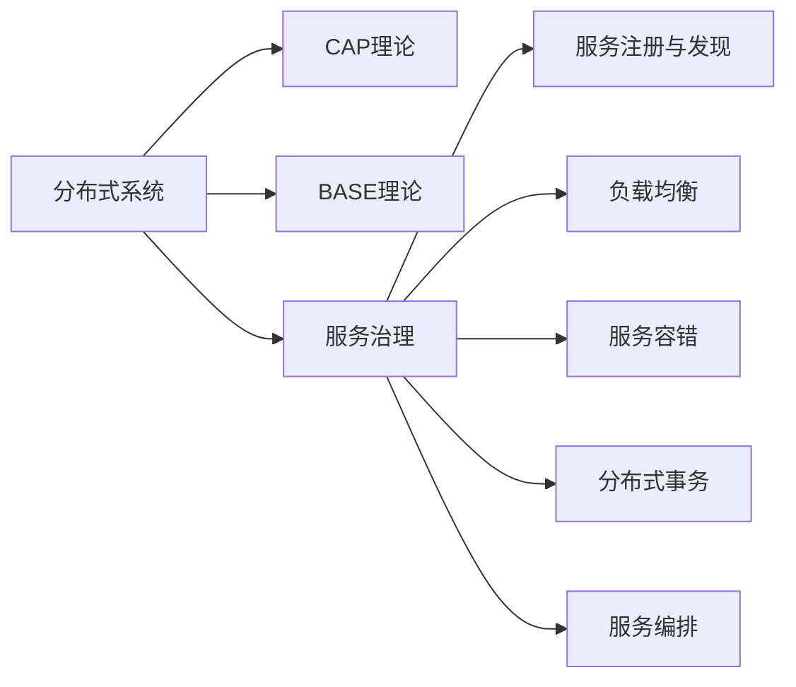

# 分布式架构:扩展性和高可用性的保证

## 1. 背景介绍

随着互联网技术的快速发展和应用规模的不断扩大,传统的单体架构已经无法满足高并发、大流量、海量数据处理等方面的需求。分布式架构应运而生,通过将应用系统拆分为多个独立的服务,部署在不同的服务器节点上,实现系统的高扩展性、高可用性和高性能。本文将深入探讨分布式架构的核心概念、关键技术以及在实际项目中的应用实践。

### 1.1 单体架构的局限性
#### 1.1.1 扩展性差
#### 1.1.2 可靠性低
#### 1.1.3 部署不灵活
#### 1.1.4 技术债务高

### 1.2 分布式架构的优势
#### 1.2.1 高扩展性
#### 1.2.2 高可用性  
#### 1.2.3 松耦合
#### 1.2.4 独立部署
#### 1.2.5 技术多样性

### 1.3 分布式架构面临的挑战
#### 1.3.1 系统复杂度增加
#### 1.3.2 数据一致性问题
#### 1.3.3 故障诊断与恢复
#### 1.3.4 运维与监控难度加大

## 2. 核心概念与联系

要深入理解分布式架构,需要掌握一些核心概念及其相互关系。

### 2.1 分布式系统
分布式系统是由一组通过网络进行通信、为了完成共同的任务而协调工作的计算机节点组成的系统。

### 2.2 CAP理论
CAP理论指出,分布式系统无法同时满足一致性(Consistency)、可用性(Availability)和分区容错性(Partition tolerance),最多只能同时满足其中两项。

### 2.3 BASE理论
BASE理论是对CAP中一致性和可用性权衡的结果,其核心思想是即使无法做到强一致性,但每个应用都可以根据自身业务特点,采用适当的方式来使系统达到最终一致性。

### 2.4 服务治理
服务治理是指通过一系列的架构设计、制度建设、流程规范、工具支撑等手段,对分布式架构中的服务进行全面管理,保证服务的可靠性、安全性和高效性。

### 2.5 服务注册与发现
服务注册与发现是分布式系统中不可或缺的基础设施,用于动态管理集群中的服务实例,使服务消费者能够动态地发现和调用服务。

### 2.6 负载均衡
负载均衡是将请求分发到多个服务实例上,避免单个实例负载过高,提高系统的并发处理能力。

### 2.7 服务容错
服务容错是指当系统中某些服务发生故障时,通过重试、熔断、降级等手段,保证系统整体的可用性。

### 2.8 分布式事务
分布式事务用于保证跨多个服务的数据一致性,常见的实现方案有两阶段提交、补偿事务、最终一致性等。

### 2.9 服务编排
服务编排是将多个服务组合成一个完整的业务流程,并对服务之间的调用顺序、依赖关系、异常处理等进行统一编排。

下图展示了这些核心概念之间的关系:



## 3. 核心算法原理具体操作步骤

分布式架构中涉及多个关键算法,下面以一致性哈希算法为例,详细介绍其原理和操作步骤。

### 3.1 一致性哈希算法原理
一致性哈希算法是分布式系统中常用的负载均衡算法,其核心思想是将数据和节点都映射到一个圆环上,数据的分布由数据到节点的距离决定。

### 3.2 一致性哈希算法操作步骤
1. 将节点通过哈希函数映射到圆环上
2. 将数据通过哈希函数映射到圆环上  
3. 顺时针找到第一个大于等于数据哈希值的节点,将数据存储到该节点上
4. 当有节点加入或退出时,只影响该节点附近的一小部分数据,其他数据保持不变

### 3.3 一致性哈希算法优点
- 充分利用各个节点,使数据分布更加均衡
- 具有很好的容错性和可扩展性
- 加入和删除节点只影响邻近的节点,对系统影响小  

### 3.4 一致性哈希算法缺点
- 数据倾斜问题,当节点数量较少时,容易造成数据分布不均
- 数据迁移量大,当节点数量变化时,大量数据需要在节点间迁移

## 4. 数学模型和公式详细讲解举例说明

在分布式系统中,Paxos算法是一种基于消息传递的一致性算法,用于在分布式系统中就某个值达成一致。下面通过数学模型和公式来详细讲解Paxos算法。

### 4.1 Paxos算法的基本概念
- Proposer:提议者,提出议案
- Acceptor:决策者,决定是否接受议案
- Learner:学习者,获取最终一致的结果
- Proposal:议案,包含提议编号和提议值
- Ballot:投票,Acceptor针对某个Proposal的投票结果

### 4.2 Paxos算法的两个阶段
#### 4.2.1 准备阶段(Prepare)
1. Proposer选择一个Proposal编号N,向所有Acceptor广播Prepare请求
2. Acceptor收到Prepare请求后,如果N大于之前响应的所有Prepare请求,则承诺不再接受编号小于N的Proposal,并且带上之前Accept的最大编号的Proposal(如果有)
3. Proposer收到多数Acceptor的响应后,进入第二阶段

令Proposal编号为N,Acceptor已Accept的最大编号Proposal为 $Accepted_i(N_a,V_a)$ ,则准备阶段可以表示为:

$$
\begin{aligned}
Proposer &\rightarrow Acceptor_i: Prepare(N) \\
Acceptor_i &\rightarrow Proposer: Promise(N,Accepted_i(N_a,V_a))
\end{aligned}
$$

#### 4.2.2 接受阶段(Accept)  
1. Proposer收到多数Acceptor的Promise响应后,从中选择编号最大的Proposal的值作为本次Proposal的值V,向所有Acceptor发送Accept请求
2. Acceptor收到Accept请求后,如果Proposal编号N不小于之前承诺的编号,则接受该Proposal
3. Proposer收到多数Acceptor的Accept响应后,本次Proposal被选定,通知所有的Learner

令Proposer选定的Proposal为(N,V),则接受阶段可以表示为:

$$
\begin{aligned}
Proposer &\rightarrow Acceptor_i: Accept(N,V) \\  
Acceptor_i &\rightarrow Proposer: Accepted(N,V)
\end{aligned}
$$

### 4.3 Paxos算法的活锁问题
Paxos算法可能会出现活锁问题,即多个Proposer不断提出编号更大的Proposal,但都无法达成一致。解决方案是引入Leader,只有Leader才能提出Proposal。

## 5. 项目实践:代码实例和详细解释说明

下面以Go语言为例,演示如何使用gRPC和Consul实现一个简单的分布式服务。

### 5.1 定义服务接口
首先使用Protocol Buffers定义服务接口:

```protobuf
syntax = "proto3";

package hello;

service Greeter {
  rpc SayHello (HelloRequest) returns (HelloReply) {}
}

message HelloRequest {
  string name = 1;
}

message HelloReply {  
  string message = 1;
}
```

### 5.2 实现服务端
```go
type server struct {
    pb.UnimplementedGreeterServer
}

func (s *server) SayHello(ctx context.Context, in *pb.HelloRequest) (*pb.HelloReply, error) {
    return &pb.HelloReply{Message: "Hello " + in.GetName()}, nil
}

func main() {
    lis, err := net.Listen("tcp", port)
    if err != nil {
        log.Fatalf("failed to listen: %v", err)
    }
    s := grpc.NewServer()
    pb.RegisterGreeterServer(s, &server{})

    // 注册服务到Consul
    err = consul.RegisterService("hello", port)
    if err != nil {
        log.Fatalf("failed to register service: %v", err) 
    }

    if err := s.Serve(lis); err != nil {
        log.Fatalf("failed to serve: %v", err)
    }
}
```

### 5.3 实现客户端
```go
func main() {
    // 从Consul发现服务
    addr, err := consul.DiscoverService("hello")
    if err != nil {
        log.Fatalf("failed to discover service: %v", err)
    }

    conn, err := grpc.Dial(addr, grpc.WithInsecure(), grpc.WithBlock())
    if err != nil {
        log.Fatalf("did not connect: %v", err)
    }
    defer conn.Close()
    c := pb.NewGreeterClient(conn)

    ctx, cancel := context.WithTimeout(context.Background(), time.Second)
    defer cancel()
    r, err := c.SayHello(ctx, &pb.HelloRequest{Name: "world"})
    if err != nil {
        log.Fatalf("could not greet: %v", err)
    }
    log.Printf("Greeting: %s", r.GetMessage())
}
```

### 5.4 代码解释
- 服务端和客户端都使用gRPC框架进行通信,服务接口使用Protocol Buffers定义
- 服务端在启动时将服务注册到Consul,客户端通过Consul发现服务地址
- 客户端使用gRPC连接服务端,并调用远程方法进行通信

通过以上代码示例,可以看出使用gRPC和Consul可以方便地实现分布式服务的注册、发现和通信。

## 6. 实际应用场景

分布式架构在互联网领域有广泛的应用,下面列举几个典型的应用场景。

### 6.1 电商系统
电商系统中的用户、商品、订单、支付、物流等模块都可以设计为独立的服务,部署在不同的节点上,实现系统的高可用和弹性扩容。

### 6.2 社交网络
社交网络中的用户关系、动态、消息等数据量巨大,使用分布式存储和计算可以有效提高系统的吞吐量和性能。

### 6.3 金融交易
金融交易系统对数据一致性和实时性要求很高,可以使用分布式事务和缓存技术,保证交易的原子性和低延迟。

### 6.4 物联网平台
物联网平台需要处理海量的设备数据,可以使用分布式流处理和时序数据库,实现数据的实时分析和持久化存储。

## 7. 工具和资源推荐

### 7.1 基础设施
- Consul:服务注册与发现
- Zookeeper:分布式协调服务
- Etcd:分布式键值存储  

### 7.2 通信框架
- gRPC:高性能RPC框架
- Thrift:跨语言的RPC框架
- Dubbo:Java RPC框架

### 7.3 消息队列
- Kafka:分布式发布订阅消息系统
- RabbitMQ:支持多种通信协议的消息队列
- RocketMQ:阿里巴巴开源的消息队列

### 7.4 分布式存储
- HDFS:Hadoop分布式文件系统
- HBase:分布式列存数据库 
- Cassandra:分布式NoSQL数据库
- TiDB:分布式关系型数据库

### 7.5 分布式计算
- Hadoop MapReduce:大规模数据处理框架
- Spark:内存计算框架
- Flink:实时流处理框架

### 7.6 服务治理
- Spring Cloud:微服务治理框架
- Kubernetes:容器编排平台
- Istio:服务网格平台

## 8. 总结:未来发展趋势与挑战

### 8.1 未来发展趋势
- 云原生架构将成为主流,基于容器和微服务的分布式架构将得到广泛应用
- 无服务器架构(Serverless)将得到快速发展,进一步提高系统的弹性和可扩展性
- 边缘计算将与云计算深度融合,实现数据的就近处理和存储
- AI技术将与分布式架构深度