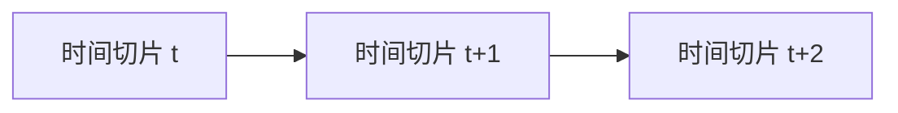

# 动态贝叶斯网络(DBN)原理与代码实战案例讲解

## 1. 背景介绍

### 1.1 什么是动态贝叶斯网络?

动态贝叶斯网络(Dynamic Bayesian Network, DBN)是一种用于建模时序数据的概率图形模型。它扩展了静态贝叶斯网络,能够捕捉随时间演化的过程,并对序列数据进行概率推理和学习。DBN在许多领域有着广泛的应用,如语音识别、机器人控制、生物信息学等。

### 1.2 动态贝叶斯网络的应用场景

动态贝叶斯网络可以应用于以下场景:

- 语音识别: 将语音信号建模为隐马尔可夫模型,用于自动语音识别。
- 机器人控制: 根据传感器数据估计机器人的位置和运动状态。
- 用户建模: 根据用户的浏览记录和购买行为预测用户的兴趣和需求。
- 生物信息学: 分析基因调控网络和蛋白质相互作用。
- 故障诊断: 根据系统的观测值诊断潜在故障。

## 2. 核心概念与联系

### 2.1 贝叶斯网络

贝叶斯网络是一种基于概率论的图形模型,用于表示随机变量之间的条件独立性。它由节点(表示随机变量)和有向边(表示变量之间的条件依赖关系)组成。贝叶斯网络能够通过概率推理来更新变量的条件概率分布。

### 2.2 马尔可夫性质

马尔可夫性质是动态贝叶斯网络的一个重要假设。它表示在给定当前状态的情况下,未来状态与过去状态是条件独立的。这种假设简化了模型,使得推理和学习更加高效。

### 2.3 时间切片

动态贝叶斯网络通过时间切片(Time Slice)来表示时间的演化。每个时间切片包含一组随机变量,表示系统在该时间点的状态。相邻时间切片之间通过有向边连接,表示系统状态的转移。



### 2.4 初始分布和转移分布

动态贝叶斯网络需要定义两个核心分布:

- 初始分布 (Initial Distribution): 描述系统初始状态的概率分布。
- 转移分布 (Transition Distribution): 描述系统从一个状态转移到下一个状态的条件概率分布。

## 3. 核心算法原理具体操作步骤

### 3.1 DBN 模型定义

动态贝叶斯网络由以下组件定义:

- 一组随机变量 $X_t = \{X_t^1, X_t^2, \ldots, X_t^n\}$,表示系统在时间 $t$ 的状态。
- 一个初始分布 $P(X_0)$,描述系统的初始状态概率。
- 一个转移分布 $P(X_t | X_{t-1})$,描述系统状态的转移概率。

### 3.2 推理算法

给定观测数据序列 $Y_1, Y_2, \ldots, Y_T$,我们希望计算隐藏状态序列 $X_1, X_2, \ldots, X_T$ 的概率分布。这可以通过以下步骤实现:

1. **前向算法 (Forward Algorithm)**: 计算 $P(X_t, Y_1, \ldots, Y_t)$,即在观测到前 $t$ 个观测值的情况下,隐藏状态为 $X_t$ 的联合概率。

2. **后向算法 (Backward Algorithm)**: 计算 $P(Y_{t+1}, \ldots, Y_T | X_t)$,即在给定隐藏状态为 $X_t$ 的情况下,观测到后续观测值的概率。

3. **组合前向和后向概率**: 计算 $P(X_t | Y_1, \ldots, Y_T) \propto P(X_t, Y_1, \ldots, Y_t) P(Y_{t+1}, \ldots, Y_T | X_t)$,得到隐藏状态的后验概率分布。

### 3.3 学习算法

DBN 的参数学习通常采用期望最大化算法 (Expectation-Maximization, EM),其步骤如下:

1. **E 步骤 (Expectation Step)**: 使用当前模型参数,计算隐藏状态序列的期望值。

2. **M 步骤 (Maximization Step)**: 使用隐藏状态序列的期望值,最大化模型参数的对数似然函数,得到新的参数估计值。

3. 重复 E 步骤和 M 步骤,直到收敛或达到最大迭代次数。

## 4. 数学模型和公式详细讲解举例说明

### 4.1 贝叶斯网络的联合概率分布

在贝叶斯网络中,每个节点的条件概率分布由其父节点决定。因此,整个网络的联合概率分布可以通过链式法则表示为:

$$
P(X_1, X_2, \ldots, X_n) = \prod_{i=1}^n P(X_i | \text{Parents}(X_i))
$$

其中 $\text{Parents}(X_i)$ 表示节点 $X_i$ 的父节点集合。

### 4.2 DBN 的联合概率分布

对于动态贝叶斯网络,我们可以利用马尔可夫性质和时间切片的独立性假设,将联合概率分布分解为:

$$
P(X_1, X_2, \ldots, X_T, Y_1, Y_2, \ldots, Y_T) = P(X_1) \prod_{t=2}^T P(X_t | X_{t-1}) \prod_{t=1}^T P(Y_t | X_t)
$$

其中:

- $P(X_1)$ 是初始分布。
- $P(X_t | X_{t-1})$ 是转移分布,描述系统状态的转移概率。
- $P(Y_t | X_t)$ 是观测分布,描述观测值与隐藏状态之间的关系。

### 4.3 前向算法

前向算法用于计算 $P(X_t, Y_1, \ldots, Y_t)$,可以通过以下递推公式实现:

$$
\alpha_t(j) = P(X_t = j, Y_1, \ldots, Y_t) = \sum_i \alpha_{t-1}(i) P(X_t = j | X_{t-1} = i) P(Y_t | X_t = j)
$$

其中 $\alpha_t(j)$ 表示在观测到前 $t$ 个观测值的情况下,隐藏状态为 $j$ 的前向概率。

### 4.4 后向算法

后向算法用于计算 $P(Y_{t+1}, \ldots, Y_T | X_t)$,可以通过以下递推公式实现:

$$
\beta_t(i) = P(Y_{t+1}, \ldots, Y_T | X_t = i) = \sum_j P(X_{t+1} = j | X_t = i) P(Y_{t+1} | X_{t+1} = j) \beta_{t+1}(j)
$$

其中 $\beta_t(i)$ 表示在给定隐藏状态为 $i$ 的情况下,观测到后续观测值的概率。

### 4.5 后验概率计算

利用前向概率和后向概率,我们可以计算隐藏状态的后验概率分布:

$$
P(X_t = j | Y_1, \ldots, Y_T) \propto \alpha_t(j) \beta_t(j)
$$

## 5. 项目实践: 代码实例和详细解释说明

以下是一个使用 Python 和 pgmpy 库实现动态贝叶斯网络的示例。我们将建模一个简单的机器人导航系统,根据传感器观测值估计机器人的位置和运动状态。

### 5.1 定义 DBN 模型

```python
import numpy as np
from pgmpy.models import DynamicBayesianNetwork

# 定义随机变量
location = np.array(['l1', 'l2', 'l3'])
motion = np.array(['m1', 'm2', 'm3'])
sensor = np.array(['s1', 's2', 's3'])

# 定义初始分布
initial_location = np.array([0.3, 0.5, 0.2])
initial_motion = np.array([0.6, 0.2, 0.2])

# 定义转移分布
transition_location = np.array([[0.7, 0.2, 0.1],
                                 [0.1, 0.8, 0.1],
                                 [0.2, 0.1, 0.7]])

transition_motion = np.array([[0.5, 0.3, 0.2],
                               [0.2, 0.6, 0.2],
                               [0.3, 0.1, 0.6]])

# 定义观测分布
observation_location = np.array([[0.8, 0.1, 0.1],
                                  [0.1, 0.8, 0.1],
                                  [0.1, 0.1, 0.8]])

observation_motion = np.array([[0.9, 0.05, 0.05],
                                [0.05, 0.9, 0.05],
                                [0.05, 0.05, 0.9]])

# 创建 DBN 模型
dbn = DynamicBayesianNetwork([([location, motion], [location, motion]),
                              ([location, motion], [sensor])])

# 设置初始分布
dbn.initialize_initial_state(location=initial_location, motion=initial_motion)

# 设置转移分布
dbn.set_transition_model(location=transition_location, motion=transition_motion)

# 设置观测分布
dbn.set_observation_model(location=observation_location, motion=observation_motion)
```

在这个示例中,我们定义了三个随机变量:

- `location`: 机器人的位置,有三个可能的值 `['l1', 'l2', 'l3']`。
- `motion`: 机器人的运动状态,有三个可能的值 `['m1', 'm2', 'm3']`。
- `sensor`: 传感器观测值,有三个可能的值 `['s1', 's2', 's3']`。

我们还定义了初始分布、转移分布和观测分布,并使用 `pgmpy.models.DynamicBayesianNetwork` 创建了一个 DBN 模型。

### 5.2 推理和预测

```python
from pgmpy.inference import DBN_InferenceController

# 创建推理引擎
infer = DBN_InferenceController(dbn)

# 观测序列
observations = [{'sensor': 's1'},
                {'sensor': 's2'},
                {'sensor': 's3'},
                {'sensor': 's1'}]

# 执行推理
predicted_states = infer.forward_inference(observations)

# 打印预测结果
for t, state in enumerate(predicted_states):
    print(f"Time {t}:")
    print(f"Location: {state['location'].values}")
    print(f"Motion: {state['motion'].values}")
```

在这个示例中,我们创建了一个 `DBN_InferenceController` 对象,用于执行推理。我们定义了一个观测序列 `observations`,表示传感器在不同时间点的观测值。

然后,我们使用 `forward_inference` 方法执行推理,得到每个时间点的预测状态。最后,我们打印出每个时间点的位置和运动状态的预测结果。

### 5.3 学习参数

```python
from pgmpy.estimators import BayesianEstimator

# 生成训练数据
data, states = dbn.sample(10000)

# 创建 BayesianEstimator 对象
estimator = BayesianEstimator(dbn, data)

# 学习参数
estimator.estimate_parameters()

# 获取学习后的参数
learned_initial_location = estimator.state_estimator.parameters['location'][0].values
learned_initial_motion = estimator.state_estimator.parameters['motion'][0].values
learned_transition_location = estimator.state_estimator.parameters['location'][1].values
learned_transition_motion = estimator.state_estimator.parameters['motion'][1].values
learned_observation_location = estimator.observation_estimator.parameters['location'].values
learned_observation_motion = estimator.observation_estimator.parameters['motion'].values
```

在这个示例中,我们使用 `dbn.sample` 方法生成了一个包含 10000 个样本的训练数据集。然后,我们创建了一个 `BayesianEstimator` 对象,并使用 `estimate_parameters` 方法学习模型参数。

最后,我们可以从 `estimator` 对象中获取学习后的参数,包括初始分布、转移分布和观测分布。

## 6. 实际应用场景

动态贝叶斯网络在许多实际应用场景中发挥着重要作用,例如:

### 6.1 语音识别

在语音识别系统中,动态贝叶斯网络可以建模语音信号和隐藏的语音单元(如音素或