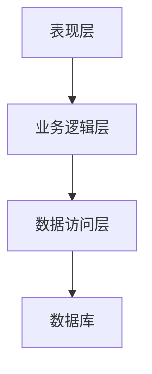
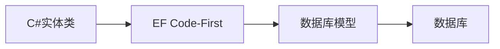
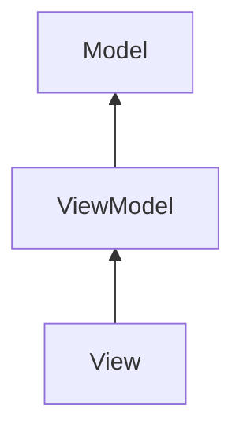
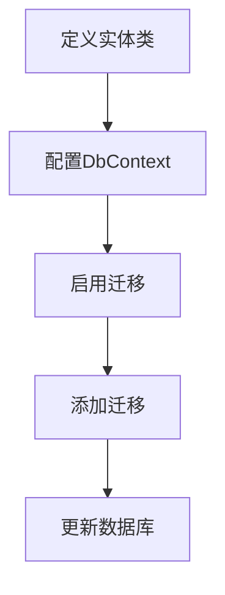
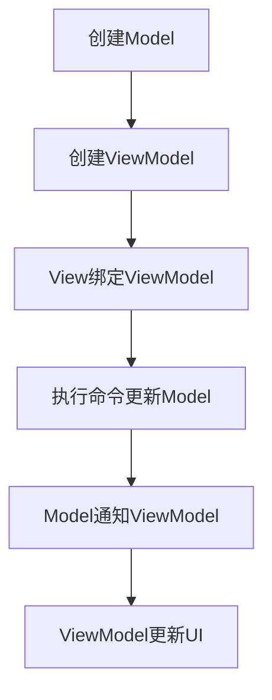

# 基于.net平台的成绩管理系统设计与实现

## 1.背景介绍

### 1.1 成绩管理系统的重要性

在当今教育体系中,成绩管理系统扮演着至关重要的角色。它不仅是学生学习成绩的记录和追踪工具,更是教师评估学生表现、制定教学策略的重要依据。一个高效、可靠的成绩管理系统,能够极大地提高教学管理的效率,优化教学资源的分配,促进教育质量的持续提升。

### 1.2 传统管理方式的缺陷

传统的基于纸质记录或简单电子表格的成绩管理方式,存在诸多不足。首先,数据的录入、存储和检索效率低下,工作量大;其次,数据的准确性和安全性无法得到有效保证;再者,教师和学生无法实时查阅成绩信息,缺乏互动性。这些问题严重阻碍了教育管理工作的顺利开展。

### 1.3 基于.NET平台的优势

.NET是微软推出的软件框架,为快速开发Windows应用程序提供了完整的解决方案。基于.NET平台开发的成绩管理系统,能够充分利用Windows操作系统的本地资源,实现高性能、高可靠、高安全性的运行。同时,.NET框架提供了丰富的类库和工具支持,极大简化了系统开发的工作量。

## 2.核心概念与联系

### 2.1 三层架构

成绩管理系统通常采用三层架构模式,包括表现层(User Interface)、业务逻辑层(Business Logic)和数据访问层(Data Access)。



- 表现层: 负责与用户交互,接收用户输入并显示处理结果。
- 业务逻辑层: 实现系统的核心业务规则和算法,对来自表现层的请求进行处理。
- 数据访问层: 负责与数据库进行通信,执行数据的增删改查操作。

该架构模式实现了关注点分离,有利于代码的模块化和可维护性。

### 2.2 Code-First开发模式

Code-First是Entity Framework中的数据库迁移方式,支持通过编写C#代码来创建和更新数据库。这种开发模式能最大程度地遵循领域驱动设计(DDD)理念,使开发人员更专注于编写业务逻辑代码,而不必过多关注数据库细节。



### 2.3 Model-View-ViewModel模式

MVVM是WPF应用程序中常用的设计模式,将界面(View)与业务逻辑(Model)进行了分离,通过ViewModel作为中介进行通信。这种模式提高了代码的可测试性和可维护性。



## 3.核心算法原理具体操作步骤  

### 3.1 Code-First工作流程

1. 定义实体类
2. 配置DbContext
3. 启用迁移
4. 添加迁移
5. 更新数据库



### 3.2 MVVM模式实现

1. 创建Model类
2. 创建ViewModel类,实现属性更改通知
3. 在View中绑定ViewModel
4. 执行命令更新Model
5. Model属性变化通知ViewModel
6. ViewModel更新UI



## 4.数学模型和公式详细讲解举例说明

在成绩管理系统中,通常需要计算学生的总分、平均分、排名等统计数据。下面给出相关公式:

### 4.1 总分计算

设一门课程有n个单元,每个单元的分值为$w_i(i=1,2,...,n)$,学生在第i个单元的得分为$s_i$,则该生总分为:

$$\sum_{i=1}^{n}s_i \times w_i$$

### 4.2 平均分计算

设一门课程总分为$S$,总分值为$W$,则平均分为:

$$\overline{s}=\frac{S}{W}$$

### 4.3 排名计算

对于有m名学生的一个班级,设第i名学生的总分为$s_i(i=1,2,...,m)$,则该生的名次排名为:

$$r_i=1+\sum_{j=1}^{m}[s_j>s_i]$$

其中,[$\cdot$]为阶跃函数,当$s_j>s_i$时取值为1,否则为0。

## 5.项目实践:代码实例和详细解释说明

### 5.1 实体类定义

```csharp
public class Student
{
    public int Id { get; set; }
    public string Name { get; set; }
    public ICollection<Score> Scores { get; set; }
}

public class Course
{
    public int Id { get; set; }
    public string Name { get; set; }
    public ICollection<Score> Scores { get; set; }
}

public class Score
{
    public int Id { get; set; }
    public int StudentId { get; set; }
    public Student Student { get; set; }
    public int CourseId { get; set; }
    public Course Course { get; set; }
    public int Value { get; set; }
    public int Weight { get; set; }
}
```

上述代码定义了Student、Course和Score三个实体类,描述了学生、课程和分数之间的关系。

### 5.2 DbContext配置

```csharp
public class SchoolContext : DbContext
{
    public DbSet<Student> Students { get; set; }
    public DbSet<Course> Courses { get; set; }
    public DbSet<Score> Scores { get; set; }

    protected override void OnConfiguring(DbContextOptionsBuilder optionsBuilder)
    {
        optionsBuilder.UseSqlServer(@"Data Source=(localdb)\MSSQLLocalDB;Initial Catalog=School");
    }
}
```

SchoolContext继承自DbContext,用于配置实体类与数据库之间的映射关系,并指定数据库连接字符串。

### 5.3 MVVM实现示例

ViewModel:

```csharp
public class StudentViewModel : ViewModelBase
{
    private Student _student;

    public Student Student
    {
        get { return _student; }
        set
        {
            _student = value;
            OnPropertyChanged(nameof(Student));
        }
    }

    public ObservableCollection<Score> Scores { get; set; }

    private ICommand _addScoreCommand;
    public ICommand AddScoreCommand
    {
        get
        {
            if (_addScoreCommand == null)
            {
                _addScoreCommand = new RelayCommand(
                    param => AddScore(),
                    param => CanAddScore()
                );
            }
            return _addScoreCommand;
        }
    }

    private void AddScore()
    {
        // 添加分数的逻辑
    }

    private bool CanAddScore()
    {
        // 判断是否可以添加分数的条件
        return true;
    }
}
```

View:

```xml
<Window>
    <Grid>
        <Grid.RowDefinitions>
            <RowDefinition Height="Auto"/>
            <RowDefinition Height="*"/>
        </Grid.RowDefinitions>

        <StackPanel Orientation="Horizontal">
            <TextBlock Text="学生姓名:" Margin="5"/>
            <TextBox Text="{Binding Student.Name}" Margin="5"/>
            <Button Content="添加分数" Command="{Binding AddScoreCommand}" Margin="5"/>
        </StackPanel>

        <DataGrid Grid.Row="1" ItemsSource="{Binding Scores}" AutoGenerateColumns="False" Margin="5">
            <DataGrid.Columns>
                <DataGridTextColumn Header="课程" Binding="{Binding Course.Name}"/>
                <DataGridTextColumn Header="分数" Binding="{Binding Value}"/>
                <DataGridTextColumn Header="权重" Binding="{Binding Weight}"/>
            </DataGrid.Columns>
        </DataGrid>
    </Grid>
</Window>
```

上述代码展示了一个简单的学生成绩管理界面,包括学生姓名输入、添加分数按钮和成绩列表。通过数据绑定,将ViewModel中的数据与View进行了关联。

## 6.实际应用场景

成绩管理系统在教育领域有着广泛的应用,可以为不同层级的教育机构提供高效的教务管理服务:

- 中小学校: 记录学生各科成绩,生成成绩报告,分析学习情况。
- 大学: 管理选课、考试、学分绩点等,打印成绩单和毕业证书。
- 培训机构: 跟踪学员的学习进度,为教师和学员提供反馈。
- 在线教育平台: 记录学习视频观看情况,线上考试及格成绩。

除教育场景外,成绩管理系统的思路也可应用于企业绩效考核、游戏积分排名等其他领域。

## 7.工具和资源推荐

### 7.1 开发工具

- Visual Studio: 微软的集成开发环境,支持.NET开发。
- SQL Server: 微软的关系型数据库管理系统。
- Git: 分布式版本控制系统,方便多人协作开发。

### 7.2 开源库

- Entity Framework: 对象关系映射框架,简化数据库操作。
- AutoMapper: 对象映射工具,减少重复的对象映射代码。
- NUnit: 流行的单元测试框架,确保代码质量。

### 7.3 学习资源

- 官方文档: [https://docs.microsoft.com/zh-cn/dotnet/](https://docs.microsoft.com/zh-cn/dotnet/)
- 书籍: 《C#编程语言》、《Entity Framework核心技术》等
- 在线课程: Pluralsight、Udemy等平台的.NET相关课程
- 社区: [https://stackoverflow.com/](https://stackoverflow.com/)、[https://docs.microsoft.com/zh-cn/answers/](https://docs.microsoft.com/zh-cn/answers/)

## 8.总结:未来发展趋势与挑战

### 8.1 云计算与微服务架构

未来成绩管理系统将向云端迁移,采用微服务架构模式,实现高可扩展性和灵活性。每个微服务只负责单一职责,通过RESTful API进行通信,易于集成和部署。

### 8.2 大数据与人工智能

成绩数据的不断积累,为大数据分析和人工智能应用奠定了基础。通过数据挖掘和机器学习算法,可以发现学生学习模式,预测潜在表现,为个性化教育提供决策支持。

### 8.3 安全与隐私保护

随着系统上云,如何保护学生隐私和防止数据泄露将是一大挑战。需要采用先进的加密技术、访问控制和安全审计机制,确保数据的完整性和可靠性。

### 8.4 用户体验优化

系统需要持续优化用户体验,提供直观友好的界面和无缝集成的多平台支持(Web、移动端等),方便教师和学生随时随地查阅成绩信息。

## 9.附录:常见问题与解答

1. **如何提高系统的并发性能?**

可以采用异步编程模型(async/await)、缓存技术(如Redis)、负载均衡等策略,有效利用系统资源,提升响应速度。

2. **如何保证数据的一致性?**

在进行数据更新操作时,应该使用事务(Transaction)确保数据的原子性。同时可以引入乐观并发控制,避免并发修改导致的数据不一致。

3. **如何实现系统的可扩展性?**

遵循SOLID原则进行面向对象设计,使用依赖注入、设计模式等方法,将系统划分为松耦合的模块,有利于后续功能扩展和维护。

4. **如何部署和维护系统?**

建议采用DevOps理念,使用持续集成和持续交付(CI/CD)流程,实现自动化构建、测试和部署,缩短上线周期,提高效率。

5. **如何实现系统的移动化?**

可以开发跨平台的移动应用程序(如Xamarin、React Native),或构建渐进式Web应用(PWA),让教师和学生能够在移动设备上方便地访问系统。

作者: 禅与计算机程序设计艺术 / Zen and the Art of Computer Programming